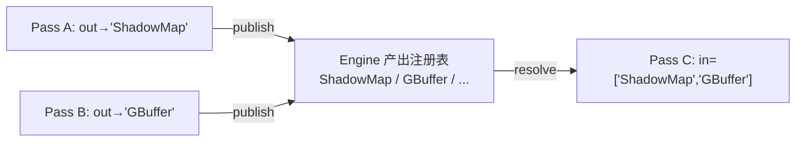

# Graphics 多 Pass 渲染管线设计

> 状态：已对齐代码（2026-09-03），v1 已落地
>
> ⚠ 2026-09-07 **Design C 变更**（下述 v1/Design B 描述部分过时）：RenderEngine **删除 masterCamera
> 与相机/导航职责，并删除默认内容 scene()/setScene()**，成为纯 pass 调度器（零内容零相机）——相机、
> 内容 Scene、manipulator、尺寸/aspect 全部移到新增的 **`SceneView`**（graphics，组合借用 engine，
> `scene()` 返回 owning `intrusive_ptr<Scene>`）。内容一律 per-pass 显式绑定
> （`addPass(pass, content, order)` / `bindPassContent`）。`hasWindowPass()` 改
> `hasWindowPass(raw_ptr<Camera>)`；“窗口 pass” = 携带某 view camera 且 RT==null 的注册 pass。
> RenderControl 持有 engine + SceneView；输入/尺寸推给 view；AppShell/Builder 用
> view->camera()/scene() 显式绑定内容。详见 .ai/memory/graphics.md 顶部 Design C 条目。
>
> ⚠ 2026-09-03 **Design B 变更**（下述 v1 描述的部分已过时）：RenderEngine 已**删除主通道**
> （`main_pass_`/`setMainPass`/`mainPass` 均移除），改为**空启动 + 显式注册**：引擎不再自动建
> scene/camera/pass；`scene()` 是可选的“默认内容”（未绑 content 的 pass 回落它，可 null），
> `masterCamera()` 是可选的交互主相机（manipulator 驱动它，不设则无效）。“窗口 pass”就是
> camera==masterCamera 且 RT==null 的注册 pass（约定 order 0）。全部 pass 进统一 `passes_`
> 注册表按 order 升序执行 + overlays 最后，无锚点特判。默认 viewer 由 fw 层 RenderControl
> 引导（passCount()==0 时注册默认窗口 pass）。本文件下方 v1 章节保留作设计演进记录。
>
> 定位：`RenderEngine` 多 Pass 调度、pass↔场景内容关联、pass 间数据衔接的**设计基线**；
> 后续新增光源 / 阴影 / 后处理均以此为扩展点。

## 0. 一句话模型

> **Pass = 「输入 → 输出」的一个可执行单元；Scene 只是“数据生产者”之一；
> 真正在 pass 之间流动的“货币”是 RenderTarget 的纹理附件；衔接（连接关系）由
> RenderEngine 统一管理。**

## 1. 术语与职责切分

| 概念 | 定义 | 归属 |
|---|---|---|
| **RenderPass** | 通道定义（stage）：怎么画 + 画到哪 | 无内容、可复用模板 |
| **内容(Scene)** | 画什么（世界数据，含将来的光源） | **Engine** 关联管理 |
| **视图(Camera/VP)** | 怎么取景（与 target 宽高比绑定） | Pass（借用，共享外部保活） |
| **输出(RenderTarget/FBO)** | 画到哪（通道的输出资源） | Pass（**持有**，null=backbuffer） |
| **调度槽(PassSlot)** | 一次执行：pass + 可选内容 + order | **Engine** 持有 |
| **衔接/依赖** | 谁写谁读、先后关系 | **Engine**（order + 将来的依赖图） |

### 数据生产者分类

| 类型 | 数据源 | 需要 | 例子 |
|---|---|---|---|
| **Scene pass** | 遍历场景几何/材质 | 视图(Camera→VP) | main forward、shadow map、g-buffer、depth prepass、镜像 |
| **Screen pass（将来）** | 前序 pass 输出的纹理 | 全屏三角形 + 采样 | 后处理、合成、模糊 |

Scene pass 之间“画同一份场景、各用自己的 view/target/order”；Screen pass 与场景解耦，
消费纹理附件。

## 2. RenderEngine 调度（已落地 v1）

一帧执行序（以主通道 order 0 为锚）：

```
beginFrame
  pre passes (order < 0)          // shadow / depth / g-buffer
  main pass  (order 0, 引擎场景)   // 内容固定 = engine.scene_
  post passes (order > 0)         // 后处理 / 合成
  overlays (升序 zOrder)          // HUD，永远最顶层
endFrame; swapBuffers
```

- 同 `order` 内按 `addPass()` 插入顺序**稳定**执行。
- **内容关联由 Engine 管理**：每个槽 `{ pass, content(可空), order }`，执行时解析
  `effectiveContent = slot.content ?: engine.scene_`。
- 收益：`setScene()` 对未绑定通道是**单点更新**；`RenderPass` 保持无内容、可复用；
  应用只通过 Engine API 组装。

### 公开 API（v1）

```cpp
// ---- 内容（默认内容，所有未绑定通道绘制它）----
void setScene(intrusive_ptr<Scene> scene);
raw_ptr<Scene> scene() const;

// ---- 场景通道管线 ----
void addPass(intrusive_ptr<RenderPass> pass, int order);                       // 画引擎场景
void addPass(intrusive_ptr<RenderPass> pass, intrusive_ptr<Scene> content, int order); // 画显式场景
void bindPassContent(raw_ptr<RenderPass> pass, intrusive_ptr<Scene> content);  // 重绑；null=回落引擎场景
raw_ptr<Scene> contentOf(raw_ptr<RenderPass> pass) const;                      // 有效内容
void removePass(raw_ptr<RenderPass> pass);
void clearPasses();
std::size_t passCount() const;

// ---- 主通道（锚点）----
void setMainPass(intrusive_ptr<RenderPass> pass);
raw_ptr<RenderPass> mainPass() const;
```

### RenderPass 定义（已落地 v1）

```cpp
// view：借用（raw_ptr<Camera>）——共享视图，外部保活（如引擎主相机）
void setCamera(raw_ptr<Camera> camera);

// 输出：持有（intrusive_ptr<RenderTarget>）——通道的输出资源自保活
void setRenderTarget(intrusive_ptr<RenderTarget> target);   // null = backbuffer
raw_ptr<RenderTarget> renderTarget() const;

// clear / viewport 仍是通道状态
void setClearColor(const Color&);  void setShouldClearDepth(bool);
void setClearEnabled(bool);        void setViewport(x,y,w,h); ...

void execute(raw_ptr<Scene> scene, raw_ptr<RenderBackend> backend);
```

> 注：析构在 `.cpp` 出外联（持有不完整类型 `RenderTarget` 成员所需）。

## 3. 为什么顺序必须显式且确定

渲染正确性本身依赖先后，这不是性能问题而是正确性问题：

| 阶段 | 例子 | 原因 |
|---|---|---|
| `order < 0` | shadow map、depth/g-buffer | 必须在被照亮的几何体之前 |
| `order 0` | main（forward/deferred 光照） | 锚点 |
| `order > 0` | 后处理 / 合成 | 必须在着色之后 |
| overlays | HUD | 覆盖最上层 |

同一 target 上连续 pass 的 clear/混合/深度策略同样由顺序决定（谁先写、谁不清屏保 depth）。

## 4. FBO 拓扑（RenderTarget 是否同一个）

- **FBO 是 per-pass 的输出**；是否共享取决于“该小段通道是否需要共享缓冲”。
- 三种典型形态：
  1. **共享同一 FBO/depth（前向小步拆分）**：depth prepass 与 main 共享同一 depth 附件；
     main 关 depth-write、开 depth test（equal）。共享方式 = 两个 pass 各自持有同一个
     `RenderTarget` 的引用（RefCounted 天然共享）。
  2. **各自独立 FBO（不同阶段）**：shadow map（depth-only）、g-buffer（MRT）、光照输出、
     后处理（ping-pong 两张）。
  3. **主场景 = backbuffer**：`renderTarget()==nullptr`，只有它需要 swap。
- 规则：引擎不拥有 FBO，只保证执行序；共享 FBO 的 clear/load-store 由 pass 的 clear 策略显式表达；
  **禁止 feedback**（一个 pass 不能同时读写同一张纹理 → 后处理用 ping-pong）。

## 5. 不同 pass 的数据衔接与传递

### 两种依赖

- **顺序依赖**：谁先跑（v1 显式 `order`；将来可自动推导）。
- **数据依赖**：谁把什么交给谁（“衔接”的本质）。

### 四种数据载体

| 载体 | 传什么 | 阶段 |
|---|---|---|
| **A. 输出纹理** | A 写 RT 的 color/depth → B 采样 | 将来（Screen pass 输入槽） |
| **B. 共享附件** | 两 pass 共用同一 target/depth | 现在（各自持有同一 RT 引用） |
| **C. FrameContext** | dt、当前/上一帧 VP、光源、尺寸 | 骨架（随需扩展） |
| **D. RenderCommand** | pass 内部收集的 CPU 命令 | 现在（现状） |

### 推荐衔接模型（为自动帧图留门）

> **2026-09-12 修订（见 §14）**：本节把"命名产出注册表"当作**接线权威**这个选择已被重审。§5 要的三个
> 收益（解耦 / 可复用 / 顺序可推导）保留，但端点的**身份**应从字符串换成对象（`ImageRef`，初稿名为
> `RenderPort`），字符串降级为
> 标签 + 语法糖；结构错误因此能在**接线期**判定（D55/D56 那一族的解）。本节其余内容（两种依赖、四种载体、
> 一帧时序）仍然有效。**设计稿见 §14；步 1 已实施（2026-09-12），逐帧读 `ImageRef` 的步 2 未做。**

不做“pass 之间互相握 target 指针”，而是 **Engine 侧“命名产出注册表（publish/resolve）”**：



- 解耦：消费者只声明“我要一个叫 X 的纹理”，不关心生产者。
- 可复用：同一段后处理对主场景颜色 / 小地图颜色都成立。
- 顺序可推导：Engine 从 “P3 需要 X” 即可推断写 X 者必须先于 P3（将来替代手写 order）。

### 一帧衔接时序（目标态）

```
beginFrame()
  for pass in 管线(按序):
    1. 解析内容：slot.content ?: engine.scene_
    2. 视图：用 pass 的 Camera（aspect 匹配 pass 输出 target 尺寸）
    3. 绑定输出：backend->setRenderTarget(pass 输出 RT / null=backbuffer)
    4. 解析输入：pass 声明的输入槽 → 绑定纹理（查注册表）
    5. load/store：按 pass clear 策略（共享 FBO 不清屏/保 depth）
    6. 收集命令并渲染（遍历内容场景 → RenderCommand → backend->render）
    7. publish：登记本 pass 输出（供后续 resolve）
  overlays(升序)
endFrame(); swapBuffers()
```

## 6. 相机与 VP（per-pass，非全局）

| pass | 相机 | VP |
|---|---|---|
| main + 它的 depth prepass | 复用同一 Camera | 相同（共享一份） |
| shadow / 反射 / 小地图 | 独立 Camera | 不同 |
| 全屏后处理（将来） | 不需要 | 用不到 |

- **相机 aspect 必须匹配该 pass 的 target 尺寸**：把主相机复用到不同宽高比的离屏 target 会变形；
  要么给该 pass 独立相机，要么按 target 尺寸重设投影。因此“复用相机”只应发生在尺寸一致的 pass 间。
- Camera 是 `RefCounted` 资源，pass 以 `raw_ptr` 借用，生命周期由创建者/引擎主相机保活。

## 7. 落地分期

| 阶段 | 范围 | 状态 |
|---|---|---|
| **v1（现在）** | 有序场景通道管线 + Engine 内容关联 + RenderPass 持有输出 target | ✅ 已实现 |
| **v2** | RenderTarget 离屏能力 + RenderBackend 离屏契约（**平台层已落地**）；`FrameContext` 与 vsg 离屏 render-to-texture 待 GPU 上迭代 | 平台层 ✅，vsg 待做 |
| **v3** | Screen/全屏 pass + “命名产出槽” publish/resolve 衔接 | ✅ 已实现（2026-09-03） |
| **v4** | 光源系统（挂 Scene）+ shadow map（光源相机 order<0 通道） | 待做 |
| **v5（可选）** | 自动依赖排序/帧图、后处理链 | 待做 |

## 8. 与未来光源系统的衔接

- 光源计划挂在 `Scene` 上；Engine 已解析出每个 pass 的“有效内容(Scene)”，光源列表随场景走。
- shadow map = “同一份场景 + 光源相机 + depth-only RenderTarget”的 `order<0` 通道 ——
  复用 v1 的调度，无需改 `RenderPass` 定义。
- 延迟光照（v3/v4）：g-buffer（MRT）→ 光照 pass 经“命名产出槽”读 g-buffer → 后处理。

## 9. 关键决策记录

1. Scene **不放**在 `RenderPass` 上（破坏复用/换场景同步/全屏 pass 无场景）→ 由 **Engine** 关联管理。
2. 相机放 pass（借用）；输出 RenderTarget 放 pass（持有）；null target = backbuffer。
3. 顺序以 int `order` 升序 + 稳定插入，主通道锚 0；overlays 永远最后。
4. 数据传递以“纹理附件 + FrameContext”为主；衔接按“命名产出槽”解耦，为自动排序留门。
5. 分期避免过度设计：当前只做“顺序 + 各自输出 target + 内容关联”，Screen pass/输入槽后置。

## 10. RenderBackend / vsg 后端演进设计（v2/v3）

> 结论先行：**抽象 `RenderBackend` 不推翻重设计** —— 多 pass 调度在 CPU
> （RenderEngine/RenderPass）；后端只需**增量补离屏与纹理能力**。
> **vsg 后端要中等重构**：从“单主 RenderGraph + overlay 特判”演进为“一帧内按
> pass 提交多个 RenderGraph（每个输出 target 一个）”。

### 10.1 设计原则

- 后端 = 低层“设备”抽象（绑定目标 / 视口 / clear / 提交命令 / 交换缓冲），与 pass 无关；
  RenderPass::execute 已把多 pass 编排成其上的命令序列，无需后端“认识 pass”。
- 逐 pass 的“输入→输出”数据流属于 CPU 调度层；后端只负责“当前输出 target + load/store +
  采样输入能绑到哪”。

### 10.2 抽象接口的增量演进（非破坏）

| 能力 | 现状 | v2 增量 | v3 增量 |
|---|---|---|---|
| **离屏 FBO** | `setRenderTarget(RenderTarget*)` 仅支持 null=backbuffer | 后端为 `RenderTarget` 创建真实 color/depth 附件并绑定（render-to-texture） | MRT（多 color 附件） |
| **load/store** | 仅 clear 开关 | 每个 pass 表达 load/store（vsg→`loadOp LOAD/CLEAR`） | 同左 |
| **采样输入** | 无 | —（v2 仅“写离屏 + 回拷/合成”） | 把某 RT 纹理作为后续 pass 输入（Screen pass） |
| **提交收敛** | 散命令序列 + 遗留 `executePass(pass, commands)` 未用 | 可把 RenderPass::execute 改为“一次提交一个 pass 描述（target + load/store + viewport + camera + commands）”，后端内部组 RenderGraph/处理 barrier | 同左 |
| **FrameContext** | 无 | 每帧共享上下文（dt/VP 历史/尺寸/光源）传后端/命令 | 同左 |

> v2 只承诺“能渲染到离屏 target 并把内容呈现/拷回屏幕”，验证多 target 与 load/store；
> 真正的“A 的产物被 B 采样”（后处理/阴影采样）放 v3（需要材质/全屏管线带纹理能力）。

### 10.3 RenderTarget 的生命周期设计

- `RenderTarget`（graphics SDK）= 平台无关的**逻辑帧缓冲描述**：size + color/depth 格式 + 附件标志
  （现已有雏形）。
- 真正的 GPU 附件由**后端**持有缓存：`backend:: map<RenderTarget*, BackendFBO{color/depth 纹理}>`，
  惰性创建、按需重建（resize）。
- 供后续 pass 采样时，后端把该 target 的 color/depth 纹理作为**采样资源**暴露（平台无关的
  最小接口，v3 引入；vsg 侧即 `vsg::ImageView`）。
- 生命周期：target 由应用创建并持有；GPU 资源随后端（`shutdown()` 时释放）或在 target 不再
  被任何 pass 引用后由后端惰性清理。

### 10.4 vsg 后端映射

| 抽象概念 | vsg 实现 |
|---|---|
| 输出 target | 每个非空 RenderTarget → 一组 `vsg::Image(+DepthImage)` + 独立 `vsg::RenderGraph`；null → 现有窗口 RenderGraph |
| load/store | RenderGraph 的 `loadOp`/`storeOp`（LOAD=不清屏叠层，CLEAR=按 pass clear 策略） |
| depth-only（shadow 预备） | 仅 depth 附件的 RenderGraph + 光源相机 |
| 采样输入（v3） | RT 的 `vsg::ImageView` 作为后续 pass 的 ImageDescriptor |
| 提交 | `vsg::Viewer::recordAndSubmit` 提交“本帧所有 pass 的 RenderGraph 集合” |
| 现状差距 | ~~“单主图 + overlay_slots(Camera* 特判)”~~ 已于 2026-09 统一为 `window_layers`（Camera* 键，
  每层自带 View/SceneBridge/light_group/on_top）；SceneBridge 底座可复用，离屏/pass 每帧提交演进仍在
  §10.5 排期 |

### 10.5 演进顺序与验收

1. **v2a**：抽象层补“RenderTarget 由后端创建附件”的约定；vsg 实现 `setRenderTarget(RT)` +
   一个“离屏 pass 渲主场景到 RT，再拷回屏幕/合成到 backbuffer”的验证（证明多 target + load/store）。
2. **v2b**：把 `RenderPass::execute` 收敛为“按 pass 提交”（可用 `executePass`），帧上下文骨架。
3. **v3**：Screen/全屏 pass + “命名产出槽” publish/resolve + 采样输入（材质/管线带纹理）→ 首个后处理/阴影。
4. 验收标准：`GraphicsTest` 覆盖离屏多 pass 命令序列；vsg 端手动/自动验证“渲染到离屏→合成上屏”无
   barrier/loadOp 伪影；单 target 路径（现行为）回归不变。

### 10.7 落地记录（2026-09-03）

- **v2a 平台层已落地**：`RenderTarget` 增加 `hasColor()/hasDepth()/colorFormat()/depthFormat()/valid()`
  （离屏描述访问器，含单元测试）；`RenderBackend` 增加 `supportsRenderTargets()` 与离屏契约文档
  （非空 target = 后端自建 GPU 附件并绑定）。`RenderPass::execute` 本就把 target 传给后端，CPU 侧无需改。
- **vsg 离屏 scaffold 已实现（编译通过，GPU 未验证）**：`VsgRenderer` 现对非空 target 建立离屏
  color(±depth) `Image/ImageView` + `createRenderPass`/`Framebuffer` + 独立 `RenderGraph`（含自己的
  相机与 SceneBridge 保留根），命令经 `renderOffscreenTarget()` 同步；`supportsRenderTargets()==true`。
  默认（窗口）路径不变；首次 on-device 需验证 loadOp/管线兼容/后续采样与合成（采样属 v3）。
- **v2b（2026-09-03）**：新增 `FrameContext` 骨架（dt / 表面尺寸，由 `RenderEngine::frame()` 与
  `pushEvent(ResizeEvent)` 填充，经 `frameContext()` 暴露）；vsg 离屏在 target resize 时
  `deviceWaitIdle` + 从 `CommandGraph::children` 摘除旧图后重建；`app_shell` 增加
  `VINE_VSG_OFFSCREEN=1` 离屏验证入口（默认关闭，渲 640x360 RGBA8+D24 的 order<0 通道）。
- **首次 on-device 验证修复（2026-09-03，llvmpipe）**：① 离屏 `Image`/`ImageView` 必须先
  `vsg::createImageView(device,...)`（内部 compile Image + allocateAndBindMemory + compile
  ImageView），否则 VkImage/VkImageView 为 VK_NULL_HANDLE → 录制时 `vkCmdBeginRenderPass` 崩；
  ② 离屏 target 必须持有**独立 SceneBridge**（overlay 同款模式）：vsg 的 GraphicsPipeline 按
  viewID 逐视图编译，复用主场景 bridge 会把只按主视图 viewID 编译的 pipeline 挂到离屏视图下 →
  `GraphicsPipeline::vk(viewID)` 越界崩。resize 重建改为原地字段重置+清 bridge 缓存。
- **v3（2026-09-03）已实现（lavapipe 实测）**：
  - SDK：`RenderPass` 增 `setOutputName/addInputName` + `resolveInputTextures` + `execute` 改 virtual；
    新增 `ScreenPass`（默认不清屏，execute 设 target/viewport/clear 后调 `backend->drawScreenTexture`）；
    `RenderBackend` 增 `drawScreenTexture(RenderTarget*)`（默认 no-op）。
  - Engine：私有 `outputs_` 命名产出注册表（public `publish/resolve/unpublish`），每帧帧首清空，
    逐 pass “执行前 resolve 输入 → 执行后 publish 输出”。
  - vsg：`makeSampleableRenderPass`（color finalLayout=SHADER_READ_ONLY + subpass→external
    fragment-read 依赖，替代默认 PRESENT_SRC_KHR）；离屏 RenderGraph **插入 command_graph 队首**
    先于主图录制；`drawScreenTexture` 用内嵌 GLSL（ShaderCompiler，VSG_SUPPORTS_ShaderCompiler=1）
    建全屏纹理三角，作为主 render_graph 的第二个 View（复用 overlay 子视口机制）画 PiP；请求的
    rect 超出表面时自动收缩锚到右下。
  - 教训：vsg ShaderCompiler 逐模块编译后链接，**顶点输出/片元输入接口变量必须同名**（glslang
    报 “Input has no corresponding output”）；新增的 PiP View 若 `viewer->compile()` 失败必须从
    render_graph 摘掉再丢弃，否则录制已编译失败的 pipeline 会 `GraphicsPipeline::vk()` 崩。
  - 验证：`VINE_VSG_OFFSCREEN=1` 下离屏 640x360 渲主场景 → publish “SceneColor”→ ScreenPass
    PiP（右下 189x106）采样上屏，画面正确（离屏偏暗因仅环境光、无 headlight）；GraphicsTest 68 全过
    （新增 RenderPassTest 命名槽、Engine resolve/publish、离屏→Screen 链路 5 用例）。

### 10.6 关键决策

1. RenderTarget 的 GPU 附件归**后端**持有缓存，CPU 侧只保留逻辑描述（避免平台类型泄漏进 SDK）。
2. 输入采样接口 v3 再加（避免 v2 就设计死的采样 API）；v2 用“离屏 + 回拷/合成”先打通多 target。
3. vsg 从“单图 + HUD 特判”收敛为“每 pass 一图”是**中等重构**，但 SceneBridge 保留图底座复用，
   风险集中在 loadOp/提交/设备复用，按 v2a→v2b 小步验收。

## 11. 演进项（待多 pass 成熟）：pass 执行上下文 PassContext

> 状态：**设计就绪，暂缓实施**（2026-09-03）。与“shadow 排到最后”一致：待自定义 shader
> （buildVineShaderSet P0/P1）与多 pass/pipeline 模型完全成熟时，作为“多 pass 成熟”的一部分实施。

### 11.1 动机（现状的“味道”，非 bug）

现状 `virtual void execute(raw_ptr<Scene> scene, raw_ptr<RenderBackend> backend)` 的问题：

1. `scene` 对 `ScreenPass` 是**假参数**（被忽略）；“pass 自决”只是隐式约定，不在签名/契约上显式。
2. 引擎存在**隐式两阶段协议**：先 `resolvePassInputs()`（按 inputNames 查注册表 →
   `resolveInputTextures()` 把输入塞进 pass）再 `execute()`。`ScreenPass` 依赖“执行前输入已 resolve”，
   但签名表达不出这个先后依赖。
3. `execute(scene, backend)` 装不下“**既要输入纹理、又要场景**”的混合 pass（延迟合成、
   后处理采样 G-buffer / 世界位置等）。

### 11.2 目标形态：Pull 而非 Push

```cpp
/// 每帧、每个 pass 的执行上下文（RenderEngine 构造、只读）。
struct PassContext {
    raw_ptr<RenderBackend> backend = nullptr;
    raw_ptr<Scene>         content = nullptr;   // slot 绑定 ?: 引擎默认 scene，可 null
    raw_ptr<RenderTarget>  resolve(const String& name) const;  // 命名输出注册表（只读）
    int surface_width  = 0;   // 后续可加 dt / 视口历史 / ...
    int surface_height = 0;
};

class RenderPass {
  public:
    /** @brief 执行本 pass：按需从 ctx 拉取 backend / content / 命名输出。 */
    virtual void execute(const PassContext& ctx) = 0;
};
```

- **基类 RenderPass**：用 `ctx.content`（可能 null）→ `collectRenderCommands(camera_)` → 画几何；
  无内容就空转（策略在 pass 内，引擎不再用 null 拦截 `execute`）。
- **ScreenPass**：`ctx.resolve("SceneColor")` 取输入纹理 → 画全屏三角形；`scene` 参数从签名消失。
- **引擎 frame()**：`outputs_.clear()` → 按 order 依次 `pass->execute(PassContext{ ... })` → 声明了
  `outputName()+RT` 的 pass 事后仍由引擎 `publish`（输出保持**声明式**）。
- 移除 `resolveInputTextures()` 预置步骤与“先 resolve 后 execute”的隐式顺序协议（resolve 变成 execute
  内的按名拉取；混合 pass 要 scene 就 `ctx.content`、要纹理就 `ctx.resolve(...)`，都要就都要）。

### 11.3 收益 / 代价

- 收益：消灭假参数与隐式两阶段协议；引擎更薄、类型无关；为“既要场景又要输出纹理”的 pass 留好接口。
- 代价：改 `RenderPass` / `ScreenPass` / `Overlay` / 引擎 / 测试 的签名与顺序约定 —— 中等重构。
- 也可视为迈向 v5 依赖图（生产者/消费者由 input 声明推导、引擎自动定序）的**中间形态**。

### 11.4 实施时机（触发条件）

- 按路线：等 **自定义 shader（buildVineShaderSet P0/P1）** 与 **多 pass/pipeline 完全成熟** 时实施，
  作为该里程碑的一部分（而非独立返工）。
- 在此之前维持现状：两种 pass（scene / screen）+ resolve+execute 两阶段 + overlays，82 测试全绿，
  app 冒烟 exit=124。

## 12. 内容收集的帧内复用（D27，2026-09-11）

**问题**：`RenderPass::execute` 每次都调 `Scene::collectRenderCommands(camera)` —— 一次全树遍历 +
每节点包围盒 + 视锥剔除 + 排序。多 pass 管线里同一个场景/同一个相机被多个 pass 画（deferred 链的
G-buffer 生产 pass + 光照消费 pass + …），同样的结果算 N 遍，成本 O(passes × nodes)。

**先度量**（debug 构建、2000 节点场景、20 次取平均）：一次遍历 **17.1 ms**，命中 memo 的复用
**0.10 ms** → **170×**。"多一个共用视图的 pass"从 +17 ms 变成 +0.1 ms。

**设计（安全边界优先）**：

1. **键是"视图"，不是相机对象**：条目存 `(projection*view, eye, 场景内容版本)`。收集结果是这三者的
   **纯函数**，所以同视图的另一个相机对象直接共享条目（正确性 by construction），相机被**就地编辑**
   会 miss 并重算，而**堆栈上的相机**（`raw_ptr` 契约明确允许）也不会被当成拥有对象 —— 第一版用
   `intrusive_ptr` 持相机键，堆栈相机直接 `free(): invalid pointer`，测试当场抓到。
2. **只在引擎开启的"内容帧"内生效**：`RenderEngine::frame` 开局给每个场景
   `setContentFrame(token)`（幂等，同一个 token 重复宣布是 no-op），`token == 0` 时**完全不缓存**。
   自己调 `collectRenderCommands` 的调用方（工具、测试、手写循环）行为与从前一致 —— **零行为变更**，
   测试专门钉住这条（"没有内容帧 → 每次都遍历"）。
3. **失效来源**：帧边界（下一帧必然重算，所以宿主在帧之间做的编辑一定生效）+ 场景自身的内容变更
   （`setRoot` / `setVisible` / `setOpacity` / `clear`）。**同值 setter 不失效**（否则"每帧重设一次
   参数"的 app 会把缓存一律废掉）。灯光不属于收集结果，增删灯光**不**失效。
4. **交给调用方的是副本**：pass 会对自己拿到的表做后处理（pass 级 `programOverride` 改写每条命令的
   program），共享同一份引用会让一个 pass 的改写泄漏给后面的 pass。复制 N 条命令远比再走一遍树便宜。
5. **残留（写进契约，不是秘密）**：直接改**节点**（变换/材质/属性）场景观测不到，所以"同一帧两个
   pass 之间改节点"要下一帧才生效；`Scene::invalidateContent()` 是显式补丁。跨帧编辑（正常写法）
   完全不受影响。

**可观测**：`Scene::contentCollectCount()`（走了几遍树）/ `Scene::contentCollectReuseCount()`（命中
几次）——测试直接断言"3 个 pass、2 个视图、1 帧 → 2 次遍历 + 1 次命中"，以及"第二帧再走一遍"。

**测试**：`SceneContentCacheTest`（4 个：无内容帧不缓存 / 视图键与帧边界 / 场景变更失效 + 同值不失效
+ 显式失效 / 每次调用拿副本）+ `RenderEngineTest.PassesSharingSceneAndCameraCollectOncePerCameraPerFrame`；
test_graphics 151 → 156。

**部署教训（写下来，别再踩）**：`Scene` / `RenderEngine` 是 SDK 公共类，**加成员就等于改 ABI**。
只刷新 `dist/lib/libviGraphicsd.so` + 后端插件，其它插件（`app_shelld.so` / `test_plugind.so`）仍按
旧布局分配 `Scene`，新库越界写 → 堆损坏 → `free(): invalid pointer`（冒烟当场崩，gdb 栈落在插件里的
一次 `vector::emplace_back`）。**改 SDK 类布局后必须整体刷新 `dist/lib/*.so*` +
`dist/plugins/vine/*.so` + `dist/bin/Vine`。**

## 13. 前端也有诊断通道了：未解析的 pass 输入不再静默（D37，2026-09-11）

**问题（结构性）**：`RenderEngine` 只是把宿主的 sink **转发**给后端，**自己没有任何上报手段** ——
而后端从前端拿到的只是"一个没有 source 的 pass"，看不到**为什么**。于是前端层面最典型的接线错误
**永远静默**：

- `ScreenPass::resolveInputTextures` 只保留**第一个非空**输入，**全为空**时 `source_` 置空，
  `execute` 直接 return → **整个 pass 什么也不画**；
- 触发条件全是"接线错误"：生产者被 `setEnabled(false)`、被 `removePass`、改了 `setOutputName`、
  或者 pass 顺序排在消费者**之后**（注册表每帧清空）；
- 宿主只看到一个"缺内容的画面"，零解释（后端可能碰巧因为别的原因报一条，纯属运气）。

**修法**：

1. **给前端一条自己的上报路径**：`RenderEngine::reportEngineProblem()`（私有）把消息送进**同一个**
   宿主 sink（`setDiagnosticSink` 装的那个），并计入新的 `engineDiagnosticCount()`
   （`diagnosticCount()` 仍是"后端报了多少条"，语义不变）。前端没有 printf 风格的助手，消息用
   `String` 拼接（`formatDiagnostic` 是后端的）。
2. **在 `resolvePassInputs` 里判定并上报**：解析完声明的名字后，若**一个都没解析到** →
   `ContentSkipped` 警告，消息含**pass 名 + 输入名**，并提示"检查生产者的 order / enabled / output name"。
   注意"多名字=备选链"的用法：**只要有一个解析到就不报**。
3. **每 pass 只报一次 + 重新武装**：`unresolved_inputs_reported_` 集合记住已报过的 pass；输入重新解析
   成功后从集合移除（以后再断就再报）；`removePass` / `clearPasses` 清理集合（否则新 pass 复用同地址
   会被旧记录噤声）。
4. 契约写进 `RenderPass::addInputName`：**生产者必须在本帧更早运行**（更低的 order，或同 order 更早
   注册），注册表每帧清空；全部落空即"这个 pass 不画东西"并上报。

**测试**：`RenderEngineTest.UnresolvedDeclaredInputIsReportedOnceAndRearmed` —— 无生产者时
`engineDiagnosticCount()==1`、消息含 `GBuffer` 与 `light`、再跑两帧仍为 1；接上生产者后不再增加；
**再撤掉生产者后重新报**（`==2`）。

**验收**：test_graphics 157、test_vsg 71 全绿；`gfx_lavapipe_check.sh` → `RESULT: PASS`（0 VUID）；
全量重新部署后 dist 冒烟 25s 存活，且 app **没有**任何未解析输入告警（内置管线的接线正确）。

## 14. 缓冲绑定对象化：`ImageRef`（2026-09-12，**步 1 已实施**）

> **命名修订（实施当天）**：本节初稿把类型叫 `RenderPort`。落地时改名 **`ImageRef`**，理由：`port` 说的是
> **角色**（两端共插的端点），而这个对象装的是**身份**（哪张图）——引擎的规则（「一张图至多一个生产者」）也
> 全部是关于身份的；角色已经由用它的位置表达了（`RenderPass::output()` 是写侧、`inputs()` 是读侧）。
> 下面的历史叙述保留当时的 `port` 用词，代码与结论一律以 `ImageRef` 为准。
>
> **一条附带的认识（本次问到「port 就是附件吧，可能是纹理吗」）**：一张图两种角色——写时是**附件**
> （`ATTACHMENT_OPTIMAL`）、采时是**纹理**（`SHADER_READ_ONLY`），后端为此有整套布局切换（深度提升 / 借用 /
> 撤销）。所以身份**必须**与角色无关，否则生产者与消费者根本没法指同一件东西。不覆盖的只一种：**不是任何
> pass 产物的图像**（材质贴图、导入图、cube map / mip 层）——它们在今天的 SDK 里**没有身份**（材质贴图只是
> 一个路径字符串）。触发条件见 §14.8。

### 14.1 判词：重新审视 §5 的"命名产出注册表"

§5 当时**有意**选了"不做 pass 之间互相握 target 指针，而是 Engine 侧命名注册表"，理由有三个：**解耦**
（消费者只声明"我要一个叫 X 的纹理"）、**可复用**（同一段后处理对主场景 / 小地图都成立）、**顺序可推导**
（引擎从"P3 需要 X"推断写 X 者必须先于 P3）。这三个理由今天依然成立——**问题不在"共享端点"这件事，而在端点的
身份是一个字符串，并且三种本来就不同的事实被塞进了同一张每帧重建的 map**：

| 事实 | 性质 | 今天的存放处 |
|---|---|---|
| "谁给谁供图"（绑定） | **接线期**、静态 | 字符串（`setOutputName` / `addInputName`） |
| "本帧产出了吗" | **每帧**、动态 | 只能由"名字在 map 里查不到"**反推** |
| "谁是生产者"（身份） | 接线期、静态 | **不存在**（名字不带身份） |

三处合流的后果，正是评审这一轮登记的那一族：

- **D37**（名字全落空 ⇒ 整个 pass 静默不画）：只能靠"字符串查不到"推断"没产出"，而且**只在全落空时**才有办
  法说（§13）；多名字备选链里"缺一半"是看不见的。
- **D55**（同名不同目标 ⇒ 后者静默覆盖）：冲突双方**各自都合法**，只有引擎在运行期、按发布顺序才看得见。
- **D56**（未声明 input 的 `ScreenPass` ⇒ 每帧静默不画）：连"名字落空"都不存在，**零判据**。
- **改名即断线**：`u8"GBuffer"` 在 2 个文件、3~4 处出现（`RenderPipelineBuilder.cpp:320/333/363`、
  `AppShellUi.cpp:867`），改名不会有任何编译期或运行期错误。

一句话：**字符串键把"结构性错误"降级成了"运行期、以'匹配不上'的形式表现的现象"**；而 §5 要的三个收益
**并不依赖"名字"**，只依赖"一个双方共享的图像身份"。把身份换成对象之后，三件事各归其位。

### 14.2 设计：一个 `ImageRef` = 一张可寻址的图（哪张 target 的哪个附件）

**两层声明、一个身份**（2026-09-12 追加）：pass 的接线单位是**图**（`ImageRef`），但"整捆"（一个 `RenderTarget` 的全部图）是合法的上层声明 —— 因为一次渲染作用域**绑它 target 的全部附件**：

| 层 | 声明 | 谁用 |
|---|---|---|
| 细 | `setOutput(ImageRef)` / `addInput(ImageRef)` | PiP 采一个附件；读一个深度（`Kind::Depth`）；读一个尚未绑定的图 |
| 粗 | `setOutputTarget(RenderTarget)` / `addInputTarget(RenderTarget)` | MRT 生产者一行承诺整捆；全屏 program 读整捆（后端确实把源的**全部**颜色附件+可采样深度都绑上，shader 用 `layout(binding=)` 挑） |

- **两层在同一个身份上汇合**：身份 = **地址**（`target + attachment + kind`），所以粗的承诺能被细的读满足、两个各自建的 `ImageRef` 也能被认成同一张图。**深度与颜色 0 不是同一张图**（身份带 kind）。
- **生产者 = 写这个 target 的 pass（凭顺序最早的）或声明了这张图的 pass**；承诺（promise）不是成立读的必要条件——它只是"谁拥有这次交接"的**声明**，两条声明重到同一张图才是要报的冲突（累加式多 pass 写同一 target 是合法形态，此时**不承诺**，见 §14.7 迁移）。
- **粗细的取舍规则**：一个 pass 是某 target 的**唯一写者** ⇒ 承诺整捆（一行，且对附件数免疫）；多个 pass **累加**写同一 target ⇒ **不承诺**（最后一个写者的内容就是消费者看到的，但没有单一个 pass "拥有"它）。

```cpp
// 一个可绑定的图像身份：哪张 target 的哪个附件。由创建者持有（intrusive_ptr），
// 生产者与消费者**指向同一个对象**——这就是"接线"的全部。
class V_GRAPHICS_API ImageRef : public Object, public RefCounted<ImageRef>
{
  public:
    /// 颜色附件 / 深度附件（深度给全屏程序的 `gbuffer_depth` 一类消费留位）。
    enum class Kind { Color, Depth };

    ImageRef(String label, Kind kind = Kind::Color);

  public:
    /// 宿主手动接线（"宿主自己当生产者"），或生产者产出时由引擎写入。
    void bind(intrusive_ptr<RenderTarget> target, int attachment = 0);
    /// 生产者离开 / 目标被释放：置空并让消费者知道"没有输入"。
    void unbind();

    raw_ptr<RenderTarget> target() const;   ///< 强持：活着的 ImageRef 永不给出悬垂 target。
    int                   attachment() const;
    Kind                  kind() const;
    const String&         label() const;    ///< 只给诊断用，**永不作为查找键**。
};
```

**接线读起来就是数据流本身**（"优雅"的判据）；粗声明让 MRT 那侧只需一行：

```cpp
auto gbuffer = make_intrusive<RenderTarget>();                 // 捆：宿主造的资源

gbuf_pass->setRenderTarget(gbuffer);
gbuf_pass->setOutputTarget(gbuffer);                           // 两行，与附件数无关
light    ->addInputTarget(gbuffer);                            // 全屏 program 读整捆

// 细颗粒怎么设：哪张图就绑哪个附件（标签只给诊断用；身份是地址）
auto normal = make_intrusive<ImageRef>(u8"GBuffer.normal");
normal->bind(gbuffer, 1);
preview->addInput(normal);                                     // 一行：我采这一张
```

**为什么是 `target + attachment` 而不是裸 target**：消费者真正采的是**某个附件**（MRT）。今天这个索引挂在
`ScreenPass::setSourceAttachment(int)` 上，与名字分家；收进 `ImageRef` 后"消费哪张图的哪个附件"只有一处定义，
`Kind::Depth` 再把全屏程序的深度输入纳入同一套。

**为什么强持 target**：链因此**自描述**——"GBuffer 这张图就是这张 target"。今天宿主必须并行记一个
`RenderTargetPtr`（`AppShellUi` 的 demo 正是两边都记）才能保证它活着。目标被显式 `releaseRenderTarget` 时，
`ImageRef` 置空并在消费侧报一次（"输入没了"），而不是留一个悬垂或一份静默的上一帧图。

### 14.3 名字：降级为"标签 + 语法糖"，权威唯一

> **落地状态（2026-09-12 对账）**：本节是**目标设计（步 2 的一部分）**，不是今天的实现。已落地的是：三条声明
> 并存、互不覆盖（见下），名字仍由**每帧重建的 `name → target` 注册表**服务，`ImageRef::label()` 只用于消息、
> **不**参与查找。待落地的正是本节那两条：`name → ImageRef` 只在接线期解析一次、名字只是图像身份的 label。

**三条输出声明今天各自管什么（已落地，权威）**：

| 声明 | 引擎拿它做什么 | 谁来校验 | 出错的报告 |
|---|---|---|---|
| `setRenderTarget(T)` | **画到哪**（执行期唯一权威） | — | 目标不可用 / 0 尺寸 |
| `setOutput(image)` | 细粒度身份：消费者按对象解析；承诺语义 | 接线期：同一张图被两个 pass 声明 / 承诺了不写的 target | `ContentSkipped`（分集） |
| `setOutputTarget(T)` | 粗粒度承诺："这个 target 的图由我交付" | 同上（逐图展开后比对） | 同上 |
| `setOutputName(N)` | **按名字查**：每帧把 `N → renderTarget()` 注册进名字表 | 运行期：同名不同目标 = 冲突；**空名字 = 关闭发布（合法）** | `ContentSkipped`（分集）；**渲染进窗口却要发布 ⇒ 报"无处可发"**（2026-09-12 修） |

两条性质（各有单测钉住）：①**一个错误只报一次** —— 两个 pass 写**同一张** target 时是**声明冲突**（对象侧报，名字表只看到一个名字对一个目标，不算冲突）；两个 pass 发布**同名不同** target 时是**名字冲突**（名字侧报，两个 target 各有一个声明者 = 合法接线）⇒ 两个检查的触发条件**互斥**；②**只有能发出去的才发** —— 名字表交付的是一张可采样 target，因此"渲染进窗口却声明发布名"过去是**静默丢弃**（消费者被告知"本帧没人产出它"，指向了错误的一方）。

- `setOutputName` / `addInputName` **保留**（`RenderPipelineBuilder`、`AppShellUi` 零改动），但语义变成
  **"按这个名字找/建一个 `ImageRef`"** 的糖；
- `name → ImageRef` 只在**接线期解析一次**（不再每帧重建）——顺带消掉"陈旧条目随生产者消失"那整段推理；
- 同一个事实不再有两个家：**图像身份是权威**，名字只是它的 label；糖只有一层，改名的影响面从"全仓库字符串"
  缩到"一个解析函数"。

### 14.4 接线期校验（确定性、不需要设备、可单测）

接线完成时（首次 `frame()` 之前）一次性校验；结构错误在这里就报，**不再等到某帧的画面上体现**：

| 规则 | 报什么 | 对应缺陷 | 今天的状态 |
|---|---|---|---|
| 一张图至多一个生产者 | "image 'X' is declared as the output of two passes (a、b)" / 两个不同 `ImageRef` 指向同一张图时："two passes ('a' and 'b') declared DIFFERENT images ('X' and 'Y') that are the same attachment of one target" | **D55** 由"运行期事后检测"变成"接线期确定" | **已实施**（步 1） |
| 声明了输入的 `ScreenPass` 输入数不得为 0 | "pass 'light' is a ScreenPass that declares no input" | **D56** 的解（判据来自既有 `inputs().empty()` + `inputNames().empty()`，**不需要新虚函数**） | **已实施**（步 1） |
| 消费者的图必须有生产者 | "pass 'light' declares the input image 'GBuffer' but no pass declares it as an output" | **D37** 的结构性部分前移 | **已实施**（步 1） |
| 生产者的 order < 消费者的 order（同 order 按注册序） | "pass 'light' … but its producer 'gbuffer' is registered after it" | 顺序依赖第一次**可判**（§5 想要的"顺序可推导"的第一步） | **已实施**（步 1） |
| 承诺必须关于**这个 pass 画进去的那个 target** | "pass 'X' promises target 'T' as its output but renders into 'T2'" | 自己拓的洞：承诺是"消费者拿到谁的图"的**声明**，不写却承诺 ⇒ 该声明关于**不存在**的线，还会让冲突报误报 | **已实施**（2026-09-12） || 声明必须是**这个 pass 采得到的东西** | "pass 'X' declares the depth image 'D' as its input, but a ScreenPass without a program samples ONE COLOUR attachment …" | **D64**：`ScreenPass` 的 texture 路径只能采样**一张彩色图**（`attachmentToSample`），只声明深度图时它会**静默**退成 `sourceAttachment()`（默认 0）——宿主要的是深度、拿到的是彩色 0 | **已实施**（2026-09-12） |
| pass 的**前置条件**必须齐（否则它永远不画） | 输入："pass 'X' is a ScreenPass that declares no input"；相机："pass 'X' has a fullscreen program but no camera, so it can never draw …" | **D56 / D65**：`ScreenPass` 的 program 路径要先有**相机**才能建出自己的 view（`ScreenPass::execute` 没相机就直接 return，后端一点就不到）——host 看到的是"后处理从来不出现"，没有原因 | **已实施**（2026-09-12） |
| 声明的图必须 **bind 到一张 target** | "pass 'X' declares the output image 'I' or the input image 'I' but that image is not bound to a target … — bind it (ImageRef::bind(target, attachment))" | **D66**：未绑定的身份**没有地址** —— 消费者解析不到、承诺校验也**无从比较**（旧代码里那条 `resolveDeclaredImage` 的注释写着"接线期已报"，实际**没报**）⇒ 整根线静默、消费者什么都不画 | **已实施**（2026-09-12） |

### 14.5 每帧语义（图像语义已落地，2026-09-12）

```
帧首          : 重置本帧产出集（按 TARGET 记，不按名字）
接线期        : validateWiring() —— 结构问题（谁能填谁、谁声明了哪张图）
每 pass 执行前: 解析声明的输入：图的 target 在本帧产出集里且（非深度 或 target 有深度）⇒ 交给消费者
                否则 ⇒ 报一次（分集）并不交
每 pass 执行后: 本 pass renderTarget() 入产出集（`name → target` 注册表同时照旧发布，名字仍是糖）
帧末          : 产出集/上报集按"本帧仍在"重建 ⇒ 修好再断会重新武装（与名字路径同一套分集语义）
```

- **声明优先**：一个 pass 声明了图或捆 ⇒ 由声明决定它拿到什么（每条声明一个条目、按声明序），**名字不被查询**（同一根线说两遍不该解析两遍）；只声明名字的 pass 走原路径（名字是糖，向后兼容）。
- **“谁填了”是事实**：本帧产出集按 **target** 记（一个 pass 画进它 ⇒ 它的全部图都新）；**承诺（promise）只是声明**，不是满足读的必要条件。
- **无法再往下推的部分归后端**：一个 pass 读它自己画的 target 就是反馈环形态——是否真的是反馈环由后端判（vsg 后端会拒绝 `source == destination` 并报），两层都不抢话；**深度**（`Kind::Depth`）在**无深度**的 target 上读 ⇒ 接线期报（“没有深度可填”）。
- **细声明的附件直接驱动采样**：`ScreenPass` 采哪张图由声明决定（`ImageRef::attachment`），`setSourceAttachment` 退为**粗声明**下的选择（粗声明只说“这张 target”，不说哪张图）。
  **这条的边界（D64，2026-09-12）**："声明驱动采样"只在**声明里有彩色图**时成立。无 program 的 `ScreenPass` 走 texture 路径（`drawScreenTexture(source, attachment)`，只能采一张彩色图），因此：
  ①全部只声明**深度图** ⇒ 采样退回 `sourceAttachment()`（默认 0）——**报一次**（`ContentSkipped`，接线期，分集），并带上两条出路（声明你要的那张彩色图 / 给 pass 一个 program：program 路径会绑源的**每张**彩色图＋深度）；
  ②粗声明或只声明名字 ⇒ `setSourceAttachment` 仍是**唯一**能说"它的第 N 张图"的地方（因此**保留**，不退场）；
  ③有 program 的 `ScreenPass` 不吃这一套：它走 `drawScreenProgram`，声明里的深度**真的会被绑上** ⇒ 不报（只在 texture 路径上报）。
**不引入的东西**：`ImageRef::produced()` / `producer()` 这类**成员状态**没加 —— "本帧产出了吗" 是**引擎**的账（`produced_targets_`，按 target 记），图的身份保持**值语义**（绑定 + 标签 + kind，不携带帧状态）。这样身份不会在帧与帧之间"记忆"，也不会出现"谁忘了重置"这类错误。消费者那边 `resolveInputTextures` 的**形态没变**（仍是 `vector<raw_ptr<RenderTarget>>`，每条声明一个条目、按声明序，null = 本帧没产出），所以自定义 pass 的契约不变。

### 14.6 与后端的关系：零改动

完全落在 SDK / 前端：后端仍收 `setRenderTarget`（对象）+ `drawScreenTexture/Program(source, attachment)`。
**插件、门禁、selftest 全不动**，风险面集中在 `test_graphics`——这也是这个方案可维护性的一部分。

### 14.7 分两步落地（每步带判据，不跳步）

**步 1：`ImageRef` + 糖 + 接线期校验**（现有代码零改动）——**已实施（2026-09-12）**

- 新增 `ImageRef`；`RenderPass::setOutput/addInput(ImageRef)`；名字 API 变糖（内部 `name → ImageRef`）。
- 引擎在接线完成时跑 §14.4 的校验（`reportEngineProblem`，分集）。
- 判据：**无设备单测** + 现有 `test_graphics` 全绿（语义不变）；`[selftest]` 45 行逐字节相同；门禁 PASS。

**步 1 的实际落地范围**（比设计稿窄，据实记录）：

- 类型：`src/viz/graphics/sdk/vine/graphics/ImageRef.hpp` + `src/ImageRef.cpp`（`label`/`kind`/`bind`/
  `unbind`/`target`/`attachment`/`bound`，**强持** target）；`RenderPass` 加 `setOutput`/`output`/
  `addInput`/`inputs`/`clearInputs`（与名字 API **并列**，互不清空——迁移中的 pass 可同时声明两者）。
- 已实现的校验（`RenderEngine::validateWiring()`，`frame()` 首部调用）分**三个阶段**（消费者可能先注册 ⇒ 先收齐生产者再判消费者）：
  1. **产出冲突**：一张图被两个**不同** pass 声明为产出（只看**启用**的 pass：禁用者不会"后跑覆盖"）；
  2. **输入不可用**：声明的输入图没人产出，或其生产者**注册在消费者之后**（只看**声明**，禁用也算"声明了这根线"——开关 pass 不是接线错误）；
  3. **`ScreenPass` 完全没输入**（既无图像也无名字）。
- **有意不算冲突的两种形态**：①同一 target 的**不同附件**（MRT 一次交多张图；`light` 与 `transparent` 都写 `composite`）；②一个 pass **读自己写的图**（反馈环，后端有意支持）。两者各有单测钉住。
- **推迟到步 2**：把运行期的"这个名字本帧没查到"换成图像语义（今天的名字注册表仍是每帧权威），并把 `ScreenPass::setSourceAttachment(int)` 收进 `ImageRef`。
- 上报语义与既有的 `unresolved_inputs_reported_` 一致：**分集**（同一问题只报一次），每帧把集合**重建**为
  "本帧仍在的问题"，于是问题消失后重新出现会**重新武装**（`output_collisions_reported_` /
  `missing_inputs_reported_`）。
- 糖的**回收规则**（本次拍定）：`name → ImageRef` 的解析表由引擎持有（接线期解析一次），条目在**其生产/消费
  者全部消失**（`removePass`/`clearPasses` 后无 pass 引用）时丢弃，再次出现时按需重建——即"条目活着的唯一
  理由是有人引用它"，与仓库既有的"表的条目必须自持其键"约定同源。
- **冲突检查的键 = 地址**（本批已修）：第一版按 `ImageRef` 对象身份比较，漏掉"两个宿主各自建一个 `ImageRef` 绑到**同一张图的同一附件**"（名字模型下同名能抓到）；现在键为 `RenderEngine::OutputIdentity` = 已绑定时 `(target, attachment)`、未绑定时 "声明的对象"（未绑定没有地址，此时对象就是全部身份）。**不能只按 target**：一个 pass 绑它 target 的**全部**附件、写不了子集，但**同 target 多 pass 是合法形态**——MRT 一次交多张图，且 `RenderPipelineBuilder` 的 `light` 与 `transparent` 都写 `composite`。两条反证均已跑：①键退回对象身份 ⇒ `TwoImageRefsOfOneAttachmentAreReportedOnce` 红；②键退成"只看 target" ⇒ `TwoImagesOfOneTargetWithDifferentAttachmentsAreNotACollision` 红（实测）。

**步 1 的判据（已跑）**：`test_graphics` **179**（160 + 19 条新测）、`test_vsg` 162 全绿；全量 `ninja` 零 error/零
warning；`[selftest]` **45 行逐字节相同**；`gfx_lavapipe_check.sh` → `RESULT: PASS`（0 VUID）；
`check_diagnostic_formats.py` → 0 suspicious。

**两层声明已落地（2026-09-12，仍**不动执行路径**）**：`RenderPass` 加 `setOutputTarget`/`outputTarget`、
`addInputTarget`/`inputTargets`（`clearInputs` 同时清两层）；引擎侧 `OutputIdentity` 带上 **kind**（颜色 vs 深度
是两张图）与**整捆形式**；`validateWiring()` 分三阶段：①**谁填了哪张 target**（写这个 target、或承诺整捆——**已启用的 pass
才计承诺**，因为冲突报的是"后跑的静默覆盖"）与**谁承诺了哪张图**（冲突报在这里，**逐图**比对）；②声明的输入**拿不到**
（没人填 / 唯一填充者排在消费者之后 / 要的是这张 target 没有的深度）；③`ScreenPass` 完全无输入。
**迁移（真代码同步接上声明，名字仍驱动执行）**：`RenderPipelineBuilder`（gbuffer 承诺整捆、light 读整捆、transparent
作为 composite 的**最后写者**承诺、present 读整捆、`addOffscreenToScreen` 两侧）与 `AppShellUi` 四个 demo（G-buffer 预览
改**细颗粒**：每次预览声明它采的那一张图；multislot 是**累加**形态 ⇒ 两边都**不承诺**，消费者读整捆由"有人写它"回答）。
**判据**：门禁跑真 app（含 `VINE_VSG_DEFERRED=1` + `VINE_VSG_OFFSCREEN_MULTISLOT=1` 两个只在 env 下跑的 demo）⇒
**新校验零触发**（0 VUID，PASS）——即真实产线的声明与新模型一致，这是这一批最有价值的证据；`test_graphics` 174 → **179**
（整捆承诺满足细读 / 整捆读取无人写 / 深度在无深度 target 上报 / **深度与颜色 0 是两张图** / 整捆与细承诺相撞报一次）。改名 `RenderPort → ImageRef` 后复测同
判据（零语义改动，证据行逐字节不变）。

**运行期已改为“读声明、名字退为回退”（2026-09-12）**：`resolvePassInputs()` 先按声明的图/捆解析，**只有在一条
声明都没有时**才查名字（同一根线不说两遍）；`produced_targets_` 按 **target** 记本帧产出，`ScreenPass` 的采样附件
由声明的图决定（`setSourceAttachment` 只在粗声明下兜底）。三条随之拍定的规则：

1. **宿主绑定 vs 本帧发布**（两条独立的账）：`publish(name, target)` 是**常驻**绑定（`host_outputs_`，跨帧有效，宿主
   在帧外注册“这张图由我提供”），pass 自己的产出仍走**本帧**账（`outputs_`，帧首清空）；`resolve()` **先**看本帧产出
   **再**看常驻绑定；`unpublish()` 两条都删。接线期的 `filled` 表也把宿主绑定当成一个**没有生产者 pass** 的填充者 ——
   否则“宿主绑定 + 只声明名字的消费者”会被误报成“没人填”。**这两半各有反证**（去掉任一半 ⇒
   `HostPublishedTargetSurvivesTheFrame` 红），且它修的是真缺陷：`publish()` 的宿主能力此前被帧首 `outputs_.clear()`
   吃掉（帧外注册的绑定只在第一帧有效）。
2. **viewport / lights 是“每次绘制调用”的宣布**：队列由 `beginPass()` 重置，一个 pass 的宣布不继承给下一个
   （`takeViewport`/`takeLights` 语义，见 `VsgRendererState.hpp`）。
3. **承诺必须关于“本 pass 真正写进去的 target”**：承诺是“消费者拿到谁的内容”，pass 承诺一张自己没写的 target 时
   接线期报（`promise-mismatch`）——这条修掉了此前 4 个测试用例里“承诺了不写的 target”的写法。

**本批判据（已跑）**：全量 `ninja` 零 error/零 warning；`test_graphics` **185**、`test_vsg` **163** 全绿；
`scripts/vsg_selftest_evidence.sh` → 45 行 `[selftest]` 证据逐字节相同；`gfx_lavapipe_check.sh` → `RESULT: PASS`
（0 VUID，含 `VINE_VSG_DEFERRED=1` + `VINE_VSG_OFFSCREEN_MULTISLOT=1`）；`check_diagnostic_formats.py` → 0 suspicious。

**步 2：逐帧读 `ImageRef`**（把运行期上报换成图像语义）

- 消费者从 `ImageRef` 取 target/attachment；"本帧未产出"取代"名字查不到"；删掉 D55 的事后检测（结构性问题已在
  接线期说清）；`ScreenPass::setSourceAttachment` 的 int 收进 `ImageRef`。
- 判据：D37/D55 的既有测试**语义保持**（改写成图像版）；`test_graphics` 全绿；门禁 PASS。

**明确不做**：不改后端；不做自动 order 推导（只把生产者→消费者的边"可推导"准备好）；不引入帧图调度/多线程。

### 14.8 已定与未决

**已定（本次讨论结论）**：粒度 = `target + attachment`（+`Kind::Depth`）；写入者 = 生产者（引擎写），宿主可
手动 `bind`；名字降级为标签 + 糖；强持 target；类型名 = **`ImageRef`**（初稿 `RenderPort`，理由见本节开头的
命名修订）；由**宿主**持有（引擎只在校验与执行期间引用）；`Kind::Depth` **第一批就加**（StepKind 的 depth 用法
已有需求）；糖的回收规则见 §14.7 步 1。

**未决（动手前要拍）**：①糖是否要暴露"按名字取 `ImageRef`"的查询 API（今天只有 pass 侧 `setOutputName`/
`addInputName` 隐藏式解析）；②**一张图的可寻址粒度**什么时候扩到 mip / array / cube 层。

**明确不覆盖（附触发条件）**：**不是任何 pass 产物的图像**（材质贴图、导入图、cube map）今天无法接线，因为
SDK 里它们**没有身份**（材质贴图 = 一个路径字符串，`Material::textureFile()`）。触发条件 = 出现第一处"pass 要
采样不是 pass 产物的图"（材质贴图当环境图、相机画面、外部导入）；那时需要先有图像对象，再让 `RenderBackend`
的入参从 `RenderTarget* + int` 换成该对象——`ImageRef` 的命名正好为它留了位置。

**诚实边界**：①顺序**不能**在接线期一定判出（消费者可能先注册、order 也可能后改），所以 §14.4 那条校验的
时机要选在"接线完成后、首帧前"；②图像身份不解决"生产者这一帧没跑"的**语义**（它只是让这件事说得出来）；
③这条路线是 SDK 层改动，正是此前被搁置的 `sdk/` 议题——所以先设计、后实施，与 D56–D58 的小修互不阻塞。
