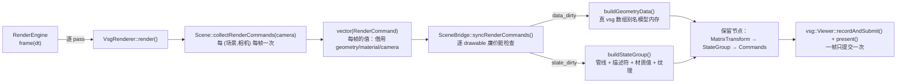

# gfx_backend_vsg：后端运行时说明

本插件是 `vine::graphics` 的 Vulkan 后端（`RenderBackend` 的实现），经 VulkanSceneGraph（vsg）落到
Vulkan。它对外只有一个身份：`RenderBackendFactory` 自注册，后端名 **`"vsg"`**（宿主用
`RenderBackendRegistry::instance().create(u8"vsg")` 拿它）。

本文回答四个问题：**数据怎么流**、**谁活多久**、**每帧/每变化各调用多少次**、**什么触发更新**。
逐帧时序的详细版本在 [`../vine-to-vsg-data-flow.md`](../vine-to-vsg-data-flow.md)（本文只给概览并指向它），
设计理由与实测结论在 `.ai/design/` 与 `.ai/memory/graphics.md`。

## 1. 文件地图：谁负责什么

| 单元 | 职责 |
| --- | --- |
| `GfxBackendVsgPlugin.cpp` | 插件入口：自注册 `VsgRenderBackendFactory` |
| `VsgRenderer.cpp` | **帧泵 + `RenderBackend` 覆写**：`initialize/render/clear/beginPass/endPass/drawScreenTexture/drawScreenProgram/readColorBuffer/readDepthBuffer/resize/shutdown/submitFrame` |
| `VsgRendererState.hpp` | 会话状态（`VsgRendererState`，单窗口会话）、持久状态（`VsgRendererPersistent`，跨会话）、槽的键 `SlotKey` |
| `VsgRenderTargetEntry.hpp` | 目标账本：一个 `RenderTarget` 的三张槽表（内容/程序/覆盖层）+ 附件 + 深度提升状态 |
| `VsgFramePlan.hpp` | 帧计划的值类型：`detail::PassPlan` / `detail::RecordPlan` / `detail::PassAttachments` |
| `VsgRendererPasses.cpp` | pass 协议：`passGraph` 施工与 pass / 槽的生命周期 |
| `VsgPipelineFactory.cpp` | 状态对象与变体决策：`makeRenderStateObjects`、`planPassVariant` / `passVariantIsStale`（纯函数）、清屏附件数与 opaque blend 规则 |
| `SceneBridge.cpp/.hpp` | **Vine 场景 → vsg 节点的保留缓存**：逐 drawable 的脏检查、重建、停放；每个桥自持一个 `vsg::SharedObjects`（`clearCache()` 清它） |
| `SceneBridgeGeometry.cpp` | 几何物化：属性通道 → 真 vsg 数组（**别名模型内存**）、索引、诊断 |
| `SceneBridgePipeline.cpp` | 状态物化：状态变体（管线）、描述符绑定、材质值、纹理 |
| `VsgSceneRules.hpp/.cpp` | **设备无关规则**（通道形状、解包、法线推导、格式/绑定点映射、哈希）—— 有独立单测，不需要设备 |
| `VsgPassMaterialiser.cpp` | pass → `RenderGraph`/framebuffer：变体决策（清屏/深度提升）、稳态复用、发布 |
| `VsgRecordOrder.cpp` | 录制顺序：采样边 + 深度借用边 + 稳定拓扑排序 |
| `VsgTargetBookkeeping.cpp` | 目标装配/注销：附件创建、深度借用解析、重建与释放 |
| `VsgContentSlot.cpp` | 内容槽的每帧驱动（视口、灯、诊断） |
| `VsgOverlay.cpp` | PiP / 全屏 program overlay 的两种绘制 |
| `VsgViewCompiler.cpp` | 增量编译（只编译新 view） |
| `VsgTextureCache.cpp` / `VsgMaterialManager.cpp` | 纹理上传缓存 / 材质值缓存（都是**按地址键 + owner 持有**） |
| `VsgRetireRing.cpp` | 退役环（停放被换下的对象，而不是停设备） |
| `VsgReadback.cpp` | 颜色/深度回读（一次性提交） |
| `CameraBridge.hpp/.cpp` | Vine 相机 → vsg 相机/view（overlay 的两种绘制共用） |
| `VsgBackendUtility.cpp` | 窗口句柄/自建窗口等环境相关的小工具（含 `VINE_VSG_OWN_WINDOW` 逃生口） |
| `VsgDiagnostics.cpp` | 诊断路由：本插件的报告 → SDK 的 sink |
| 插件 CMakeLists（`v_add_plugin`） | `include/` 是 PUBLIC、`src/` 是 PRIVATE；源文件靠 `GLOB_RECURSE`（**无 `CONFIGURE_DEPENDS`**）⇒ 新增 `src/` 文件必须重新 configure |

## 2. 数据流（概览）



要点：

- **`RenderCommand` 是每帧的值**，只借用 Vine 对象；后端要留什么就自己取引用。
- 顶点数据**不复制**：`vsg::vec3Array` 等**别名** geometry 的 buffer（`detail::aliasArray<Array, Element>`，
  存储由 `detail::VsgBufferView<Element>` 持有）。被绑定的对象**必须是真 `vsg::Array`**，裸 `vsg::Data`
  会被静默忽略（不出图、validation 不报）。
- 详细的逐帧时序图、支持/不支持矩阵、已知缺陷清单见
  [`../vine-to-vsg-data-flow.md`](../vine-to-vsg-data-flow.md)。

## 3. 生命周期

### 3.1 谁拥有什么

| 对象 | 拥有者 | 说明 |
| --- | --- | --- |
| 保留节点（transform/state/commands） | `SceneBridge` 的缓存条目（缓存条目又归 `VsgRendererState`） | 键是 `Geometry*`，但条目**持有**该 geometry 的引用，所以地址不会是复用的陌生人（`OwnedCache.hpp`） |
| 被换下的旧节点 | **退役环**（`VsgRetireRing`，深度 `kRetireRingDepth = 4`） | 可能还在飞行的命令缓冲里；提交之后推进环 |
| `vsg::Image`/`ImageView`/采样器（纹理） | `VsgTextureCache` 的条目（条目持有 `Texture` 的引用） | 按容量裁剪（`trimToCapacity`）；条目被丢弃后，场景仍在用的会在下一次绘制时重建 |
| `PhongMaterialValue` | `VsgMaterialManager` 的条目（条目持有 `Material` 的引用） | 每帧 `releaseAbandoned()` 回收已死材质 |
| 渲染目标、附件、pass 图 | `VsgRendererState::targets` | 目标级不变量（`color_seeded`/`depth_seeded`/`any_load_pass`/`depth_sampleable`）随目标一起重置 |
| 内容槽 | 目标账本 | 槽持有 view / 节点 / 编译队列条目 |

### 3.2 会话与持久

- `VsgRendererPersistent`（**跨会话**）：`cameraBridge`、`materialManager`、`shader_preset`、绑定的窗口句柄。
- `VsgRendererState`（**单窗口会话**）：窗口、viewer、命令图、三个 depth 策略的 shader set、pass 请求状态机、
  `targets`（目标 + 附件 + 三张槽表）、录像顺序图、退役环、`pending_compile_views`、以及各种计数
  （`offscreen_build_count` / `program_slot_build_count`）。
- **共享对象注册表是每个 `SceneBridge` 一份**（窗口层/离屏桥各一个）：管线变体、采样器等由它去重；
  `clearCache()` 清空它（所以那条路径必须计数等待，见 §5.3）。
- `shutdown()` 的做法是 **`state = VsgRendererState{};` 整体替换** —— 会话期资源不可能被手写拆卸清单漏掉
  （新增一个持有 vsg 对象的成员不需要改拆卸代码）。持久部分跟着 `persistent` 的析构走。
- 清理顺序是硬约束（撞 `VSG_MAX_DEVICES==1`）：见
  [`../vine-to-vsg-data-flow.md`](../vine-to-vsg-data-flow.md) §10.3。

### 3.3 后端对宿主的承诺（借用 vs 保留）

`RenderBackend.hpp` 的类级契约是权威；本插件逐条兑现：

- **借用参数**：`render(commands, camera)` 里的命令/相机、`drawScreenTexture` 的来源、`publish` 的目标 ——
  调用返回后宿主可以立刻销毁（需要留的，插件当场取引用）。
- **可保留**：只有**显式**发布/持有过的东西（`setRenderTarget` 公告的 target、`publish` 的名字、
  `CompileManager` 里的 view…）会被保留，且必须由 `releasePass()` / `releaseRenderTarget()` /
  `unpublish()` 注销。**保留不随帧数增长**。
- **线程**：`RenderBackend` 的调用是单线程的（宿主主线程）；内部没有后台线程。
- **失败必报**：能拒绝就拒绝并**在诊断通道说明原因**（不静默降级）。诊断按"每类每段只报一次"分集
  （`prune-and-re-arm`），修好再坏会重新报。

## 4. 调用次数（一帧各发生多少次）

### 4.1 每帧恰好一次

`submitFrame()` 就是这份清单（`VsgRenderer.cpp`）：

| 步骤 | 每帧次数 | 稳态是否真做事 |
| --- | --- | --- |
| `releaseAbandonedTargets()` | 1 | 通常无事（只有目标被放弃时） |
| `reportSessionDevice()` | 1 | 有标志守卫，多调 no-op |
| `retireInactivePassSlots()` | 1 | 通常无事（只有本帧未公告的 pass 槽） |
| `compilePendingViews()`（增量编译） | 1 | 队列空 = 立刻返回 |
| `viewer->recordAndSubmit()` | **1**（一帧只提交一次） | 是 |
| `viewer->present()` | 1 | 是 |
| `settleSubmittedFrame()`（各内容槽 + 渲染器退役环各推进一步） | 1 | 是（推进环） |
| `materialManager.releaseAbandoned()` | 1 | 通常无事 |

另外每帧一次（在逐 pass 驱动里）：

- `Scene::collectRenderCommands(camera)`：**每个 (场景, 相机) 一次**，帧内记忆（同一 pass 里多槽共用）。
- 每个 pass 的 `render()` / `clear()`：各一次。
- 每个窗口层的 `SceneBridge::syncRenderCommands()`：一次；内部**每个 drawable 一次廉价脏检查**
  （`revision` / topology / loc2 路径 / material / texture+revision / render state / program+revision /
  矩阵 / opacity）。命中就是只更新 `MatrixTransform::matrix` 或 `colors[].a`。
- 材质值：每个 drawable 一次 `updateMaterial()` **比较**；只有参数真的不同才写 + `dirty()`。
- opacity：每个 drawable 一次 `cmd.opacity` 比较；只有变了才写 alpha + `dirty()`。

### 4.2 每次"变化"一次（稳态 0 次）

| 触发 | 调用 | 代价 |
| --- | --- | --- |
| `geometry->revision()` 变（或 topology / loc2 路径变） | `buildGeometryData()` 重建**数据节点** + 重新上传 | 新数组（别名模型内存）+ 一次上传；旧节点进退役环 |
| material / texture(+revision) / render state / program(+revision) 变 | `buildStateGroup()` 重建**状态包装** | 变体查表命中则复用管线；否则编译一次 |
| 自定义通道集合变了 | 连状态包装一起重建 | 布局哈希变 ⇒ 新变体 |
| 某纹理首次出现或 `Texture::revision()` 变 | `VsgTextureCache::getOrCreate()` 未命中 ⇒ 新建 `vsg::Image` + 上传 | 一张纹理的一次上传 |
| 某个 DYNAMIC 数据被 `dirty()`（材质值 / opacity 载体） | vsg `TransferTask` 拷贝 | host-visible 映射内存上的一次 memcpy（按 `(VkBuffer, offset)` 去重；**不是**每帧无条件拷） |
| load-op 策略（清屏/深度提升）变 | 重建该 pass 的 render pass/framebuffer（**一次性变体**） | 提交之后换回稳态 |

### 4.3 结构性变化才发生

- `reconcileOffscreenOrder()`：新图入图、pass 顺序变、`retargetPass`、overlay 目标解析 —— **不是每帧**。
- `buildOffscreenTarget()` / `releaseRenderTarget()`：附件形态或生命周期变时（重建整张目标）。
- `VsgViewCompiler` 的池注册：某个槽的 view **第一次**出现在增量编译里时才把 (render pass, view) 注册进
  `CompileManager`（池是窗口图还空时建的）。
- 回读（`readColorBuffer`/`readDepthBuffer`）：只在宿主问的时候做一次 one-shot 提交（带具名超时）。

### 4.4 稳态应当是 0 的计数（可断言）

- **几何重建 0**：`syncRenderCommands` 的 `created` 为空 ⇒ vsg 侧零编译。
- **管线变体 0**：`pipelineVariantCount()` 不增（`variantReuseCount()` 增）。
- **设备等待 0**：`deviceWaitCount()` 不增（见 §5.3；`policy churn:` 相位断言 15 帧 0 次）。

## 5. 更新策略

### 5.1 数据与状态解耦

```
                    ┌─ data_dirty ─→ 重建数据节点（新数组、别名模型内存）→ 重新上传
几何的一个命令 ─→ 脏检查 ┤
                    └─ state_dirty ─→ 重建状态包装（管线 + 描述符）→ 数据节点原样复用
```

- 改几何数据**不**重编译管线；改材质/状态**不**重传网格。这是这个后端最基本的性能承诺。
- 两个 `dirty` 的判定与理由都写在 `SceneBridge.cpp` 的注释里（`data_dirty` / `state_dirty`）。

### 5.2 DYNAMIC 与脏计数（谁"每帧"上传）

- 只有两类数据是 `DYNAMIC_DATA`：**每个 drawable 的 opacity 载体**（白色 `vec4Array`，alpha 承载
  per-drawable 不透明度）与**每个 Material 的 `PhongMaterialValue`**。
- 两者的写入都被**比较**守卫（opacity 与缓存参数相同就都不写），所以"稳态帧零传输"。
- 拷贝由 vsg 的**修改计数**驱动：`BufferInfo::requiresCopy()` = `differentModifiedCount()`，且
  `TransferTask::assign()` 按 `(VkBuffer, offset)` **去重** ⇒ 同一段内存被多少 drawable 绑定都只算一条。
- 落地方式是 **host-visible 映射内存上的直接 memcpy**（小 uniform / 顶点颜色），不走 staging、不进队列。

### 5.3 停放 vs 计数等待（破坏性边界）

| 路径 | 策略 |
| --- | --- |
| 状态变体交换、撤销深度提升、被丢弃的 program 节点、视图摘除 | **停放**（退役环，深度 4，提交后推进）⇒ 0 次设备等待 |
| 槽 teardown / 目标重建 / `clearCache()` / depth 模式变更的状态重建 | **计数等待**（`Impl::waitForIdle()`） |

理由（实测）：`clearCache()` 会清空**该桥的**共享对象注册表，那里的管线/采样器不一定还有存活节点作为唯一持有者
—— 停放会让 lavapipe 报 `VUID-vkDestroyPipeline-00765` / `vkDestroySampler-01082`。所有等待都必须走
可数入口（`deviceWaitCount()`），`policy churn:` 相位断言稳态 0 次。

### 5.4 变体与清屏策略

- 每个 pass 的 render pass / framebuffer 由 **`planPassVariant()`**（纯函数）决定：清屏请求（颜色/深度）
  与深度提升状态是变体身份；稳态复用（`reuseSteadyPass()`）只做"变体是否过期 + 更新清屏值"。
- 变体之间必须 **render pass 兼容**，包括**子通道依赖逐字段相同**（否则 `renderPass-02684`）——
  `makeColorDepthRenderPass()` 把依赖块收成一处置，就是为了让这条从约定变成结构性。
- 一次性变体（bootstrap / 需要特定初始布局）**提交之后**才换回稳态。

## 6. 诊断与验证

- 报告统一走 `VsgDiagnostics`（模块自己接 SDK 的 sink），消息用 `formatDiagnostic()` 生成，**一条分支一套
  格式串**（历史事故：三元选格式串却按另一分支传参 ⇒ 打印互换的数字）。
- 检查：`scripts/check_diagnostic_formats.py`（按分支核对三元格式串，0 命中才算过）。
- 渲染门禁：`scripts/gfx_lavapipe_check.sh`（lavapipe + 校验层，期望 0 VUID）与
  `scripts/vsg_selftest_evidence.sh`（后端自检的 `[selftest]` 证据行**逐字节**比对基线）。
- 设备无关规则有独立单测（`tests/test_vsg/SceneRulesTest.cpp`）—— 通道形状、解包、法线推导、格式/绑定
  点映射、布局与变体哈希都能在无设备环境下断言。

## 7. 已知坑（扩展前必读）

1. **被绑定的必须是真 `vsg::Array`**：自写 `vsg::Data` 子类即使把 `format`/`stride`/`valueSize`/
   `valueCount`/`dataSize` 报得完全一致也**不出图**，且 validation 一条不报。别名要用
   `vsg::Array(storage, offset, stride, count)`。
2. **别名数组的 stride 必须是数组自己的元素大小**（`vec3` → 12，不是 `float` → 4）：vsg 用
   `properties.stride` **同时**索引 CPU 侧与 GPU 绑定，取错会让 GPU 交错读，而 CPU 侧的值看着还挺像。
3. **格式不匹配会被 configurator 静默接受**：绑定名、Vulkan 格式、样例数据三者必须一致，错了只在绘制时
   表现为"属性缺失/读错"。
4. **vsg 按值类型匹配绑定**：`assignArray` 把数组与绑定名对应，数组的元素类型就是格式的来源 —— 别手写。
5. **一个 drawable 三层串联**（`MatrixTransform → StateGroup → Commands`）；手工拼 `VertexIndexDraw` 不会
   被光栅化，必须用显式 bind/draw 命令。
6. **`RenderTarget` 默认尺寸是 1×1**（不是 0）：想表达"没有尺寸"要显式 `setSize(0,0)`。
7. **`VINE_VSG_OWN_WINDOW`** 是临时逃生口（后端自建窗口，忽略公告的表面尺寸），只用于测试。
8. **新增 `src/` 文件后必须重新 `cmake -S . -B build`**（插件源文件列表是 `GLOB_RECURSE` 且无
   `CONFIGURE_DEPENDS`）；`tests/*/CMakeLists.txt` 的条目用 **tab** 缩进。
