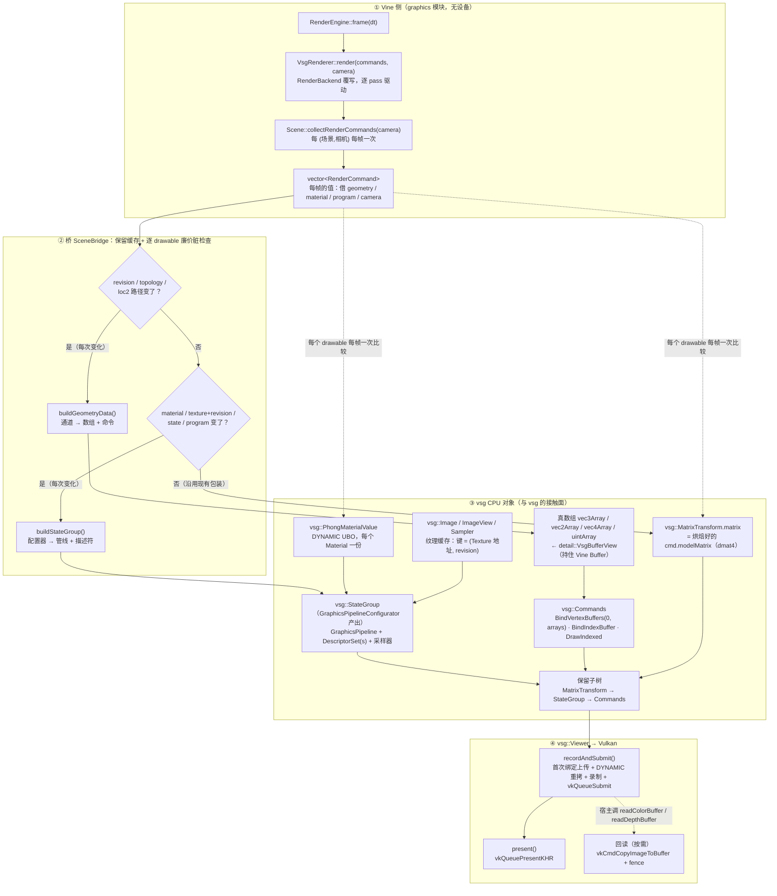

# gfx_backend_vsg：后端运行时说明

本插件是 `vine::graphics` 的 Vulkan 后端（`RenderBackend` 的实现），经 VulkanSceneGraph（vsg）落到
Vulkan。它对外只有一个身份：`RenderBackendFactory` 自注册，后端名 **`"vsg"`**（宿主用
`RenderBackendRegistry::instance().create(u8"vsg")` 拿它）。

本文回答四个问题：**数据怎么流**、**谁活多久**、**每帧/每变化各调用多少次**、**什么触发更新**。
逐帧时序的详细版本在 [`data-flow.md`](data-flow.md)（本文只给概览并指向它），
设计理由与实测结论在 `.ai/design/` 与 `.ai/memory/graphics.md`。

## 1. 文件地图：谁负责什么

| 单元 | 职责 |
| --- | --- |
| `GfxBackendVsgPlugin.cpp` | 插件入口：自注册 `VsgRenderBackendFactory` |
| `VsgRenderer.cpp` | **帧泵 + `RenderBackend` 覆写**：`initialize/render/clear/beginPass/endPass/drawScreenTexture/drawScreenProgram/readColorBuffer/readDepthBuffer/resize/shutdown/submitFrame` |
| `VsgRendererState.hpp` | 会话状态（`VsgRendererState`，单窗口会话）、持久状态（`VsgRendererPersistent`，跨会话）、槽的键 `SlotKey` |
| `VsgRenderTargetEntry.hpp` | 目标账本：一个 `RenderTarget` 的三张槽表（内容/程序/覆盖层）+ 附件 + 深度提升状态 |
| `VsgFramePlan.hpp` | 帧计划的值类型：`detail::PassPlan` / `detail::RecordPlan` / `detail::PassAttachments` |
| `VsgRendererPasses.cpp` | pass 协议：`passGraph` 施工与 pass / 槽的生命周期 |
| `VsgPipelineFactory.cpp` | 状态对象与变体决策：`makeRenderStateObjects`、`planPassVariant` / `passVariantIsStale`（纯函数）、清屏附件数与 opaque blend 规则 |
| `SceneBridge.cpp/.hpp` | **Vine 场景 → vsg 节点的保留缓存**：逐 drawable 的脏检查、重建、停放；每个桥自持一个 `vsg::SharedObjects`（`clearCache()` 清它） |
| `SceneBridgeGeometry.cpp` | 几何物化：属性通道 → 真 vsg 数组（**别名模型内存**）、索引、诊断 |
| `SceneBridgePipeline.cpp` | 状态物化：状态变体（管线）、描述符绑定、材质值、纹理 |
| `VsgSceneRules.hpp/.cpp` | **设备无关规则**（通道形状、解包、法线推导、格式/绑定点映射、哈希）—— 有独立单测，不需要设备 |
| `VsgPassMaterialiser.cpp` | pass → `RenderGraph`/framebuffer：变体决策（清屏/深度提升）、稳态复用、发布 |
| `VsgRecordOrder.cpp` | 录制顺序：采样边 + 深度借用边 + 稳定拓扑排序 |
| `VsgTargetBookkeeping.cpp` | 目标装配/注销：附件创建、深度借用解析、重建与释放 |
| `VsgContentSlot.cpp` | 内容槽的每帧驱动（视口、灯、诊断）；vsg 灯节点 + 每帧 `setGroupLights` 只在**内建退回路径**跑（forward 用自己的 `vine_lights` 块） |
| `VsgOverlay.cpp` | PiP / 全屏 program overlay 的两种绘制 |
| `shaders/`（`fullscreen.vert` / `screen_texture.frag`） | 本后端自己的 GLSL：构建期嵌入成 `vine/vsg/EmbeddedShaders.hpp`（清单 `cmake/VineShaders.cmake`，机制见 [`.ai/design/vsg-custom-shader.md`](../../../../.ai/design/vsg-custom-shader.md) §10） |
| `detail::buildVineShaderSet` / `makeContentShaderSet` | **自写前向着色**（替代 vsg 内建 phong 的 P0）：**GLSL 归 SDK**（`src/viz/graphics/shaders/vine_forward.*`，经 `BuiltinShaders.hpp` 的 `builtinProgram(preset)` 取源——本后端只编译它并声明 ABI）。属性 0/1/2(色,define) / 8(uv,define)、set0 的 material(b0) / diffuseMap(b1) / **vine_lights(b2, 每槽 UBO)**、**set1/b0 `vine_draw`（`VineDrawBlock`，UNIFORM_BUFFER_DYNAMIC，每 drawable 一个槽）** + push `pc` 0..128（vsg 矩阵栈填）。**唯一路径（2026-09-13 起）**：`makeContentShaderSet` 总是返回引擎自己的 set，**完全不使用 vsg 内建 set**（`VINE_VSG_BUILTIN` 开关与内建基线已删除）；没有自己 program 的 preset（Pbr/ShadowedPhong）由**前向程序**代替，并每会话报一条 diagnostic。证据基线一条（51 行，ABI/门禁见该文档 §11） |
| `VsgViewCompiler.cpp` | 增量编译（只编译新 view） |
| `VsgTextureCache.cpp` / `VsgMaterialManager.cpp` | 纹理上传缓存 / 材质值缓存（都是**按地址键 + owner 持有**） |
| `VsgRetireRing.cpp` | 退役环（停放被换下的对象，而不是停设备） |
| `VsgReadback.cpp` | 颜色/深度回读（一次性提交） |
| `CameraBridge.hpp/.cpp` | Vine 相机 → vsg 相机/view（overlay 的两种绘制共用） |
| `VsgBackendUtility.cpp` | 窗口句柄/自建窗口等环境相关的小工具（含 `VINE_VSG_OWN_WINDOW` 逃生口） |
| `VsgDiagnostics.cpp` | 诊断路由：本插件的报告 → SDK 的 sink |
| 插件 CMakeLists（`v_add_plugin`） | `include/` 是 PUBLIC、`src/` 是 PRIVATE；源文件靠 `GLOB_RECURSE`（**无 `CONFIGURE_DEPENDS`**）⇒ 新增 `src/` 文件必须重新 configure；`shaders/` 不在 glob 里，靠 `v_use_embedded_shaders` 挂生成头文件 |

## 2. 数据流（纵向）

从 Vine 到像素有四段，**只有第三段（桥）接触 vsg**：上面两段是纯 CPU、不需要设备，下面一段是 vsg
自己在上传与录制时的行为。纵向看：



### 2.1 每一步产出什么、发生多少次

| # | 步骤 | 产出 / 写入的 vsg 对象 | 频次 |
| --- | --- | --- | --- |
| 1 | `RenderEngine` → `Scene::collectRenderCommands(camera)` | 无（纯 Vine 值） | 每 (场景, 相机) **每帧一次** |
| 2 | `SceneBridge::buildGeometryData()` | 真 `vsg::Array`（**别名**模型内存）+ `vsg::Commands`（`BindVertexBuffers` / `BindIndexBuffer` / `DrawIndexed`） | 每次**数据**变化一次（稳态 0） |
| 3 | `SceneBridge::buildStateGroup()` | `vsg::StateGroup`（内含 `GraphicsPipeline` + `DescriptorSet`）+ 材质值 + 纹理 `ImageInfo` | 每次**状态**变化一次（稳态 0） |
| 4 | 位置（每帧路径） | `vsg::MatrixTransform.matrix`（`::vsg::dmat4`，来自烘焙好的 `cmd.modelMatrix`） | **每帧**：每个 drawable 一次比较，值变了才写 |
| 5 | 不透明度（每帧路径） | 该 drawable 的 DYNAMIC `vsg::vec4Array`（白色载体的 alpha） | **每帧**比较；`cmd.opacity` 变了才写 + `Data::dirty()` |
| 6 | `VsgMaterialManager` | `vsg::PhongMaterialValue`（DYNAMIC uniform） | **每帧**比较参数；变了才写 + `dirty()` |
| 7 | `VsgRenderer` 的 pass 物料化 | 把新节点挂进该 pass 的 `vsg::RenderGraph`（窗口图或离屏目标的图）；有新节点 ⇒ 交给 `CompileManager`（增量编译，只编译新 view） | 有 `created` 时（稳态 0） |
| 8 | `vsg::Viewer` | `vkQueueSubmit`（**一帧一次**）+ `vkQueuePresentKHR` | 每帧 |
| 9 | `VsgReadback` | `vkCmdCopyImageToBuffer` + fence（具名超时） | 宿主**按需** |

### 2.2 上传路径：与 vsg 的第二次接触

| 数据 | 谁决定上传 | 机制 | 频次 |
| --- | --- | --- | --- |
| 顶点 / 索引（静态） | vsg 首次使用该数组时 | `BufferInfo` → 设备本地 buffer（staging / `TransferTask`）；我们的数组**不是 DYNAMIC** ⇒ 只传一次 | 每次数据重建一次 |
| 顶点颜色（opacity 载体） | 该 drawable 的 `cmd.opacity` 变了 | DYNAMIC ⇒ `Data::dirty()` → vsg `TransferTask` 拷贝（按 `(VkBuffer, offset)` **去重**） | 每次 opacity 变化一次 |
| 材质值 | `Material` 参数变了 | 同上（DYNAMIC）：走 host-visible 分支是**直接 `memcpy`**，不建 staging、不进队列 | 每次材质变化一次 |
| 纹理 | 新纹理，或 `Texture::revision()` 变了 | 新建 `vsg::Image` + 一次上传；旧条目由容量裁剪 / 废弃回收 | 每次变化一次 |

于是**稳态帧**：不重建节点、不重编译管线、不重传任何数据、零设备等待（§4.4 的三个 0）。

### 2.3 一句话概括

- **`RenderCommand` 是每帧的值**，只借用 Vine 对象；后端要留什么，当场自己取引用。
- **顶点不复制**：真 `vsg::Array` 别名 geometry 的 buffer（`detail::aliasArray<Array, Element>`，存储由
  `detail::VsgBufferView<Element>` 持住）。被绑定的对象**必须是真 `vsg::Array`** —— 裸 `vsg::Data`
  会被静默忽略（不出图、validation 不报）。
- **数据与状态解耦**：改几何数据只重建数据节点（重新上传），改材质 / 状态只重建状态包装（复用数据节点）。
- 坏数据（越界索引、坏通道形状）在桥里就被**拒绝并上报**，不会带着疑问进入 vsg。

更细的逐帧时序、支持/不支持矩阵、已知缺陷清单见 [`data-flow.md`](data-flow.md)。

### 2.4 属性喂入：名字、location 与绑定顺序

**先把四个词分清**（本节全用这一套叫法，别混）：

| 词 | 是什么 | 谁写它 |
| --- | --- | --- |
| **通道 location**（= 源 location） | 通道在 Geometry 里的编号，是 `Geometry::attributes_` 这个 `std::map` 的键 | **调用者**：`setPositions` 固定 0、`setNormals` 固定 1、`setTexcoords2` 固定 8、`setIndices` 不是属性；`addBuffer(L, …)` 的自定义通道 L ≥ 3 且 ≠ 8 |
| **shader location** | GLSL 里的 `layout(location = N) in …`；也就是 SPIR-V 的输入编号 | **写 shader 的人**。内建路径必须用 vsg 的编号；自定义 program 路径必须用模块契约（下表） |
| **数组下标 = Vulkan binding** | 顶点输入数组在喂入列表里的位置：`VkVertexInputBindingDescription.binding` / `vkCmdBindVertexBuffers` 的 binding | **后端**（调用者既不写它，也影响不到前缀四个的编号；GLSL 里根本没有这个概念） |
| **喂给的名字** | 后端与 ShaderSet 之间配对用的字符串：`vsg_Vertex` / `vsg_Normal` / `vsg_TexCoord0` / `vsg_Color` / `vine_Attribute{L}` | **后端**生成（`customAttributeName(L)`），调用者只在自定义通道的 L 上间接影响 `{L}` |

**走哪条路径由 draw command 上的 program 决定，不由 geometry 决定**（`buildStateGroup()` 里 `program != nullptr`，`SceneBridgePipeline.cpp:348-353`）：

| | 内建路径 | 自定义 program 路径 |
| --- | --- | --- |
| 触发 | `cmd.program == nullptr` | `RenderPass::setProgramOverride()` / `ScreenPass::setProgram()` 给的 program |
| ShaderSet | `baseShaderSet()`（宿主传进来的 vsg set） | `getProgramShaderSet()` → `assembleProgramShaderSet()` |
| shader location 的来源 | vsg 自己的编号 | 通道 location 一一对应（canonical 0/1/2/8 + 自定义 `L`） |
| 顶点数据来源 | **两条路径完全相同**：`buildGeometryData()` 按固定 canonical location 取数据，再按名字配对 | 同左 |
| 换路径时重建 | 只重建 state wrapper，数据节点复用 | 同左（例外：带作者写的 loc2 颜色时数据也要重建） |
| 同一个 geometry | 可以在 A pass 走内建、B pass 走自定义；两条路径的 set 互相独立 | 同左 |

唯一需要重建数据的情形：几何体带**作者写的 loc2 颜色**时，内建路径的 binding 2 是后端白 `DYNAMIC` 载体（alpha 驱动 opacity）、
自定义路径绑作者的颜色原样，所以切换路径要重建**数据**节点（`SceneBridge.cpp` 的 `data_dirty` 里那一条）。

三张表的关系就下面这张（左边两列是后端的，右边两列是 shader 的）：

| 数组下标（= binding） | 喂给的名字 | 内建路径的 shader location（vsg） | 自定义 program 的 shader location（模块） |
| --- | --- | --- | --- |
| 0 | `vsg_Vertex` | **0** | **0** |
| 1 | `vsg_Normal` | **1** | **1** |
| 2 | `vsg_TexCoord0` | **2** | **8** |
| 3 | `vsg_Color` | **6** | **2** |
| 4+i | `vine_Attribute{L}` | —（内建不声明） | **L**（= 该通道的**源 location**） |

举个具体的：几何体有位置(0)、法线(1)、颜色(2)、UV(8) 和一个 `L = 5` 的自定义通道 ——

| 通道 | 通道 location（Geometry） | 内建路径 shader location | 自定义路径 shader location | 数组下标/binding |
| --- | --- | --- | --- | --- |
| 位置 | 0 | 0 | 0 | 0 |
| 法线 | 1 | 1 | 1 | 1 |
| UV | 8 | **2** | **8** | **2** |
| 颜色 | 2 | **6** | **2** | 3 |
| 自定义 | 5 | ——（内建 set 不声明它，喂了也不被读） | **5** | 4 |

注意最后一行与第三行的对照：**数组下标与 shader location 是两回事**（UV 的 binding 是 2 而 location 是 8）。

> **模块契约的 location 值（内建前向与自定义 program 共用 0/1/2/8）现由 SDK `vine/graphics/ShaderAbi.hpp`
> 定义**（`attributeLocation(VertexAttribute)`；契约见 `.ai/design/graphics-shader.md` §11）。后端只把角色
> 映射成 vsg 的绑定别名（`vsg_Vertex` 等），编号不再由后端硬编码（2026-09-13，P0.B1）。

其余规则：

- **数组下标由 `SceneBridgeGeometry.cpp` 的 `arrays` 列表顺序决定**（位置 → 法线 → texcoords → 颜色 → 自定义通道按 location 升序），
  在 `SceneBridgePipeline.cpp` 里按同一顺序 `assign_array(name, index)` 配对；`BindVertexBuffers::create(0u, arrays)` 再按列表位置绑成 binding 0..N-1。
  自定义通道的 `i` 按 **location 升序**排（`Geometry::attributes_` 是 `std::map`，升序确定，不是哈希序）。
- vsg 给顶点输入 binding 编号的方式是“按 `assignArray()` 成功的顺序递增”，所以**ShaderSet 的声明顺序必须与 `arrays` 顺序逐位对齐**：漏声明一个名字或漏喂一个数组，
  后面全体错位，把下一个属性的数据喂给当前属性 —— 而 validation 不会报。这也是模块把前缀四个通道**永远都声明、永远都喂**（没有 UV 的网格喂零填充数组）的原因。
- **内建路径的 shader location 是 vsg 自己的**（ShaderSet 就是宿主传进来的 vsg set；实测 `vsg_shader_dump`：
  `vsg_Vertex` 0 / `vsg_Normal` 1 / `vsg_TexCoord0..3` 2..5 / `vsg_Color` **6** / `vsg_Translation(_scaleDistance)` 7 /
  `vsg_Rotation` **8** / `vsg_Scale` 9 / `vsg_JointIndices` 10 / `vsg_JointWeights` 11 —— flat/phong/pbr 三套完全一样，
  也就是**密集占满 0..11**）。
- **自定义 program 路径自建 ShaderSet**（`assembleProgramShaderSet`），shader location 用模块契约 0 / 1 / 2 / 8。
  推导就是下面这张表（前提：自定义通道**沿用自己的源 location** 当 shader location，转发范围 `L ≥ 3 且 L ≠ 8`）：

  | 契约位置 | 给谁 | 为什么是这个号 |
  | --- | --- | --- |
  | 0 / 1 | 位置、法线 | 与 vsg 一致 ⇒ 只读位置/法线的 shader 两条路径通用 |
  | 2 | 颜色 | `< 3` 的最后一个空位；vsg 内建 set 里颜色是 6，而 2..6 被 `vsg_TexCoord0..3`(2..5) 与 `vsg_Color`(6) 占满 |
  | 8 | texcoord | `≥ 3` 里由模块**显式保留**，且 `L == 8` 的通道不转发 ⇒ 用户占不掉（`Geometry::kTexCoordLocation`） |
  | 3..7、9.. | 自定义通道 | 全留给用户；vsg 的 8 是 `vsg_Rotation`，两套 set 永不同时存在，撞号无害 |

  结果是模块这套是**稀疏**编号（vsg 那套是密集的 0..11）。
- **别把 vsg Builder 的数组下标当成 shader location**：`Builder.cpp:97` / `tile.cpp:488` 的 `enableArray("vsg_TexCoord0", …, 8)`
  里的 8 是 vsg 那边的**数组下标**，而它 Phong set 里 texcoord 的 shader location 是 **2** —— 这两套编号 vsg 自己就是分开的。
- 名字侧的守卫：`assignArray()` 失败且该名字**被管线声明**过 ⇒ 报一次 `ContentSkipped` Warning
  （`vertex binding '%s' (array %zu, %s) was not matched by the pipeline; the shader reads an attribute the pipeline does not enable…`）。
  反方向（shader 声明了几何体没有的 shader location）**没有任何诊断** —— ShaderSet 是按几何体的通道布局建的，没声明的就是没喂。
- **通道可以是缓冲里的一段（arena 切片，P7）**：`AttributeChannel::offset`（scalar 计）+ `scalarCount`，配合
  `AttributeChannel::slice(values, components, first_vertex, vertex_count)` 表达"一个大缓冲、每 geometry 一段"。
  后端全链路按**这一段**走：

  | 环节 | 行为 |
  | --- | --- |
  | 别名 | `aliasArray(buffer, count, offset_scalars)` 把 offset 换算成 vsg `Array` 的**字节**起点（`Array(storage, offset, stride, count)`）⇒ 绑定的数组第 0 号元素就是这一段的第一个顶点 |
  | 形状校验 | `channelShape()` / `unpackXyz()` / `packColor4()` 全部走 `floatCount()/vertexCount()/scalars()` ⇒ 判的是**通道自己的范围**，不是缓冲的长度 |
  | 共享 key | 顶点侧 key 带 `offset`（同缓冲不同段是两条流，不能互借）；**索引侧相反**：bind 别名整段缓冲，`DrawIndexed(firstIndex, indexCount)` 表达切片 ⇒ 一个索引 arena 共享一次索引上传 |
  | 刷新路径 | 段变了（同缓冲、同 revision、同长度）⇒ 走刷新：新数组按新 offset 建立；**索引 span 变了 ⇒ 必须重建**（span 在 draw 命令里，原地换 bind 表达不了），闸门是 `index_span_changed` |
  | 派生通道 | P5 的派生法线缓存 key 加上 positions 的 `offset` 与索引的 `first/count`：同缓冲另一段是另一组输入 |
  | 索引越界检查 | 按**这一段的**顶点数检查（索引是段内相对的）⇒ arena 里一个 geometry 的索引不会读到邻居的数据 |


**缓存与重建**（布局进 cache key，所以“按 geometry 映射”实际是“按每个布局映射一遍”）：

| 缓存 | 键 | 值 | 何时失效 |
| --- | --- | --- | --- |
| `program_stages_` | program 对象 | 编译好的 SPIR-V stages | `program->revision()` 变化 ⇒ 重编译 |
| `program_shader_sets_` | program + **布局 hash**（`vertexLayoutHash(extra_channels)`） | 该布局的 `vsg::ShaderSet` | program revision 或布局变化 ⇒ 重装配 |
| `VsgMeshResourceCache`（**会话级**） | 通道流身份：`binding + components + Buffer 地址 + Buffer::revision() + offset + 元素数`（`offset` = arena 切片起点，见 §2.4 的 "一段一个 geometry"） | 该流的 `BindVertexBuffers` / `BindIndexBuffer`（**一条 bind 就是一份设备缓冲 + 一次上传**） | key 变了自然是新条目；没人再读的条目由帧级 sweep 释放（§5.1.2） |

⇒ 同一份 program 配不同通道布局的 geometry 拿到**不同的 ShaderSet**（binding 不同），但共享同一份 stages。
编译失败/装配失败都会缓存（空 stages / null）以免每帧重试；两者都回落内建 set，并各报一条 `ShaderFallback` Warning。两表上界都是 64，FIFO 淘汰。

> 面向使用者的写法（Geometry 侧怎么挑 location、每段的示例 shader、描述符/push constant 清单）见
> `src/viz/graphics/docs/usage.md` §3.8。

## 3. 生命周期

### 3.1 谁拥有什么

| 对象 | 拥有者 | 说明 |
| --- | --- | --- |
| 保留节点（transform/state/commands） | `SceneBridge` 的缓存条目（缓存条目又归 `VsgRendererState`） | 键是 `Geometry*`，但条目**持有**该 geometry 的引用，所以地址不会是复用的陌生人（`OwnedCache.hpp`） |
| 被换下的旧节点 | **退役环**（`VsgRetireRing`，深度 `kRetireRingDepth = 4`） | 可能还在飞行的命令缓冲里；提交之后推进环 |
| `vsg::Image`/`ImageView`/采样器（纹理） | **会话**的 `VsgTextureCache`（`VsgRendererState::texture_cache`，经 `SceneBridge::setTextureCache()` 注入每个内容槽） | 每张纹理**一条**：同一张纹理被 N 个槽采样只上传一次（在此之前缓存是每 bridge 一份 ⇒ N 份 image + N 次上传）；按容量裁剪（`trimToCapacity`，上界 256），App 放手的条目由**帧级清扫**（`SceneBridge::releaseAbandonedCaches()` → `textureCache().releaseAbandoned()`）释放 |
| 共享网格流（`BindVertexBuffers` / `BindIndexBuffer`） | **会话**的 `VsgMeshResourceCache`（`VsgRendererState::mesh_cache`，经 `SceneBridge::setMeshResourceCache()` 注入；没有注入时退化成该 bridge 自己的一份） | 每条**别名自模型缓冲**的流一条：k 个 drawable 读同一份顶点/索引只上传一次（在此之前每 drawable 一份 bind ⇒ 池区间与上传各一套）；按容量 FIFO 裁剪（上界 512），无人再读的条目由同一次帧级清扫释放（§5.1.2） |
| `PhongMaterialValue` | `VsgMaterialManager` 的条目（条目持有 `Material` 的引用） | 每帧 `releaseAbandoned()` 回收已死材质 |
| 渲染目标、附件、pass 图 | `VsgRendererState::targets` | 目标级不变量（`color_seeded`/`depth_seeded`/`any_load_pass`/`depth_sampleable`）随目标一起重置 |
| 内容槽 | 目标账本 | 槽持有 view / 节点 / 编译队列条目 |

### 3.2 会话与持久

- `VsgRendererPersistent`（**跨会话**）：`cameraBridge`、`materialManager`、`shader_preset`、绑定的窗口句柄。
- `VsgRendererState`（**单窗口会话**）：窗口、viewer、命令图、三个 depth 策略的 shader set、pass 请求状态机、
  `targets`（目标 + 附件 + 三张槽表）、录像顺序图、退役环、`pending_compile_views`、以及各种计数
  （`offscreen_build_count` / `program_slot_build_count`）。
- **共享对象注册表是每个 `SceneBridge` 一份**（窗口层/离屏桥各一个）：管线变体、采样器等由它去重；
  `clearCache()` 清空它（所以那条路径必须计数等待，见 §5.3）。
- `shutdown()` 的做法是 **`state = VsgRendererState{};` 整体替换** —— 会话期资源不可能被手写拆卸清单漏掉
  （新增一个持有 vsg 对象的成员不需要改拆卸代码）。持久部分跟着 `persistent` 的析构走。
- 清理顺序是硬约束（撞 `VSG_MAX_DEVICES==1`）：见
  [`data-flow.md`](data-flow.md) §10.3。

### 3.3 后端对宿主的承诺（借用 vs 保留）

`RenderBackend.hpp` 的类级契约是权威；本插件逐条兑现：

- **借用参数**：`render(commands, camera)` 里的命令/相机、`drawScreenTexture` 的来源、`publish` 的目标 ——
  调用返回后宿主可以立刻销毁（需要留的，插件当场取引用）。
- **可保留**：只有**显式**发布/持有过的东西（`setRenderTarget` 公告的 target、`publish` 的名字、
  `CompileManager` 里的 view…）会被保留，且必须由 `releasePass()` / `releaseRenderTarget()` /
  `unpublish()` 注销。**保留不随帧数增长**。
- **线程**：`RenderBackend` 的调用是单线程的（宿主主线程）；内部没有后台线程。
- **失败必报**：能拒绝就拒绝并**在诊断通道说明原因**（不静默降级）。诊断按"每类每段只报一次"分集
  （`prune-and-re-arm`），修好再坏会重新报。

## 4. 调用次数（一帧各发生多少次）

### 4.1 每帧恰好一次

`submitFrame()` 就是这份清单（`VsgRenderer.cpp`）：

| 步骤 | 每帧次数 | 稳态是否真做事 |
| --- | --- | --- |
| `releaseAbandonedTargets()` | 1 | 通常无事（只有目标被放弃时） |
| `reportSessionDevice()` | 1 | 有标志守卫，多调 no-op |
| `retireInactivePassSlots()` | 1 | 通常无事（只有本帧未公告的 pass 槽） |
| `compilePendingViews()`（增量编译） | 1 | 队列空 = 立刻返回 |
| `viewer->recordAndSubmit()` | **1**（一帧只提交一次） | 是 |
| `viewer->present()` | 1 | 是 |
| `settleSubmittedFrame()`（各内容槽 + 渲染器退役环各推进一步） | 1 | 是（推进环） |
| `materialManager.releaseAbandoned()` | 1 | 通常无事 |

另外每帧一次（在逐 pass 驱动里）：

- `Scene::collectRenderCommands(camera)`：**每个 (场景, 相机) 一次**，帧内记忆（同一 pass 里多槽共用）。
  返回的是**视锥剔除后的**列表：剔除掉的对象根本不在 `RenderCommand` 里，后端“看不见”它（见 §5.5）。
- 每个 pass 的 `render()` / `clear()`：各一次。
- 每个窗口层的 `SceneBridge::syncRenderCommands()`：一次；内部**每个 drawable 一次廉价脏检查**
  （`revision` / topology / loc2 路径 / material / texture+revision / render state / program+revision /
  矩阵 / opacity）。命中就是只更新 `MatrixTransform::matrix` 或 `colors[].a`。
- 材质值：每个 drawable 一次 `updateMaterial()` **比较**；只有参数真的不同才写 + `dirty()`。
- opacity：每个 drawable 一次 `cmd.opacity` 比较；只有变了才写 alpha + `dirty()`。

### 4.2 每次"变化"一次（稳态 0 次）

| 触发 | 调用 | 代价 |
| --- | --- | --- |
| `geometry->revision()` 变（或 topology / loc2 路径变） | 形状不变且快照能解释"变了哪一路" ⇒ **原地刷新那一路**（`assignArrays({新数组})`，只重拷该通道）；否则 `buildGeometryData()` 重建**数据节点** + 重新上传 | 刷新：该通道字节；重建：新数组（别名模型内存）+ 全通道上传，旧节点进退役环 |
| material / texture(+revision) / render state / program(+revision) 变 | `buildStateGroup()` 重建**状态包装** | 变体查表命中则复用管线；否则编译一次 |
| 自定义通道集合变了 | 连状态包装一起重建 | 布局哈希变 ⇒ 新变体 |
| 某纹理首次出现或 `Texture::revision()` 变 | `VsgTextureCache::getOrCreate()` 未命中 ⇒ 新建 `vsg::Image` + 上传 | 一张纹理的一次上传 |
| 某个 DYNAMIC 数据被 `dirty()`（材质值 / opacity 载体） | vsg `TransferTask` 拷贝 | host-visible 映射内存上的一次 memcpy（按 `(VkBuffer, offset)` 去重；**不是**每帧无条件拷） |
| load-op 策略（清屏/深度提升）变 | 重建该 pass 的 render pass/framebuffer（**一次性变体**） | 提交之后换回稳态 |

### 4.3 结构性变化才发生

- `reconcileOffscreenOrder()`：新图入图、pass 顺序变、`retargetPass`、overlay 目标解析 —— **不是每帧**。
- `buildOffscreenTarget()` / `releaseRenderTarget()`：附件形态或生命周期变时（重建整张目标）。
- `VsgViewCompiler` 的池注册：某个槽的 view **第一次**出现在增量编译里时才把 (render pass, view) 注册进
  `CompileManager`（池是窗口图还空时建的）。
- 回读（`readColorBuffer`/`readDepthBuffer`）：只在宿主问的时候做一次 one-shot 提交（带具名超时）。

### 4.4 稳态应当是 0 的计数（可断言）

- **几何重建 0**：`syncRenderCommands` 的 `created` 为空 ⇒ vsg 侧零编译。
- **管线变体 0**：`pipelineVariantCount()` 不增（`variantReuseCount()` 增）。
- **设备等待 0**：`deviceWaitCount()` 不增（见 §5.3；`policy churn:` 相位断言 15 帧 0 次）。

## 5. 更新策略

### 5.1 数据与状态解耦

```
                    ┌─ data_dirty ─→ 重建数据节点（新数组、别名模型内存）→ 重新上传
几何的一个命令 ─→ 脏检查 ┤
                    └─ state_dirty ─→ 重建状态包装（管线 + 描述符）→ 数据节点原样复用
```

- 改几何数据**不**重编译管线；改材质/状态**不**重传网格。这是这个后端最基本的性能承诺。
- 两个 `dirty` 的判定与理由都写在 `SceneBridge.cpp` 的注释里（`data_dirty` / `state_dirty`）。

### 5.1.1 通道级增量：为什么数据节点每通道一条 bind

vsg 的重传粒度是**一条 `BindVertexBuffers` 命令**：命令里任一阵列过期，`BindVertexBuffers::compile()` 就把该命令的**全部**
阵列重新预留并重拷（`createBufferAndTransferData` → 池 reserve）。所以"只重传变了的那一路"要求两条：

| 条件 | 做法 |
| --- | --- |
| 每个 canonical 通道有自己的命令 | `buildGeometryData()` 发 5 条 bind：0 位置、1 法线、2 texcoord、3 loc2 颜色、4+ 自定义（自定义共用一条，集合变就是布局变）。**forward set 在几何无作者色（且无 UV/无纹理）时不 assign 2/3** ⇒ 数据节点仍绑着那两条，但管线不声明、define 关（§11.6） |
| 知道"变的是哪一路" | `SceneBridge::ChannelKey` = `位置/分量/缓冲指针/Buffer::revision()/元素数`；快照存在 `Item` 里，`shapesMatch()` 比形状（位置/分量/数量），逐键比字节身份 |

于是数据 revision 分两档：**形状不变**（通道集合、分量、元素数一致，位置 0 仍是可别名布局）且快照解释了变化 ⇒ 只把变化
通道的 bind 换成新数组（索引流同理），节点与 `MatrixTransform` 都是原对象；**其余情况**（形状变、有无解释不了的变化、通道
不可别名、越界索引…）⇒ 走原来的全量重建，由 builder 报诊断/拒绝。

派生通道与位置**耦合**：几何体不作者法线时，位置变会连带重新推导法线（P5 的缓存同步更新）。

> 命名接口不变：`Geometry::revision()` 仍然只表示"变了"，刷新路径只是**额外**用逐流快照判断能不能少做；看不出来就
> 老实重建。`Buffer::revision()` 的契约见 `vine/Buffer.hpp`：**写的人**改完字节要显式 bump（buffer 自己不 bump）。

### 5.1.2 共享网格流：一份模型字节，一条 bind

`BufferInfo` **是命令自己拥有的**，而 vsg 把 `BufferInfo` 变成一个设备缓冲（`BindVertexBuffers::compile()` →
`createBufferAndTransferData` → 池 reserve + 拷字节）。所以"k 个 drawable 读同一份顶点/索引"在 P9 之前是 k 条 bind、
k 份设备内存、k 次上传 —— CPU 侧本来就是**同一段内存**（`AttributeChannel` 借 `vine::Buffer`），GPU 侧却复制成 k 份。
`VsgMeshResourceCache` 把这类流收敛成**一条 bind**，于是它们共享同一个设备缓冲。

**哪些通道能共享**（判据只有一条：**这条数组是不是模型字节的原样视图**）：

| 通道（binding） | 能共享？ | 为什么 |
| --- | --- | --- |
| 0 位置 | ✅ | `aliasArray` 原样读 `Buffer<float>`，没有任何转换 |
| 1 法线 | ✅ 仅当**作者写了法线** | 写法线时同样是原样视图；否则是派生法线（见下） |
| 2 texcoord | ✅ 仅当**作者写了 UV** | 写法线时同样是原样视图；否则是零填充数组（见下） |
| 3 loc2 颜色 | ✅ 仅当**自定义 program 路径**且**四分量** | 四分量是原样视图；三分量要**打包成 vec4**（每 drawable 一份），内建路径此处是白载体（见下） |
| 4+ 自定义通道 | ❌（暂） | 它们共用**一条**命令、其身份是布局（§5.1.1）；拆成每通道一条命令才谈得上共享，见待办 |
| 索引流 | ✅ | 原样索引数组 |
| 白 opacity 载体 | ❌ | 它的 alpha 就是**这个 drawable** 的 opacity；共享会让所有 drawable 用第一个的不透明度 |
| 零 UV / 派生法线 | ❌ | 是按这个 geometry 的输入**算出来**的，不是模型的字节 |

**键 = 这条流**（不是这个 geometry）：

| 键字段 | 作用 |
| --- | --- |
| `binding` + `components` | 同一段内存按不同解释绑在不同槽上时不能混 |
| `Buffer` 地址 | 两份内容相同的缓冲**各自一份**，绝不互借 |
| `Buffer::revision()` | **重新填充过就是另一条流**：条目里的字节副本永远是"插入那一刻的 revision"，不会把旧副本当新的用 |
| 元素数 | 视图长度不同就不是同一条流（也是越界与错位的最后一道） |

**谁有资格共享**（P9 的第二个闸门，被既有测试抓出来的）：共享条目里的字节副本是**插入那一刻**拷的，而
`Geometry::revision()`（唯一由调用者发出的"我数据变了"信号）允许"借用的模型缓冲被改于渲染器背后"。所以一次重建先问：
**这条 revision 有没有哪条流能解释它？**

| 情形 | 判定 | 结果 |
| --- | --- | --- |
| 首次建节点（还没建过） | — | 走共享表（k 个实例读同一 mesh ⇒ 只上传一次） |
| 某通道换了缓冲 / bump 了 `Buffer::revision()`，或索引流变了 | `streamsMatch()` = false（逐键比身份） | 走共享表：变了的流是新 key ⇒ 新条目（拷一次），没变的流命中老条目（**不再拷**） |
| geometry bump 了 revision，但**没有一条流变** | `streamsMatch()` = true | **不走共享表**：这条 revision 无法归因，只能当"模型被改过"⇒ 这套节点建**自己的** bind，重新读一遍模型字节（`buildGeometryData(..., mesh_cache = nullptr)`） |

第三行就是 `ManuallyReportedRevisionRebuildsTheDataNode` 守住的契约：它 bump 的只有 geometry，没有任何流变。共享条目
按 key 复用，就会把**上一次拷进去的字节**接着画 —— 静默的错误画面。

**刷新与共享**（§5.1.1 的刷新路径）：共享的 bind **绝不被原地改** —— 它属于所有读这条流的 drawable，`assignArrays()` 会
把它们的流一起换成"这个 drawable 的数组"。所以刷新走 `meshResources().getOrCreateVertexBind(新 key, 新数组)`：新 revision
得到**新条目**，同一帧里其它也刷新到同一 revision 的 drawable 会**命中同一个条目**（一起只拷一次）；命令列表里换的是
`RetainedBinds::canonical_child[binding]` 那个**槽位**，命令顺序（也就是绑定号）不变。

**生存期**：条目持有 bind，bind 持有数组，数组持有模型缓冲 ⇒ 共享流顺带把模型字节留住。没人再读的条目（最后那个
drawable 换到别的缓冲了）由帧级清扫 `releaseAbandonedCaches()` → `meshResources().releaseAbandoned()` 释放；容量上界
512（FIFO，与其它缓存同一条规则）。

**未做（诚实边界）**：

| 缺口 | 说明 |
| --- | --- |
| 自定义通道不共享 | 它们共用一条命令（`firstBinding = 4`），身份是布局；要共享得先拆成每通道一条命令 |
| **索引流的共享面更宽** | 索引 bind 一律别名**整条缓冲**，切片由 `DrawIndexed(firstIndex, indexCount)` 表达 ⇒ 一个索引 arena 的所有 geometry 解析到**同一个 key**（整段缓冲）⇒ 共享一次索引上传（顶点侧做不到：顶点数组别名到切片，所以 key 必须带 offset） |
| 内建路径的颜色槽 | 白载体是 per-drawable 的（opacity 在顶点色里）⇒ P10 把 opacity 移出顶点色后，内建路径能共享的通道会更多 |
| 共享跨桥 | 只有**注入进来的会话缓存**能跨槽共享；两个都没有注入的 bridge 各有各的（各自的设备身份） |

### 5.2 DYNAMIC 与脏计数（谁"每帧"上传）

- 只有两类数据是 `DYNAMIC_DATA`：**每个 drawable 的 opacity 载体**（白色 `vec4Array`，alpha 承载
  per-drawable 不透明度）与**每个 Material 的 `PhongMaterialValue`**。
- 两者的写入都被**比较**守卫（opacity 与缓存参数相同就都不写），所以"稳态帧零传输"。
- 拷贝由 vsg 的**修改计数**驱动：`BufferInfo::requiresCopy()` = `differentModifiedCount()`，且
  `TransferTask::assign()` 按 `(VkBuffer, offset)` **去重** ⇒ 同一段内存被多少 drawable 绑定都只算一条。
- 落地方式是 **host-visible 映射内存上的直接 memcpy**（小 uniform / 顶点颜色），不走 staging、不进队列。

### 5.3 停放 vs 计数等待（破坏性边界）

| 路径 | 策略 |
| --- | --- |
| 状态变体交换、撤销深度提升、被丢弃的 program 节点、视图摘除 | **停放**（退役环，深度 4，提交后推进）⇒ 0 次设备等待 |
| 槽 teardown / 目标重建 / `clearCache()` / depth 模式变更的状态重建 | **计数等待**（`Impl::waitForIdle()`） |

理由（实测）：`clearCache()` 会清空**该桥的**共享对象注册表，那里的管线/采样器不一定还有存活节点作为唯一持有者
—— 停放会让 lavapipe 报 `VUID-vkDestroyPipeline-00765` / `vkDestroySampler-01082`。所有等待都必须走
可数入口（`deviceWaitCount()`），`policy churn:` 相位断言稳态 0 次。

### 5.4 变体与清屏策略

- 每个 pass 的 render pass / framebuffer 由 **`planPassVariant()`**（纯函数）决定：清屏请求（颜色/深度）
  与深度提升状态是变体身份；稳态复用（`reuseSteadyPass()`）只做"变体是否过期 + 更新清屏值"。
- 变体之间必须 **render pass 兼容**，包括**子通道依赖逐字段相同**（否则 `renderPass-02684`）——
  `makeColorDepthRenderPass()` 把依赖块收成一处置，就是为了让这条从约定变成结构性。
- 一次性变体（bootstrap / 需要特定初始布局）**提交之后**才换回稳态。

### 5.5 剔除与缺席（culled / hidden）

命令列表已经是**视锥剔除后**的（`Scene::collectRenderCommands`：`isVisible()` 是硬门、`Frustum::isOutside()` 用
p-vertex 测试整棵子树剪掉，每节点世界盒经 `BoundsCache` 只算一次），所以“被剔除”在后端就表现为**该几何体不在本帧命令里**。
`syncRenderCommands()` 只遍历命令，因此它这一帧什么都不做；下列行为由 `evictAbsentItems()` / `publishRetainedChildren()` 决定：

| 方面 | 行为 | 依据 |
| --- | --- | --- |
| 绘制 | 保留节点的 transform 不再挂到 slot root（只有本帧 visible 的按命令顺序挂上）⇒ 不提交、不画 | `publishRetainedChildren` |
| 数据 / 状态 | **不重建、不重编译、不重上传**；`cache_` 条目（transform / state / data）原样留着 | `Item` |
| 计数 | `absent_frames++`；同时清掉 `rejected` 记录，下次回来重新评估 | `evictAbsentItems` |
| 重新出现 | 缺席 ≤ **600 帧**（`kAbsentEvictFrames`）直接复用：只重挂；回来那一帧才比对 revision / material / texture+revision / state / program ⇒ 缺席期间攒的改动一次结算 | 同上 |
| 缺席 > 600 帧，或 App 已释放该几何体 | 条目删除；子树进**退役环**（环深 4）而不是立刻析构 —— 在飞的 command buffer 可能还引用它 | `retireNode` |
| 每帧成本 | 一次扫 `cache_`（O(条目数)），与几何体复杂度无关 | 同上 |

容易踩的点：

| 点 | 说明 |
| --- | --- |
| 只有 CPU 侧视锥剔除 | 模块不用 vsg 的 `CullGroup`（也没用 `ComputeBounds`），更无遮挡剔除；视锥内的对象一律提交，片元级省略只有光栅化的背面剔除（`CullMode`，默认 `None`） |
| 首帧就被剔除的几何体 | 从未建过 ⇒ 第一次进入视锥那一帧才建 + 编译（走增量编译队列 `pending_compile_views`），会有一帧抖动，不是提前建好 |
| 包围盒只会“多画” | 节点级 AABB 保守：相交就保留；反面是 Group 被剪掉时里面其实可见的子节点也一起没了 |
| 缺席 ≠ 改动被丢弃 | 缺席期间 bump 的 `Geometry::revision()` 不会被消费（`Item::revision` 不更新），回来那一帧才重建 |
| 每槽各自记账 | `syncRenderCommands()` 是**每个内容槽每帧**调一次，`seen` / `absent_frames` 也随之按槽走：同一几何体在 A 槽可见、B 槽被剔除时，B 那边照计缺席 |
| 剔除 vs 隐藏 | 在后端两者长得一样（都是“缺席”），不区分 |

## 6. 诊断与验证

- 报告统一走 `VsgDiagnostics`（模块自己接 SDK 的 sink），消息用 `formatDiagnostic()` 生成，**一条分支一套
  格式串**（历史事故：三元选格式串却按另一分支传参 ⇒ 打印互换的数字）。
- 检查：`scripts/check_diagnostic_formats.py`（按分支核对三元格式串，0 命中才算过）。
- 渲染门禁：`scripts/gfx_lavapipe_check.sh`（lavapipe + 校验层，期望 0 VUID）与
  `scripts/vsg_selftest_evidence.sh`（后端自检的 `[selftest]` 证据行**逐字节**比对基线）。
- 着色器门禁：`scripts/vine_shader_check.sh`（每个 shader × define 变体过 glslangValidator；嵌入副本的
  SHA-256 与字节数必须与磁盘文件一致）—— 运行时才编译意味着语法错只会表现为“回落内建 set + 一条
  `ShaderFallback` Warning”，这个脚本把它提到提交之前。
- 设备无关规则有独立单测（`tests/test_vsg/SceneRulesTest.cpp`）—— 通道形状、解包、法线推导、格式/绑定
  点映射、布局与变体哈希都能在无设备环境下断言。

## 7. 已知坑（扩展前必读）

1. **被绑定的必须是真 `vsg::Array`**：自写 `vsg::Data` 子类即使把 `format`/`stride`/`valueSize`/
   `valueCount`/`dataSize` 报得完全一致也**不出图**，且 validation 一条不报。别名要用
   `vsg::Array(storage, offset, stride, count)`。
2. **别名数组的 stride 必须是数组自己的元素大小**（`vec3` → 12，不是 `float` → 4）：vsg 用
   `properties.stride` **同时**索引 CPU 侧与 GPU 绑定，取错会让 GPU 交错读，而 CPU 侧的值看着还挺像。
3. **格式不匹配会被 configurator 静默接受**：绑定名、Vulkan 格式、样例数据三者必须一致，错了只在绘制时
   表现为"属性缺失/读错"。
4. **vsg 按值类型匹配绑定**：`assignArray` 把数组与绑定名对应，数组的元素类型就是格式的来源 —— 别手写。
5. **一个 drawable 三层串联**（`MatrixTransform → StateGroup → Commands`）；手工拼 `VertexIndexDraw` 不会
   被光栅化，必须用显式 bind/draw 命令。
6. **`RenderTarget` 默认尺寸是 1×1**（不是 0）：想表达"没有尺寸"要显式 `setSize(0,0)`。
7. **`VINE_VSG_OWN_WINDOW`** 是临时逃生口（后端自建窗口，忽略公告的表面尺寸），只用于测试。
8. **新增 `src/` 文件后必须重新 `cmake -S . -B build`**（插件源文件列表是 `GLOB_RECURSE` 且无
   `CONFIGURE_DEPENDS`）；`tests/*/CMakeLists.txt` 的条目用 **tab** 缩进。
9. **新增 shader 文件除了重新 configure，还要进 `cmake/VineShaders.cmake` 的清单**：清单漏了则
   `scripts/vine_shader_check.sh` 报“孤儿文件”；shader 必须是 LF 结尾，否则生成器（构建期）直接报错。
