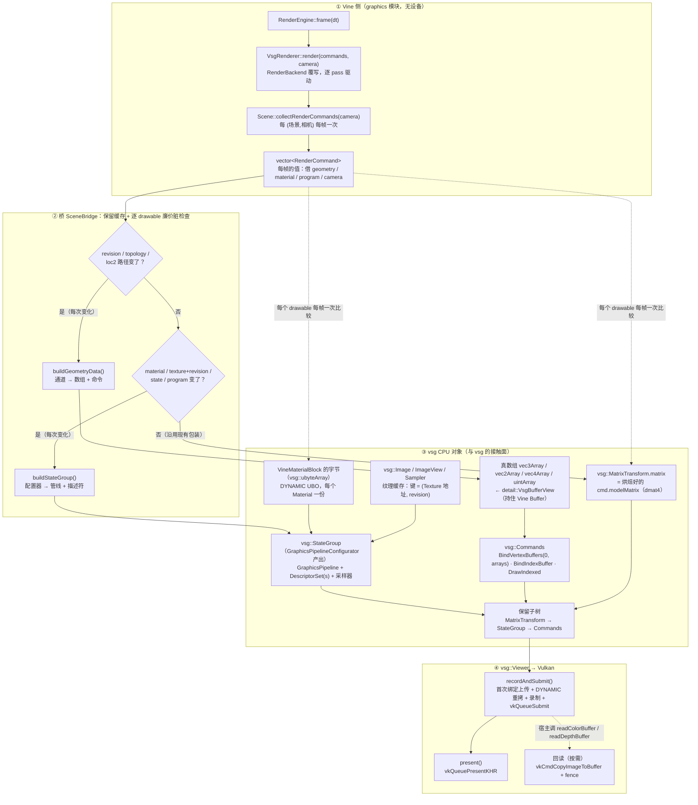

# gfx_backend_vsg：后端运行时说明

本插件是 `vine::graphics` 的 Vulkan 后端（`RenderBackend` 的实现），经 VulkanSceneGraph（vsg）落到
Vulkan。它对外只有一个身份：`RenderBackendFactory` 自注册，后端名 **`"vsg"`**（宿主用
`RenderBackendRegistry::instance().create(u8"vsg")` 拿它）。

本文回答四个问题：**数据怎么流**、**谁活多久**、**每帧/每变化各调用多少次**、**什么触发更新**。
逐帧时序的详细版本在 [`data-flow.md`](data-flow.md)（本文只给概览并指向它），
设计理由与实测结论在 `.ai/design/` 与 `.ai/memory/graphics.md`。

> **2026-09-15 审查轮次的后端侧变化**（逐条 `defect → evidence → fix` 见 `.ai/design/graphics-vsg-audit.md`）：
> - **正交相机桥按完整窗口**：`CameraBridge` 用 `Camera::orthographicLeft/Right/Bottom/Top`（以前只拿高度重建**居中**视锥，
>   与引擎裁剪用的视锥不一致——对称窗口下两者恰好相同，所以一直没暴露）。门禁：`CameraBridgeTest.*`。
> - **内容槽的 viewport 状态是"一个、原位更新"**：`detail::updateSlotViewport` 不再每槽每帧 `new` 一个
>   `vsg::ViewportState`（矩形不变就早退）；`VsgRenderer::resize` 走同一个实现。门禁：`ContentSlotViewportTest.*`。
> - **内存可观测**：`VsgDrawBlockPool::Stats::bytes` 与 `VsgRetentionStats::{slot_bytes,mesh_streams,textures}`；
>   每 drawable 槽的重复归还会被 `SlotAllocator` 拒绝并计入 `Stats::refused`（必须恒为 0）。

> **本文边界（谁写什么，2026-09-15）** —— 同一件事只写一处：
>
> | 主题 | 唯一权威 |
> |---|---|
> | **所有权表**（谁拥有什么、契约、违约后果） | **本文 §3.1** |
> | 会话/持久划分、帧份额 | **本文 §3.2 / §3.4** |
> | 清理点的动作表与 `shutdown()` 步骤 | [`data-flow.md`](data-flow.md) §9–§10 |
> | L0/L1 契约映射、ShaderSet 契约表、支持矩阵 | [`data-flow.md`](data-flow.md) |
> | **待办与当前缺陷** | `.ai/memory/graphics-perf-backlog.md`（**唯一登记**） |
> | 目标/槽模型与 pass 生命周期、模块导航 | `.ai/design/vsg-target-unification.md`、[`../gfx_backend_vsg.md`](../gfx_backend_vsg.md) |

## 1. 文件地图：谁负责什么

| 单元 | 职责 |
| --- | --- |
| `GfxBackendVsgPlugin.cpp` | 插件入口：自注册 `VsgRenderBackendFactory` |
| `VsgRenderer.cpp` | **帧泵 + `RenderBackend` 覆写**：`initialize/shutdown/beginFrame/endFrame/render/setClearPolicy/setRenderTarget/setPassOrder/setViewport/setLights/setPassInputs/setDepthMode/swapBuffers/resize/readColorBuffer/readDepthBuffer/releaseRenderTarget`（帧泵的七个私有步骤也在本 TU；`drawScreenProgram` / `releasePass` 等只在类上留委派） |
| `VsgRendererState.hpp` | 会话状态（`VsgRendererState`，单窗口会话）、持久状态（`VsgRendererPersistent`，跨会话）、pass 请求状态机 `VsgPassRequest`（含槽身份的两个转换）、`FrameCommit` 令牌的存位 |
| `VsgRenderTargetEntry.hpp` | 目标账本：一个 `RenderTarget` 的三张槽表（内容/程序/覆盖层）+ 附件 + 深度提升状态；`SlotKey`（槽身份的两套键） |
| `VsgFramePlan.hpp` | 帧计划的值类型：`detail::PassPlan` / `detail::PassAttachments`（录制顺序的 `RecordPlan` 在 `VsgRecordOrder.hpp`） |
| `VsgRendererPasses.cpp` | pass 协议：`beginPass`/`endPass`/`isPassScopeOpen`、未公告 pass 的退役、`releasePass`、协议误用的**唯一**上报点 `reportPassMisuse` |
| `VsgDeferredRelease.hpp` | 延迟释放的**时钟**与它的**提交令牌** `FrameCommit`（见下行的三个用户） |
| `VsgPipelineFactory.cpp` | 状态对象与变体决策：`makeRenderStateObjects`、`planPassVariant` / `passVariantIsStale`（纯函数）、清屏附件数与 opaque blend 规则 |
| `SceneBridge.cpp/.hpp` | **Vine 场景 → vsg 节点的保留缓存**：逐 drawable 的脏检查、重建、停放；每个桥自持一个 `vsg::SharedObjects`（`clearCache()` 清它） |
| `SceneBridgeGeometry.cpp` | 几何物化：属性通道 → 真 vsg 数组（**别名模型内存**）、索引、诊断 |
| `SceneBridgePipeline.cpp` | 状态物化：状态变体（管线）、描述符绑定、材质值、纹理 |
| `VsgSceneRules.hpp/.cpp` | **设备无关规则**（通道形状、解包、法线推导、格式/绑定点映射、哈希）—— 有独立单测，不需要设备 |
| `VsgPassMaterialiser.cpp` | pass → `RenderGraph`/framebuffer：变体决策（清屏/深度提升）、稳态复用、发布 |
| `VsgRecordOrder.cpp` | 录制顺序：采样边 + 深度借用边 + 稳定拓扑排序 |
| `VsgTargetBookkeeping.cpp` | 目标装配/注销：附件创建、深度借用解析、重建与释放 |
| `VsgContentSlot.cpp` | 内容槽的每帧驱动（视口、灯块、诊断）。灯只有 `vine_lights` 块一个来源（2026-09-13 起 vsg 灯节点/`setGroupLights` 已删除） |
| `VsgProgramSlot.cpp` | 全屏 program 槽：目的目标解析 / 视图摆放（2026-09-13 起屏幕绘制只有这一个入口） |
| `VsgLights.cpp` | `detail`：光照块填充（`viewRotation` + `fillLightPushBlock` / `fillVineLightsBlock`，两路共用一次打包） |
| `shaders/`（**已删除，2026-09-13**） | 本后端曾自带两段 GLSL（全屏三角形 / 屏幕拷贝）。它们都在**引擎可见的画面**后面 —— 没有 program 的 `ScreenPass` 画的就是那段拷贝，所有全屏 program 也是照那个三角形写的 —— 而文本却住在一个后端里。现在两段都是 SDK program（`BuiltinShaders::fullscreenVertexProgram` / `screenCopyProgram`），本后端只决定**怎么编译和绑**（清单因此只剩一个 owner：`cmake/VineShaders.cmake`） |
| `detail::buildVineShaderSet` / `makeContentShaderSet` | **自写前向着色**（替代 vsg 内建 phong 的 P0）：**GLSL 归 SDK**（`src/viz/graphics/shaders/builtin_forward.*`，经 `BuiltinShaders.hpp` 的 `forwardProgram()` / `flatForwardProgram()` 取源——本后端只编译它并声明 ABI）。属性 0/1/2(色,define) / 8(uv,define)、set0 的 material(b0) / diffuseMap(b1) / **vine_lights(b2, 每槽 UBO)**、**set1/b0 `vine_draw`（`VineDrawBlock`，UNIFORM_BUFFER_DYNAMIC，每 drawable 一个槽）** + push `pc` 0..128（vsg 矩阵栈填）。**唯一路径（2026-09-13 起）**：`makeContentShaderSet` 总是返回引擎自己的 set，**完全不使用 vsg 内建 set**（`VINE_VSG_BUILTIN` 开关与内建基线已删除）。**不兜底**：`makeContentShaderSet(program)` 用不了就返回 null（`program == nullptr`，或它没有可编译的 stage）——调用方报一条 diagnostic 并**不画**，不会替你换成别的着色。证据基线一条（见该文档 §11） |
| `VsgViewCompiler.cpp` | 增量编译（只编译新 view）；会话的 `detail::VsgCompileManager`（派生自 vsg 的 `CompileManager`，因为它只会 `add`：池是 `protected`，派生类能做出上游 `remove(view)` 的效果而不用打补丁） |
| `VsgCompileRegistration.hpp` | 一个内容槽的**编译上下文注册**（`detail::VsgCompileRegistration`）：注册在哪里做就由槽自己持有，**随槽析构释放**——于是"池里恰好一槽一条"是构造保证，而不是拆除路径要记得调的事（为什么**不能**把释放推迟到某次扫描，见 §5.3.1） |
| `VsgTextureCache.cpp` / `VsgMaterialManager.cpp` | 纹理上传缓存 / 材质值缓存（都是**按地址键 + owner 持有**） |
| `VsgRetireRing.cpp` | 退役环（停放被换下的对象，而不是停设备） |
| `VsgRetentionStats.hpp` | 会话保留情况的**一个值**（`VsgRenderer::retentionStats()`）：内容槽数、槽池统计、退役环计数、编译上下文注册数 |
| `VsgDeferredRelease.hpp` | 延迟释放的**时钟**：一个模板（`park` / `advance` / `parkedCount`），三个用户共用 —— 退役环（被换下的对象）、`VsgDrawBlockPool`（每 drawable 的槽）、每个内容槽的桥（保留节点）。深度只有一处（`kDeferredReleaseFrames`），`VsgRetireRing::kRetireRingDepth` 是它的历史别名 |
| `VsgReadback.cpp` | 颜色/深度回读（一次性提交） |
| `CameraBridge.hpp/.cpp` | Vine 相机 → vsg 相机/view（overlay 的两种绘制共用） |
| `VsgBackendUtility.cpp` | 窗口句柄/自建窗口等环境相关的小工具（含 `VINE_VSG_OWN_WINDOW` 逃生口） |
| `VsgDiagnostics.cpp` | 诊断路由：本插件的报告 → SDK 的 sink |
| 插件 CMakeLists（`v_add_plugin`） | `include/` 是 PUBLIC、`src/` 是 PRIVATE；源文件靠 `GLOB_RECURSE`（**无 `CONFIGURE_DEPENDS`**）⇒ 新增 `src/` 文件必须重新 configure；`shaders/` 不在 glob 里，靠 `v_use_embedded_shaders` 挂生成头文件 |

## 2. 数据流（纵向）

从 Vine 到像素有四段，**只有第三段（桥）接触 vsg**：上面两段是纯 CPU、不需要设备，下面一段是 vsg
自己在上传与录制时的行为。纵向看：



### 2.1 每一步产出什么、发生多少次

| # | 步骤 | 产出 / 写入的 vsg 对象 | 频次 |
| --- | --- | --- | --- |
| 1 | `RenderEngine` → `Scene::collectRenderCommands(camera)` | 无（纯 Vine 值） | 每 (场景, 相机) **每帧一次** |
| 2 | `SceneBridge::buildGeometryData()` | 真 `vsg::Array`（**别名**模型内存）+ `vsg::Commands`（`BindVertexBuffers` / `BindIndexBuffer` / `DrawIndexed`） | 每次**数据**变化一次（稳态 0） |
| 3 | `SceneBridge::buildStateGroup()` | `vsg::StateGroup`（内含 `GraphicsPipeline` + `DescriptorSet`）+ 材质值 + 纹理 `ImageInfo` | 每次**状态**变化一次（稳态 0） |
| 4 | 位置（每帧路径） | `vsg::MatrixTransform.matrix`（`::vsg::dmat4`，来自烘焙好的 `cmd.modelMatrix`） | **每帧**：每个 drawable 一次比较，值变了才写 |
| 5 | 不透明度（每帧路径） | 该 drawable 在 `vine_draw` 池里的槽（`VsgDrawBlockPool`：HOST_VISIBLE 映射内存，`params.x`） | **每帧**比较，`cmd.opacity` 变了才写（一次量化写，不扫顶点） |
| 6 | `VsgMaterialManager` | `VineMaterialBlock` 的字节（`vsg::ubyteArray`，DYNAMIC uniform） | **每帧**比较参数；变了才写 + `dirty()` |
| 7 | `VsgRenderer` 的 pass 物料化 | 把新节点挂进该 pass 的 `vsg::RenderGraph`（窗口图或离屏目标的图）；有新节点 ⇒ 交给 `CompileManager`（增量编译，只编译新 view） | 有 `created` 时（稳态 0） |
| 8 | `vsg::Viewer` | `vkQueueSubmit`（**一帧一次**）+ `vkQueuePresentKHR` | 每帧 |
| 9 | `VsgReadback` | `vkCmdCopyImageToBuffer` + fence（具名超时） | 宿主**按需** |

### 2.2 上传路径：与 vsg 的第二次接触

| 数据 | 谁决定上传 | 机制 | 频次 |
| --- | --- | --- | --- |
| 顶点 / 索引（静态） | vsg 首次使用该数组时 | `BufferInfo` → 设备本地 buffer（staging / `TransferTask`）；我们的数组**不是 DYNAMIC** ⇒ 只传一次 | 每次数据重建一次 |
| 顶点颜色（opacity 载体） | 该 drawable 的 `cmd.opacity` 变了 | DYNAMIC ⇒ `Data::dirty()` → vsg `TransferTask` 拷贝（按 `(VkBuffer, offset)` **去重**） | 每次 opacity 变化一次 |
| 材质值 | `Material` 参数变了 | 同上（DYNAMIC）：走 host-visible 分支是**直接 `memcpy`**，不建 staging、不进队列 | 每次材质变化一次 |
| 纹理 | 新纹理，或 `Texture::revision()` 变了 | 新建 `vsg::Image` + 一次上传；旧条目由容量裁剪 / 废弃回收。**上传前先过 `textureDataMatchesExtent()`**（`TextureReject::Inconsistent`）：每个 mip 层每张脸的字节数必须等于它的 extent×format 算出的值，否则就是一次越过 staging 缓冲的拷贝（以前是越界写，现在是拒绝 + 诊断） | 每次变化一次 |

于是**稳态帧**：不重建节点、不重编译管线、不重传任何数据、零设备等待（§4.4 的三个 0）。

### 2.3 一句话概括

- **`RenderCommand` 是每帧的值**，只借用 Vine 对象；后端要留什么，当场自己取引用。
- **顶点不复制**：真 `vsg::Array` 别名 geometry 的 buffer（`detail::aliasArray<Array, Element>`，存储由
  `detail::VsgBufferView<Element>` 持住）。被绑定的对象**必须是真 `vsg::Array`** —— 裸 `vsg::Data`
  会被静默忽略（不出图、validation 不报）。
- **数据与状态解耦**：改几何数据只重建数据节点（重新上传），改材质 / 状态只重建状态包装（复用数据节点）。
- 坏数据（越界索引、坏通道形状）在桥里就被**拒绝并上报**，不会带着疑问进入 vsg。

更细的逐帧时序、支持/不支持矩阵、已知缺陷清单见 [`data-flow.md`](data-flow.md)。

### 2.4 属性喂入：名字、location 与绑定顺序

**先把四个词分清**（本节全用这一套叫法，别混）：

| 词 | 是什么 | 谁写它 |
| --- | --- | --- |
| **通道 location**（= 源 location） | 通道在 Geometry 里的编号，是 `Geometry::attributes_` 这个 `std::map` 的键 | **调用者**：`setPositions` 固定 0、`setNormals` 固定 1、`setTexcoords2` 固定 8、`setIndices` 不是属性；`addBuffer(L, …)` 的自定义通道 L ≥ 3 且 ≠ 8 |
| **shader location** | GLSL 里的 `layout(location = N) in …`；也就是 SPIR-V 的输入编号 | **SDK 的 ABI**（`ShaderAbi.hpp::attributeLocation()`：位置 0 / 法线 1 / 颜色 2 / texcoord 8；自定义通道沿用自己的源 location） |
| **数组下标 = Vulkan binding** | 顶点输入数组在喂入列表里的位置：`VkVertexInputBindingDescription.binding` / `vkCmdBindVertexBuffers` 的 binding | **后端**（调用者既不写它，也影响不到前缀四个的编号；GLSL 里根本没有这个概念） |
| **喂给的名字** | 后端与 ShaderSet 之间配对用的字符串：`vine_Vertex` / `vine_Normal` / `vine_TexCoord0` / `vine_Color` / `vine_Attribute{L}` | **后端**生成（`customAttributeName(L)`），调用者只在自定义通道的 L 上间接影响 `{L}` |

**每档 set 的 location 都是 SDK 契约，所以几何装配只有一条路**（`buildStateGroup()`）：`cmd.program` 有就该 program 建一档 set（`assembleProgramShaderSet`），没有就用槽的 set。

| | 槽的 set | 每个 program 的 set |
| --- | --- | --- |
| 来自 | `detail::makeContentShaderSet(槽的 program, …)` | `assembleProgramShaderSet(program, …, extra_channels)` |
| 触发 | `cmd.program == nullptr` | `RenderPass::setProgramOverride()` / `ScreenPass::setProgram()` 给的 program |
| shader location | SDK 契约（0/1/2/8 + 自定义 `L`） | 同左 |
| 顶点数据 | `buildGeometryData()` 一次建好（与 set 无关）：按 canonical location 取数据、按名字配对 | 同一个数据节点，换 set 只重建 state wrapper |
| 同一个 geometry | 可以在 A pass 用槽的 set、B pass 用别的 program；两档 set 互相独立 | 同左 |

三张表的关系就下面这张（左边两列是后端的，右边一列是 shader 的）：

| 数组下标（= binding） | 喂给的名字 | shader location（SDK 契约） |
| --- | --- | --- |
| 0 | `vine_Vertex` | **0** |
| 1 | `vine_Normal` | **1** |
| 2 | `vine_TexCoord0` | **8** |
| 3 | `vine_Color` | **2** |
| 4+i | `vine_Attribute{L}` | **L**（= 该通道的**源 location**；未被任何 set 声明时只是多绑一段没用的顶点缓冲） |

举个具体的：几何体有位置(0)、法线(1)、颜色(2)、UV(8) 和一个 `L = 5` 的自定义通道 ——

| 通道 | 通道 location（Geometry） | shader location | 数组下标/binding |
| --- | --- | --- | --- |
| 位置 | 0 | 0 | 0 |
| 法线 | 1 | 1 | 1 |
| UV | 8 | **8** | **2** |
| 颜色 | 2 | **2** | 3 |
| 自定义 | 5 | **5** | 4 |

注意最后两行的对照：**数组下标与 shader location 是两回事**（UV 的 binding 是 2 而 location 是 8），而且顺序也**不是**按 location 排的（颜色 location 2 排在 UV location 8 后面）——顺序是后端固定的 canonical 顺序，只看绑定号。

> **模块契约的 location 值（内建前向与自定义 program 共用 0/1/2/8）现由 SDK `vine/graphics/ShaderAbi.hpp`
> 定义**（`attributeLocation(VertexAttribute)`；契约见 `.ai/design/graphics-shader.md` §11）。后端只把角色
> 映射成 vsg 的绑定别名（`vine_Vertex` 等），编号不再由后端硬编码（2026-09-13，P0.B1）。

其余规则：

- **数组下标由 `SceneBridgeGeometry.cpp` 的 `arrays` 列表顺序决定**（位置 → 法线 → texcoords → 颜色 → 自定义通道按 location 升序），
  在 `SceneBridgePipeline.cpp` 里按同一顺序 `assign_array(name, index)` 配对；`BindVertexBuffers::create(0u, arrays)` 再按列表位置绑成 binding 0..N-1。
  自定义通道的 `i` 按 **location 升序**排（`Geometry::attributes_` 是 `std::map`，升序确定，不是哈希序）。
- vsg 给顶点输入 binding 编号的方式是“按 `assignArray()` 成功的顺序递增”，所以**ShaderSet 的声明顺序必须与 `arrays` 顺序逐位对齐**：漏声明一个名字或漏喂一个数组，
  后面全体错位，把下一个属性的数据喂给当前属性 —— 而 validation 不会报。这也是模块把前缀四个通道**永远都声明、永远都喂**（没有 UV 的网格喂零填充数组）的原因。
- **只有一套 shader location 编号 —— 引擎自己的**（`ShaderAbi.hpp::attributeLocation()`）：位置 0 / 法线 1 / 颜色 2 / texcoord 8。
  两档 set（内容 set 与自定义 program 的 `assembleProgramShaderSet`）都是它；以前“宿主传进来的 vsg set 用 vsg 自己的密集编号
  0..11”那条路已随 2026-09-13 的收尾一起消失（当时的实测记录：`vsg_TexCoord0..3` 2..5、`vsg_Color` **6**、
  `vsg_Rotation` **8**……也就是 8 在那边是 `vsg_Rotation`）。
- 推导就是下面这张表（前提：自定义通道**沿用自己的源 location** 当 shader location，转发范围 `L ≥ 3 且 L ≠ 8`）：

  | 契约位置 | 给谁 | 为什么是这个号 |
  | --- | --- | --- |
  | 0 / 1 | 位置、法线 | `ShaderAbi.hpp` 给的号，两档 set 一样（0/1 也是 vsg 那边唯一的同号） |
  | 2 | 颜色 | `< 3` 里剩下的位置；写成 2 而不是跟 vsg 一样的 6，是因为 2..5 在那边被 `vsg_TexCoord0..3` 占着 |
  | 8 | texcoord | `≥ 3` 里由模块**显式保留**，且 `L == 8` 的通道不转发 ⇒ 用户占不掉（`Geometry::kTexCoordLocation`） |
  | 3..7、9.. | 自定义通道 | 全留给用户 |

  结果是模块这套是**稀疏**编号（原来 vsg 那套是密集的 0..11）。
- **别把 vsg Builder 的数组下标当成 shader location**：`Builder.cpp:97` / `tile.cpp:488` 的 `enableArray("vsg_TexCoord0", …, 8)`
  里的 8 是 vsg 那边的**数组下标**，而它 Phong set 里 texcoord 的 shader location 是 **2** —— 这两套编号 vsg 自己就是分开的。
  （我们自己的 8 是**有意**选在自定义通道区，不是照搬那个下标。）
- 名字侧的守卫：`assignArray()` 失败且该名字**被管线声明**过 ⇒ 报一次 `ContentSkipped` Warning
  （`vertex binding '%s' (array %zu, %s) was not matched by the pipeline; the shader reads an attribute the pipeline does not enable…`）。
  反方向（shader 声明了几何体没有的 shader location）**没有任何诊断** —— ShaderSet 是按几何体的通道布局建的，没声明的就是没喂。
- **通道可以是缓冲里的一段（arena 切片，P7）**：`AttributeChannel::offset`（scalar 计）+ `scalarCount`，配合
  `AttributeChannel::slice(values, components, first_vertex, vertex_count)` 表达"一个大缓冲、每 geometry 一段"。
  后端全链路按**这一段**走：

  | 环节 | 行为 |
  | --- | --- |
  | 别名 | `aliasArray(buffer, count, offset_scalars)` 把 offset 换算成 vsg `Array` 的**字节**起点（`Array(storage, offset, stride, count)`）⇒ 绑定的数组第 0 号元素就是这一段的第一个顶点 |
  | 形状校验 | `channelShape()` / `unpackXyz()` / `packColor4()` 全部走 `floatCount()/vertexCount()/scalars()` ⇒ 判的是**通道自己的范围**，不是缓冲的长度 |
  | 共享 key | 顶点侧 key 带 `offset`（同缓冲不同段是两条流，不能互借）；**索引侧相反**：bind 别名整段缓冲，`DrawIndexed(firstIndex, indexCount)` 表达切片 ⇒ 一个索引 arena 共享一次索引上传 |
  | 刷新路径 | 段变了（同缓冲、同 revision、同长度）⇒ 走刷新：新数组按新 offset 建立；**索引 span 变了 ⇒ 必须重建**（span 在 draw 命令里，原地换 bind 表达不了），闸门是 `index_span_changed` |
  | 派生通道 | P5 的派生法线缓存 key 加上 positions 的 `offset` 与索引的 `first/count`：同缓冲另一段是另一组输入 |
  | 索引越界检查 | 按**这一段的**顶点数检查（索引是段内相对的）⇒ arena 里一个 geometry 的索引不会读到邻居的数据 |


**缓存与重建**（布局进 cache key，所以“按 geometry 映射”实际是“按每个布局映射一遍”）：

| 缓存 | 键 | 值 | 何时失效 |
| --- | --- | --- | --- |
| `program_stages_` | program 对象 | 编译好的 SPIR-V stages | `program->revision()` 变化 ⇒ 重编译 |
| `program_shader_sets_` | program + **布局 hash**（`vertexLayoutHash(extra_channels)`） | 该布局的 `vsg::ShaderSet` | program revision 或布局变化 ⇒ 重装配 |
| `VsgMeshResourceCache`（**会话级**） | 通道流身份：`binding + components + Buffer 地址 + Buffer::revision() + offset + 元素数`（`offset` = arena 切片起点，见 §2.4 的 "一段一个 geometry"） | 该流的 `BindVertexBuffers` / `BindIndexBuffer`（**一条 bind 就是一份设备缓冲 + 一次上传**） | key 变了自然是新条目；没人再读的条目由帧级 sweep 释放（§5.1.2） |

⇒ 同一份 program 配不同通道布局的 geometry 拿到**不同的 ShaderSet**（binding 不同），但共享同一份 stages。
编译失败/装配失败都会缓存（空 stages / null）以免每帧重试；**两者都不再回落**（2026-09-13 起）：
program 编译失败 ⇒ 报一条 `ShaderFallback` Warning 且该 drawable **不入图**；槽自己没有 set ⇒ 报一条且**不画**。
两表上界都是 64，FIFO 淘汰。

> 面向使用者的写法（Geometry 侧怎么挑 location、每段的示例 shader、描述符/push constant 清单）见
> `src/viz/graphics/docs/usage.md` §3.8。

## 3. 生命周期

### 3.1 谁拥有什么

| 对象 | 拥有者 | 说明 |
| --- | --- | --- |
| 保留节点（transform/state/commands） | `SceneBridge` 的缓存条目（缓存条目又归 `VsgRendererState`） | 键是 `Geometry*`，但条目**持有**该 geometry 的引用，所以地址不会是复用的陌生人（`OwnedCache.hpp`） |
| 被换下的旧节点 | **退役环**（`VsgRetireRing`，深度 `kRetireRingDepth = 4`） | 可能还在飞行的命令缓冲里；提交之后推进环 |
| `vsg::Image`/`ImageView`/采样器（纹理） | **会话**的 `VsgTextureCache`（`VsgRendererState::texture_cache`，经 `SceneBridge::setTextureCache()` 注入每个内容槽） | 每张纹理**一条**：同一张纹理被 N 个槽采样只上传一次（在此之前缓存是每 bridge 一份 ⇒ N 份 image + N 次上传）；按容量裁剪（`trimToCapacity`，上界 256），App 放手的条目由**帧级清扫**（`SceneBridge::releaseAbandonedCaches()` → `textureCache().releaseAbandoned()`）释放 |
| 共享网格流（`BindVertexBuffers` / `BindIndexBuffer`） | **会话**的 `VsgMeshResourceCache`（`VsgRendererState::mesh_cache`，经 `SceneBridge::setMeshResourceCache()` 注入；没有注入时退化成该 bridge 自己的一份） | 每条**别名自模型缓冲**的流一条：k 个 drawable 读同一份顶点/索引只上传一次（在此之前每 drawable 一份 bind ⇒ 池区间与上传各一套）；按容量 FIFO 裁剪（上界 512），无人再读的条目由同一次帧级清扫释放（§5.1.2） |
| `VineMaterialBlock`（`vsg::ubyteArray`） | `VsgMaterialManager` 的条目（条目持有 `Material` 的引用） | 每帧 `releaseAbandoned()` 回收已死材质 |
| 渲染目标、附件、pass 图 | `VsgRendererState::targets` | 目标级不变量（`color_seeded`/`depth_seeded`/`any_load_pass`/`depth_sampleable`）随目标一起重置 |
| 内容槽 | 目标账本 | 槽持有 view / 节点 / 编译队列条目 |

### 3.2 会话与持久

- `VsgRendererPersistent`（**跨会话**）：`cameraBridge`、`materialManager`、`default_content_program`（内容命名不了 program 时用的那个；**没有默认值**，引擎自己持有并在 initialize 前转发）、绑定的窗口句柄。
- `VsgRendererState`（**单窗口会话**）：窗口、viewer、命令图、三个 depth 策略的 shader set、pass 请求状态机、
  `targets`（目标 + 附件 + 三张槽表）、录像顺序图、退役环、`pending_compile_views`、以及各种计数
  （`offscreen_build_count` / `program_slot_build_count`）。
- **共享对象注册表是每个 `SceneBridge` 一份**（窗口层/离屏桥各一个）：管线变体、采样器等由它去重；
  `clearCache()` 清空它（所以那条路径必须计数等待，见 §5.3）。
- `shutdown()` 的做法是 **`state = VsgRendererState{};` 整体替换** —— 会话期资源不可能被手写拆卸清单漏掉
  （新增一个持有 vsg 对象的成员不需要改拆卸代码）。持久部分跟着 `persistent` 的析构走。
- 清理顺序是硬约束（撞 `VSG_MAX_DEVICES==1`）：见
  [`data-flow.md`](data-flow.md) §10.3。

### 3.3 后端对宿主的承诺（借用 vs 保留）
`RenderBackend.hpp` 的类级契约是权威；本插件逐条兑现：

- **借用参数**：`render(commands, camera)` 里的命令/相机、`drawScreenProgram` 的来源、`publish` 的目标 ——
  调用返回后宿主可以立刻销毁（需要留的，插件当场取引用）。
- **可保留**：只有**显式**发布/持有过的东西（`setRenderTarget` 公告的 target、`publish` 的名字、
  `CompileManager` 里的 view…）会被保留，且必须由 `releasePass()` / `releaseRenderTarget()` /
  `unpublish()` 注销。**保留不随帧数增长**。
- **线程**：`RenderBackend` 的调用是单线程的（宿主主线程）；内部没有后台线程。
- **失败必报**：能拒绝就拒绝并**在诊断通道说明原因**（不静默降级）。诊断按"每类每段只报一次"分集
  （`prune-and-re-arm`），修好再坏会重新报。- **驱动方式只有一种**：引擎那样给每个 pass 开作用域（`beginPass` → 该 pass 的状态 → 它的绘制调用
  → `endPass`）。没有公告 pass 的**绘制**调用（`render` / `clear` / `drawScreenProgram`）会被**拒画**
  并以 `PassProtocolViolation` **每帧只报一次**（`refuseNoPassAnnounced`）：没有 pass 就没有身份，
  服务它等于用上一个作用域剩下的状态画一幅没人要求的画面。状态 setter 不在此列——​它们单独调用是
  惰性的（下一次 `beginPass()` 从空请求开始）。
### 3.4 帧所有权：份额是**入参**，不是状态

"应用放手了吗"这个问题由**份额**回答：一个对象上还剩几个**保留条目**在持有它（`OwnedShareCounts`
+ `keyReleased(object, shares)` = `useCount() <= shares`）。份额是**数据相关**的，所以数出来，
而"数出来之后交给谁用"是这一层的设计：

- 会话在帧首把全会话（材质管理器 + 每个 target 的每个内容槽）数一遍（`VsgRenderer::collectFrameShares`
  —— 必须**先装份额再 sync 各槽**，否则先 sync 的槽只看到自己的份额，会留下自己的条目）；
- 这份图**通过参数**交给每次 sync（`SceneBridge::syncRenderCommands(..., const OwnedShareCounts*
  session_shares)`），所以桥里**没有**指向会话状态的指针、也没有"帧尾记得清指针"这条规则 ——
  指针生命周期这种协议一旦存在，就总有"某个路径忘了清"的失败模式；
- 帧尾清扫前**重数一次**（`VsgRenderer::releaseAbandonedContent`）：帧开着的时候被拆掉的槽
  （离屏按新尺寸重建 / retarget / release）会带走它的条目和那些份额，用帧首的图就会**多算**，
  而多算等于对"应用仍持有"的对象报"它放手了"。**收集与清扫融合在同一个函数里**，让"用旧图清扫"
  在结构上无法表达（见 §5.3.1 的实测与 F1）；
- 设备无关的调用点（单测直接驱动一个桥，没有会话可以数份额）传 `nullptr` ⇒ 退化为"本桥可见份额 =
  自己的缓存 + 材质管理器"（`collectSweepShares`），保守方向（少算 ⇒ 多留一帧）。生产路径全部由会话给图
  —— "单桥直驱"这条驱动方式本身已随 §67 删除。

诊断面同样按"一个概念一个值"收敛：会话的保留情况是**一个** `VsgRetentionStats`
（`VsgRenderer::retentionStats()`：内容槽数、槽池的 chunks/capacity/reserved/retired、退役环的
parked/released/waits、以及**换掉 manager 才能收回**的编译上下文注册数），而"策略类"的单值断言
（`deviceWaitCount()` / `retiredObjectCount()`）仍按名字暴露 —— 它们答的是"这一帧有没有停设备 /
环有没有在动"，与"留着多少"是两件事。这两个单值访问器读的就是同一个环的计数器，不会给第二个答案。

### 3.5 帧的提交令牌（`FrameCommit`，2026-09-15）
延迟释放的时钟以**已提交的帧**计数，所以"推进环"这件事有一个前置条件：这一帧真的提交过。它现在是
**类型**而不是注释：`beginFrame()` 铸造本帧唯一的一枚令牌，唯一的 `submitFrame()` 消费它，
三个环的 `advance`（退役环 / 逐 draw 槽池 / 每个内容槽的桥）都要求这枚令牌 ——

- "提交前 settle"写不出来（没有令牌）；
- "一帧推两步"写不出来（一帧只发一枚）：没有令牌的 `swapBuffers()` 被**拒绝**并只报一次
  `PassProtocolViolation`（episode，下一次 `beginFrame()` 重新武装）。服务它等于为同一帧再推一次环，
  会提前释放仍可能被在飞命令缓冲引用的对象；
- 设备无关测试自己铸造令牌（它们模拟的正是"提交了一帧"），调用点因此把意图写在脸上。

## 4. 调用次数（一帧各发生多少次）

### 4.1 每帧恰好一次

`submitFrame()` 就是这份清单（`VsgRenderer.cpp`）：

| 步骤 | 每帧次数 | 稳态是否真做事 |
| --- | --- | --- |
| `releaseAbandonedTargets()` | 1 | 通常无事（只有目标被放弃时） |
| `reportSessionDevice()` | 1 | 有标志守卫，多调 no-op |
| 提交令牌检查（`beginFrame` 发的那一枚） | 1 | 无事——除非这一帧没开过 frame，那就不提交并报一次 |
| `retireInactivePassSlots()` | 1 | 通常无事（只有本帧未公告的 pass 槽） |
| `compilePendingViews()`（增量编译） | 1 | 队列空 = 立刻返回 |
| `viewer->recordAndSubmit()` | **1**（一帧只提交一次） | 是 |
| `viewer->present()` | 1 | 是 |
| `settleSubmittedFrame(令牌)`（各内容槽 + 渲染器退役环 + 逐 draw 槽池各推进一步） | 1 | 是（推进环） |
| `releaseAbandonedContent()`（**先重数份额、再清扫**：几何 + 材质） | 1 | 通常无事 |
| └ 其中的 `collectFrameShares()` | **2**（帧首一次 + 清扫前重数一次） | 是（O(当前条目)） |

另外每帧一次（在逐 pass 驱动里）：

- `Scene::collectRenderCommands(camera)`：**每个 (场景, 相机) 一次**，帧内记忆（同一 pass 里多槽共用）。
  返回的是**视锥剔除后的**列表：剔除掉的对象根本不在 `RenderCommand` 里，后端“看不见”它（见 §5.5）。
- 每个 pass 的 `render()` / `clear()`：各一次。
- 每个窗口层的 `SceneBridge::syncRenderCommands()`：一次；内部**每个 drawable 一次廉价脏检查**
  （`revision` / topology / loc2 路径 / material / texture+revision / render state / program+revision /
  矩阵 / opacity）。命中就是只更新 `MatrixTransform::matrix` 或 `colors[].a`。
- 材质值：每个 drawable 一次 `updateMaterial()` **比较**；只有参数真的不同才写 + `dirty()`。
- opacity：每个 drawable 一次 `cmd.opacity` 比较；只有变了才写 alpha + `dirty()`。

### 4.2 每次"变化"一次（稳态 0 次）

| 触发 | 调用 | 代价 |
| --- | --- | --- |
| `geometry->revision()` 变（或 topology / loc2 路径变） | 形状不变且快照能解释"变了哪一路" ⇒ **原地刷新那一路**（`assignArrays({新数组})`，只重拷该通道）；否则 `buildGeometryData()` 重建**数据节点** + 重新上传 | 刷新：该通道字节；重建：新数组（别名模型内存）+ 全通道上传，旧节点进退役环 |
| material / texture(+revision) / render state / program(+revision) 变 | `buildStateGroup()` 重建**状态包装** | 变体查表命中则复用管线；否则编译一次 |
| 自定义通道集合变了 | 连状态包装一起重建 | 布局哈希变 ⇒ 新变体 |
| 某纹理首次出现或 `Texture::revision()` 变 | `VsgTextureCache::getOrCreate()` 未命中 ⇒ 新建 `vsg::Image` + 上传 | 一张纹理的一次上传 |
| 某个 DYNAMIC 数据被 `dirty()`（材质值 / opacity 载体） | vsg `TransferTask` 拷贝 | host-visible 映射内存上的一次 memcpy（按 `(VkBuffer, offset)` 去重；**不是**每帧无条件拷） |
| load-op 策略（清屏/深度提升）变 | 重建该 pass 的 render pass/framebuffer（**一次性变体**） | 提交之后换回稳态 |

### 4.3 结构性变化才发生

- `reconcileOffscreenOrder()`：新图入图、pass 顺序变、`retargetPass`、overlay 目标解析 —— **不是每帧**。
- `buildOffscreenTarget()` / `releaseRenderTarget()`：附件形态或生命周期变时（重建整张目标）。
- `VsgViewCompiler` 的池注册：某个槽的 view **第一次**出现在增量编译里时才把 (render pass, view) 注册进
  `CompileManager`（池是窗口图还空时建的）。
- 回读（`readColorBuffer`/`readDepthBuffer`）：只在宿主问的时候做一次 one-shot 提交（带具名超时）。

### 4.4 稳态应当是 0 的计数（可断言）

- **几何重建 0**：`syncRenderCommands` 的 `created` 为空 ⇒ vsg 侧零编译。
- **管线变体 0**：`pipelineVariantCount()` 不增（`variantReuseCount()` 增）。
- **设备等待 0**：`deviceWaitCount()` 不增（见 §5.3；`policy churn:` 相位断言 15 帧 0 次）。

## 5. 更新策略

### 5.1 数据与状态解耦

```
                    ┌─ data_dirty ─→ 重建数据节点（新数组、别名模型内存）→ 重新上传
几何的一个命令 ─→ 脏检查 ┤
                    └─ state_dirty ─→ 重建状态包装（管线 + 描述符）→ 数据节点原样复用
```

- 改几何数据**不**重编译管线；改材质/状态**不**重传网格。这是这个后端最基本的性能承诺。
- 两个 `dirty` 的判定与理由都写在 `SceneBridge.cpp` 的注释里（`data_dirty` / `state_dirty`）。

### 5.1.1 通道级增量：为什么数据节点每通道一条 bind

vsg 的重传粒度是**一条 `BindVertexBuffers` 命令**：命令里任一阵列过期，`BindVertexBuffers::compile()` 就把该命令的**全部**
阵列重新预留并重拷（`createBufferAndTransferData` → 池 reserve）。所以"只重传变了的那一路"要求两条：

| 条件 | 做法 |
| --- | --- |
| 每个 canonical 通道有自己的命令 | `buildGeometryData()` 发 5 条 bind：0 位置、1 法线、2 texcoord、3 loc2 颜色、4+ 自定义（自定义共用一条，集合变就是布局变）。**forward set 在几何无作者色（且无 UV/无纹理）时不 assign 2/3** ⇒ 数据节点仍绑着那两条，但管线不声明、define 关（§11.6） |
| 知道"变的是哪一路" | `SceneBridge::ChannelKey` = `位置/分量/缓冲指针/Buffer::revision()/元素数`；快照存在 `Item` 里，`shapesMatch()` 比形状（位置/分量/数量），逐键比字节身份 |

于是数据 revision 分两档：**形状不变**（通道集合、分量、元素数一致，位置 0 仍是可别名布局）且快照解释了变化 ⇒ 只把变化
通道的 bind 换成新数组（索引流同理），节点与 `MatrixTransform` 都是原对象；**其余情况**（形状变、有无解释不了的变化、通道
不可别名、越界索引…）⇒ 走原来的全量重建，由 builder 报诊断/拒绝。

派生通道与位置**耦合**：几何体不作者法线时，位置变会连带重新推导法线（P5 的缓存同步更新）。

> 命名接口不变：`Geometry::revision()` 仍然只表示"变了"，刷新路径只是**额外**用逐流快照判断能不能少做；看不出来就
> 老实重建。`Buffer::revision()` 的契约见 `vine/Buffer.hpp`：**写的人**改完字节要显式 bump（buffer 自己不 bump）。

### 5.1.2 共享网格流：一份模型字节，一条 bind

`BufferInfo` **是命令自己拥有的**，而 vsg 把 `BufferInfo` 变成一个设备缓冲（`BindVertexBuffers::compile()` →
`createBufferAndTransferData` → 池 reserve + 拷字节）。所以"k 个 drawable 读同一份顶点/索引"在 P9 之前是 k 条 bind、
k 份设备内存、k 次上传 —— CPU 侧本来就是**同一段内存**（`AttributeChannel` 借 `vine::Buffer`），GPU 侧却复制成 k 份。
`VsgMeshResourceCache` 把这类流收敛成**一条 bind**，于是它们共享同一个设备缓冲。

**哪些通道能共享**（判据只有一条：**这条数组是不是模型字节的原样视图**）：

| 通道（binding） | 能共享？ | 为什么 |
| --- | --- | --- |
| 0 位置 | ✅ | `aliasArray` 原样读 `Buffer<float>`，没有任何转换 |
| 1 法线 | ✅ 仅当**作者写了法线** | 写法线时同样是原样视图；否则是派生法线（见下） |
| 2 texcoord | ✅ 仅当**作者写了 UV** | 写法线时同样是原样视图；否则是零填充数组（见下） |
| 3 loc2 颜色 | ✅ 仅当**四分量** | 四分量是原样视图；三分量要**打包成 vec4**（每 drawable 一份，因为字节形状变了）；没作者色则所有几何共用同一份静态白 |
| 4+ 自定义通道 | ❌（暂） | 它们共用**一条**命令、其身份是布局（§5.1.1）；拆成每通道一条命令才谈得上共享，见待办 |
| 索引流 | ✅ | 原样索引数组 |
| 零 UV / 派生法线 | ❌ | 是按这个 geometry 的输入**算出来**的，不是模型的字节 |

**键 = 这条流**（不是这个 geometry）：

| 键字段 | 作用 |
| --- | --- |
| `binding` + `components` | 同一段内存按不同解释绑在不同槽上时不能混 |
| `Buffer` 地址 | 两份内容相同的缓冲**各自一份**，绝不互借 |
| `Buffer::revision()` | **重新填充过就是另一条流**：条目里的字节副本永远是"插入那一刻的 revision"，不会把旧副本当新的用 |
| 元素数 | 视图长度不同就不是同一条流（也是越界与错位的最后一道） |

**谁有资格共享**（P9 的第二个闸门，被既有测试抓出来的）：共享条目里的字节副本是**插入那一刻**拷的，而
`Geometry::revision()`（唯一由调用者发出的"我数据变了"信号）允许"借用的模型缓冲被改于渲染器背后"。所以一次重建先问：
**这条 revision 有没有哪条流能解释它？**

| 情形 | 判定 | 结果 |
| --- | --- | --- |
| 首次建节点（还没建过） | — | 走共享表（k 个实例读同一 mesh ⇒ 只上传一次） |
| 某通道换了缓冲 / bump 了 `Buffer::revision()`，或索引流变了 | `streamsMatch()` = false（逐键比身份） | 走共享表：变了的流是新 key ⇒ 新条目（拷一次），没变的流命中老条目（**不再拷**） |
| geometry bump 了 revision，但**没有一条流变** | `streamsMatch()` = true | **不走共享表**：这条 revision 无法归因，只能当"模型被改过"⇒ 这套节点建**自己的** bind，重新读一遍模型字节（`buildGeometryData(..., mesh_cache = nullptr)`） |

第三行就是 `ManuallyReportedRevisionRebuildsTheDataNode` 守住的契约：它 bump 的只有 geometry，没有任何流变。共享条目
按 key 复用，就会把**上一次拷进去的字节**接着画 —— 静默的错误画面。

**刷新与共享**（§5.1.1 的刷新路径）：共享的 bind **绝不被原地改** —— 它属于所有读这条流的 drawable，`assignArrays()` 会
把它们的流一起换成"这个 drawable 的数组"。所以刷新走 `meshResources().getOrCreateVertexBind(新 key, 新数组)`：新 revision
得到**新条目**，同一帧里其它也刷新到同一 revision 的 drawable 会**命中同一个条目**（一起只拷一次）；命令列表里换的是
`RetainedBinds::canonical_child[binding]` 那个**槽位**，命令顺序（也就是绑定号）不变。

**生存期**：条目持有 bind，bind 持有数组，数组持有模型缓冲 ⇒ 共享流顺带把模型字节留住。没人再读的条目（最后那个
drawable 换到别的缓冲了）由帧级清扫 `releaseAbandonedCaches()` → `meshResources().releaseAbandoned()` 释放；容量上界
512（FIFO，与其它缓存同一条规则）。

**未做（诚实边界）**：

| 缺口 | 说明 |
| --- | --- |
| 自定义通道不共享 | 它们共用一条命令（`firstBinding = 4`），身份是布局；要共享得先拆成每通道一条命令 |
| **索引流的共享面更宽** | 索引 bind 一律别名**整条缓冲**，切片由 `DrawIndexed(firstIndex, indexCount)` 表达 ⇒ 一个索引 arena 的所有 geometry 解析到**同一个 key**（整段缓冲）⇒ 共享一次索引上传（顶点侧做不到：顶点数组别名到切片，所以 key 必须带 offset） |
| 顶点色不再是载体 | 不透明度只在 `vine_draw` 块里（2026-09-13 起顶点色 alpha 载体已删）⇒ 颜色通道可以按几何共享，loc2 作者色原样进管线 |
| 共享跨桥 | 只有**注入进来的会话缓存**能跨槽共享；两个都没有注入的 bridge 各有各的（各自的设备身份） |

### 5.2 DYNAMIC 与脏计数（谁"每帧"上传）

- 标记 `DYNAMIC_DATA` 的只有**每个 Material 的 `VineMaterialBlock`**（`VsgMaterialManager`）。
- 每帧被重写的还有**每槽的 `vine_lights` 块**（视空间方向随相机变）与**每个 drawable 的 `vine_draw` 槽**——
  后者根本不走 vsg：它是 HOST_VISIBLE 映射内存里的一个量化写。
- 写入都被**比较**守卫，所以"稳态帧零传输"。
- 拷贝由 vsg 的**修改计数**驱动（`BufferInfo::requiresCopy()` = 修改计数不同），所以 `dirty()` 了才会重传；
  `TransferTask::assign()` 按 `(VkBuffer, offset)` **去重** ⇒ 同一段内存被多少 drawable 绑定都只算一条。
- 落地方式是 **host-visible 映射内存上的直接 memcpy**（小 uniform / 顶点颜色），不走 staging、不进队列。

### 5.3 停放 vs 计数等待（破坏性边界）

| 路径 | 策略 |
| --- | --- |
| 状态变体交换、撤销深度提升、被丢弃的 program 节点、视图摘除 | **停放**（退役环，深度 4，**由提交令牌驱动推进**：只有已提交的一帧才能推一步，见 §4.1）⇒ 0 次设备等待 |
| 全屏 program 槽丢弃（`detail::eraseProgramSlot`：摘 view + 停放 node + erase） | **停放** —— 它的 node 持有管线与描述符集（描述符集又握着被采样图像的 view），停放让它们活过在飞命令缓冲 |
| 内容槽 teardown（`erasePassFromTarget` / `clearTargetAttachments`，都要 `bridge.clearCache()`）/ 目标重建 / `clearCache()` / depth 模式变更的状态重建 | **计数等待**（`VsgRetireRing::waitForIdle(viewer)`） |

理由（实测）：`clearCache()` 会清空**该桥的**共享对象注册表，那里的管线/采样器不一定还有存活节点作为唯一持有者
—— 停放会让 lavapipe 报 `VUID-vkDestroyPipeline-00765` / `vkDestroySampler-01082`。所有等待都必须走
可数入口（`deviceWaitCount()`），`policy churn:` 相位断言稳态 0 次。

### 5.3.1 两处"活过持有者的注册表"（实测数字，2026-09-14 对抗性复核）

拆槽会销毁桥，因此**任何记在桥上的延迟/保留状态都会跟着死**。这种形状查出来两处：

| 注册表 | 状态 | 实测（自检 376 帧，存活内容槽峰值 9） |
| --- | --- | --- |
| **每 drawable 的槽**（`VsgDrawBlockPool`） | **已修**：延迟释放队列搬到**池**（会话级），`retire()` + `advanceRetired()`（提交帧推进，与退役环共用同一个时钟 `VsgDeferredRelease`）；**2026-09-15 起桥侧一行也不剩**：`VsgDrawBlockPool::Lease`（`acquire()` 取得）把归还写进析构，`Item` 一死槽就回池，任何丢弃分支都不可能漏 | 修复：峰值 **1 个 chunk**、64 槽里最多用 13；把槽丢弃（= 修复前后果：队列随桥死）⇒ 峰值 **3 个 chunk**、192 槽里用掉 147。同一负载、同样 9 个存活槽 ⇒ 容量按拆除次数增长 |
| **编译上下文**（vsg `CompileManager`） | **已修（2026-09-16）**：`VsgViewCompiler` 为每个内容槽注册一次 `(render pass + view)` 上下文，而 vsg 1.1.16 **没有 remove API**（`add()` 往 traversal 的 `contexts` 里 push；每个 `Context` 持一个 `VkCommandPool` 和对该 render pass 的强引用）。`CompileManager` 的池（`compileTraversals` / `numCompileTraversals` / `takeCompileTraversals`）是 **`protected`**、`CompileTraversal::contexts` 是 **public**，**派生一个 manager 就能做出上游 `remove(view)` 的效果而不用打补丁**：会话的 manager 是本后端的 `detail::VsgCompileManager`（`VsgRenderer::initialize()` 在 vsg 惰性创建之前装上，池里只有一条无上下文的 traversal）。**释放由槽自己负责（2026-09-16 第二次改动）**：每个内容槽持一个 `detail::VsgCompileRegistration`，采纳时记账、析构时 `forget(view)`，而它声明在 `view` **之后**（成员反序析构 ⇒ 注册先走，而它命名的 view 还活着） | 修前 `churn START: content_slots=4 compile_contexts=60`、`churn END` 63；修后**恰好一槽一条**：`START 3/3`、`END 6/6`（同相位 `waits=0 retired=115 builds=2 stage_cache=1`）。**变异**：把 `VsgCompileRegistration::release()` 短路 ⇒ 立刻回到 4/60→63，churn 末尾断言红（实测）。单次编译要过一遍的上下文数均值从 **53.5**（8962 次访问 / 167 次编译）降到与存活槽同量级。**两条记录更正**：① 本表先前写的"修后 START 4/4、END 7/7"在**记下它的那份代码上今天也复现不出来**（同日的基线二进制读到 3/6，见下）；② 先前那行里"`observer_ptr<View>` 只是弱引用 ⇒ 不会悬垂"是**错的**，它正是下一条被否决的原因 |

**被否决的"每帧对账"版（2026-09-16，实现过、崩过、已撤销）**：既然"一槽一条"是个能从槽表算出来的事实，先试的做法是让它**每帧从槽表重算**：`VsgCompileManager` 只提供 `prune(live)` / `holds(view)` / `contextCount()`，`compilePendingViews()` 在编译前剪掉"view 已不在槽里"的 context，注册与否改为问池（少掉槽上的 bool 与会话上的影子计数器，也不用任何拆除点记得释放）。**实测：自检 3/3 次段错误**（三个独立进程都死在 churn 的 `churn-rebuild` 阶段），而且它比原方案**弱**：释放被推到下一帧，于是池里有一段窗口留着一个 `context->view` 已经析构的 context。而 vsg 自己的 `CompileTraversal::apply(View&)` 对**每个** context 都做 `context->view.ref_ptr()` —— 把 `observer_ptr` 变成 `ref_ptr` 就是给所指对象**加引用计数** ⇒ 悬垂的 observer 不是"只读比较"，而是**写已释放内存**（lavapipe 上表现为随机段错误；gdb 下因为 ASLR 关闭 + 时序变化又不复现，这也是排除它的代价）。所以"事实只有一份、无需路径记得"这两点优雅性，换来的是**一条释放窗口，而窗口本身就是 UAF**。**结论：释放必须绑在槽的析构上**（`VsgCompileRegistration` 唯一做的事）；同一会话内的对照：对账版 3/3 崩、租约版全绿。

**为什么"派生 manager"而不是"换 manager"（2026-09-16 定论，取代先前的 `renewCompileContexts`）**：先前的做法是整只换掉 manager——能一次带走全部废注册，但代价是**让活槽的注册一起失效**（要重新注册、重新编译），还得靠"至少一半是废的"这条规则避免逐帧换。派生方案精确得多：一条注册随它的槽一起消失，**没有失效、没有重新注册、没有规则**。**回答"manager 能否派生"**：能（`vsg::Inherit` + `create()`；`~CompileManager()` 是 protected，派生类把析构声明为 public 即可），已验证能编译、能运行。**再进一步（2026-09-16 第二次改动）**："谁负责释放"也从**三处拆除点必须记得**改成**槽自己持有**（`VsgCompileRegistration`）——于是会话上少一个影子计数器（`compile_contexts` 改成问 manager 要池的真值）、槽上少一个 bool、三处调用与解释它们的整段文档一起消失。

**这笔改动的代价：与本次逻辑无关的一笔账（2026-09-16 实测）**。自检墙钟从 **2.79–3.03 s** 变成 **3.23–3.40 s**（+0.43 s，≈+15%），CPU **+0.42 s**；两份**各自独立构建**的修前二进制都在同一时窗复现 2.6–2.9 s，所以这笔差是稳定可复现的，不是噪声。但它归因到"这次改的东西"上**已被逐条排除**：① **不是编译上下文**——修后池内内容与修前**相同**（一槽一条；上表那两个数当时记成 4/4、7/7，今日复现为 3/3、6/6）；② **不是释放本身**——那三处释放调用全程 **118 次调用、摘掉 114 条、合计 13 ms**（实测；那三处调用本轮已删，见上表）；③ **不是 manager 安装**——每会话一次；④ **不是自检新增的两次 `retentionStats()` 与断言**——µs 级。⇒ **仍未查明，但 2026-09-16 的专门调查把它圈定了**（下列全部实测）：
> ① **差在 user CPU、与帧数无关**：三条已提交的二进制在同一时窗交错 5 轮（先用 `nm -C` 验身份：preT16 无 `VsgCompileManager`、后两者有、lease 多一个 `release` 符号）⇒ preT16 **2.88 s / 2.66 user**、`1582125` **3.33 / 3.15**、`fb6894f` **3.31 / 3.19**（C3 中性）；`VINE_SELFTEST_FRAMES=2` 时 +0.49 s、`=60` 时 +0.47 s ⇒ **一次性成本，不是每帧的**。
> ② **日志相同**：两边完整 stderr 日志**逐行相同**（309 行，差异只有源码行号）；缺页/常驻也相同（~105k minor、214 MB、0 major）。**（2026-09-16 深夜修正：这只证明"日志相同"，不证明"工作相同" —— Release 对上驱动侧分配量并不相同，见下。）**
> ③ **热在哪**：树内临时装了个 SIGPROF 采样器（`ITIMER_PROF` 计的就是 user+sys；本机 `perf` 需提权、无 valgrind）⇒ **94% 样本落在可执行文件之外**（llvmpipe/libc），可执行文件自己的份额 222→315 个样本（≈+0.11 s，散在 100+ 符号里，前十名只占 3.3%，最大单项 +0.32 pp），库侧 ≈+0.38 s。
> ④ **时间戳对齐**：两边日志按时间戳对齐后，这 +0.47 s 是**在很多个一次性操作上各攒一点**（挂离屏目标 / 释放 GPU 资源 / 装 program 槽各 +0.05…+0.22 s，有的步骤还是 -0.10 s），没有任何单点。
> ⑤ **不是代码布局，也不是堆起点**：同 TU 内两个函数定义对调（纯重排）⇒ 3.33 vs 3.31；往 TU 里加 ~2–3 KB **永不执行**的代码（改变后续 obj 的链接位次）⇒ 3.15 vs 3.20；`GLIBC_TUNABLES=glibc.malloc.top_pad=2 MB` 挪堆起点 ⇒ 3.17 vs 3.19。三个扰动都在噪声级。
> ⇒ **判词**：这笔差**不是我们的逻辑或簿记**（工作逐行相同、计数相同、帧数无关、无热点），而是**同样工作量下软件光栅器的一次性开销**变了；为什么会变，本机工具查不到（"改地址/分配时序影响 llvmpipe 内部映射"只是剩余猜想，且被 ⑤ 削弱）。上面那句"更像代码布局效应"的旧猜测经 ⑤ 逐条检验后**不成立**，已删。**（2026-09-16 深夜：这条判词的"同样工作量"已被推翻 —— 驱动侧的分配量 B 比 A 多 39 块 16 MB；见下。）**
>
> **release（-O2）复测（2026-09-16 晚完成，H5）：交付物确实带这笔钱，比 debug 还大一点。** 做法：两个 revision **各自独立**地在 Release 下建 `vsg_backend_selftest`（两个 `git worktree` + `-DCMAKE_BUILD_TYPE=Release`；依赖源码用 `-DFETCHCONTENT_SOURCE_DIR_<NAME>=<主树>/build/_deps/<name>-src` 复用 ⇒ 不需要网络；各 ~1m29s），交错跑 5 轮、30 帧、lavapipe：**pre-T16（`d6a182f`）2.75 / 2.74 / 2.75 / 2.77 / 2.77 s**（均值 2.76）对 **T16（`fb6894f`）3.33 / 3.34 / 3.41 / 3.34 / 3.41 s**（均值 3.37）⇒ **+0.61 s（+22%）**，比 -O0 的 +0.43 s（+15%）**更大**。
> - **但它并不是"帧循环前的一次性开销"，更没有"每帧回本"这回事（2026-09-16 深夜复核；本条初稿是错的）**：把帧数拉开到 **5 / 200** 帧、各交错 5 轮 ⇒ **5 帧 A 1585 / 1595 / 1609 / 1625 / 1611 ms 对 B 2259 / 2241 / 2282 / 2296 / 2292 ms（差 +669 ±13 ms）**；**200 帧 A 4883 / 4926 / 4900 / 4883 / 5021 对 B 5743 / 5656 / 5459 / 5497 / 5410（差 +389…+843，均值 +627 ms）**。差**与帧数无关**（不增反略减）⇒ 原先由**三个单点样本**拟合出的"B 每帧省 2.6 ms、约 290 帧回本"是**假象，已删**；按两端点直接算的斜率 A ≈17.0、B ≈16.8 ms/帧，本来就没有差别（注：5 帧那档的 B 是**稳定**的，200 帧那档 B 的散度大得多，所以"随帧数减小"更像是缓存/热漂移）。
> - **这 +0.6…0.7 s 花在 9 个事件上，全在渲染目标 attach/release**：自检日志自带毫秒时间戳 ⇒ 逐行相减即可定位：差额全部集中在 **9 步**，其中 8 步的消息是 `EXPERIMENTAL off-screen target … attached`（`VsgTargetBookkeeping.cpp:484`）与 `released GPU resources for removed render target`（`:658`），每步 B 比 A 多 **60–176 ms**；帧循环那 161 步合计只差 **55 ms**。所以它既不在"帧循环之前"，也不在帧循环里。
> - **不是"同样工作量下光栅器变慢"，是驱动侧的工作真的不一样（这一条推翻上一段的判词）**：① **逐线程 CPU**（按 2 ms 采样 `/proc/<pid>/task/*/stat`）⇒ 差额 **+0.54 s 全部落在进程主线程**，llvmpipe 的 16 条光栅线程 A/B **逐条相同**（0.06–0.17 s 量级）；② **JIT 量相同**（`LD_PRELOAD` 计数 `mmap(PROT_EXEC)` 与 `mprotect(PROT_EXEC)`：exec_mprotect **219 对 219**）；③ **不是阻塞**（wall +0.60 s 而 user CPU **+0.55 s**，几乎全在 CPU 上）；④ **峰值 RSS 不变**（207/211/208 MB 对 202/208/202，B 反而略低）。⑤ 但 **B 在那几个窗口里让驱动多做了 39 次 16 MB 设备内存分配**（`/memfd:allocation fd`，这个字符串就在 `libvulkan_lvp.so` 里；≥2 MB 的映射 A **38** 个 / B **77** 个，其中 16 MB 的 A **32** / B **71**，且 B 多出的那些**全部**落在 t=1.5–2.1 s，与上面那 9 步的后半段重合）⇒ **我们的日志逐字相同，驱动侧的账却不同**：这是 H5 那段"工作负载身份"教训的第二次现身，而这次骗过的是**日志身份**。
> - **确认由这次改动引起，没有"构建噪声"可赖**：控制实验 —— **同一 revision 独立建两份**（两个 build 目录）⇒ 产物 **md5 完全相同**（`1d245de6…`）⇒ 构建是**位可复现**的，A/B 的差只可能来自源码（上一段 ⑤ 的三个扰动实验同样支持）。
> - **机制未定，登记为本文件 H7**：驱动为什么多分配、那 0.6 s 是不是它的代价，本机查不到 —— **没有 perf / strace / ltrace / valgrind / gdb**（只有 gprof，需 `-pg` 重建）。下一个探针是 `LD_PRELOAD` 包住 `vkGetInstanceProcAddr`/`vkGetDeviceProcAddr`，计数 `vkCreateImage` / `vkAllocateMemory` / `vkCreateSwapchainKHR`（能用真正 profiler 的机器上直接采样），以及去**真机**看这笔账还在不在。
> - **方法论教训（比数字值钱）**：第一次 A/B 我拿的是 **pre-T16 对 HEAD**，算出 +0.82 s —— **那个比较是错的**，因为 HEAD 多了 C1/A6 的 host-surface 相位（实测每轮多两次整会话重建）。`nm -C` 的符号身份**不足以**证明"两边做同样的工作"：**还要验工作负载身份**（`grep -c host-surface` 的日志行数：pre-T16 与 T16 都是 0，HEAD 是 4）。⇒ 二进制级 A/B 的检查单：**符号身份 + 工作负载身份**，缺一不可；而"日志逐行相同"**也不等于**工作在下面（驱动侧）相同。

**方法论教训（这次绕了远路）**：`git stash push -q` 有一次**静默失败**，于是有几次"修前二进制"其实是我自己的代码，一度得出"没有差别"的错结论；另有一次把 **renewal 版**当成了 derived 版在比。⇒ **二进制级 A/B 之前必须验明身份**：`nm -C <bin> | grep <symbol>` + `VINE_PROBE_RETENTION=1` 的指纹（修前 **60**、renewal 版 **0–3**、derived 版**恰好等于存活槽数**）。

**怎么按需把它看出来**：自检 policy churn 相位前后各采一次保留量，默认**不打印**（否则会动到证据基线），用 `VINE_PROBE_RETENTION=1 VK_ICD_FILENAMES=<lavapipe icd> ./bin/vsg_backend_selftest` 打开；该相位末尾还会**断言**`compile_contexts <= content_slots`（修前的 60 对 4 会直接 FAIL）。未做的：上游加 `CompileManager::remove(view)`（有了派生方案就不需要了），以及上面那 0.4 s 的归因。

### 5.3.2 宿主表面归宿主：附加、搬移、绝不销毁（2026-09-16 落地）

**约束曾来自宿主（2026-09-16 晚已解，见本节末条）**：宿主以前在句柄变化时做 `engine->shutdown()` + `initialize()`（而且是**两处**：`initializeBackend()` 的“句柄变了”分支，加上 `onSurfaceDestroyed()` 的 `SurfaceAboutToBeDestroyed`），而 SDK 的 `setWindowHandle()` 语义本来就是“把后端**搬**到新表面”。于是此前为了“重建窗口不炸”加的两条补丁都是**症状**，不是需求：

| 旧补丁 | 为什么存在 | 现在的处置 |
| --- | --- | --- |
| `VSG_MAX_DEVICES=4`（CMake 强制） | 重建窗口会再建 instance/physical device/device，1 个不够 | **撤回**：搬移不新建窗口 ⇒ 同一时刻只有一个 device，默认上限就够（也把"有没有泄漏 device"变成真判据） |
| `VsgRenderer::releaseWindow()`（把 vsg 窗口的 `nativeWindow` 摘掉再析构） | vsg 的 `Xcb_Window::~Xcb_Window()` 会 `xcb_destroy_window()`——**宿主的窗口** | **已删除（2026-09-16 复核）**：本后端的窗口类根本不销毁宿主窗口，于是这个调用对 `VsgHostWindow` 是空操作，对 vsg 自建的窗口（`VINE_VSG_OWN_WINDOW`、**任何没有宿主句柄的会话**）却是把 `_window` 置 0 ⇒ 析构不再 `xcb_destroy_window`，**每个会话漏一个 X 窗口**。调用点、注释，以及整条“第三方窗口要顺手还回去”的思路一起删掉 |

**新增一类窗口**（`include/vine/vsg/VsgHostWindow.hpp` + `src/VsgHostWindow.cpp`）：`detail::VsgHostWindow : public ::vsg::Inherit<::vsg::Window, VsgHostWindow>`，实现 vsg 那两个纯虚（`_initSurface()` **和** `instanceExtensionSurfaceName()`），X11 分支给出 `VK_KHR_XCB_SURFACE_EXTENSION_NAME`、Win32 分支 `VK_KHR_WIN32_SURFACE_EXTENSION_NAME`（本环境只能编译验证 Win32 分支，行为由 Windows 上的 app 门禁覆盖）。

- **派生自平台窗口**：`VsgHostWindowBase` = `vsgXcb::Xcb_Window`（X11）／`vsgWin32::Win32_Window`（Win32），`VsgHostWindow : vsg::Inherit<VsgHostWindowBase, VsgHostWindow>` **只改两件事**（下两条）——自持连接、屏幕、几何、surface、`valid()`/`visible()`（map 状态）、`resize()`、事件泵全部继承。
- **绝不销毁**：析构 `clear()` 后把 `_window` 置空，**基类析构因此不会** `xcb_destroy_window()`／`::DestroyWindow()`（Win32 那条路还会顺手 `UnregisterClass(GetClassName(hwnd))`——对 Qt 的类是灾难）。这就是这一层存在的唯一理由。
- **搬移**：`moveToHostSurface(native_handle)` 丢掉 `_swapchain/_frames/_indices/_depth*/_multisample*/_surface`，**继承的** `_initSurface()` 在**同一个** instance 上重建 surface，`_initFormats()` 复核格式——`_imageFormat.format` 变了就**拒绝**（返回 false，让调用方退回重建），否则**继承的** `resize()`（重查几何 + `buildSwapchain()`）接手。device、render pass、已编译管线全部留用。
- **为什么不是重写**：C1 第一版自己实现平台窗口，结果漏了 `valid()`/`visible()`（见下），于是黑屏且零 validation error。派生之后“漏一个虚函数”的整类风险消失，两个文件从 **567 行降到 315 行**（−252，约 −44%，含两个平台分支与注释）；**2026-09-16 晚再收成一份**：两个平台分支本是逐字重复（真正不同的只有 3 处 handle 转换），现在合成一份 ⇒ `VsgHostWindow.cpp` **315 → 110 行**、`.cpp` 里**零** `#if`（平台差异只剩头文件的 `VsgHostHandle` typedef + `hostHandleFromVoid()` 的 4 行）。
- **宿主真的开始跟着走了（2026-09-16 晚，H4）**：两处 shutdown 都删掉 —— `onSurfaceDestroyed()` 只标记 `surface_ok=false`（渲染由 `renderFrame()` 的可见性/句柄比较拦住），新句柄到来时 `initializeBackend()` **重新公告**（`setWindowHandle` + `initialize`），由后端的 `initialize()` 自己决定搬还是重建；`init()` 的幂等返回改成“句柄匹配才算已绑定”。**可判性**：新测试钩子 `VINE_RECREATE_SURFACE_MS`（`RenderControl::recreateSurface()`：`QWindow::destroy()+create()+show()`）把那个本来只能靠换屏/重新 parent/拖出 dock 触发的事件变成可按需触发，app 阶段默认 `VINE_APP_RECREATE_MS=1200` 并断言 `moved to the host's new window ≥ 1` **且** `attached to the host window == 1`。**实测**：`0x60004a` → 钩子 → `[RenderControl] … re-announcing` → `moved to the host's new window 0x600051`，渲染区（**采的就是新窗口**）84.90% 非黑；**变异**（把 shutdown 放回 `onSurfaceDestroyed()`）⇒ `follow it (0 moved)` + `rebuilt the session (2 attached)` + 像素阶段读旧窗口失败，三条红。
- **一处代价要知道**：vsg 平台窗口的构造里会调 `_initXdnd()`（在**宿主窗口**上写 XdndAware 属性）。Qt 在 X11 上本来也用 XDND，属性是幂等的；而且我们从不 `pollEvents()`（采纳路径不会选事件掩码 ⇒ 我们这条连接收不到 X 事件），所以不会偷 Qt 的事件。
- `VINE_VSG_OWN_WINDOW` 仍是测试逃生口（后端自建窗口），不是生产路径。

**搬移的入口与判据**：`VsgRenderer::moveSessionToHostSurface(void*)` **先认同一句柄**——公告的正是会话已经在的那一个 ⇒ 返回 true 并把会话留着（2026-09-16 复核：以前这里当拒答，而拒答的代价是整会话重建，等于对"显示/缩放事件重复公告同一窗口"收全价）；否则对被拒的三种情形返回 false：**公告 `nullptr`**（宿主没有窗口可给）、**会话不在本后端的宿主窗口上**（vsg 自建窗口 / `VINE_VSG_OWN_WINDOW`）、**新窗口的 swapchain 格式不能服务本会话的 render pass**（`_imageFormat.format` 搬前后不一致，由 `VsgHostWindow::moveToHostSurface` 判）。**三种都发一条 `DiagnosticSeverity::Warning` + `DiagnosticCategory::UnsupportedRequest`**（2026-09-16 补：前两种原本静默，而它们的代价同样是整会话重建，宿主却听不到）；真正搬之前先 `retireRing.waitForIdle(state.viewer)`（计数等待，飞行中的 work 可能还指着旧表面/交换链/深度图）。`initialize()` 的"会话还活着"分支因此变成**先搬、搬不动才重建**。新增可观测量 `VsgRenderer::windowBuildCount()`：**没有新建窗口 ⇒ 没有新 instance / physical device / device ⇒ 管线没被丢掉**，这就是"搬"与"重建"在测试里的分别。前两条拒答由自检相位各钉一条断言（被拒 ⇒ 上报 + 重建），第三条要两个视觉映射到不同 swapchain 格式的窗口，是驱动属性，仍无断言（登记在 `.ai/memory/graphics-perf-backlog.md` 的 H6）。

**自检相位**（`vsg_selftest/selftest_hostsurface.cpp`）：自建两个 X11 宿主窗口 A、B（320×180），shutdown 后公告 A 并 `initialize()`，在两个窗口上各驱动若干帧，再把句柄换成 B、`initialize()`，然后断言：① `windowBuildCount()` **不变**（搬了，不是重建）；② 恰好 **1 次**计数 device stop；③ 两个宿主窗口都还在；④ `shutdown()` 之后**宿主 B 仍然存在**。它打印的行是 `[host-surface] ...`，**故意不带 `[selftest]` 前缀**，所以 55 行证据基线一字不动。

实测（lavapipe，本机）：`[host-surface] move: the session followed the host's new window (windows built 2 before, 2 after; 1 counted device stop(s); host windows intact; the session still presented it)`。**变异**（项目标准）：把 `moveSessionToHostSurface()` 改成 `return false`（回落到整会话重建）⇒ 立刻红：`the session was REBUILT for the host's new window (2 window build(s) before, 3 after)` + `the move took 0 counted device stop(s), expected exactly 1`，相位报 `FAILED`。注意 `deviceWaitCount()` 是**会话级**的，`shutdown()` 之后读回 0，所以相位在放手之前取这两个计数（打印的就是量到的值）。

**曾经记成"未解决的一条"，其实是同一个 bug 的另一张脸（2026-09-16 修正）**：先前这里写着"窗口会话里把 pass 指向离屏 target 时该 target 不被写入（读回透明黑），并出 1 条 `UNASSIGNED-…InvalidImageLayout`"，还当成一个独立的、待查的后端缺陷。**它是错的**：根因是 **`VSG` 的帧路径按 `window->visible()` 决定要不要录帧**，而本后端的窗口类当时没回答这个问题：

| vsg 的事实 | 后果 |
| --- | --- |
| `Window::valid()` 返回 **false**，`Window::visible()` 返回 `valid()`（基类对"没有平台类认领的窗口"一律答 false） | 自建的 `VsgHostWindow` 继承到 **false/false** |
| `CommandGraph::record()`（`if (window && !window->visible()) return;`）、`SecondaryCommandGraph::record()`、`Viewer::advance()`（`if (!window->visible()) continue;`）、`Presentation::present()` 全都先问 `visible()` | **整帧不录**：窗口是黑的，**离屏 target 也一个像素都不会被写**（它们在这条命令图里），而且 **0 条 validation error**——"validation clean" 与 "什么都没画" 在这里完全同形 |
| `vsgXcb::Xcb_Window` 覆写 `valid()`(`_window != 0`) 与 `visible()`(`_windowMapped`) | 所以 C1 之前那条"宿主句柄走 `vsg::Window::create`"的路径是好的，换成自建类后立刻变黑 |

**修法（第一版在子类里自己回答，第二轮改成派生后自带）**：`VsgHostWindow` 先自己实现了 `valid()`/`visible()`——`valid()` = 有句柄且连接在，`visible()` = 采纳的宿主窗口处于映射态（X11 问 `xcb_get_window_attributes().map_state == XCB_MAP_STATE_VIEWABLE`；Win32 用 `IsWindow` + `IsWindowVisible`）。随后查实 **vsg 的两个平台窗口本来就在采纳分支里把 `_windowMapped = true`**（Xcb：`else { _windowMapped = true; … }`；Win32：构造尾部）⇒ 正确的做法是**派生它们**（见上），那套手写的 `valid/visible/refreshHostWindowState` 与 `_initSurface/resize` 全部删除。**这条的结论比补丁本身重要：不要重写平台窗口，派生它。**

**实测（都验过二进制身份，见下）**：读 Qt 渲染区窗口的真实像素（工具已入库：`scripts/xwin2ppm.py <窗口id|窗口名> [out.ppm]`，经 libX11 `XGetImage` 抓取、自己解码 `XImage` 的掩码/步长；再用 `scripts/ppm2png.py` 转 PNG）⇒ 修前 **741/88452 = 0.84% 非黑**（均值 (0,1,0)），修后 **74132/88452 = 83.81% 非黑**（均值 (96,105,112)）——与 C1 之前 `vsgXcb::Xcb_Window` 那条路径**逐位相同**；日志同时从 `attached to the host window (378x234)` 变成 `attached to the host window (378x234, mapped=true)`（**现在句柄也在这一行里**：`attached to the host window 0x60004a (378x247, mapped=true)`，见下条）。把窗口拉到 1498×828 后渲染区跟着变成 **97.10% 非黑**（`resize()` + 刷新也在跑）。**派生版复测**：渲染区 **85.75% 非黑**（同一动画场景，比例随帧变化，两版都远超“全黑”），自检相位的 `centre 34,6,2 / corner 10,20,30` 与手写版**逐位相同**。自检相位因此恢复成真正的**像素**判据：离屏 target 的中心 vs 角点（角点就是 pass 的清屏色），搬移前后**逐位相同**；帧被跳过时两点都是透明黑 ⇒ 断言直接红。

**这笔教训值得单列（验证纪律）**：先有一次"修好了"的假阳性——`cmake --build . --target Vine` **不会重建插件** `plugins/vine/gfx_backend_vsgd.so`（app 是运行时 dlopen 它），于是那次跑的还是 19:42 那份**C1 之前**的插件。**结论：二进制级结论必须按构建产物验身份**（`nm -DC build/plugins/vine/gfx_backend_vsgd.so | grep VsgHostWindow` + `.so` 时间戳），只验 `bin/Vine` 不够。
**2026-09-16 晚：这条像素判据进了门禁本身，而不是只留在文档里（H6④）。** 上面那次靠**手工**读图才发现的 0.84%，此前没有任何自动判据拦得住——app 阶段只看 stderr 证据（"插件加载了""cube map 加载了"）加"0 VUID"，而**一个黑屏的会话把这两条都满足了**。现在 app 阶段在 app **运行期间**读它的渲染区：`VINE_APP_PIXELS=0` 关掉，`VINE_APP_MIN_CONTENT`（默认 30%）是阈值，`VINE_APP_PIXEL_WAIT` / `VINE_APP_PIXEL_SETTLE` 管等待与稳定。三件事让它**可判**：① 后端把**它渲染的那个窗口句柄**写进日志（Qt 的渲染区是具名顶层窗口的**子窗**，按名字读会读到 Qt 自己的界面—— 那部分即使渲染区全黑也是亮的，0.84% 那个案子就是这么被藏住的）；② `scripts/xwin2ppm.py` 改成**只依赖 libX11**（原来的 `xwd`/`xwininfo` 属于 x11-apps，**默认安装里没有**：本环境实测缺失、`sudo` 又要密码 ⇒ 门禁会在最需要它的地方静默跳过）；③ app 阶段改成**后台**跑（`exec timeout` 保住 pid 与 124 语义），趁它活着采样、再 `wait`。
**判据（实测）**：门禁绿时打印 `84.90% of the render area is not near-black (threshold 30%)`；**变异**（给 `VsgHostWindow` 加 `visible() → false`，即当天的黑屏根因）⇒ 渲染区 **0.00%**、`[FAIL]`、整体 `RESULT: FAIL`。修前这条打的是 `[PASS]`：`stage_before` 拿全局布尔比较，前一个阶段已经失败时就分不出"又多一条失败"——已改成每阶段自己的计数 `STAGE_FAILURES`。

### 5.4 变体与清屏策略

- 每个 pass 的 render pass / framebuffer 由 **`planPassVariant()`**（纯函数）决定：清屏请求（颜色/深度）
  与深度提升状态是变体身份；稳态复用（`reuseSteadyPass()`）只做"变体是否过期 + 更新清屏值"。
- 变体之间必须 **render pass 兼容**，包括**子通道依赖逐字段相同**（否则 `renderPass-02684`）——
  `makeColorDepthRenderPass()` 把依赖块收成一处置，就是为了让这条从约定变成结构性。
- 一次性变体（bootstrap / 需要特定初始布局）**提交之后**才换回稳态。

### 5.5 剔除与离场（culled / hidden / moved away）

命令列表已经是**视锥剔除后**的（`Scene::collectRenderCommands`：`isVisible()` 是硬门、`Frustum::isOutside()` 用
p-vertex 测试整棵子树剪掉，每节点世界盒经 `BoundsCache` 只算一次），所以“被剔除”在后端就表现为**该几何体不在本帧命令里**。
`syncRenderCommands()` 只遍历命令，因此它这一帧什么都不做；下列行为由 `updateUndrawnCandidates()` / `releaseAbandonedGeometries()` / `publishRetainedChildren()` 决定：

| 方面 | 行为 | 依据 |
| --- | --- | --- |
| 绘制 | 保留节点的 transform 不再挂到 slot root（只有本帧 visible 的按命令顺序挂上）⇒ 不提交、不画 | `publishRetainedChildren` |
| 数据 / 状态 | **不重建、不重编译、不重上传**；`cache_` 条目（transform / state / data）原样留着 | `Item` |
| 候选 | 上次画过、这次没画 ⇒ 进候选表；同时清掉 `rejected` 记录，下次回来重新评估 | `updateUndrawnCandidates` |
| 重新出现 | 直接复用：只重挂；回来那一帧才比对 revision / material / texture+revision / state / program ⇒ 未画期间攒的改动一次结算 | `Item` |
| 释放判据（**唯一一条**） | 缓存之外还有没有人持有该几何（`useCount() <= shares`）。被剔除 / 隐藏 / 移动 / 暂存复用的对象都由场景树或调用方持有 ⇒ **不因“没画”而逐出**，离开多久都一样 | `releaseAbandonedGeometries` |
| App 放手（外侧无人持有） | 条目删除；子树进**退役环**（环深 4）而不是立刻析构 —— 在飞的 command buffer 可能还引用它 | `retireNode` |
| 每帧成本 | 只走候选表：O(本帧画过的 + 仍未画的)，与“见过的几何总数”无关 | `updateUndrawnCandidates` |

容易踩的点：

| 点 | 说明 |
| --- | --- |
| 只有 CPU 侧视锥剔除 | 模块不用 vsg 的 `CullGroup`（也没用 `ComputeBounds`），更无遮挡剔除；视锥内的对象一律提交，片元级省略只有光栅化的背面剔除（`CullMode`，默认 `None`） |
| 首帧就被剔除的几何体 | 从未建过 ⇒ 第一次进入视锥那一帧才建 + 编译（走增量编译队列 `pending_compile_views`），会有一帧抖动，不是提前建好 |
| 包围盒只会“多画” | 节点级 AABB 保守：相交就保留；反面是 Group 被剪掉时里面其实可见的子节点也一起没了 |
| 未画 ≠ 改动被丢弃 | 未画期间 bump 的 `Geometry::revision()` 不会被消费（`Item::revision` 不更新），回来那一帧才重建 |
| 候选按槽走，判据是对象级 | `syncRenderCommands()` 是**每个内容槽每帧**调一次，候选表也随之按槽走：同一几何体在 A 槽可见、B 槽被剔除时，B 那边它是候选。但释放判据读的是**整个会话的份额**（帧首/帧末各收一次，`VsgRenderer::collectFrameShares`），A 槽的条目持有它 ⇒ 哪个槽都不会误删 |
| 剔除 / 隐藏 / 移走，后端看不出区别 | 三者都表现为“这一帧没有它的命令”，所以后端**不能**拿“没画”当删除信号 —— 这正是释放判据改成“外侧是否仍持有”的原因 |
| 内存上界 | 条目数 = 曾经画过、且缓存之外仍有人持有的几何数；释放途径是**从场景摘掉并丢掉句柄**（或 `clearCache()`），不是等时间 |
| 一个条目会钉住它用过的材质 / 程序 / 纹理 | `Item` **按引用**持有 `material` / `program` / `texture`（地址即身份，不能只存裸指针），而这些引用**不计入份额**（份额只数缓存条目）⇒ 应用丢弃的材质 / 程序 / 纹理要等**它所在的几何条目也消失**才回收：被持有但不画的几何会一直钉住它们。**有界**（材质 `kMaxEntries`、纹理 `kMaxEntries`、程序 64/64/256、变体 256 的 FIFO），但不是“立即” —— 删掉 600 帧窗口后这条耦合从“最长 600 帧”变成“应用持有该几何多久就多久”。要更早释放：把几何从场景摘掉并丢掉句柄 |

## 6. 诊断与验证

- 报告统一走 `VsgDiagnostics`（模块自己接 SDK 的 sink），消息用 `formatDiagnostic()` 生成，**一条分支一套
  格式串**（历史事故：三元选格式串却按另一分支传参 ⇒ 打印互换的数字）。
- 检查：`scripts/check_diagnostic_formats.py`（按分支核对三元格式串，0 命中才算过）。
- 渲染门禁：`scripts/gfx_lavapipe_check.sh`（lavapipe + 校验层，期望 0 VUID）与
  `scripts/vsg_selftest_evidence.sh`（后端自检的 `[selftest]` 证据行**逐字节**比对基线）。
- 着色器门禁：`scripts/vine_shader_check.sh`（每个 shader × define 变体过 glslangValidator；嵌入副本的
   SHA-256 与字节数必须与磁盘文件一致）—— 运行时才编译意味着语法错只会表现为“一条
  `ShaderFallback` Warning + 什么都不画”，这个脚本把它提到提交之前。
- 设备无关规则有独立单测（`tests/test_vsg/SceneRulesTest.cpp`）—— 通道形状、解包、法线推导、格式/绑定
  点映射、布局与变体哈希都能在无设备环境下断言。
- 三份"活文档"与代码树的一致性由 `scripts/check_doc_symbols.py` 钉住：文档里以反引号标注的**本插件
  单元名**（形如 `Vsg…` / `SceneBridge…` 的 `.hpp` / `.cpp`）必须真的存在（历史章节与此处提到的
  逃生注释除外），且 `src/` 与 `include/vine/vsg/` 下每个单元都必须在某份活文档里被点名 —— 单元
  改名/删除后没人改文档，这道门会红（`drawScreenTexture`、`renderOffscreenTarget`、
  `window_layers` 就是这么漂走的）。**它只判单元级事实**：一句话的语义（某个符号现在归谁负责）
  仍要人读。

## 7. 已知坑（扩展前必读）

1. **被绑定的必须是真 `vsg::Array`**：自写 `vsg::Data` 子类即使把 `format`/`stride`/`valueSize`/
   `valueCount`/`dataSize` 报得完全一致也**不出图**，且 validation 一条不报。别名要用
   `vsg::Array(storage, offset, stride, count)`。
2. **别名数组的 stride 必须是数组自己的元素大小**（`vec3` → 12，不是 `float` → 4）：vsg 用
   `properties.stride` **同时**索引 CPU 侧与 GPU 绑定，取错会让 GPU 交错读，而 CPU 侧的值看着还挺像。
3. **格式不匹配会被 configurator 静默接受**：绑定名、Vulkan 格式、样例数据三者必须一致，错了只在绘制时
   表现为"属性缺失/读错"。
4. **vsg 按值类型匹配绑定**：`assignArray` 把数组与绑定名对应，数组的元素类型就是格式的来源 —— 别手写。
5. **一个 drawable 三层串联**（`MatrixTransform → StateGroup → Commands`）；手工拼 `VertexIndexDraw` 不会
   被光栅化，必须用显式 bind/draw 命令。
6. **`RenderTarget` 默认尺寸是 1×1**（不是 0）：想表达"没有尺寸"要显式 `setSize(0,0)`。
7. **`VINE_VSG_OWN_WINDOW`** 是临时逃生口（后端自建窗口，忽略公告的表面尺寸），只用于测试。
8. **新增 `src/` 文件后必须重新 `cmake -S . -B build`**（插件源文件列表是 `GLOB_RECURSE` 且无
   `CONFIGURE_DEPENDS`）；`tests/*/CMakeLists.txt` 的条目用 **tab** 缩进。
9. **新增 shader 文件除了重新 configure，还要进 `cmake/VineShaders.cmake` 的清单**：清单漏了则
   `scripts/vine_shader_check.sh` 报“孤儿文件”；shader 必须是 LF 结尾，否则生成器（构建期）直接报错。
