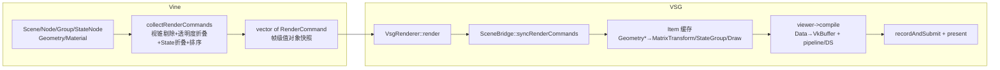
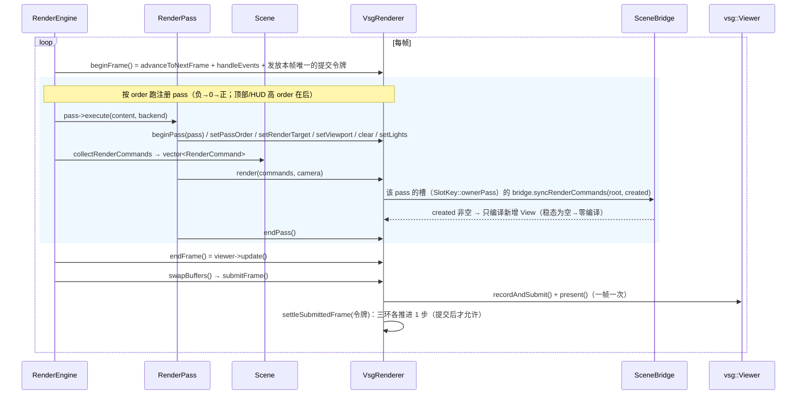

# gfx_backend_vsg 模块全解（架构 / 数据链路 / 生命周期 / 未定义行为）

> 模块：`src/plugins/gfx_backend_vsg`
> 版本依据：2026-09-04 工作区代码（`git` 后状态）+ 本机 vsg v1.1.16。
>
> **现状（2026-09-23）**：注册名 `vsg` 现在创建的是**重写版门面** `api/VsgBackend`（见
> `.ai/design/vsg-reimplementation.md` §11.16bi）；本文档描述的 `VsgRenderer` 仍在树里、仍由自己的测试驱动，
> 但**不再由任何名字创建**。重写版的逐片设计与证据都在那份设计文档里；宿主侧怎么接线也是那边的事。
>
> **运行期下限：Vulkan 1.4**（`detail::kRequiredVulkanVersion`，`VsgBackendUtility.hpp`）。低于它就**拒绝会话**
> 并在诊断通道报出两个版本号（`VsgRenderer::initialize` 的 "checking the device's Vulkan version" 阶段）——
> 后端有权依赖 1.4 的核心行为（扩展动态状态、dynamic rendering 的 local read），把低版本设备"跑子集"当成
> 可接受就会让宿主从帧深处的驱动报错里才知道。**抬到 1.4 不是为了 polygon mode / blend**：那两项 1.4 也没收
> （见 §2.3 与 `.ai/design/vsg-pipeline-sharing.md`），仍要 `VK_EXT_extended_dynamic_state3` 的 feature 位。
> 判据：`tests/test_vsg/DeviceRequirementsTest.cpp`。
>
> 本文件是模块的**导航与现状说明**：它回答"这个插件是什么、有哪些文件、类各自负责什么、图长什么样、线程约定是什么"，并指向每个主题的权威文档。
>
> **本文边界（谁写什么，2026-09-15）** —— 同一件事只写一处，其余给链接：
>
> | 主题 | 唯一权威 |
> |---|---|
> | 运行时行为：数据流、调用次数、更新策略、诊断、坑 | [`docs/backend.md`](./docs/backend.md) |
> | L0/L1 契约映射、ShaderSet 契约表、支持矩阵、历史缺陷登记（D1–D28） | [`docs/data-flow.md`](./docs/data-flow.md) |
> | 所有权 / 生命周期 / 每个清理点的动作 | `docs/data-flow.md` §9–§10（**唯一表格**）与 `docs/backend.md` §3（会话与持久、帧份额） |
> | 目标 / 内容槽模型与 pass 生命周期 | `.ai/design/vsg-target-unification.md`、`.ai/design/vsg-pass-lifecycle.md` |
> | 待办与缺陷登记 | `.ai/memory/graphics-perf-backlog.md`（**唯一登记**；本模块文档不再各自维护一份） |
> | 自定义着色 ABI、内建契约 | `.ai/design/vsg-custom-shader.md`、`.ai/design/graphics-shader.md` |
>
> 早期设计历史见 `.ai/design/vsg-design.md`。
>
> ⚠️ **当前工作区状态（2026-09-04，C6 重构后）**：`VsgRenderer` 不绑定任何 Vine Scene/Camera
> （`RenderBackendFactory/Registry::create()` 无参）；`Overlay` 类已删（顶部/HUD = 高 order 普通 pass，
> 见 `.ai/design/graphics-overlay.md`）。后端维护单一 `targets[RenderTarget*]` 表（nullptr 键 = 窗口），
> 窗口与离屏**同构为统一 `Target`**：每个 target = 一个 RenderGraph + 每个 **pass 一个槽**的
> `content_slots[]`（每槽 = 保留 View/root/SceneBridge）+ `program_slots[]`（全屏 program：延迟光照 /
> PiP 拷贝 —— **2026-09-13 起只有这一种**，`screen_slots` / `drawScreenTexture` / 后端自身的
> `shaders/` 目录都已删除，见 `.ai/design/vsg-custom-shader.md` §11.11）；窗口图 = 共享
> swapchain 图，离屏 target 自持附件（image/view/render_pass/framebuffer）。主/顶(HUD) 由 `clear()`
> 标记判定（清屏→depth-on 主槽，否则 depth-off+ambient 顶部槽）；同 target 多个不同 order 槽 = 各自
> 独立保留 ContentSlot 顺序叠画（窗口与离屏同一套代码，`renderContentSlot`/`setupContentSlot` 单一
> 路径；`buildOffscreenTarget` 只建附件+空图）。**槽的身份是 `beginPass(pass)` 公告的那个 pass**
> （`SlotKey::ownerPass`），所以两个共享相机与 order 的 pass 不会互相顶掉、pass 换相机/目标/程序时
> 槽跟着它走；每 pass 执行前引擎 `setPassOrder(order)` 只决定该 pass 在 target 内的叠画位置；
> 移除 pass 时引擎 `RenderBackend::releasePass(pass)` 释放（插件不再实现
> `releaseWindowLayer(camera, order)`：作用域是唯一驱动方式后，槽一律属于公告的那个 pass，
> 见 `docs/data-flow.md` §10.2）。槽身份只有**一种**（`SlotKey::ownerPass`），转换只有一处
> （`VsgPassRequest::slotKey()`）。早期 `contentSlot`/`setContentSlot`
> 轴与 `primary_camera`/`vsg_camera`/`vsg_scene` 主槽别名已删，窗口即 targets[nullptr]。
> target 内叠画顺序 = 用户显式 pass order
> （`ContentSlot.order`，`setupContentSlot` 按 order 升序插入子 View；PiP 视为最高阶）——不用
> main/HUD 语义限序；深度风格(depth-on/off、光照)由 `clear()` 标记判定，与顺序解耦。按显式 order
> 归位天然处理引擎 warm-up 越序建槽（不再出现 [HUD, MAIN] 把 HUD 盖住）。早期 B1
> （残留 `delete d;`）已修复。
> **2026-09-15**：第 7/11/12 节已按当前形态（统一 target + 内容/程序槽、无 PImpl）改写，
> 与上式同源；仍以 `.ai/design/vsg-target-unification.md` 与代码为最终依据。
>
> ⚠️ **2026-09-08 更新（管线共享基础已落地）**：`SceneBridge` 的 `shared_objects_`
> 已接入（此前声明未赋值 = 文档-代码漂移），同 (program×状态×槽位) 的几何共享一条
> pipeline；并新增 L1 program ShaderSet 缓存与 L2 变体模板缓存（跳过重复
> configurator）。权威设计见 `.ai/design/vsg-pipeline-sharing.md`；回归测试见
> `tests/test_vsg/SceneBridgePipelineSharingTest.cpp`（含 1k 量级不变量）。
>
> ⚠️ **2026-09-11 更新（保留状态身份 / 在飞资源生命周期）**：保留缓存的条目现在**自持**它
> 所索引的对象（裸指针键 + 不自持会让对象销毁后的同地址新对象复用旧网格 / 旧 SPIR-V /
> 旧拒绝记录），`rejected_` 合并进 `Item`；活路径替换的保留节点先经 `retireNode()` 停放、
> 由 `advanceRetireRing()`（每**已提交**帧一次，环深 4 = 命令槽 3 + 1）延后销毁；`Group::addChild`
> 拒绝成环。**权威设计/契约见 `.ai/design/vsg-pass-lifecycle.md` §8**（含未做项逐项设计登记 §9：
> D13 材质缓存逐出与身份、D27 跨 pass 命令列表缓存、D28 VkPipelineCache 持久化）。

## 1. 模块定位与插件模型

`gfx_backend_vsg` 是 `vine::graphics` 渲染抽象（`RenderBackend`）的**第一个真后端**，
以 appfw **MODULE 插件**（动态库）形式交付。它把 graphics 层的场景图 / 相机 /
渲染命令翻译成 **VulkanSceneGraph（VSG）** 调用。

```
┌────────────────────────────────────────────┐
│ graphics（抽象层，无三方依赖）                │
│  RenderBackend / RenderBackendRegistry      │
│  RenderEngine / RenderPass                  │
│  Scene / Node / Geometry / Material / Camera│
└───────────────────┬────────────────────────┘
                    │ 按名创建 "vsg"（运行时插件）
┌───────────────────▼────────────────────────┐
│ gfx_backend_vsg（MODULE 插件）               │
│  GfxBackendVsgPlugin  → 注册工厂             │
│  VsgRenderer : RenderBackend                │
│  ├─ SceneBridge   命令流 → 保留式 vsg 场景   │
│  ├─ CameraBridge  Camera → vsg::Camera      │
│  ├─ VsgMaterialManager  Material → Phong    │
│  └─ RenderStateMapper  ResolvedState→管线态  │
└────────────────────────────────────────────┘
```

- 插件 `load()` 把 `static VsgRenderBackendFactory s_factory` 注册进
  `RenderBackendRegistry`；上层 `registry.create(u8"vsg")` 拿后端（C6 起无参：
  引擎逐 pass 驱动内容，后端不绑 Vine scene/camera），不依赖本模块或 VSG 库头文件。
- 命名空间：实现都在 `vine::vsg`（`V_VSG_NS_BEGIN/END`）；graphics 类型在
  `vine::graphics`；vsg 类型全局 `::vsg`。
- 头文件放 `include/vine/vsg/`，其中 `RenderStateMapper.hpp`、`VsgUtils.hpp` 是
  header-only；类主体在插件 `src/`（不进公共 SDK 树）。

## 2. 目录与文件结构

```
src/plugins/gfx_backend_vsg/
  CMakeLists.txt                  # v_add_plugin + FetchContent(vsg/glslang)
  include/vine/vsg/
    vsg_global.hpp                # V_VSG_API 导出宏 + 命名空间宏（查 V_VSG_LIB）
    VsgRenderer.hpp               # 后端类定义（RenderBackend 实现；无 PImpl，状态按值持有）
    SceneBridge.hpp               # 命令流 → 保留式 vsg 场景（保留缓存声明在此）
    SceneBridgeInternals.hpp      # SceneBridge 的保留态形状（各实现单元共享）
    CameraBridge.hpp              # 相机桥
    VsgMaterialManager.hpp        # 材质管理器（实现 graphics::MaterialManager）
    RenderStateMapper.hpp         # ResolvedRenderState → 4 个 vsg 管线态（header-only）
    OwnedCache.hpp                # 拥有键对象的缓存（契约见头）
    VsgFwd.hpp                    # 只在指针/ref_ptr 后面出现的 vsg 类型（前向声明单一家，规则见头）
    VsgRendererState.hpp          # 会话态（纯数据）：Persistent / PassRequest / 目标表 + entryFor
    VsgRenderTargetEntry.hpp      # 一个输出目标的保留态（SlotKey + 三种槽 + per-pass 对象）
    VsgFramePlan.hpp              # detail::PassAttachments / PassPlan / RecordPlan（纯值）
    VsgPassMaterialiser.hpp       # detail：把一个 pass 变成 render pass/framebuffer/graph
    VsgRetireRing.hpp             # 泊车环：被替换的 GPU 对象延后 kRetireRingDepth 帧释放
    VsgDeferredRelease.hpp        # 延迟释放时钟（park/advance）：环、槽池、保留节点同一深度
    VsgReportOnce.hpp             # 「一个 episode 只报一次」规则本身（重武装由调用者决定，见头）
    VsgRetentionStats.hpp         # 会话保留情况的一个值（retentionStats()：槽池/退役环/编译上下文）
    VsgDiagnostics.hpp            # 诊断路线：stderr 追踪 → SDK channel（模块可接同一条路）
    VsgRecordOrder.hpp            # 命令图录制顺序：计划 + 三阶段 + 驱动器
    VsgReadback.hpp               # 颜色/深度读回（公开覆写的实现与共享守卫）
    VsgViewCompiler.hpp           # D22 增量编译：只编译本帧新增的槽 View
    VsgContentSlot.hpp            # 内容槽：请求类型 + 搭建 / 绘制 / 按序摆放
    VsgTargetBookkeeping.hpp      # detail：目标装配/重建/注销（附件、借用深度、槽视图）
    VsgProgramSlot.hpp           # 全屏 program 槽：目的目标解析/摆放
    VsgLights.hpp                # detail：光照块填充（世界→视图，两路共用）
    VsgSceneRules.hpp             # detail：设备无关规则（通道形状、缓存键哈希、颜色附件/opaque 写）
    VsgDynamicState.hpp           # detail::SetDynamicState：逐 drawable 的动态状态命令（StateNode 的
                                  # depth/cull/frontFace/topology/polygonMode/blend 全走它）
    VsgPipelineFactory.hpp        # vsg 对象工厂 + detail（格式转换 / 渲染通道 / 着色器集 / 管线态）
    VsgVulkanEntryPoints.hpp      # detail：三个 loader 不导出的扩展命令入口点（值，随命令携带）
    VsgGpuProfile.hpp             # detail::VsgGpuProfile：设备侧逐 pass GPU 时间（VINE_VSG_PROFILE 开关）
    VsgBackendUtility.hpp         # detail：图手术、设备同步、会话策略查询
    VsgUtils.hpp                  # detail::toVsg(Mat4d→dmat4)
    GfxBackendVsgPlugin.hpp       # 插件入口声明
    VsgRenderBackendFactory.hpp   # 工厂（按名创建后端）
  src/                            # 只有 .cpp（§46）；一个概念的头 ↔ 一个概念的 TU（§49）
    VsgRenderer.cpp               # 会话生命周期、帧泵、诊断路由、查询访问器
    VsgPassMaterialiser.cpp       # detail：pass 物料化 8 个函数
    VsgRetireRing.cpp             # 泊车环（park / advance / waitForIdle）
    VsgDiagnostics.cpp            # 诊断路线（追踪格式在一处）
    VsgRecordOrder.cpp            # 录制顺序三阶段 + reconcileOffscreenOrder
    VsgReadback.cpp               # 读回：提交、host-visible 内存、颜色/深度拷贝
    VsgViewCompiler.cpp           # 增量编译两条路径 + 全图回落
    VsgContentSlot.cpp            # 内容槽搭建/绘制 + 四个文件局部 helper
    VsgTargetBookkeeping.cpp      # detail：目标装配/重建/注销 + releaseRenderTarget/WindowLayer
    VsgProgramSlot.cpp           # 全屏用户程序（视图编译、摆放）
    VsgLights.cpp                # detail：光照块填充（viewRotation + 两个块）
    VsgSceneRules.cpp             # detail：通道形状判定 + 缓存键哈希 + opaque 多附件写
    VsgDynamicState.cpp           # detail::SetDynamicState 的 compare/record + 动态状态声明
    VsgVulkanEntryPoints.cpp      # 唯一包含 volk.h 的 TU：volk 装载 device 表并取出三个入口点
    VsgGpuProfile.cpp             # 读 vsg::Profiler 的日志：哪张图属于哪个 pass + 逐 pass 毫秒
    VsgRendererPasses.cpp         # pass 协议（begin/end/releasePass、退役）
    SceneBridge.cpp               # 保留 Item 缓存 / buildGeometry / syncRenderCommands
    SceneBridgeGeometry.cpp       # 顶点/索引上传与通道处理
    SceneBridgePipeline.cpp       # vsg 管线态构建（hash / buildStateGroup）
    CameraBridge.cpp
    VsgMaterialManager.cpp
    VsgBackendUtility.cpp         # detail：图手术、设备同步、会话策略
    VsgPipelineFactory.cpp        # detail：格式转换、渲染通道、着色器集、叠加/程序节点、灯光节点
    VsgRenderBackendFactory.cpp   # 后端工厂注册
    GfxBackendVsgPlugin.cpp       # 插件外壳 + V_DECLARE_PLUGIN
  shaders/                        # 早期手工 flat shader（flat.vert/frag[.spv]，已不被构建使用）
  vsg_selftest/                   # 无窗口自检（lavapipe 下跑完整帧装配）
  docs/data-flow.md               # 数据映射专项文档（旧名 vine-to-vsg-data-flow.md）
  docs/backend.md                 # 后端运行时说明（生命周期 / 调用次数 / 更新策略）
  gfx_backend_vsg.md              # 本文
```

`v_add_plugin` 由短名推出 `V_GFX_BACKEND_VSG_LIB`，但头文件查 `V_VSG_LIB`，所以
CMake 里显式 `target_compile_definitions(... PRIVATE V_VSG_LIB)` 让 `V_VSG_API`
在构建本插件时展开为 `V_EXPORT`。

## 3. 构建与依赖

- **运行期 Vulkan 下限 = 1.4**：实例版本由 vsg 的 `WindowTraits::defaults()` 用 `vkEnumerateInstanceVersion`
  取 loader 支持的最高值（本机 1.4），但**算数的是设备自己的 `apiVersion`** —— 会话建立时用
  `detail::supportsRequiredVulkanVersion()` 判，低了就 `shutdown()` + 返回 false 并在诊断通道报原因。
  可用/不可用的 API 面看**系统头的版本**（本机 `VK_HEADER_VERSION 341`），vsg 那份 `include/vsg/vk/vulkan.h`
  只是 `#include <vulkan/vulkan.h>` + 老头补丁。
- `v_add_plugin(GFX_BACKEND_VSG_TARGET gfx_backend_vsg)`：MODULE 库。
- `VINE_USE_FETCHCONTENT=ON`（推荐）：静态编译 glslang + vsg v1.1.16 打进插件；
  保留运行期 `vsg::ShaderCompiler`（程序路径需要）。
  - 先 `find_package(glslang QUIET)`；没有再 Fetch glslang 16.2.0，并把它的
    `SPIRV/` 头镜像到构建树、生成 `glslang-config.cmake` 指向 in-tree，让 vsg 的
    `find_package(glslang)` 命中，`VSG_SUPPORTS_ShaderCompiler=ON`。
  - vsg 静态库把 glslang 的 private 依赖 re-export 进 `vsgTargets`，故需把
    glslang 各 target 塞进 vsg 的 export set（安装规则在树内 inert）。
- `VINE_USE_FETCHCONTENT=OFF`：走 vcpkg / 本机安装的 vsg（如 `/opt/opensrc/VSG`）。
  ⚠️ 无 glslang 的预装 vsg **禁用运行期 shader 编译** → program 路径静默失效
  （登记 D12）。默认 phong 用内嵌 SPIR-V blob，无需 glslang 也能渲染。
- 链接：`vsg::vsg`（PUBLIC，因 `SceneBridge` 对外 API 暴露 `vsg::ref_ptr<vsg::Node>`）
  + appfw（插件基类）+ graphics（接口 + registry）。
- 部署：`<exe>/plugins/vine/gfx_backend_vsgd.*`（v_add_plugin 规则）。
- 测试：`tests/test_vsg` 不能链 MODULE 库，改为**直接编实现源文件**做集成测试。

## 4. 核心类职责一览

| 类 | 职责 | 备注 |
|---|---|---|
| `VsgRenderer` | 实现 `RenderBackend`：帧泵、pass 协议、目标账本、内容/程序槽、读回、诊断路由 | **无 PImpl**（状态按值：`VsgRendererPersistent` 跨会话 + `VsgRendererState` 单会话）；不绑 Vine Scene/Camera |
| `SceneBridge` | 把每帧命令流保留式 reconcile 到一棵 `vsg::Group`；按 `Geometry*` 缓存 Item（**条目自持键**） | 每个**内容槽**一个（窗口与离屏同构；vsg 按 viewID 编管线 ⇒ 槽的管线注册表不可共享） |
| `CameraBridge` | `Camera`（eye/target/up + fov/ortho）→ `vsg::LookAt` + `vsg::Perspective/Orthographic`；`apply()` 原位同步 | vsg 相机不含 viewportState（渲染器补） |
| `VsgMaterialManager` | `Material*` → 缓存 `VineMaterialBlock` 的字节（`vsg::ubyteArray`） | 实现 `graphics::MaterialManager` |
| `RenderStateMapper` | `ResolvedRenderState` → DepthStencil/Rasterization/ColorBlend/InputAssembly 四态 | header-only；含 reverse-Z 深度比较反转 |
| `VsgUtils::detail::toVsg` | `Mat4d` → `vsg::dmat4`（列主序复制） | header-only |
| `VsgRenderBackendFactory` | `create/info` + 静态 `Registrar` 自注册 | 插件加载也注册一次 |
| `GfxBackendVsgPlugin` | 插件外壳，`load()` 注册工厂 | `V_DECLARE_PLUGIN` |

## 5. 分层数据链路（命令流 → 保留式 vsg 场景）

一句话：**Vine 每帧收集"命令流"（立即模式快照）→ `SceneBridge` 拿它当 diff 去
对账一棵常驻 vsg 场景（保留模式）→ 结构变化才重建 + compile → `recordAndSubmit`。**



### 5.1 Vine 侧收集（`Scene::collectRenderCommands`）

- 逐 `Node` 递归，做**视锥剔除**（每节点 AABB vs 视锥），叶子 `Geometry` 产一条
  `RenderCommand{geometry, material, program, modelMatrix, opacity, isTransparent,
  resolvedRenderState}`。
- `opacity` 沿树相乘（scene×祖先×叶，材质不贡献）；`isTransparent=opacity<1-ε`。
- `resolvedRenderState` = 沿祖先链把每个 `StateNode` 的 `RenderState` 折叠（深层
  覆盖浅层）后 `resolveRenderState` 成平面结构；`program` 同理叶优先再逐级祖先。
- 排序：opaque 前→后、transparent 后→前（painter）。

### 5.2 驱动：`RenderPass::execute` / `ScreenPass::execute`

引擎逐 pass 调 `RenderPass::execute`，它依次对后端调用：
`setRenderTarget → (setViewport?) → (clear?) → setLights → render(commands, camera)`。
`ScreenPass` 则 `setRenderTarget → (setViewport?) → drawScreenProgram(source, program, camera)`
（2026-09-13 起屏幕绘制只有这一个入口：PiP 拷贝、deferred 光照、宿主后处理是同一次调用配不同 program）。
（`RenderBackend::executePass` 虽是纯虚但引擎不走它。）

### 5.3 保留式 reconcile（`SceneBridge::syncRenderCommands`）

对每条命令，以 `Geometry*` 为键在 `cache_` 找 `Item`：

- 判据变化才**重建该几何的子树**：`geometry->revision()` / 材质对象指针 /
  `resolvedRenderState` / program 指针任一不同。
- 稳态每帧只做廉价操作（见 §6 表）。
- 不在本帧的几何：从 root 摘下但**保留 Item**；只有缓存之外没有人持有它（App 放手）那一帧才逐出 —— 剔除 / 隐藏 / 移动都不算删除。
- 根 children 顺序跟随（已排序的）命令流，顺序变了才重排 → opaque/透明 painter 序
  由命令序承载。

重建调用 `buildGeometry`：读 loc0(位置)+可选 loc1(法线/推导)+索引 → 物化成
`vsg::vec3Array / uintArray / vec4Array` → `GraphicsPipelineConfigurator` 按名字
喂 `vine_Vertex / vine_Normal / vine_Color` + `material` descriptor（默认路径），或
`vine_Vertex` + 自建 `pc` ShaderSet（program 路径）→ 按 `ResolvedRenderState` 装管线态
→ `StateGroup` 挂 `BindVertexBuffers + BindIndexBuffer + DrawIndexed`。
**顶点数据/世界变换/透明度、材质字段的完整映射与 ShaderSet 契约表**
见 `docs/data-flow.md`。

### 5.4 GPU 上传 / 编译

`syncRenderCommands` 把新建/重建子树收进 `created`；调用方（`VsgRenderer`）在
`created` 非空时编译**只有新增的那些 View**（`VsgViewCompiler`：两条路径 + 全图回落；
待编列表 `pending_compile_views`）。稳态帧 `created` 为空 → **零编译**。编译即 vsg 的
`Data→VkBuffer` 上传 + 建 pipeline / descriptor set。

## 6. 帧循环与每帧成本

引擎 `RenderEngine::frame(dt)` 驱动：



没有 `VsgRenderer::frame()` 之类的便捷入口：帧只能走 `RenderBackend` 接口（`beginFrame` → 逐 pass →
`endFrame` → `swapBuffers`），而后端对"没有 `beginFrame` 的 `swapBuffers()`"会**拒绝并只报一次**——
环的推进以"已提交的一帧"为时钟（`FrameCommit` 令牌），多推一次会提前释放仍在飞行命令缓冲里的对象。

**每帧脏检查与动作**（`syncRenderCommands` 内逐几何）：

| 变化 | vsg 动作 | 重建/编译 |
|---|---|---|
| 世界矩阵（`cmd.modelMatrix`） | 写 `MatrixTransform::matrix`（变了才写） | 无 |
| 透明度 `cmd.opacity` | 写该 drawable 在 `vine_draw` 池里的槽（变了才写） | 无 |
| 同材质改颜色/光泽 | 原位覆写共享的 `VineMaterialBlock` 字节（每帧循环） | 无 |
| 顺序变化 | 重排 root children 匹配命令序 | 无 |
| 隐藏/剔除离场 | 摘下 root，Item 保留；只有外侧放手才逐出（无时间窗） | 无 |
| 首次出现 / revision / 换材质对象 / renderState / program 变 | 重建该 Item | 有（全图 compile） |

**要点**：稳态帧成本 ≈ 每几何几次指针/浮点比较 + 材质 uniform 覆写；**不重建节点、
不建管线、不编译**。透明排序依赖命令序（root 子序），混合**恒开**由逐顶点 alpha
承载（代价：opaque 也走 alpha 混合，GPU 固定小开销）。

## 7. 图结构与槽

> 设计权威：`.ai/design/vsg-target-unification.md`（目标统一）与
> `.ai/design/vsg-pass-lifecycle.md`（pass/槽生命周期）。本节只给形状。

后端维护**一个** `vsg::Viewer` + **一个** `vsg::CommandGraph`；每个输出目标（窗口 = `targets[nullptr]`，
或一个离屏 `RenderTarget*`）各有一张自己的 `RenderGraph`，窗口图共享 swapchain，离屏图自持附件。
目标内**每个 pass** 是一个**槽**：内容槽与全屏 program 槽都以**公告的那个 pass**（`SlotKey::ownerPass`）
为身份，一个槽 = 一套保留的 View/root/bridge。身份只有这一种：**作用域是唯一的驱动方式**
（`beginPass` → 该 pass 的状态 → 它的绘制调用 → `endPass`），没有公告 pass 的**绘制**调用
（`render` / `clear` / `drawScreenProgram`）会被拒画并每帧只报一次 `PassProtocolViolation`；
状态 setter 单独调用是惰性的（下一次 `beginPass()` 从空请求开始）。

```mermaid
graph TD
    V[vsg::Viewer<br/>EmbeddedViewer] --> CG[vsg::CommandGraph]
    CG --> RG_M[窗口目标 RenderGraph<br/>= 共享 swapchain]
    CG --> RG_O[离屏目标 RenderGraph ×N<br/>自持 image/view/RP/framebuffer；按录制顺序插入]
    RG_M --> MV[内容槽 View ×N<br/>键 (camera, order)，每槽一个 SceneBridge]
    RG_M --> PV[程序槽 View ×M<br/>全屏 program / PiP]
    RG_O --> OFV[离屏内容槽 / 程序槽 View]
    MV --> LG[vine_lights UBO（每槽）] & SC[保留 root Group]
    SC --> IT[MatrixTransform ×N]
    IT --> SG[StateGroup: pipeline + material DS]
    SG --> DR[Bind* + DrawIndexed]
```

录制顺序不是“离屏永远在前”：采样边与深度借用边由 `VsgRecordOrder` 拓扑排序决定
（一个离屏目标可以采样另一个离屏目标）。

### 7.1 窗口内容槽（on-screen）

- `initialize()` 建窗口目标（`VsgRenderTargetEntry`）与**空图**：它既不绑 Vine 场景也不绑相机
  （“the renderer binds neither a Vine scene nor a camera and pre-creates nothing here”）。
- 内容槽**按 pass 惰性创建**：引擎每帧 `beginPass(pass)` + `setPassOrder(order)` + `setRenderTarget(...)`
  把槽键交给后端，首次出现时建 `CameraBridge` + `View` + 保留 root + 该槽自己的 `SceneBridge`。
- 几何子树的编译是**增量**的：新建/重建的 View 进 `pending_compile_views`，`submitFrame()` 里由
  `VsgViewCompiler` 编译（两条路径 + 全图回落）。
- 深度风格（depth-on / depth-off、光照）由该 pass 的 **`clear()` 请求**判定，与槽顺序解耦；
  槽内叠画顺序 = 用户显式 `order`（`PassAttributes.order`，升序插入），不再有 main/HUD 语义限序。

### 7.2 同目标多槽（HUD / 顶部层）

- 同一相机 + **不同 order** = 两个槽，各自保留 View/root/bridge，按 order 叠画；顶部层用
  `depth_off` 着色集（深度 test/write 关）。
- 每帧把该槽相机的 `viewportState` 设成该 pass 的 `setViewport` 子矩形（无则全屏）→
  `CameraBridge::apply` → 该槽 bridge 同步。灯只有 `vine_lights` UBO 一个来源，不透明度走每 drawable 的
  `vine_draw` 槽（vsg 灯节点 / `setGroupLights` 已于 2026-09-13 删除）。
- 移除见 §12.2；`RenderEngine::initialize` 会对已注册、enabled 且**不清屏**的 pass 预热一次
  （先建好、编译好，避开帧中途首见编译）。

### 7.3 离屏 RenderTarget

- 离屏目标自持 GPU 附件（color ± depth image/view）、自己的 render pass / framebuffer 与
  `RenderGraph`（`VK_SUBPASS_CONTENTS_INLINE` + 每 pass 自定义 clearValues）。
- 它和窗口**同一套代码路径**：同样的内容槽 / 程序槽，同样的 `renderContentSlot`；差别只在附件与
  录制位置。深度的“promotion”（可采样）与“借用”由目标账本记录，详见 `.ai/design/vsg-pass-lifecycle.md`。
- 采样方（PiP / 延迟光照 / 用户全屏 program）与生产者之间的顺序由 `VsgRecordOrder` 保证：
  采样边 + 深度借用边拓扑排序，且生产者重建后消费者丢弃旧 image view。

### 7.4 程序槽（PiP / 全屏 program）

- 2026-09-13 起只有这一种屏幕绘制：`drawScreenProgram(source, program, camera)`（`screen_slots` /
  `drawScreenTexture` / 后端自带 `shaders/` 目录均已删除，见 `.ai/design/vsg-custom-shader.md` §11.11）。
- 全屏三角形由 SDK program 提供（`BuiltinShaders` 的 `fullscreenVertexProgram` / `screenCopyProgram`）——
  没有 program 的 `ScreenPass` 画的就是那段拷贝；后端只决定**怎么编译与怎么绑**。
- 每帧更新该槽相机 `viewportState` 跟随 `setViewport` 矩形（越界自动右下角 16:9 贴边）；
  source 尺寸变化 → 丢旧槽重建。

## 8. 相机桥接（CameraBridge）

- `Camera` 是 OSG 风格：完整 view/projection 矩阵由 eye/target/up + 投影参数表达。
- `create()`：`vsg::Camera(projection, viewMatrix=LookAt)`，然后 `apply()`。
- `apply()`：写 `LookAt.eye/center/up`；按投影类型原位建/更新
  `vsg::Perspective`（fovY/aspect/near/far）或 `vsg::Orthographic`
  （由 orthoHeight×aspect 得 half_w/half_h）。
- vsg 相机**不带 viewportState**（桥无窗口概念）；`VsgRenderer` 在 initialize/resize
  时用 `window->extent2D()` 补 viewportState，`RenderGraph` 每帧从它取渲染区域。
  （2026-09-17：窗口图的 `renderArea`/`viewportState`/`previous_extent` 也在 `resize()` 里直接写成新
  extent —— 见 §13。）

## 9. 材质管理（VsgMaterialManager）

- `getOrCreate(Material*)`：以 `Material*` 为键缓存 `vsg::ubyteArray`（`VineMaterialBlock` 的字节，SDK ABI）
  （同一材质多几何共享一个 uniform 资源）；null → 默认灰。
- 每帧 `syncRenderCommands` 尾部：对每条命令 `getOrCreate`（命中缓存）并把
  diffuse/specular/ambient/shininess **原位写进共享值** → 同材质改色即时生效、
  零 rebuild；`diffuse.w` 是材质自身的 alpha，物体不透明度走 `vine_draw` 槽的 `params.x`。
- 抽象基类接口：`updateMaterial / releaseMaterial / clear / find / materialCount /
  hasMaterial / forEachMaterial`。
- 刷新与回收（登记 D13 已修，2026-09-14）：`updateMaterial` **由 `SceneBridge` 每帧调用**（在
  `syncRenderCommands` 尾部），比较的是块类型**自己的** `operator==`（`ShaderAbi.hpp`，默认化）——
  所以块里加成员时比较自动跟上，不会出现“改了属性但画面不动”的静默失效；条目自持 `Material`，
  帧级 `releaseAbandoned()` 回收 App 已放手的材质，容量裁剪兜住极端情况。

## 10. 渲染状态映射（StateNode / reverse-Z / 深度约定）

- 状态在**收集期**已折叠进 `RenderCommand.resolvedRenderState`，vsg 侧不存在“StateNode
  节点”。`Item` 记录上一次 `render_state`，每帧比较，变了才重建管线。
- `RenderStateMapper` 把平面状态映射成 4 个 vsg 态：
  - **深度**：test/write 1:1；**比较符反转**（`Less→GREATER` 等）。这是 reverse-Z 约定的代码面：
    `RenderStateMapper.hpp` 直接写着“the vsg backend uses a reverse-Z …”，目标清屏值取的是
    reverse-Z 的远平面（`VsgTargetBookkeeping.cpp`：depth clear = 0.0）。**已实测**（不再是待验证项）：
    selftest 的 program 相位把几何画在 clip `z = 0.5`，若约定不成立（clear 0 + GREATER）该几何会
    被整片丢弃；反向改 `LESS` 或把 z 写成 0 会立即可见。
  - **剔除/多边形**：`cullMode` 映射，`frontFace` **固定 CCW**（配合 vsg Y-flip）；
    `polygonMode` Fill/Line/Point。
  - **混合**：**恒开**（`blend.enabled=false` 不关混合，只回默认因子
    SrcAlpha/OneMinusSrcAlpha）——因为透明度走 per-vertex alpha 随时可能 <1；
    单 color attachment，MRT 未做。
  - **拓扑**：Triangles/Points/Lines → `TRIANGLE_LIST/POINT_LIST/LINE_LIST`。

## 11. 生命周期与所有权

> **谁拥有什么的唯一表格在 [`docs/backend.md`](docs/backend.md) §3**（逐项：拥有者 / 契约 / 违约后果，
> 含会话级纹理与网格缓存、退役环、帧份额），**逐清理点的动作表在
> [`docs/data-flow.md`](docs/data-flow.md) §9–§10**。本节只说模块级约定，不重复那两张表。

四条合同（违反即 UB / 双释放 / 撞 `VSG_MAX_DEVICES==1`）：

1. **Vine 对象**由场景树 / 调用方持有（`intrusive_ptr`）；后端**不延长**其生命，但保留缓存的
   **条目自持它索引的键对象**（`OwnedCacheEntry`）——“外侧放手了吗”由 `useCount() <= shares` 回答。
2. **保留 = 显式公告过的东西**（`setRenderTarget` 的 target、`beginPass` 的 pass、内容/程序槽），
   必须配对 `releaseRenderTarget` / `releasePass` 注销；长期驻留不随帧数增长。
3. **在用对象不立即释放**：被换下的保留节点、槽池的槽、退役的 GPU 对象都进泊车环，
   延后 `kDeferredReleaseFrames` 帧（提交过的帧）才真正释放。深度是**实测值 8**，不是"槽数 + 1"
   （见 `include/vine/vsg/VsgDeferredRelease.hpp`：4 时 2 帧运行稳定报销毁在用的 00873/00892/00765）。
   **推进必须是帧的最后一步**：
   在推进之后停放的，只拿到 `深度 - 1` 帧保护 —— 2026-09-19 修掉的那族 VUID
   （`00873`/`00892`/`00765`，自检 6 帧 5 条 / 30 帧 13 条）就是这一帧差的后果（见
   `.ai/design/vsg-upstream-alignment.md` §3）。
4. **重初始化前必须把会话资源清干净**（否则新 `Window::create()` 撞 `VSG_MAX_DEVICES == 1`）：
   做法是 `state = VsgRendererState{}` 整体替换，而不是手写拆卸清单。

### 11.1 状态按值，无 PImpl

类定义整个在 `include/vine/vsg/VsgRenderer.hpp`；会话态 = `VsgRendererState`（`VsgRendererState.hpp`），
跨会话态 = `VsgRendererPersistent`，目标账本 / 帧计划 / 物料化 / 泊车环各在
`VsgRenderTargetEntry.hpp` / `VsgFramePlan.hpp` / `VsgPassMaterialiser.hpp` / `VsgRetireRing.hpp`。
早期 PImpl（`unique_ptr<Impl>`）已于 2026-09-12 删除（设计 §44–§48）。

### 11.2 线程模型

- **约定：后端 + vsg 对象只在宿主线程（GUI 线程）访问**；`RenderEngine::frame`
  同步驱动，无并发提交。
- `EmbeddedViewer::pollEvents()` **不泵原生消息队列**（vsg 默认会
  PeekMessage/DispatchMessage；嵌入 Qt 时再泵会重入 Qt → 帧递归 → 栈溢出）。
  输入由宿主 Qt 事件送进来，后端只丢缓冲事件。
- 跨线程调用任何后端方法 = 数据竞争（UB）。线程切换只出现在 `deviceWaitIdle()`
  （同步点）内部。

## 12. 资源清理路径

> **统一顺序、逐清理点表格、`shutdown()` 的完整步骤：唯一权威在
> [`docs/data-flow.md`](docs/data-flow.md) §10**（本节不重复）。口诀：
> 先从录制图摘下 → `deviceWaitIdle()` → 丢 vsg 子树 / `clearCache()` → erase 槽/映射。

只有两条只住在这里的注意事项：

- **为什么必须清干净**：已编译的 pipeline / descriptor set 持旧 `vsg::Device` 引用；表面重建后再
  `Window::create()` 会分配**第二个 Device**，撞本构建 `VSG_MAX_DEVICES == 1` 抛未捕获异常。
- `releaseWindow()` 漏调 → `Win32_Window` 析构会对 Qt 拥有的 HWND 调
  `DestroyWindow()/UnregisterClass()`（主机正在拆窗口）→ 双释放。

### 12.1 pass 移除（引擎侧释放）

`RenderEngine` 的 `removePass/clearPasses` 在移除后调后端 `releasePass(pass)` +
`releaseRenderTarget(pass->renderTarget())`（均非空判断）；pass 在单列表至多注册一次，
无共用歧义。后端对应实现见上表。

## 13. resize 与表面重建

`RenderEngine::pushEvent(ResizeEvent)`：更新 `frame_ctx_` → 有 manipulator 则
`onResize`，否则按新宽高比重设主相机 aspect（`setProjectionMatrixAsPerspective`，
避免几何拉伸）→ `backend_->resize(w,h)` → 各注册 pass `onSurfaceResized`。

`VsgRenderer::resize(w,h)`：
- `window->resize()`（重建 swapchain）；
- 更新 `vsg_camera->viewportState = ViewportState::create(window->extent2D())`
  —— 否则 `RenderGraph` 每帧从旧 viewportState 取渲染区域，画面停在旧尺寸
  （见 `.ai/bugs/vsg-resize-distortion.md`）。
- **窗口共享 `RenderGraph` 的 `renderArea` / `viewportState` 在这里就写成新 extent**（并把 `previous_extent`
  同步成同值）：vsg 自己的 resize 处理只在**录制期**发现 extent 变化后缩放，中间那些帧仍按旧矩形清/画，
  新露出的部分既没清也没画 ⇒ 黑带（2026-09-17 实测：最大化后 250–320 ms）。同步 `previous_extent` 顺带
  关掉了 vsg 的缩放路径（它会把已经正确的矩形再缩一次：HUD overlay 跑到窗口外）。

**宿主侧顺序保持一帧**（`src/fw/appfw/src/gui/SurfaceWindow.cpp::handleUpdate`）：`engine->resize()` →
`view->onSurfaceResized()`（重建离屏链）→ `renderFrame()` → settle。“先呈现一帧再重建”（旧画面被拉伸填满
新窗口，实测 26 ms 就上屏）**试过又撤了**：它把画面拉伸变形，比“新区域晚 ~240 ms 才填上”更难接受 ⇒
**约定：画面任何时刻不变形**；重建帧覆盖整个新窗口（因为 `renderArea` 已当场写对，见上）。重建帧 ~240 ms
里 6 个全屏程序节点占 ~180 ms（glslang 只 ~50 ms，其余是 vsg 每节点建管线/描述符）。

离屏 target：其 GPU 附件在**描述变化**（尺寸 / 颜色附件数或格式 / 深度格式 / 深度提升，
即 `Target::BuildKey` 整把比较与尺寸任一项不符）时整目标重建（`buildOffscreenTarget`）；
采样它的程序槽在采样源重建、尺寸变化或 program 内容修订变化时丢弃重建（`drawScreenProgram`）。
**采样它的程序槽的 rebuild identity 不含“目标表面尺寸”**（2026-09-17 改）：节点的几何是全屏三角形，
矩形是**动态状态**（每帧从 pass 的 viewport 写进 `slot.camera->viewportState`，而每个全屏片段阶段都按
`vine_uv` 采样，与尺寸无关），所以窗口改尺寸不需要重建它。留在 identity 里的代价实测是把窗口里 5 个
全屏程序在 resize 帧全部重编译（各 ~21 ms，共 ~105 ms），而那正是“必须尽快提交一帧”的那一帧。
重建成 3 处都走统一顺序（先摘图 → deviceWaitIdle（计数）→ 释放 → 重建）。

## 14. 未定义行为 / 内存 / 异常安全清单

> 结论先行：所有权两侧都引用计数、**无环**（`Node::parent_` 是非拥有 raw_ptr；
> 命令流帧级释放；vsg 编译产物随节点释放），**真泄漏风险低**。主要风险集中在
> **裸指针缓存键 / 生命周期时序 / 线程**。以下按类编号，可与
> `docs/data-flow.md` §13 的 D1–D26 对应。

### 14.1 悬垂与地址复用（最危险）

| ID | 风险 | 触发条件 | 说明 |
|---|---|---|---|
| UB-1 | `SceneBridge::cache_`（key `Geometry*`）与 `VsgMaterialManager::cache`（key `Material*`）**裸指针键悬垂 + 地址复用错配** | 调用方先释放对象、缓存条目后引用（**Geometry 侧已不可能**：条目自持键，外侧放手则当帧回收） | 新几何 `find` 命中旧 Item（内容校验可能过不了 revision/material 而触发**重建**；重建 `buildGeometry` 会解引用缓存的 `material` 指针）→ 若旧 `Material*` 已释放则**解引用悬垂 = UB** |
| UB-2 | 渲染器绑定 `Scene*/Camera*` 悬垂 | 场景/相机先于渲染器销毁 | `initialize/render/frame/frame()` 解引用 → UB（构造文档明示契约） |
| UB-3 | 槽身份（`SlotKey` = 公告的 pass）对应的 `RenderPass*` 悬垂 | 引擎没配对调 `releasePass/releaseRenderTarget` 就销毁对象 | 槽表残留旧 key；新对象同址 → 错配旧槽（GPU 资源被张冠李戴） |
| UB-4 | `active_target / pending_lights / pending_viewport` 跨调用暂存 | 同一帧内 `setRenderTarget/setLights/setViewport` 后 `render` 前对象被改/销毁 | 引擎同步逐 pass 调用，正常窗口内安全；外部滥用接口时序则有悬垂 |
| UB-5 | pass 中途换相机 | 该 pass 的槽跟着它走（身份是 pass，不是相机）；旧目标上的槽由 `retargetPass` 丢掉 | 不会再出现"旧键槽泄漏 / 误释别家"——（旧）`releaseWindowLayer(camera, order)` 这条已删 |

**缓解**：场景树是权威持有者，命令流只引用“本帧画的东西”（其 `intrusive_ptr`
保活）⇒ 稳态无悬垂；真删除 + 不重用的场景最安全。**当前做法**：保留缓存的**条目自持键对象**
（`OwnedCacheEntry`），所以“外侧放手”与“仍被持有”用 `useCount() <= shares` 就能分开，
既不需要弱引用/世代号，也不需要时间窗（早期 600 帧滞留窗已删）。

### 14.2 头文件纪律

| ID | 约束 | 位置 | 说明 |
|---|---|---|---|
| B2 | `VsgRenderer.hpp` 按值持有会话态，成员类型必须是**完整类型** | 头文件纪律 | 不能再靠“只在 .cpp 里才需要完整类型”省 include；新增成员若用 `unique_ptr`/`intrusive_ptr` 指不完整类型，只能在头里用引用/指针并另找一处放置 |

### 14.3 数据读取 / 越界

| ID | 风险 | 位置 |
|---|---|---|
| UB-6 | loc0/loc1 读取不再假定 3 分量：`components` 进通道形状判定，形状不对**拒绝并报诊断**（不再交错读错） | `VsgSceneRules::classifyChannel`、`SceneBridgeGeometry` |
| UB-7 | 各属性 buffer 顶点数已与 loc0 对齐校验，不等则拒绝并报原因 | `SceneBridgeGeometry`（loc0/loc1 形状检查） |
| UB-8 | 退化三角形推导法线 → NaN / 垃圾法线 | `makeNormals/makeIndexedNormals` |

### 14.4 生命周期时序 / 异常安全

| ID | 风险 | 说明 |
|---|---|---|
| UB-9 | 重初始化前未走完整 shutdown → 撞 `VSG_MAX_DEVICES==1` **未捕获异常**（terminate） | shutdown 顺序即安全顺序（§12.1） |
| UB-10 | `releaseWindow()` 漏调 → vsg 析构 `DestroyWindow` 宿主 Qt HWND → **双释放** | shutdown 固定调用 |
| UB-11 | `materialManager` 在 `VsgRendererPersistent`，dock 于所有 bridge 之上（接口约定：manager 必须活得比 bridge 久）—— 只要 bridge 析构不碰 manager 就安全 | 约定：别在 bridge 析构里用 manager |
| UB-12 | 帧中途结构变化触发编译（增量，必要时全图回落） | 规避 = initialize / enable 后预热；稳态帧零编译 |
| UB-13 | 非 Windows 下宿主窗口句柄（`QWindow::winId()`）窄化为 `uint32_t xcb_window_t`；`nativeWindow` 用 `std::any` 按**精确类型**匹配，存错类型 → `bad_any_cast` 抛异常 | `initialize()` 有注释；若窗口 id 高 32 位非零会丢位（罕见） |
| UB-14 | `frontFace` 固定 CCW + `cullMode` 默认 None；“两种绕序兼容”只在 cull=None 成立；开 cull 后绕序错即整面消隐。**已修（2026-09-19）**：`frontFace` 改为 `VK_FRONT_FACE_CLOCKWISE`（vsg 投影反 Y ⇒ 帧缓冲里 SDK 的 CCW 正面是 CW；见 `RenderStateMapper.hpp` 与 §7.1） | RenderStateMapper |

### 14.5 线程

| ID | 风险 |
|---|---|
| UB-15 | 后端方法非线程安全；从非宿主线程调 = 数据竞争（vsg 场景/图并发改写） |
| UB-16 | 函数内 `static`（诊断计数 `s_sync_diag`、`s_dumped`、`static s_factory`）非同步；单线程约定下无碍，多线程引渲染器会竞争 |
| UB-17 | `EmbeddedViewer::pollEvents` 覆盖依赖 Qt 主循环不回灌事件；无宿主表面的会话（后端自建窗口）事件需自理 |

### 14.6 其它

- **异常安全**：`initialize()` 里 `Window::create/compile` 失败走 `shutdown()+false`
  返回，不抛（注释里的 try/catch 段已注释掉）。
- 内容槽装配（`setupContentSlot`）失败不留半初始化槽：目标没有可录制的图时上报
  `TargetBuildFailed`、相机桥创建失败时上报 `ContentSkipped`，两种情况都丢掉该槽
  （`VsgContentSlot.cpp:105-124`）。
- 窗口模式只有一种：有宿主句柄 ⇒ `VsgHostWindow`（采纳，绝不销毁）；无宿主句柄 ⇒ vsg 自建窗口（自己销毁）。
  已删：`makeRawDemoNode` / `VINE_VSG_PROBE_BUILDER_BOX` 及 `raw_layout.txt` 副作用写文件，以及
  `forceOwnWindow()`（`VINE_VSG_OWN_WINDOW` 临时逃生口）——它只是把“本次会话有没有宿主窗口”
  换成一个 env 开关，2026-09-19 起直接问会话自己（`onHostWindow()`）。

## 15. 缺陷与待办登记（只指向唯一登记）

本模块**不再维护第二份登记**：两份（本节与 `docs/data-flow.md` §13）在 2026-09-15 前已经互相漂移
—— D13、D14、D1 等项的“现状”在不同文档里同时存在“已修”与“未修”两个版本。现在：

- **当前待办**（含优先级与实测依据）：`.ai/memory/graphics-perf-backlog.md`。
- **与上游（vsg 1.1.16）的对齐审查**（哪些是上游机制、哪些是有意不同、文献漂移、当前唯一真缺陷）：`.ai/design/vsg-upstream-alignment.md`（2026-09-19）。
- **历史登记（D1–D28，含已修项与其原因）**：`docs/data-flow.md` §13，带日期，**不再更新**。
- **设计层未做项**（逐项设计已写好）：`.ai/design/vsg-pass-lifecycle.md` §9。

已修项的例子（保留在这里只是为了让读者知道“别照着旧文去找”）：D13 材质缓存无逐出、
D14 裸指针键滞留窗、D22 全图 compile、B1 析构残留 `delete d;`、`VsgRenderer::releaseWindow()`
（2026-09-16 删除：它是宿主窗口模型的残留，对 vsg 自建窗口则是“析构不再销毁它”的窗口泄漏）、
“窗口是黑的”（2026-09-16：自写窗口类漏覆写 `valid()/visible()` ⇒ 整帧不录，已改为派生 vsg 平台窗口）。

## 16. 调试与实验开关（现状残留）

| 开关 | 行为 | 性质 |
|---|---|---|
| `VINE_VSG_SLOT_DEMO` | AppShell 在主相机上注册第二个 content slot 的覆盖层（亮盒叠画，验证 C6.3b 同视角多槽） | 演示开关 |
| `VINE_VSG_OFFSCREEN` | AppShell 离屏 RT → PiP 验证链（单内容槽） | 演示/验证 |
| `VINE_VSG_OFFSCREEN_MULTISLOT` | AppShell 把**同一个** 640x360 离屏 RT 烘两个内容槽（主场景 depth-on 槽0 + 异场景 on-top 槽1），ScreenPass 以 PiP 显示（验证 C6.4 离屏多槽；日志“off-screen content slot N added … now N slot view(s)”） | 演示/验证 |
| 无 env | 主路径 = 绑宿主原生表面（Qt HWND / xcb），Qt 合成窗口 | 正式候选 |
| 首 5 帧 | `[VsgRenderer][diag] main sync: ...` 打到 stderr | 诊断 |

## 17. 支持 / 不支持矩阵（摘要，详见 data-flow §12）

**已支持**：三角形/线/点（`Topology`）、线框（`PolygonMode`）、深度 test/write/compare
（**reverse-Z + GREATER**）、剔除、混合、每几何独立拓扑、材质（共享缓存 + 每帧就地刷新）、
scene×node×叶 opacity → per-vertex alpha、用户 program（运行期 glslang）、scene 级环境光/方向光、
多 pass（主/叠画/离屏/PiP/动态子视口/自定义全屏 program）、跨几何共享 pipeline/描述符、
**纹理与 uv（含 cube map）**、**自定义顶点通道（任意 location，含 loc6 顶点色）**、
**阴量子相位（延迟 + 前向，selftest 断言画面）**、MRT 多 color 附件 + 每 pass 清屏策略、
深度借用（一个目标采另一个目标的深度）与深度提升。

**未支持 / 待办**：`LINE_STRIP`、`wideLines`/线宽、点大小；instancing/skinning/billboard 槽未暴露；
PBR（`VineMaterialBlock` 扩 metallic/roughness —— 块结构已为此留了默认化 `operator==`）；
真机驱动差异（验证只在 lavapipe）。优先级见 `.ai/memory/graphics-perf-backlog.md`。

## 18. 关联文档

- `docs/data-flow.md`（同目录）——数据映射、ShaderSet 契约表、D1–D26 明细
- `.ai/design/vsg-design.md` —— 插件化设计历史（v5）
- `.ai/design/vsg-custom-shader.md` —— 自定义着色 ABI + 内建契约档案
- `.ai/design/graphics-overlay.md` / `graphics-shadow.md` —— overlay / 阴影 / 离屏语义
- `.ai/bugs/vsg-embedded-init-crash.md`、`vsg-embedded-blank-render.md`、
  `vsg-resize-distortion.md` —— 已修 bug 记录（含 resize/嵌入 Qt 的教训）
- `.ai/memory/graphics.md` —— 模块要点速记
