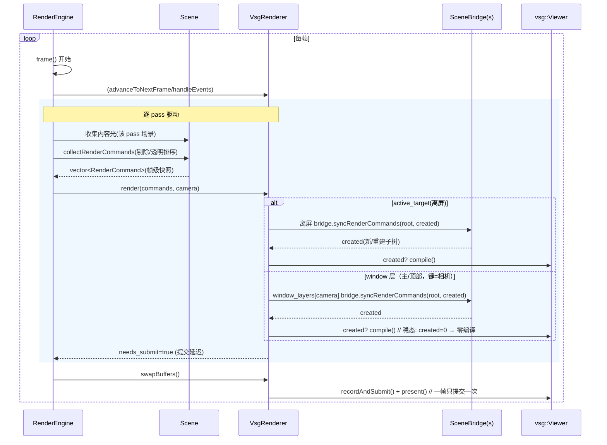

# Vine 数据 → vsg 数据的映射流程

> 模块：`src/plugins/gfx_backend_vsg`（vsg 后端）
> 2026-09-04 依据本机 vsg 1.1.16 源码 / `vsg_shader_dump` 反序列化 / 后端代码核对。
> 关联：`.ai/design/vsg-custom-shader.md`（自定义着色 ABI + §9 内建契约档案）、
> `.ai/memory/graphics.md`。
>
> 一句话：**Vine 侧存"开放 location 属性缓冲 + 材质"，后端把它物化成 vsg 的
> CPU Data 数组，按名字喂进 GraphicsPipelineConfigurator，挂 Bind*/Draw* 命令，
> 最后由 viewer->compile() 上传 GPU 并建管线**。中间两层各有一张"对应表"。

> ⚠️ **2026-09-08 复核（批次 A 之后）——本文部分段落已过期，以本注 + 代码为准**。
> 权威来源：`SceneBridge.cpp` / `VsgRenderer.cpp`（本次核对版本）；契约见
> `.ai/design/vsg-custom-attributes.md`（已实现）。已变更的要点：
> - loc0/loc1 已按 **AttributeBuffer.components 作 stride** 解包（3/4 分量取 xyz，
>   跳过 w），不再是写死 `i+=3`（下文 §6 坑① 已过期）。
> - **loc≥3 自定义通道已接线**：数据超集绑定 + `vine_Attribute{L}` 绑定名（§7
>   两步接线已落地）；loc2 语义 = 内建白 opacity carrier / custom 透传 authored
>   color（见 custom-attributes 设计）。
> - **索引流保真**：DrawIndexed count == 源索引数（仅越界拒绝）；法线推导仅 Triangles。
> - 缓存/编译：`getProgramShaderSet` 已按 (program, revision, layout) 双级缓存
>   （L1a stages + L1b ShaderSet），非早期"每 slot 编译一次"描述。

> ⚠️ **2026-09-08 更新（管线共享已实现并测试）**：`SceneBridge` 构造创建
> `shared_objects_`，`copyTo()` 的内容级去重生效 —— 同 (program×状态×槽位) 的几何共享
> 一条 pipeline；并新增 **L1 program ShaderSet 缓存**（`getProgramShaderSet`，glslang
> 每 (slot,program) 一次）与 **L2 变体模板缓存**（`variant_cache_`，跳过重复 configurator）。
> 本文件 §9.3 / §12.1 中 `shared_objects_` 共享 pipeline/DS 从此是**事实**（此前文档-代码
> 漂移：成员声明了却从未赋值）。权威设计见 `.ai/design/vsg-pipeline-sharing.md`；
> 测试见 `tests/test_vsg/SceneBridgePipelineSharingTest.cpp`。

## 0. 全景图

```mermaid
flowchart LR
    subgraph Vine[Vine SDK]
        G[Geometry<br/>map&lt;loc, AttributeBuffer&gt;<br/>loc0=position loc1=normal<br/>+ optional indices]
        M[Material<br/>Colorf 纯色(无透明度)]
        N[Node/Scene<br/>opacity]
        SC[Scene::collectRenderCommands<br/>→ RenderCommand{geometry, material,<br/>program, modelMatrix, opacity,<br/>resolvedRenderState}]
    end

    subgraph VSG[gfx_backend_vsg]
        SB[SceneBridge::syncRenderCommands<br/>按 Geometry* + revision 缓存/重建]
        BG[buildGeometry<br/>物化成 vec3Array / uintArray / vec4Array]
        CN[GraphicsPipelineConfigurator<br/>assignArray / assignDescriptor]
        SS[ShaderSet 契约表<br/>name→location/format/set/binding]
        DR[StateGroup<br/>BindVertexBuffers + BindIndexBuffer<br/>+ DrawIndexed + MatrixTransform]
        CP[viewer->compile<br/>Data→VkBuffer 上传 + 建管线/DS]
    end

    subgraph GPU[GPU / 每帧]
        RT[RecordTraversal<br/>填 pc + per-view 描述符]
    end

    G --> SC
    M --> SC
    N --> SC
    SC --> SB
    SB --> BG
    BG --> CN
    CN --> SS
    SS --> DR
    DR --> CP
    CP --> RT
```

## 1. Vine 侧数据模型

### 1.1 Geometry：开放的 location 属性缓冲

`src/viz/graphics/sdk/vine/graphics/Geometry.hpp`

```cpp
struct AttributeBuffer {
    std::shared_ptr<std::vector<float>> data;   // 打包的逐顶点 float
    std::uint32_t components;                   // 每顶点标量数 1..4
};
// Geometry 内部：std::map<uint32_t, AttributeBuffer> attributes_;
//           + 可选 std::shared_ptr<UInt32Array> indices_
```

- **纯按 location 号存储，没有"名字"**；"0 = position、1 = normal"是注释约定，
  靠便捷 API 固化：`setPositions→loc0`、`setNormals→loc1`、`geometryFromShape→loc0+loc1(+indices)`。
- 数据用 `shared_ptr` 持有，可多几何共享；后端可按键做上传缓存。
- 每次 `addBuffer/removeBuffer/setPositions/setNormals/setIndices` 都 bump `revision()`。

### 1.2 Material：纯颜色（无透明度）

- 材质颜色类型保留 `Colorf`（RGBA vec4），但**透明度不归材质**：透明只属
  scene/node/geometry 的 opacity，走 per-vertex alpha。
- 后端映射时强制 `diffuse.a = 1.0`（`VsgMaterialManager` / `SceneBridge` 每帧刷新）。

### 1.3 Scene 收集 → RenderCommand

- `Scene::collectRenderCommands` 折叠出**有效透明度**：`scene × 祖先 × 叶 geometry`
  的 opacity（材质项已移除），并按透明度排序；叶 Geometry 自身是 Node，
  其 opacity 在收集时就已折入。
- 每个可画几何产出 `RenderCommand{geometry, material, program, modelMatrix,
  opacity, isTransparent, resolvedRenderState}` —— 后端只消费命令流，不再直接看场景树。

## 2. SceneBridge：物化成 vsg CPU 数组

`SceneBridge::syncRenderCommands` 以 `Geometry*` 为键做保留缓存；只有
`geometry->revision() / material / resolvedRenderState / program` 变了才重建。
重建调 `buildGeometry(...)`：

1. **读 loc0** → 校验非空且 `components>=3`，否则整个几何不画（返回空）；
   按 **stride=3** 展开成 `Vec3fArray positions` → 拷成 `vsg::vec3Array vertices`。
2. **读 loc1（可选）** → 法线；缺失时后端用位置推导
   （indexed → `makeIndexedNormals` 平滑法线；非 indexed → `makeNormals` 面法线）。
3. **索引**：`hasIndices()` → 拷成 `vsg::uintArray`；否则生成顺序索引 0..n-1。
4. **按名字喂给 configurator**：

```cpp
config->assignArray(arrays, "vsg_Vertex", VERTEX, vertices);
config->assignArray(arrays, "vsg_Normal", VERTEX, normals);
config->assignArray(arrays, "vsg_Color",  VERTEX, colors);   // 默认路径白色 vec4
config->assignDescriptor("material", material_value);          // 默认路径
```

- **默认路径**（无 program）：`vsg_Vertex + vsg_Normal + vsg_Color` + `material` 描述符
  （内建 phong/flat）。
- **program 路径**（用户 `ShaderProgram`）：只喂 `vsg_Vertex` + 自建 ShaderSet
  （`pc` push constant），跳过法线/颜色/材质——着色完全归用户 GLSL。

### 2.1 每帧的廉价更新（不重建几何/管线）

- **世界摆放不进顶点**：`cmd.modelMatrix` 每帧写 `MatrixTransform::matrix`（矩阵没动就跳过）。
- **透明度 = `vsg_Color` 的 alpha（loc6）**：保留白色 `colors` 数组，仅当
  `cmd.opacity` 变化时整组 `color.a = opacity` 覆写（稳态帧无 O(V) 开销）。
- 消失的几何不立即删：脱离 root 保留复用，超过 600 帧未出现才逐出。

## 3. GPU 上传 / 管线编译

`syncRenderCommands` 把新建/重建子树收进 `created` 列表 → 渲染器随后：

```cpp
if (!created.empty())
    impl->viewer->compile();   // vsg：Data→VkBuffer 上传、建 pipeline / descriptor set
```

- 稳态帧：缓存命中 → 子树原样复用，不重建、不重编
  （诊断日志 `main sync: created=%zu rootChildren=%zu changed=%d`）。
- 绘制命令形态（挂在 StateGroup 下）：

```cpp
vsg::BindVertexBuffers(baseAttributeBinding, arrays)   // 一次绑定所有顶点属性
+ vsg::BindIndexBuffer(indices)
+ vsg::DrawIndexed(indexCount, 1, 0, 0, 0)
```

## 4. vsg 内建 ShaderSet 契约（数据最终落到哪）

flat/phong/pbr 共用同一张表（详见 `.ai/design/vsg-custom-shader.md` §9）。

### 4.1 顶点属性（attributeBindings）

| 名字 | loc | format | GLSL | define |
|---|---|---|---|---|
| `vsg_Vertex` | 0 | R32G32B32_SFLOAT | vec3 | 恒开 |
| `vsg_Normal` | 1 | R32G32B32_SFLOAT | vec3 | 恒开 |
| `vsg_TexCoord0..3` | 2..5 | R32G32_SFLOAT | vec2 | VSG_TEXTURECOORD_n |
| `vsg_Color` | 6 | R32G32B32A32_SFLOAT | vec4 | 恒开 |
| `vsg_Translation_scaleDistance` | 7 | … | vec4 | VSG_BILLBOARD |
| `vsg_Translation` | 7 | … | vec3 | VSG_INSTANCE_TRANSLATION |
| `vsg_Rotation` | 8 | … | vec4 | VSG_INSTANCE_ROTATION |
| `vsg_Scale` | 9 | … | vec3 | VSG_INSTANCE_SCALE |
| `vsg_JointIndices/Weights` | 10/11 | … | uvec4/vec4 | VSG_SKINNING |

### 4.2 描述符 + push constant

- set0（每 view 自动填）：`lightData` b0、`viewportData` b1、shadow b2..4
- set1（每 drawable）：贴图（define-gated）+ **`material` b10 uniform `PhongMaterialValue`** + …
- `pc`：全 stage、offset 0、size 128 = `{ mat4 projection; mat4 modelView; }`
  （RecordTraversal 每 drawable 自动填；program 路径的 `addPushConstantRange("pc",…,0,128)` 即复刻它）

### 4.3 机制：按名字查找 + define 变体

`GraphicsPipelineConfigurator::assignArray/assignDescriptor` 拿名字查 ShaderSet 的
`attributeBindings/descriptorBindings`，取 location/format/set/binding；非空 define
加进 shaderHints → ShaderSet 按 define 组合编译出对应**变体**。喂数据方零硬编码 location。

## 5. 默认三角形？画线怎么表达

- **默认 = 三角形**：SDK 侧 `ResolvedRenderState` 默认 `topology=Triangles`、
  `polygonMode=Fill`；vsg 侧 `InputAssemblyState` 默认 `TRIANGLE_LIST`。
  `Geometry` 顶点数据**本身不带拓扑**——由管线 `InputAssemblyState` 决定装配方式。
- **画"真线"（线段数据）** = `Topology::Lines` → `mapTopology→VK_PRIMITIVE_TOPOLOGY_LINE_LIST`
  （顶点每 2 个点一条线）。
- **画"线框"（还是三角形数据）** = `PolygonMode::Line` →
  `mapPolygonMode→VK_POLYGON_MODE_LINE`（demo `wire_box` 即此，仍可 phong 光照）。
- **点云** = `Topology::Points` → `POINT_LIST`（demo 里配自定义 program）。
- 线宽 `RasterizationState.lineWidth` 默认 1.0；>1 需 `wideLines` 设备特性（后端未开）。
- 线/点这类"无面"数据没有法线/光照语义 → 一般走 **program 路径**（自定义 GLSL）。

## 6. 对应规则与约束（含坑）

| 项 | 规则/约束 | 性质 |
|---|---|---|
| loc0 | 必须存在、非空、`components>=3`，否则不画 | **硬要求** |
| loc0 排布 | 后端按 stride=3 读；`positionCount/boundingBox` 都按 `size()/3` | 隐式（见坑①） |
| loc1 | 可选法线；`components>=3` 才用；否则走位置推导 | 可选 |
| 其它 loc | 当前不消费（无约束但也无效果），等自定义通道接线 | 自由但无效 |
| 各 buffer 顶点数 | 假定与 loc0 一致，不校验 | 隐式 |
| 索引 | `hasIndices()` 决定 indexed（平滑法线）/ 非 indexed（面法线） | 二选一 |
| 重建 | `Geometry*` + `revision()` + material + program 变化才重建 | 自动 |

**坑①**：`AttributeBuffer.components` 没被当 stride 用。后端读 loc0/loc1 一律
`i += 3`，`components` 只当 ">=3" 门槛。若 `addBuffer(0, {vec4 数据, components=4})`
会交错读错（v0.xyz 后接 v0.w+v1.xy…）。
**✅ 已于 2026-09-08 修复**：读端按 `components` 跳步（3/4 分量取 xyz 跳过 w）；
非 3/4 分量或不可整除 → 诊断并拒用（loc0 拒几何，可选 loc1 忽略后推导/默认）。
本条保留为演进记录。

**坑②**：`components<3` 的 loc1（如把 uv 错放到 loc1）会被静默忽略并走法线推导，
不报错——表现为"你的数据被无视"。

## 7. 第 4 个/自定义顶点通道：现状与待接线

- **内建默认 shader 只认固定名字/location**。想加第 4 通道：
  - 放 loc2..5（uv）：内建可读，但需激活变体 + 绑纹理；后端目前不喂 uv/纹理。
  - 放 loc6（顶点色）：内建会消费，但 `SceneBridge` 现在**无视用户 loc6**（永远写白+opacity）。
  - 放其它位置：内建未声明 → 一律不支持。
- **正确路径 = 自定义 program + 两步接线（✅ 已实现，2026-09-08）**：
  1. `assembleProgramShaderSet()` 按几何提供的 loc≥3 通道加
     `addAttributeBinding("vine_Attribute{N}", …)`（format 随 components）；
  2. `buildGeometryData()` 遍历 `geometry->bufferLocations()`，把 loc≥3 自定义通道
     物化后追加绑定；`buildStateGroup` 按 `vine_Attribute{N}` 逐个 `assignArray`。
  （早期"两步接线尚未做 / 现在只读 loc0/loc1"的描述已过时。）
- `AttributeBuffer` 的设计初衷正是"后端无关的自定义逐顶点通道"（点云色/尺寸/任意属性）。

## 8. 关键结论备忘

1. 对应 = **location 号映射 + 后端硬编码 loc0/loc1 语义** + vsg 侧按名字查 ShaderSet 表。
2. 顶点永远**模型空间原始数据**；世界变换走 `MatrixTransform::matrix`（每帧、懒写）。
3. 透明度不重建几何：走 `vsg_Color` per-vertex alpha，只在变化时覆写。
4. 材质是共享纯色：`Material*` 键缓存 PhongMaterialValue + `shared_objects_` 共享管线/DS。
5. 默认渲染"三角形"由管线默认拓扑决定，与数据无关；线/线框是 Topology vs PolygonMode 两个正交概念。

## 9. 对象生命周期与所有权

### 9.1 Vine 侧：全 RefCounted

- `Scene / Node / Geometry / Material / ShaderProgram / Light` 都是 `Object`（RefCounted），
  用 `intrusive_ptr` 持有。**场景树是权威持有者**：`Scene` 持根节点，`Group/StateNode`
  持子节点，`Geometry::setMaterial/setProgram` 持 `MaterialPtr/ShaderProgramPtr`。

### 9.2 命令流：帧级值对象，不延长生命

- `Scene::collectRenderCommands` **每帧生成** `std::vector<RenderCommand>`（值类型，
  内部持 `intrusive_ptr<Geometry/Material>` 与 `ShaderProgramPtr`）；帧末命令 vector
  析构即释放这些临时引用。后端消费的是这份**已快照的命令流**，不再回看场景树。

### 9.3 后端缓存：裸指针当 key，不引用 Vine 对象

| 缓存 | 键 | 值 | 谁持有 |
|---|---|---|---|
| `SceneBridge::cache_` | `const Geometry*`（裸指针） | `unique_ptr<Item>`（vsg 子树，vsg `ref_ptr` 自持） | bridge |
| `SceneBridge::program_shader_sets_` | `const ShaderProgram*`（L1） | `vsg::ref_ptr<ShaderSet>`（glslang 编译产物，失败=null） | bridge（`clearCache`） |
| `SceneBridge::variant_cache_` | (program, material, ResolvedRenderState) 内容哈希（L2） | `unique_ptr<VariantEntry>`（共享 state 命令+base_binding） | bridge（`clearCache`） |
| `VsgMaterialManager::cache` | `Material*`（裸指针） | `vsg::ref_ptr<PhongMaterialValue>` | manager |
| `shared_objects_` | —（内容级去重） | 共享 pipeline / layout / DS | bridge（`clearCache` + 析构） |

- **生命周期契约**：缓存键（`Geometry*`/`Material*`）的存活由**场景树 / 调用方保证**。
  后端不持有 Vine 对象的强引用，只在缓存键存活期间使用。
- 从场景删除的几何：命令流不再引用 → `absent_frames` 递增 → **600 帧后逐出**（释放
  vsg 子树）。逐出窗口内若调用方已把 `Geometry` 全释放，理论上 key 会悬垂
  （应用实际让场景树持有节点，见 §12 局限）。

### 9.4 材料管理器必须先于 bridge 存活

- `SceneBridge` 持 `raw_ptr<VsgMaterialManager>`，接口约定 **manager 必须活得比 bridge 久**。
- `VsgRenderer`（Impl 成员 `materialManager`）把它注入**每个 window 层 / 离屏 target 的 bridge**
  ——主/顶部/离屏共享同一材质缓存，不再各建一套；bridge 未注入时用自身成员 `default_manager_` 兜底。

## 10. 资源清理

### 10.1 清理的统一顺序（多处共用）

> ① **先从录制图摘下**（command/render graph 的 children 中 erase，保证不再被记录）
> → ② **`deviceWaitIdle()`**（等 in-flight 命令缓冲不再引用旧 Vk 对象）
> → ③ **丢 vsg 子树 / `clearCache()`**（释放 GPU 资源）→ ④ **erase 槽/映射**。

### 10.2 各清理点

| 场景 | 做了什么 | 代码位置 |
|---|---|---|
| 几何逐出 | `absent_frames > 600` → erase，释放该几何的 vsg 子树 | `syncRenderCommands` |
| Material 增删改 | `getOrCreate / updateMaterial / releaseMaterial / clear` | `VsgMaterialManager` |
| 离屏 resize | 摘 graph → `deviceWaitIdle` → `clearCache` + 置空 image/view/RP/framebuffer → 按新尺寸重建 | `renderOffscreenTarget` |
| 移除 RenderTarget | 摘 offscreen graph + 摘 PiP view → `deviceWaitIdle` → `clearCache` + erase | `releaseRenderTarget` |
| 移除窗口层 | 摘该层 View → `deviceWaitIdle` → erase 槽 | `releaseWindowLayer` |
| shutdown（析构/重初始化前） | 见 10.3 | `shutdown` |

### 10.3 shutdown 顺序（关键：撞 `VSG_MAX_DEVICES==1`）

```text
deviceWaitIdle
  → viewer 收尾（close/removeWindow）+ window->releaseWindow()  // 不 Destroy 宿主(Qt) 窗口
  → render_graph 置空
  → 逐 window_layers：释放 view/root/light_group/vsg_camera + 该层 bridge.clearCache()
  → window_layers.clear()
  → 置空 vsg_camera / vsg_scene / depth_on_shader_set / depth_off_shader_set
  → materialManager.clear()
  → initialized=false
```

- **原因（代码注释）**：已编译的 pipeline / descriptor set 持旧 `vsg::Device` 引用；
  表面重建再 `Window::create()` 会分配第二个 Device，撞 `VSG_MAX_DEVICES == 1` 抛异常。
  因此**重初始化前必须把上面全部释放干净**。

## 11. 每帧数据流（时序）



- 稳态帧成本：`syncRenderCommands` 内每个几何做**廉价脏检查**（revision / material /
  render_state / program / matrix 是否变、opacity 是否变），命中缓存则只更新
  `MatrixTransform::matrix` 或 `colors[].a`，**不重建、不重编**。
- 引擎无 pass 时也有便捷 `frame()`（begin→end→render({},camera)→swapBuffers）。

## 12. 支持 / 不支持矩阵

### 12.1 支持（已端到端 / 已测试）

| 面 | 能力 |
|---|---|
| 图元 | 三角形（默认 `TRIANGLE_LIST`）、`Topology::Points`（点云 demo）、`Topology::Lines`→`LINE_LIST`（映射 + 测试断言）、索引/非索引、法线推导（平滑/面） |
| 状态 | 深度 test/write/compare（reverse-Z 反转）、`CullMode` None/Front/Back、`PolygonMode` Fill/Line/Point、混合**恒开** + `StateNode` 选因子、每几何独立拓扑 |
| 材质 | diffuse/specular/ambient/shininess → `PhongMaterialValue`；默认灰；`Material*` 共享缓存；每帧就地刷新（编辑即时生效） |
| 透明 | scene×node×叶 geometry opacity → `vsg_Color` per-vertex alpha（不重建） |
| 程序 | `Geometry::setProgram` / `StateNode::setProgram`：glslang 运行期编译 + 自建 ShaderSet(`pc`)；失败回退内建 |
| 光照 | Scene 级 `Ambient/Directional` → 每 view 光组；默认 headlight；运行时换灯 |
| 场景 | `MatrixTransform` 嵌套 + worldMatrix、Node visible/opacity、Vine 侧剔除（另有 no-cull 变体） |
| 多 pass | 离屏 color±depth / depth-only（shadow RT 基础）、PiP screen pass、overlay、动态 sub-viewport |
| 复用 | `shared_objects_` 内容级共享 pipeline/DS、**L1 program 缓存**、**L2 变体模板缓存**（跳过重复 configurator）、逐几何保留缓存、逐帧懒更新 |

### 12.2 不支持 / 待办（现状）

| 面 | 限制 |
|---|---|
| 纹理/uv | `Material::texture_file_`、`diffuseMap`、`vsg_TexCoord0..3` 均**未接线** |
| 用户自定义通道 | loc≥2 的数据后端不消费；program 路径也不喂（需 §7 两步接线） |
| 顶点色 | 用户 loc6 会被 `SceneBridge` 白色覆盖（只认自己生成的 colors + opacity） |
| 线/点 | 无 `LINE_STRIP`；`lineWidth>1` 需 `wideLines` 特性（未开）；无法调线宽/点大小 |
| 阴影 | 深度 RT 通道已有；**shadowed Phong 采样（v4b-2）未完成** |
| preset | `Pbr / ShadowedPhong` 预留无实现（仅 StandardPhong/FlatShaded 映射内建） |
| instancing | vsg loc7-11（billboard/instance/skinning）槽未向 Vine 暴露 |
| 固定项 | `frontFace` 固定 CCW、MRT/自定义 blend op/独立 mask 未做 |
| 生命周期局限 | 缓存以裸指针为键，依赖场景树保活；几何删除后最多滞留 600 帧才释放 |

## 13. 已知缺陷清单（2026-09-04 登记）

> 内存结论：所有权两侧均引用计数、**无环**（`Node::parent_` 是非拥有 `raw_ptr`；
> ShaderProgram/Material 只被单向持有；命令流帧级释放；vsg 编译产物随节点释放），
> **真泄漏风险低**。主要风险 = **只增不减的留存** + 若干**行为缺陷**。
> 状态：已登记，未修。按类别编号便于后续逐条销号。

### 13.1 顶点数据层

| ID | 缺陷 | 位置 | 严重度 |
|---|---|---|---|
| D1 | `components` 未当 stride：loc0/loc1 读取写死 `i+=3`，vec4/非 3 分量通道会交错读错 | `SceneBridge::buildGeometry`、`Geometry` localBounds/positionCount | 🔴 数据错位不报错。**已修（2026-08 后端 `unpackXyz`；2026-09-11 CPU 侧 `Geometry`/`RayIntersection`，设计 §6）** |
| D2 | loc1 `components<3` 被静默忽略（如 uv 错放 loc1）→ 数据被无视、走法线推导 | `buildGeometry` | 🟡 |
| D3 | 用户 loc6 顶点色被 SceneBridge 白色+opacity 覆盖 → 顶点色无效 | `buildGeometry`(默认路径) | 🔴 用户可感知 |
| D4 | 各 buffer 顶点数不校验（假定全等 loc0），不一致时错位/越界读 | `buildGeometry` | 🟡 |

### 13.2 渲染管线 / 状态层

| ID | 缺陷 | 位置 | 严重度 |
|---|---|---|---|
| D5 | 混合恒开：`blend.enabled=false` 不关混合（仅回默认因子）；不透明 draw 也带 blend | `RenderStateMapper::makeRenderStateObjects` | 🟢 设计使然 |
| D6 | `frontFace` 固定 CCW + cull 默认 None："两种绕序兼容"只在 cull=None 成立；开 cull 后绕序错即消隐 | `RenderStateMapper` | 🟡 |
| D7 | 非三角形拓扑 + 内建默认 shader 语义错位：线/点仍推法线走 phong；退化数据可能出 NaN/垃圾法线 | `buildGeometry` | 🟡 |
| D8 | program 路径不注入 per-vertex opacity（`out_colors=null`）→ program 下 `setOpacity` 无效（pc 亦无 opacity） | `buildGeometry`(program 分支) | 🟡 |

### 13.3 program / shader 层

| ID | 缺陷 | 位置 | 严重度 |
|---|---|---|---|
| D9 | program 编译失败**静默回退内建**，无用户可见诊断（坏 shader 表现为"还是默认灰"）。**已修（2026-09-11，设计 §10）**：回退与装配失败经诊断通道上报（`ShaderFallback`，按 program revision 一次），appfw 写入 `vine/logging` | `getProgramShaderSet` / 诊断通道 | 🟢 |
| D10 | `ShaderProgram` **无 revision/变更通知**，重建键是指针不是内容 → 同一对象改 GLSL 不重编译/不重试（改 shader 没反应） | `ShaderProgram.hpp` + `SceneBridge::Item` | 🔴 |
| D11 | 内建 phong 是序列化 blob；`ShaderStage` 反序列化后不留 source → 默认 GLSL 不可改/难诊断 | vsg blob | 🟢 |
| D12 | 运行期 glslang 仅在 fetch-vsg 路径可用；`VINE_USE_FETCHCONTENT=OFF`（旧 /opt/opensrc/VSG 无 ShaderCompiler）→ program 功能整体失效且静默回退 | 构建 | 🟡 |

### 13.4 生命周期 / GPU 资源层

| ID | 缺陷 | 位置 | 严重度 |
|---|---|---|---|
| D13 | `VsgMaterialManager::cache` **无逐出**、且按裸指针索引不自持（同地址新材质复用旧 Phong 值/descriptor）。**已修（2026-09-11，设计 §12）**：条目自持 `Material`（地址不可复用）+ `releaseAbandoned()`（app 放弃即立即回收，渲染器每帧调）+ `kMaxEntries` FIFO 上限 + null 键默认条目不动 | `VsgMaterialManager` | 🟢 |
| D14 | 裸指针缓存键 + 600 帧滞留窗：Geometry/Material 删除后、逐出前有悬垂窗口（安全依赖场景树保活）。**Geometry 部分已修（2026-09-11，设计 §8.1）**：`Item` 自持所索引的几何 → 不再有悬垂窗口；**Material 部分仍见 D13** | `SceneBridge::cache_` | 🟡 |
| D15 | `SceneBridge::cache_` 删除几何 600 帧后才释放（延迟释放）。**已改（2026-09-11，§8.1）**：仅剩缓存持有时（`useCount()==1`，app 已放弃）**立即驱逐**；仍被引用（隐藏/剔除/临时离场）才走 600 帧复用窗 | `syncRenderCommands` | 🟢 |
| D16 | 共享/变体缓存只增不减（随"历史见过的不同变体数"增长）；2026-09-08 起 `clearCache()`（槽 teardown/resize/release）同时清 `shared_objects_`/`program_shader_sets_`/`variant_cache_`，**槽内活跃期间仍不修剪**。**已修（2026-09-11，设计 §20）**：三个 program 缓存迁到既有缓存骨架（`OwnedCache.hpp`）——容量用同一套 FIFO `trimToCapacity`（64 / 64 / 256），插入时修剪；"超限整表清空"删除（它会把当前场景正在绘制的程序一并丢掉）；每帧 `releaseAbandonedCaches()` 回收链条尾部的条目 | `SceneBridge` | 🟢 |
| D17 | shutdown 顺序错 → 撞 `VSG_MAX_DEVICES==1`；`releaseWindow()` 漏调会 Destroy Qt 宿主窗口 | `VsgRenderer::shutdown` | 🟡 |
| D18 | resize / release / 离屏 resize 走 `deviceWaitIdle` 全停（简单但会整帧卡顿） | `VsgRenderer` | 🟢 |
| D29 | pass 协议隐式：7 个 `pending_*` 字段 + 三个读取入口，"调用含义"依赖调用顺序（本会话 6 个缺陷的来源）。**已修（2026-09-11，设计 §11）**：收敛为单一 `PassRequest` + 显式作用域（作用域属性 vs 每次绘制属性），违反协议（嵌套 beginPass / 不配对 endPass）经诊断通道上报（`PassProtocolViolation`） | `VsgRenderer` | 🟢 |
| D19 | 每帧 O(materials) 就地改写 + `updateMaterial` 双路径并存。**已修（2026-09-11，设计 §12）**：比较/写入移入缓存（`Entry` 记上次参数），`SceneBridge` 只调 `updateMaterial()` —— 单一路径，且该接口首次有真实调用点 | `syncRenderCommands` 尾部 / `VsgMaterialManager` | 🟢 |
| D34 | **身份靠地址、但不持地址**：`Item::material` / `Item::program` 是裸指针，`program_shader_sets_` / `variant_cache_` 的哈希键条目也只存裸键。对象被 app 释放后销毁，同地址新对象（同 revision / 同变量身份）会**通过相等性检查** → 复用死对象的管线、descriptor、Phong 值（静默错色/错 shader）。**已修（2026-09-11，设计 §20）**：`Item` 自持它比较的 program/material；两个哈希键缓存分别用 `OwnedCacheEntry` / `OwnedPairCacheEntry` 自持键对象（variant 同时持 program 与 material）→ 地址在条目存活期内不可能被复用 | `SceneBridge::Item` / `program_shader_sets_` / `variant_cache_` | 🟢 |
| D35 | **同一目标上两个 pass 的深度策略互吞**：`clearDepth` 是**目标**属性，目标只烧一个 depth load-op，于是"最后一次 clear 请求赢" —— 不透明 pass（每帧 `clearDepth=true`）+ 半透明 pass（`clearDepth=false`）的标准多 pass 写法里，第二个请求会**吞掉**第一个 pass 的每帧清深度，上一帧深度留在缓冲 → 移开的物体继续遮挡（ghosting），静默错画。**已修（2026-09-11，设计 §22）**：`clearDepth` 同时是 pass 作用域属性；同目标出现不同请求 → `depth_policy_mixed`（sticky）→ 目标改用 LOAD pass，请求了 clear 的 pass 在自己的 view 里插 `ClearAttachments`（值同 render pass）。**残留**：冲突在第二个请求到达时才发现，首帧仍按旧策略（1 帧收敛） | `VsgRenderer::clear` / `Target` / `ContentSlot` | 🟢 |

### 13.5 构建 / 环境 / 验证层

| ID | 缺陷 | 位置 | 严重度 |
|---|---|---|---|
| D20 | 验证原先只有“无 VUID”，**没有任何像素断言**。**已补（2026-09-11，设计 §15）**：`VsgRenderer::readColorBuffer` 落地（RGBA8，离屏，blit 到线性图 + 映射回读；float 附件诚实报不支持），selftest 新增像素阶段（中心像素=被光照的红四边形、角像素=清屏色、float 附件返回 false），harness 把 `[selftest] FAIL` 当硬失败并打印实际使用的设备。**已铺开（设计 §17）**：PiP blit（子矩形内外 + 面积精确）、deferred 全屏程序（整张填满）、深度顺序（开测试时蓝色像素 0 个）、深度模式权威（Disabled 时中心变蓝）、MRT 附件 0；harness 打印证据并分别要求像素 ≥4 / 深度 ≥1 / MRT ≥2 行。**深度回读**（`readDepthBuffer`，D32/D16，打包 D24 诚实报不支持）已落地并直接断言深度值（near 0.0249 > far 0.0166 > 清屏 0）。**深度 LOAD 与共享深度的语义也已断言（设计 §21）**：`clearDepth=false` 目标必须把上一帧深度 LOAD 出来（远面必须输 + 深度不变 + 只构建 1 次）、借用者的远面必须被出借方的深度拒绝且更近面必须赢；harness 追加 `depth load:` ≥1 / `shared depth pixels:` ≥1。**仍需**：真机 GPU 冒烟（本机只有 llvmpipe/lavapipe，无 GPU 驱动） | 验证 | 🟡 |
| D32 | **离屏目标表 `std::map<RenderTarget*, Target>` 的条目不自持键对象** —— 宿主销毁目标后条目仍在，同地址的新目标会**继承死目标的附件**（尺寸/颜色格式/深度格式）。断言第一次跑就撞上（第二个 D32 目标读回打包 D24）。**已修（2026-09-11，设计 §18）**：`Target::owner` 自持 + `Impl::entryFor()` 首次触碰即自持（地址不可复用）+ `submitFrame()` 回收 `useCount()<=1` 的废弃目标 | `VsgRendererImpl.hpp` / `VsgRenderer.cpp` | 🟢 |
| D33 | **深度图缺 `VK_IMAGE_USAGE_TRANSFER_SRC_BIT`** —— 深度回读无法把图转到 `TRANSFER_SRC_OPTIMAL`，报 `VUID-vkCmdCopyImageToBuffer-srcImage-00186` / `VUID-VkImageMemoryBarrier-oldLayout-01212`。**已修（设计 §18）**：usage 加 `TRANSFER_SRC`（颜色图早有，深度图漏了） | `VsgRendererTargets` 离屏构建 | 🟢 |
| D31 | MRT 附件 ≥1 一律清成透明黑（附件 0 才拿 pass 的 `clear()` 颜色）。**已决策（2026-09-11，设计 §17）：保留行为并写成契约** —— 依据是消费者代码：`RenderPipelineBuilder::defaultDeferredLightProgram` 用 `dot(pos,pos) < 1e-6` 判定背景（"stored position ~0 where nothing was drawn"），改成统一清屏会让背景走光照分支、输出直接错。规则写进 `RenderBackend::clear()`；selftest 的 MRT 探针升级为断言（附件 0 收到几何 + 附件 ≥1 未覆盖角落必须 (0,0,0,0)） | `RenderBackend::clear` / `VsgRendererTargets` / selftest | 🟢 |
| D30 | **静态：用户程序把顶点写到裁剪空间 z = 0 时该绘制对象完全不可见且零诊断** —— 后端是反 Z（近 1 远 0、清 0、`COMPARE_OP_GREATER`），z = 0 即远平面，与清屏深度相等，严格 greater 测试拒绝全部片元。非反 Z 直觉（z = 0 = 近平面）在此正好相反。**已缓解（2026-09-11，设计 §16）**：契约补上深度约定；像素阶段用 z = 0.5 的用户程序断言该路径确实光栅化；变体探针常驻（`covered=0` vs `covered=5916`）；`assignArray` 返回 false 且着色器声明过该绑定时上报，管线构建失败不再静默 | `SceneBridge` 程序路径 | 🟢 |
| D21 | 离屏 multipass 未在最新 showcase 下复验；`VINE_VSG_OWN_WINDOW` 独立窗口 vs Qt 子窗口 compositing 主路径仍"待定" | `VsgRenderer` | 🟡 |
| D22 | 运行期新增几何触发**全图 compile()**（非增量；启动预编译已规避，运行期历史不可靠） | `VsgRenderer::render` | 🟡 |
| D23 | 无关基线噪声：`test_vsg` ctest SegFault（进程退出预存问题，直跑 10/10）、`test_cppstd/runtime/system` 失败；清 `_deps` 重建需联网（FETCHCONTENT） | 测试/构建 | 🟢 |

### 13.6 历史 / 库层小坑（扩展时注意）

| ID | 缺陷 | 位置 | 严重度 |
|---|---|---|---|
| D24 | `intrusive_ptr` 成员析构需**完整类型**：头文件放成员就得 include 对应头 | 头文件纪律 | 🟢 |
| D25 | `Mat4d()` 默认即单位阵（无 `::identity()`）；`Mat4d×Point3d` 需 include `Transform3.hpp` | SDK 使用 | 🟢 |
| D26 | 阴影：深度 RT 有、shadowed Phong 采样（v4b-2）未完成；Pbr/ShadowedPhong preset 仅预留 | 路线 | 🟢 |

### 13.7 优先处置建议（🔴）

1. **D10**：给 `ShaderProgram` 加 revision/变更通知，纳入 `Item` 重建键 → "改 shader 不生效"。
2. **D9**：program 编译失败向前端/日志报错，去掉纯静默回退。
3. **D3**：`SceneBridge` 尊重用户 loc6 顶点色（色 × opacity 合成）。
4. ~~**D13**~~：已修（设计 §12）—— 条目自持材质 + `releaseAbandoned()` 每帧回收 + FIFO 容量上限。
5. **D1**：读端按 `components` 跳步，兑现数据模型承诺。


### 13.8 性能 / 启动层（2026-09-11 补充登记，设计见 `.ai/design/vsg-pass-lifecycle.md` §9）

| ID | 缺陷 | 位置 | 严重度 |
|---|---|---|---|
| D27 | **跨 pass 命令列表重复计算**：`Scene::collectRenderCommands` 每 pass 每帧全树遍历 + 剔除 + 排序，多 pass 共用同一 `(scene, camera)` 时算 3~5 次。**已修（2026-09-11，设计 graphics-render-pipeline §12）**：帧内容 memo（键 = `(projection*view, eye, 场景内容版本)`，**不是相机地址**：同视图的另一相机共享、相机就地编辑 miss、堆栈相机安全）；`RenderEngine::frame` 用 `Scene::setContentFrame(token)` 开启（幂等；token==0 时**完全不缓存** → 自己调用的调用方零行为变更）；失效 = 帧边界 + 场景自身变更（同值 setter 不失效）+ `invalidateContent()`；交给调用方的是**副本**（pass 的 program override 不泄漏）。实测（debug、2000 节点、20 次均值）：遍历 17.1 ms vs 复用 0.10 ms → **170×**。残留：**同一帧两个 pass 之间**直接改节点要下一帧生效。可观测：`Scene::contentCollectCount()` / `contentCollectReuseCount()` | `RenderEngine::frame` / `Scene` | 🟢 |
| D28 | **无 VkPipelineCache 持久化**：vsg `GraphicsPipeline::compile` 传 `VK_NULL_HANDLE` → Vine 无法注入管线缓存，每次启动重建全部 PSO（glslang/ShaderSet/变体模板均只进程内缓存）。路线 A（等上游暴露注入点）/ C（若 Options/Device 可挂）/ B（自建管线，不推荐）；`pipelineCacheUUID` 不匹配必须安全丢弃。见设计文档 §9.3 | vsg / `VsgRenderer` | 🟢 启动性能 |
