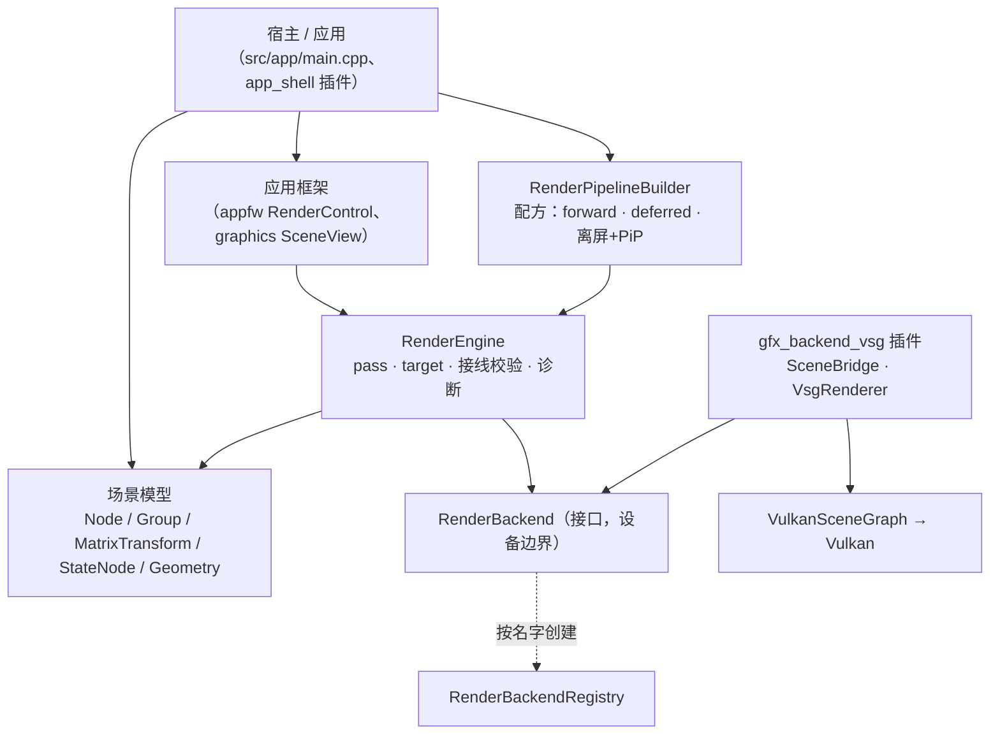

# Vine graphics 模块：架构与使用

graphics 模块是 Vine 的**场景图 + 渲染资源 + 渲染引擎**。它自己**不碰 GPU**：它驱动一个
`RenderBackend`，具体后端是插件（今天即 `src/plugins/gfx_backend_vsg`，后端名 `"vsg"`，经
VulkanSceneGraph 落到 Vulkan）。

- 公开头：`src/viz/graphics/sdk/vine/graphics/`（target `vi::Graphics`）
- 实现：`src/viz/graphics/src/`
- 后端插件与它自己的说明：`src/plugins/gfx_backend_vsg/`

本文写的是**今天的实际行为**；凡属占位（还没实现）的地方都已明确标注。

## 1. 分层



`RenderEngine` 从不直接调用 Vulkan：它驱动 `RenderPass`、解析各 pass 的目标、逐 pass 调用后端。
后端**按名字**创建，因此宿主对后端及其第三方库没有编译期依赖：

```cpp
auto backend = vine::graphics::RenderBackendRegistry::instance().create(u8"vsg");  // 需插件已加载
engine.setBackend(backend);
```

## 2. 场景模型

### 2.1 节点

| 类 | 职责 | 要点 |
| --- | --- | --- |
| `Node` | 所有节点共有的身份：`name()`、`isVisible()`、`opacity()`、`parent()` | `boundingBox()`（世界空间）、`worldMatrix()`、`localTransformMatrix()`（非变换节点恒为单位阵） |
| `Group` | 聚合子节点 | `addChild()` / `removeChild()` 会维护 parent 链 |
| `MatrixTransform` | `Group` + **场景图里唯一持有变换的地方**（`matrix()` / `setMatrix()`） | 嵌套变换沿 root→leaf 相乘 |
| `StateNode` | 给子树施加渲染状态，并可覆盖 material / program | 越深的节点优先 |
| `Geometry` | 叶子：**借用**的属性缓冲 + 可选索引 | `setPositions/setNormals/setTexcoords/setIndices`、`addBuffer` 加自定义通道、`setRevision()` |
| `Scene` | 根 + 灯光 + 每帧命令收集 | `setRoot()`、`addLight()`、`collectRenderCommands(camera)` |

### 2.2 属性沿树折叠的规则

一次遍历（`Scene.cpp` 的 `collectNodeCommands`）把场景图压平成 `RenderCommand` 列表，各属性沿路径
折叠。规则**故意各不相同**：

| 属性 | 规则 |
| --- | --- |
| 变换 | **相乘**；折好的结果烘焙进 `RenderCommand::modelMatrix` |
| `opacity` | **相乘**：scene × 各层祖先 × 自身，在叶子处夹取到 `[0, 1]` |
| 渲染状态（blend / depth / cull / topology） | **最深者覆盖** |
| material / program | 叶子自己的优先，否则取最近的祖先 `StateNode` |
| `isVisible` | **硬门**：不可见子树整棵不收集 |

`cmd.isTransparent` 由有效 opacity 推出，它决定这个 drawable 走管线的透明部分。

### 2.3 资源

- `Material` —— Phong 参数（`ambient/diffuse/specular/shininess`）+ 可选 `Texture`。颜色改动是
  **动态**的：后端逐帧就地刷新，所以改材质不需要任何重建。
- `ShaderProgram` —— 一个或多个 stage，带 `revision()`，所以"同一个对象、改了源码"能被发现。
- `Texture` —— 2D / Cube，按面填充（`setImage()` / `setFaceImage()` / `setSource()`）。每次填充都会
  `revision()++`，后端据此区分"同一张纹理、新像素"与"同一张纹理、同样像素"（只看指针做不到）。
- `Light` —— ambient / directional，带 `castShadow()` 与 `ShadowSettings{resolution, bias, filter}`
  （阴影渲染的现状见 §4.3）。
- `ImageRef` —— **一张图的身份**（某个 target 的某个附件，颜色或深度），pass 接线的对象形式，见 §3.7。

### 2.4 渲染对象

- `RenderEngine` —— 帧泵 + 账本：`initialize()`、`addPass(pass, content, order)`、`frame(dt)`、
  `resize(w, h)`、`publish/resolve`（命名输出）、`validateWiring()`（结构性校验，走诊断通道）、
  `shutdown()`。
- `RenderPass` —— 相机 + 渲染目标 + 渲染状态 + 清屏/深度策略。**没有 renderTarget 的 pass 画进窗口**，
  order 决定先后。
- `ScreenPass` —— `RenderPass` 子类，全屏 / 画中画：
  - **没有 program** ⇒ 纯拷贝：采样解析出来的源 target 的第 `sourceAttachment()`（默认 0）张彩色图；
  - **有 program** ⇒ 后处理 / 延迟光照：把源的**每一张**彩色附件按 binding 0..N-1 绑成采样纹理，用该
    fragment program 画一个全屏三角形。**这条路径必须有相机**（否则什么都不画，引擎在接线期报一次）。
- `RenderTarget` —— 若干彩色附件 + 可选深度：`attachColor(fmt)` / `attachDepth(fmt)` / `setSize(w,h)`，
  以及 `shareDepth(source)`（借用别人的深度）与 `setDepthPromotion(bool)`（深度是否变成可采样）。
- `RenderPipelineBuilder` —— 配方层：`build(PipelinePreset::Forward | Deferred | …)`、
  `addOffscreenToScreen(...)`（离屏 + PiP），并暴露延迟所需的公有件（`defaultGbufferTarget()`、
  `defaultGbufferGeometryProgram()`、`defaultDeferredLightProgram()`）。它装配出来的就是**你手写也会写的
  那些对象**，返回值 `Pipeline` 句柄持有它们（`windowPass()`、`offscreenTarget()`、`resize(w,h)`）。
- `RenderBackend` —— 设备边界（窗口层、逐 pass `render()`、回读、诊断）。`RenderBackendRegistry` /
  `RenderBackendFactory` 让插件自注册、宿主按名字创建。

### 2.5 每帧数据流

1. 宿主调 `RenderEngine::frame(dt)`。
2. 逐 pass：引擎打开内容帧，向场景要命令 —— `Scene::collectRenderCommands(camera)` 对
   **(scene, camera)** 每帧只走一次树，结果记忆到帧末（规则见 §2.2）。
3. 后端把每个 `RenderCommand` 物化成后端对象。在 vsg 后端里就是每个 drawable 一条保留的
   `MatrixTransform` → `StateGroup` → bind/draw 命令链，只在其输入（`geometry->revision()`、
   material、texture、resolved state、program）变化时重建。
4. 顶点数据是**别名，不是拷贝**：真的 `vsg::vec3Array` 等直接读 geometry 自己的 buffer，于是模型与
   渲染侧每个通道只占一份分配（位置 / 法线 / UV / 作者颜色 / 自定义通道 / 索引都是）。完整来龙去脉
   （包括让这件事成立的 vsg 约束和踩过的坑）见
   [`src/plugins/gfx_backend_vsg/docs/data-flow.md`](../../../plugins/gfx_backend_vsg/docs/data-flow.md)，
   后端的运行时总览（生命周期 / 调用次数 / 更新策略）见
   [`src/plugins/gfx_backend_vsg/docs/backend.md`](../../../plugins/gfx_backend_vsg/docs/backend.md)。

### 2.6 生命周期与变更契约

- Vine 对象全部引用计数（`intrusive_ptr`）：节点由父节点持有，target 由渲染它的 pass 持有，buffer 由
  geometry 持有。
- `RenderCommand` 是**每帧的值**：它借用 geometry、material、program、camera。后端想留什么，就自己
  取一份引用（见 `RenderBackend.hpp` 的 "WHAT MAY BE RETAINED"）。
- geometry **借用**别人交给它的顶点字节（mesh 把自己的 buffer 交过来），所以：**先建模型、再接线**，
  之后每次改数据都要用 `Geometry::setRevision()` 公告。revision 是渲染侧唯一的重建闸门 ——
  **写 setter 不会推进它**，因为 geometry 分不出"还没读过的新字节"和"上次读过的旧字节"。

## 3. 使用

### 3.1 最小可跑：一个三角形 + forward

```cpp
using namespace vine::graphics;

// ① 模型：一个三角形。packAttribute 把 Vec3f 打成 Buffer<float>，geometry 借它（不拷贝）。
vine::geometry::Vec3fArray positions = {
    vine::math::Vec3f(0.0f, 0.0f, 0.0f),
    vine::math::Vec3f(1.0f, 0.0f, 0.0f),
    vine::math::Vec3f(0.0f, 1.0f, 0.0f),
};
GeometryPtr geometry(new Geometry());
geometry->setPositions(packAttribute(positions));

MaterialPtr material(new Material());
material->setDiffuse(vine::Colorf(0.8f, 0.4f, 0.2f, 1.0f));

// ② 场景图：transform → state → geometry（三层是惯例：位置 / 状态 / 叶子）。
auto state = StateNodePtr(new StateNode());
state->setMaterial(material);
state->addChild(geometry);

auto transform = MatrixTransformPtr(new MatrixTransform());
transform->setMatrix(Mat4d());          // 默认构造 = 单位阵
transform->addChild(state);

auto scene(new Scene());
scene->setRoot(transform);
scene->addLight(Light::createAmbient());                   // 环境光
scene->addLight(Light::createDirectional({ 0.0, 0.0, -1.0 }));  // 一盏方向光

// ③ 相机。
CameraPtr camera(new Camera());
camera->setViewMatrixAsLookAt({ 0.0, 0.0, 3.0 }, { 0.0, 0.0, 0.0 }, { 0.0, 1.0, 0.0 });
camera->setProjectionMatrixAsPerspective(45.0, 16.0 / 9.0, 0.1, 100.0);

// ④ 引擎 + 后端 + 预设管线。
RenderEngine engine;
engine.setBackend(RenderBackendRegistry::instance().create(u8"vsg"));  // 需插件已加载
engine.setWindowHandle(window_handle);                                // 宿主窗口的原生句柄
if (!engine.initialize()) { return false; }

RenderPipelineBuilder builder(&engine);
builder.setContent(scene).setCamera(camera.get());
auto pipeline = builder.build(PipelinePreset::Forward);   // 或 Deferred
if (pipeline == nullptr) { return false; }

// ⑤ 帧循环。
pipeline->resize(width, height);   // 转发给离屏/合成 target，并通知 HUD 叠加
engine.frame(dt);                  // 收集 → 录制 → 提交 → present

engine.shutdown();
```

### 3.2 改数据（唯一需要公告的地方）

```cpp
geometry->setPositions(packAttribute(new_positions));   // 换掉 geometry 读的那块 buffer
geometry->setRevision(geometry->revision() + 1);        // 公告：重建数据节点 + 重新上传
```

首次渲染不受影响（那是从零建）。材质颜色**不需要**公告（动态）；重新填过的 `Texture` 自己会通过
`Texture::revision()` 公告。

### 3.3 例：纯手动 2 pass —— 离屏渲染 + 全屏合成到窗口

不写任何 shader：`ScreenPass` 不带 program 就是"把一张彩色图拷到目标子视口"。

```cpp
// ① 离屏目标：一张 RGBA8 彩色 + D24 深度。
auto scene_rt = make_intrusive<RenderTarget>();
scene_rt->setName(u8"scene_rt");
scene_rt->attachColor(RenderTarget::ColorFormat::RGBA8);
scene_rt->attachDepth(RenderTarget::DepthFormat::D24);
scene_rt->setSize(surface_w, surface_h);

// ② 场景 pass：画进 scene_rt。order < 0 ⇒ 先于主 pass 执行。
auto scene_pass = make_intrusive<RenderPass>();
scene_pass->setName(u8"scene_into_rt");
scene_pass->setCamera(camera.get());
scene_pass->setRenderTarget(scene_rt);
scene_pass->setClearEnabled(true);                     // 自己是第一笔，清屏
scene_pass->setClearColor(vine::Color(26, 26, 31));    // vine::Color 是 0..255 的 uint8 构造
scene_pass->setShouldClearDepth(true);
scene_pass->setDepthMode(DepthMode::TestAndWrite);     // 不透明内容：测 + 写
scene_pass->setOutputName(u8"SceneColor");             // 命名输出（每帧进名字表）
scene_pass->setOutputTarget(scene_rt);                 // 对象级承诺：它是这张 target 的唯一写者
engine.addPass(scene_pass, scene, -1);                 // -1 < 0：排在主 pass 之前

// ③ 合成 pass：作为**窗口 pass**（没有 renderTarget ⇒ 画进窗口），order 0。
auto compose = make_intrusive<ScreenPass>();
compose->setName(u8"compose_to_window");
compose->setCamera(camera.get());                      // 窗口 pass 的相机决定窗口视角
compose->addInputName(u8"SceneColor");                 // 名字形式
compose->addInputTarget(scene_rt);                     // 对象形式（两层在地址上汇合）
compose->setSourceAttachment(0);                       // 采第 0 张彩色图
engine.addPass(compose, scene, 0);
```

想把它变成**右下角画中画**（而不是全屏），给合成 pass 一个子视口即可：

```cpp
compose->setViewport(surface_w - 320 - 8, 8, 320, 180);
```

| pass | 相机 | renderTarget | order | 清屏 | 深度 | 输出/输入 |
| --- | --- | --- | --- | --- | --- | --- |
| `scene_into_rt` | `camera` | `scene_rt` | -1 | 是（清色+深） | `TestAndWrite` | 输出 `SceneColor` + 承诺 `scene_rt` |
| `compose_to_window` | `camera` | 无（= 窗口） | 0 | 否（默认） | 默认（只清/画覆盖层） | 输入 `SceneColor` / `scene_rt` |

### 3.4 例：纯手动 4 pass —— 手搭一条延迟管线

这条管线用的三件"公有件"正是 `RenderPipelineBuilder::build(Deferred)` 内部用的东西，所以手搭出来
与预设**完全等价**：它演示了手写延迟管线的三个要点 —— **MRT target**、**带 program 的 ScreenPass**、
以及**借用深度**。

```cpp
// ① 规范 G-buffer：告警里说的 4 张彩色附件（albedo / view normal+shininess / specular / view position）
//    + D24 深度。几何 program 必须写这 4 个输出。
auto gbuffer = RenderPipelineBuilder::defaultGbufferTarget(width, height);

// ② G-buffer pass（order < 0）：一个场景遍历写 MRT。
auto gbuffer_program = RenderPipelineBuilder::defaultGbufferGeometryProgram();
auto gbuf_pass = make_intrusive<RenderPass>();
gbuf_pass->setName(u8"gbuffer");
gbuf_pass->setCamera(camera.get());
gbuf_pass->setRenderTarget(gbuffer);
gbuf_pass->setProgramOverride(gbuffer_program);   // 场景 pass 也可以带自己的 program
gbuf_pass->setOutputName(u8"GBuffer");
gbuf_pass->setOutputTarget(gbuffer);              // 唯一写者 ⇒ 承诺整张 target
engine.addPass(gbuf_pass, scene, -3);

// ③ 延迟光照 + 前向透明的共同落点：一张离屏 composite，它**借** G-buffer 的深度，
//    于是不透明场景只光栅化一次，前向内容能正确地被不透明物体遮挡。
gbuffer->setDepthPromotion(false);               // 不把深度提升为可采样（省一次布局往返）
auto composite = make_intrusive<RenderTarget>();
composite->setName(u8"composite");
composite->setSize(width, height);
composite->attachColor(RenderTarget::ColorFormat::RGBA8);
composite->shareDepth(gbuffer);                  // 借深度

// ④ 全屏延迟光照（带 program）：读 G-buffer 的全部彩色附件，写进 composite。
auto light_program = RenderPipelineBuilder::defaultDeferredLightProgram();
auto light = make_intrusive<ScreenPass>();
light->setName(u8"deferred_light");
light->setCamera(camera.get());                  // program 路径**必须**有相机
light->setRenderTarget(composite);
light->addInputName(u8"GBuffer");
light->addInputTarget(gbuffer);                  // 读整捆：program 按 binding 自己挑
light->setProgram(light_program);
engine.addPass(light, scene, 0);

// ⑤ 前向透明：不清屏（压在光照结果上），只测深度不写。
auto forward = make_intrusive<RenderPass>();
forward->setName(u8"forward_transparent");
forward->setCamera(camera.get());
forward->setRenderTarget(composite);
forward->setClearEnabled(false);
forward->setDepthMode(DepthMode::TestOnly);
forward->setOutputName(u8"Composite");
forward->setOutputTarget(composite);
engine.addPass(forward, transparent_scene, 1);

// ⑥ 呈现：把烘好的 composite 拷到窗口（窗口 pass，无 renderTarget）。
auto present = make_intrusive<ScreenPass>();
present->setName(u8"present");
present->setCamera(camera.get());
present->addInputName(u8"Composite");
present->addInputTarget(composite);
engine.addPass(present, 2);
```

| # | pass | renderTarget | order | 清屏 | 深度 | 输出 → 输入 |
| --- | --- | --- | --- | --- | --- | --- |
| ① | `gbuffer`（场景，program override） | `gbuffer`（MRT 4 色 + D24） | -3 | 是 | `TestAndWrite` | `GBuffer` |
| ② | `deferred_light`（ScreenPass + program） | `composite` | 0 | 是 | 默认 | 读 `GBuffer`（整捆） |
| ③ | `forward_transparent`（场景） | `composite`（借 gbuffer 深度） | 1 | **否** | `TestOnly` | `Composite` |
| ④ | `present`（ScreenPass 拷贝） | 无（窗口） | 2 | 否 | 默认 | 读 `Composite`（整捆） |

要点：

- **顺序**：负数在窗口 pass 之前。G-buffer 必须在光照之前 ⇒ `-3`。
- **谁清屏**：每个 target 的**第一笔**清屏（`gbuffer` 清自己、`composite` 由①的 light 清），后面压上去的
  必须 `setClearEnabled(false)`。
- **深度**：不透明 `TestAndWrite`；压在不透明结果上的半透明 `TestOnly`；HUD/覆盖层 `Disabled`。
- **MRT**：目标侧 `attachColor()` 调四次；程序侧输出按附件序号写；`ScreenPass` 的 program 会把源的每张
  彩色附件绑成纹理 0..N-1。
- **借深度**：`shareDepth()` 之后**只有当两边尺寸一致**才是同一张图；源 target 重建（换尺寸）会让借用方
  继续测旧深度 —— 引擎会检测并重建（见 §3.7）。

### 3.5 例：同样的东西用 builder 写

builder 只是把 §3.3 / §3.4 的装配收起来，配上默认 program；它不会替你省掉"相机、内容、尺寸"这三个前提。

```cpp
RenderPipelineBuilder builder(&engine);
builder.setContent(scene).setCamera(camera.get());

// 预设：forward / deferred（+ 两个占位的 shadowed 变体，见 §4.3）
auto pipeline = builder.build(PipelinePreset::Deferred, PipelineOptions{
    /* .offscreen_width  */ 0,          // 0 = 用当前 surface 尺寸，未知时回退 640x360
    /* .offscreen_height */ 0,
    /* .gbuffer_program  */ nullptr,    // 空 = 用内置的临时 G-buffer 几何 program
    /* .lighting_program */ nullptr,    // 空 = 用内置的临时延迟光照 program
});
pipeline->resize(surface_w, surface_h);            // 同时管离屏 / 合成 target 与 HUD 叠加

// 场景 pass 可以带自己的 program（等价于手写的 setProgramOverride）：
engine.setShaderPreset(ShaderPreset::FlatShaded);

// 离屏 + 画中画（内部就是 §3.3 的两个 pass）：
builder.addOffscreenToScreen(u8"preview", 512, 288,
                             RenderTarget::ColorFormat::RGBA8,
                             RenderTarget::DepthFormat::D24,
                             surface_w - 320 - 8, 8, 320, 180);

// 也可以自己加 HUD pass：AxisGizmo / FpsOverlay 本身就是 RenderPass。
auto gizmo = make_intrusive<AxisGizmo>();
gizmo->setSourceCamera(camera.get());
gizmo->onSurfaceResized(surface_w, surface_h);
engine.addPass(gizmo, 10);
```

**手动 vs builder 对照**

| 你要做的事 | 手写 | builder |
| --- | --- | --- |
| 主窗口 forward | 一个无 target、order 0 的 `RenderPass` + 相机 + 内容 | `build(Forward)` |
| 延迟管线 | §3.4 的 6 步（target / 4 个 pass / program / 借深度） | `build(Deferred)` |
| G-buffer 布局与 program | 自己 `attachColor` × 4 + 写 MRT program | `defaultGbufferTarget()` / `defaultGbufferGeometryProgram()` |
| 离屏 + PiP | §3.3 + `setViewport()` | `addOffscreenToScreen(...)` |
| 尺寸跟随窗口 | 逐个 `setSize()` | `Pipeline::resize(w, h)` |
| 任意自定义 pass | `engine.addPass(pass, order)` | `builder.addPass(pass, order)` |

### 3.6 例：HUD 叠加与"叠加场景"

- **HUD**：`AxisGizmo` / `FpsOverlay` 是自带 pass，`engine.addPass(gizmo, 10)` 即可；用
  `Pipeline::setGizmo()/setFpsOverlay()` 让句柄持有它们，`resize()` 会顺带通知它们窗口尺寸。
- **半透明叠加场景**：`builder.setTransparentContent(overlay_scene)`。forward 下它是在主 pass 之后、
  同一窗口 pass 里**带深度**的一笔；deferred 下它先与不透明结果在离屏 composite 里合成再呈现 ——
  于是"半透明物体被不透明物体挡住"是正确的，而不是无深度地画在最上面。

### 3.7 pass 接线：名字与对象

pass 之间传图有两种写法，**可以并用**（两层在地址上汇合）：

- **名字**：生产者 `setOutputName("X")`，消费者 `addInputName("X")`。每帧把 `X → 该 pass 的
  renderTarget()` 注册进名字表。
- **对象**（`ImageRef`）：生产者 `setOutput(image)` / `setOutputTarget(target)`，消费者
  `addInput(image)` / `addInputTarget(target)`。粒度可到**某一张附件**（`ImageRef` 带颜色/深度与附件号），
  也可粗到**整捆**（整张 target）—— 带 program 的 `ScreenPass` 读的是整捆。

`RenderEngine::validateWiring()` 每帧校验结构，并把每个问题**只报一次**（消失后重新武装）：

| 检查 | 什么时候报 |
| --- | --- |
| 同一张图被两个 pass 声明为输出 | 两个不同 pass 声明同一 (target, 附件)；同名不同 target 走名字侧 |
| 消费者声明了输入，但本帧没人产出 | 该图没有生产者/生产者排在其后/生产者禁用 |
| `ScreenPass` 完全没有可用输入 | 无 `program` 且没声明任何彩色图（只声明深度会被静默替换成彩色 0 ⇒ 报） |
| `ScreenPass` 有 program 但没有相机 | 这条路径必须先建 view，否则一个像素都不画 |
| 承诺的是"这个 pass 并不画进去的 target" | 声明与 `renderTarget()` 对不上（报在真实的那条线上） |

### 3.8 自己写 shader：location 契约与绑定顺序

**单 pass 还是多 pass 与这件事无关**：只看这个 pass 有没有 program —— 场景 pass 用
`RenderPass::setProgramOverride()`，全屏 / 后处理用 `ScreenPass::setProgram()`。

两条路径用的 **location 是两套编号**，这是最容易踩的地方：

| 路径 | 谁提供 ShaderSet | shader 里的 `layout(location=…)` |
| --- | --- | --- |
| **内建**（没有 program） | 宿主传给桥的 vsg ShaderSet（如 `vsg::createPhongShaderSet()`） | **vsg 的编号**：位置 0、法线 1、texcoord **2**、颜色 **6**（实测 `vsg_shader_dump`） |
| **自定义 program** | 后端按**几何体的通道布局**现建（`assembleProgramShaderSet`） | **模块契约**：位置 0、法线 1、颜色 **2**、texcoord **8**；自定义通道 = **它自己的 location** |

> 两套编号**只有 0/1（位置、法线）一致**：`2` 在内建路径是 texcoord、在自定义路径是颜色，`6` 只有内建路径在用。
> 所以一个按 vsg 习惯写的 shader 拿到自定义 program 路径上，在 location 2/6 会读到别的东西（静默）。想两边通用，就只用 0/1。

自定义路径为什么不一样：vsg 的编号是**密集的 0..6 且被它自家属性占满**（`vsg_TexCoord0..3` 占 2..5、`vsg_Color` 占 6），而自定义通道**沿用它自己的源 location**（转发范围是 `L ≥ 3 且 L ≠ 8`）⇒ 照抄 vsg 编号，放在 3/4/5/6 的自定义通道就会与 vsg 的内建属性**撞号**。模块因此把两个 canonical 槽挤到自定义范围之外或显式保留（2 < 3；8 保留且不转发）。

> 另一个常见误记：`enableArray("vsg_TexCoord0", …, 8)` 里的 **8 是数组槽号**（喂入顺序里的位置），不是 `layout(location=)`。vsg 自己的这两套编号就是分开的。

**怎么写**（Geometry 侧只选 location，其余全自动）：

```cpp
// 自定义通道：L >= 3 且 != 8，分量数决定数组类型/格式（1→float 2→vec2 3→vec3 4→vec4）
geometry->addBuffer(5u, AttributeBuffer::packed(tangent_scalars, 3u));
geometry->addBuffer(9u, AttributeBuffer::packed(tint_scalars,    4u));
```

```glsl
layout(location = 0) in vec3 inPosition;   // 位置（固定）
layout(location = 1) in vec3 inNormal;     // 法线（固定；缺失时由位置推导）
layout(location = 2) in vec4 inColor;      // 颜色（固定）
layout(location = 8) in vec2 inUV;         // texcoords（固定；模块保留槽）
layout(location = 5) in vec3 inTangent;    // 自定义：就是 Geometry 的 loc 5
layout(location = 9) in vec4 inTint;       // 自定义：就是 Geometry 的 loc 9

layout(set = 0, binding = 0) uniform PhongMaterial { /* 与内建路径同一个材质值 */ };
layout(set = 0, binding = 1) uniform sampler2D diffuseMap;
layout(push_constant) uniform PC { /* 顶点阶段 128 字节 */ };
```

**四件要自己对齐的事**（错了都是静默的）：

- shader 声明了 geometry **没有**的 location ⇒ 该名字不会被声明给 vsg ⇒ 不喂数据：Vulkan 合法、读到未定义值、**无任何诊断**。
- 分量数必须一致（geometry 3 分量 ↔ shader `vec3`）：不一致时 configurator 会接受，只在绘制时表现为“属性读错/缺失”。
- 反过来一个方向**有诊断**：数组喂了、但管线不声明那个名字 ⇒ 报一条 `ContentSkipped` 的 Warning（`vertex binding '%s' (array %zu, %s) was not matched by the pipeline…`）。
- **绑定顺序（binding 编号）不用管、也改不了**：它由后端的喂入顺序决定（位置、法线、texcoords、颜色，再按 location 升序的自定义通道），GLSL 里根本没有这个概念 —— 你能控的只有 location。注意 Geometry 里填的是 **location**：binding 下标是后端按那份通道列表算出来的，你既不能直接指定、也影响不到前缀四个的编号。

> 实现细节（名字 ↔ 数组下标那张表、vsg 的两套编号为何不同）见
> [`src/plugins/gfx_backend_vsg/docs/backend.md`](../../../plugins/gfx_backend_vsg/docs/backend.md) §2.4。

## 4. 现成例子：怎么构建、怎么跑

### 4.1 构建

```bash
cmake -S . -B build -G Ninja            # 第三方依赖走 FetchContent（VINE_USE_FETCHCONTENT=ON，默认）
cmake --build build                     # 性能跑用 -DCMAKE_BUILD_TYPE=Release
cmake --build build --target Vine       # 只建 demo 应用
```

要求：C++20 编译器（本仓库用 `clang++-22` 开发）、CMake ≥ 3.21、Qt 6（应用与 appfw），运行需要
Vulkan loader + ICD。`scripts/gfx_lavapipe_check.sh` 可以无头跑在 **lavapipe**（软件 Vulkan）上，也可以用
真 GPU；门禁会打开 Khronos 校验层。

### 4.2 demo 应用的开关

`./build/bin/Vine` 启动应用；`app_shell` 插件负责注册 demo 场景与管线。下面每个开关都是**环境变量**
（应用不接受命令行参数）：

| 环境变量 | 取值 | 作用 |
| --- | --- | --- |
| `VINE_PIPELINE` | `forward` / `deferred` / `forward_shadowed` / `deferred_shadowed` | 选主窗口预设。**默认 `deferred`** |
| `VINE_SHADER_PRESET` | 任意值 | 切到 `FlatShaded` 预设（验证预设通路） |
| `VINE_VSG_GBUFFER` | 任意值 | 加一个 G-buffer 彩色附件（albedo / normal / specular / view position）的 PiP 预览 |
| `VINE_VSG_DEFERRED` | 任意值 | 加一条独立的"全屏延迟光照"pass（读 G-buffer 显示光照结果），用于 A/B 对照 |
| `VINE_VSG_OFFSCREEN_MULTISLOT` | 任意值 | 把一个离屏 target 烘成两个内容槽（主场景 + 顶层叠加）并以 PiP 显示 |
| `VINE_VSG_SLOT_DEMO` | 任意值 | 在主相机上再叠一个 (相机, 内容槽) 的 overlay pass，验证同视角多槽绘制 |
| `VINE_VSG_OWN_WINDOW` | 任意值 | **临时逃生口**：后端自建窗口而非用宿主窗口（仅测试用；会忽略公告的表面尺寸） |

### 4.3 forward / deferred / shadowed 各自装配什么

| 预设 | 装配内容 |
| --- | --- |
| `Forward` | 一个 order 0 的窗口场景 pass 画内容（可选叠加场景是同窗口 pass 里带深度的第二笔）。 |
| `Deferred` | order < 0 的 pass 把内容画进**规范 G-buffer**（4 张彩色：albedo RGBA8、view normal+shininess RGBA16F、specular RGBA8、view position RGBA16F，加 D24 深度；发布为 `"GBuffer"`），再用一个 order 0 的全屏光照 `ScreenPass` 作为窗口 pass。有叠加场景时，光照结果先与离屏 composite 合成再呈现。 |
| `ForwardShadowed` | **占位**：今天装配出来的与 `Forward` 完全相同。 |
| `DeferredShadowed` | **占位**：今天装配出来的与 `Deferred` 完全相同。 |

阴影切片（order < 0 的深度 pass + 阴影光照）**尚未实现**；它的 API 已经就位 ——
`Light::castShadow()` / `Light::shadow()`、`ShadowSettings{resolution, bias, filter}`、
`ShadowFilter::{None, Hard, PCF}`，以及保留的 `ShaderPreset::ShadowedPhong`；计划见
`.ai/design/graphics-shadow.md`。`ShaderPreset::Pbr` 同样是保留项。

```bash
./build/bin/Vine                                # deferred（默认）
VINE_PIPELINE=forward  ./build/bin/Vine         # forward
VINE_VSG_GBUFFER=1     ./build/bin/Vine         # + G-buffer 预览
VINE_VSG_DEFERRED=1    ./build/bin/Vine         # + 独立延迟光照 pass
VINE_VSG_OFFSCREEN_MULTISLOT=1 ./build/bin/Vine # 离屏 + PiP
VINE_PIPELINE=forward_shadowed ./build/bin/Vine # 接受，但今天等同 forward
```

### 4.4 无头验证（仓库门禁跑的就是这些）

```bash
./build/bin/test_graphics            # 设备无关的模块契约
./build/bin/test_vsg                 # 后端契约（桥 / pass / 查表）
./build/bin/test_core                # buffer、math、io

bash scripts/gfx_lavapipe_check.sh    # 真帧 + lavapipe：期望 0 VUID / 0 validation error
bash scripts/vsg_selftest_evidence.sh # 后端自检，与基线逐字节比对
ctest --test-dir build                # CTest 视角
```

后端自检（`./build/bin/vsg_backend_selftest`，上面两个脚本都会跑它）会驱动整条管线 —— forward、
deferred、离屏、深度共享、overlay —— 并打印 `[selftest]` 证据行。
`scripts/vsg_selftest_evidence.sh` 是渲染改动的主要回归门禁：**逐字节相同否则失败**（`--update` 重设
基线）。用 `VINE_SELFTEST_FRAMES` 可以加大每个相位的帧数做压力跑。

本环境里有三个套件是**既有失败**、与本模块无关（`test_cppstd` / `test_runtime` / `test_system`）；上面
列的 graphics / vsg 套件才是它的门禁。

## 5. 延伸阅读

| 内容 | 位置 |
| --- | --- |
| 后端数据流、每帧时序、已知坑 | `src/plugins/gfx_backend_vsg/docs/data-flow.md` |
| 后端运行时总览（生命周期 / 调用次数 / 更新策略） | `src/plugins/gfx_backend_vsg/docs/backend.md` |
| 设计文档（渲染管线 / 状态 / 阴影 / 延迟 / overlay） | `.ai/design/*.md` |
| 简明模块笔记（坑清单、实测结论、变异证据） | `.ai/memory/graphics.md` |
| 可执行的契约 | `tests/test_graphics/`、`tests/test_vsg/` |
| 后端自己的设备无关规则 | `src/plugins/gfx_backend_vsg/include/vine/vsg/VsgSceneRules.hpp` |
