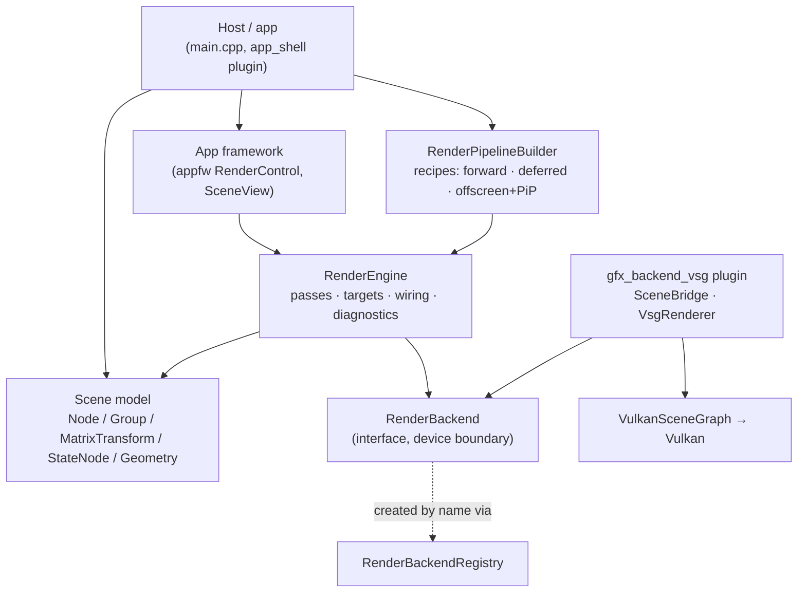

# Vine graphics module — architecture and usage

The graphics module is the scene graph, the render resources and the render engine of Vine. It owns
**no** GPU code: it drives a `RenderBackend`, and the concrete backend is a plugin (today
`src/plugins/gfx_backend_vsg`, backend name `"vsg"`, Vulkan through VulkanSceneGraph).

- public headers: `src/viz/graphics/sdk/vine/graphics/` (target `vi::Graphics`)
- implementations: `src/viz/graphics/src/`
- the backend plugin and its own notes: `src/plugins/gfx_backend_vsg/`

Everything below is what the code does today; where a feature is only a placeholder it is marked as
such.

## 1. Layers



`RenderEngine` never talks to Vulkan: it drives `RenderPass`es, resolves their targets, and calls the
backend per pass. A backend is created by **name**, so the host has no compile-time dependency on the
backend or its third-party libraries:

```cpp
auto backend = vine::graphics::RenderBackendRegistry::instance().create(u8"vsg");  // needs the plugin loaded
engine.setBackend(backend);
```

## 2. Scene model

| Class | Role | Notes |
| --- | --- | --- |
| `Node` | identity shared by every node: `name()`, `isVisible()`, `opacity()`, `parent()` | `boundingBox()` (world space), `worldMatrix()`, `localTransformMatrix()` (identity for every node that is not a transform) |
| `Group` | aggregates children | `addChild()` / `removeChild()` keep the parent link |
| `MatrixTransform` | `Group` + **the only holder of a transform** (`matrix()` / `setMatrix()`) | nested transforms multiply along the root-to-leaf path |
| `StateNode` | applies render state to a subtree, and overrides material / program | deeper nodes win |
| `Geometry` | leaf: **borrowed** attribute buffers + optional indices | `setPositions/setNormals/setTexcoords/setIndices`, `addBuffer` for custom channels, `setRevision()` |
| `Scene` | root + lights + per-frame command collection | `setRoot()`, `addLight()`, `collectRenderCommands(camera)` |

### 2.1 How attributes fold down the tree

One traversal (`collectNodeCommands` in `Scene.cpp`) turns the graph into a flat list of
`RenderCommand`s, folding each attribute along the path. The rules differ per attribute on purpose:

| Attribute | Rule |
| --- | --- |
| transform | **multiplies**; the folded result is baked into `RenderCommand::modelMatrix` |
| `opacity` | **multiplies**: scene × ancestors × the node itself, then clamped to `[0, 1]` at the leaf |
| render state (blend / depth / cull / topology) | **deepest node wins** |
| material / program | the leaf's own wins, otherwise the nearest enclosing `StateNode` |
| `isVisible` | **hard gate**: an invisible subtree is not collected at all |

`cmd.isTransparent` follows from the effective opacity, which is what routes a drawable into the
transparent part of a pipeline.

### 2.2 Resources

- `Material` — Phong values (`ambient/diffuse/specular/shininess`) plus an optional `Texture`.
  Colour edits are **dynamic**: the backend refreshes them in place per frame, so changing a material
  needs no rebuild.
- `ShaderProgram` — one or more stages plus a `revision()`, so editing source on the same object is
  detected.
- `Texture` — 2D or Cube, filled per face (`setImage()` / `setFaceImage()` / `setSource()`). Every
  fill bumps `revision()`, which is how a backend tells "same texture, new pixels" from "same
  texture, same pixels" (a pointer alone cannot).
- `Light` — ambient / directional, with `castShadow()` and `ShadowSettings{resolution, bias, filter}`
  (see §5 for the state of shadow rendering).
- `ImageRef` — the identity of one image (a target plus an attachment index, colour or depth) used by
  the pass wiring; see §3.4.

### 2.3 Rendering

- `RenderEngine` — the frame pump and the ledger: `initialize()`, `addPass(pass, content, order)`,
  `frame(dt)`, `resize(w, h)`, `publish/resolve` for named outputs, `validateWiring()` (structural
  checks reported through the diagnostics channel), `shutdown()`.
- `RenderPass` — camera + render target + render state + clear/depth policy; `ScreenPass` is the
  fullscreen / picture-in-picture pass (samples a target, optionally with a fragment `program`).
  `AxisGizmo` and `FpsOverlay` are ready-made HUD passes.
- `RenderTarget` — a set of colour attachments plus optional depth, with formats and sizes.
- `RenderPipelineBuilder` — the recipe layer: `build(PipelinePreset::Forward | Deferred | …)`,
  `addOffscreenToScreen(...)` for render-to-texture + PiP, plus the canonical deferred pieces
  (`defaultGbufferTarget()`, `defaultGbufferGeometryProgram()`, `defaultDeferredLightProgram()`).
  It produces exactly the objects you would build by hand, and returns a `Pipeline` handle that owns
  them (`windowPass()`, `offscreenTarget()`, `resize(w, h)`).
- `RenderBackend` — the device boundary (window layers, per-pass `render()`, readback, diagnostics).
  `RenderBackendRegistry` / `RenderBackendFactory` let a plugin self-register and the host create it
  by name.

### 2.4 Per-frame data flow

1. The host calls `RenderEngine::frame(dt)`.
2. Per pass, the engine opens the content frame and asks the scene for commands:
   `Scene::collectRenderCommands(camera)` walks the graph once per (scene, camera) and memoises the
   result for that frame (§2.1).
3. The backend materialises each `RenderCommand` into backend objects. In the vsg backend that is one
   retained `MatrixTransform` → `StateGroup` → bind/draw command chain per drawable, rebuilt only
   when its inputs change (`geometry->revision()`, material, texture, resolved state, program).
4. The vertex data is **aliased, not copied**: a real `vsg::vec3Array` etc. reads the geometry's own
   buffer, so the model and the renderer share one allocation per channel (positions, normals, UVs,
   authored colours, custom channels, indices). The full story, including the vsg constraints that
   make this work and the traps that do not, is in
   [`src/plugins/gfx_backend_vsg/vine-to-vsg-data-flow.md`](../../../plugins/gfx_backend_vsg/vine-to-vsg-data-flow.md).

### 2.5 Lifetime and change contracts

- Vine objects are reference-counted (`intrusive_ptr`); a node is kept by its parent, a target by the
  pass that renders into it, a geometry's buffers by the geometry.
- `RenderCommand` is a per-frame **value**: it borrows the geometry, the material, the program and
  the camera. Anything the backend retains, it retains by taking its own reference (see
  `RenderBackend.hpp`, "WHAT MAY BE RETAINED").
- A geometry **borrows** the vertex bytes it was handed (a mesh hands its own buffer over), so:
  build the model first, then wire it into a scene, and report every later data change with
  `Geometry::setRevision()`. The revision is the whole gate a renderer rebuilds on — the setters do
  **not** advance it, because the geometry cannot tell new bytes from the ones it already read.

## 3. Using it

### 3.1 A minimal host

```cpp
using namespace vine::graphics;

// 1. Model: one triangle, sharing its storage with the geometry.
vine::geometry::Vec3fArray positions = {
    vine::math::Vec3f(0.0f, 0.0f, 0.0f),
    vine::math::Vec3f(1.0f, 0.0f, 0.0f),
    vine::math::Vec3f(0.0f, 1.0f, 0.0f),
};
GeometryPtr geometry(new Geometry());
geometry->setPositions(packAttribute(positions));

MaterialPtr material(new Material());
material->setDiffuse(vine::Colorf(0.8f, 0.4f, 0.2f, 1.0f));

// 2. Graph: transform → state → geometry.
NodePtr leaf = geometry;
auto state = StateNodePtr(new StateNode());
state->setMaterial(material);
state->addChild(leaf);
auto transform = MatrixTransformPtr(new MatrixTransform());
transform->setMatrix(Mat4d());   // default-constructed = identity; or any placement
transform->addChild(state);

auto scene(new Scene());
scene->setRoot(transform);

// 3. Camera.
CameraPtr camera(new Camera());
camera->setViewMatrixAsLookAt({ 0.0, 0.0, 3.0 }, { 0.0, 0.0, 0.0 }, { 0.0, 1.0, 0.0 });
camera->setProjectionMatrixAsPerspective(45.0, 16.0 / 9.0, 0.1, 100.0);

// 4. Engine + backend + a preset pipeline.
RenderEngine engine;
engine.setBackend(RenderBackendRegistry::instance().create(u8"vsg"));   // plugin must be loaded
engine.setWindowHandle(window_handle);                                  // from the host window
if (!engine.initialize()) { return false; }

RenderPipelineBuilder builder(&engine);
builder.setContent(scene).setCamera(camera.get());
auto pipeline = builder.build(PipelinePreset::Forward);                 // or Deferred
if (pipeline == nullptr) { return false; }

// 5. Frame loop.
pipeline->resize(width, height);   // keeps an off-screen G-buffer in step with the surface
engine.frame(dt);                  // collect → record → submit → present

engine.shutdown();
```

`Deferred` needs a content scene and a camera and adds an order < 0 G-buffer pass (published as
`"GBuffer"`) plus a fullscreen lighting pass at order 0; it falls back to the builder's built-in
temporary G-buffer and lighting programs unless you pass your own through `PipelineOptions`.

### 3.2 Changing data after wiring

```cpp
geometry->setPositions(packAttribute(new_positions));   // replaces what the geometry reads
geometry->setRevision(geometry->revision() + 1);        // THE announcement: rebuild + re-upload
```

The first render of a geometry is unaffected (it is built from scratch on its first sync). Material
colours need no announcement at all (they are dynamic); a re-filled `Texture` announces itself through
`Texture::revision()`.

### 3.3 App-level helpers

`SceneView` (graphics) and `RenderControl` (appfw GUI) wrap the loop above: they own a camera plus an
`OrbitCameraManipulator`, forward input, resize the pipeline with the surface, and assemble their
default viewer through the same Forward preset the builder produces.

### 3.4 Pass wiring

Passes exchange images by **object** (`ImageRef` = target + attachment, colour or depth) and/or by
**name** (a producer publishes a name, a consumer resolves it). `RenderEngine::validateWiring()` checks
the structure every frame — a missing producer, an image declared as an output by two passes, a
`ScreenPass` with no usable input, a promise about a target the pass does not write — and reports each
problem **once** (re-armed when it disappears) through the diagnostics channel.

## 4. Ready-made examples: how to build and run them

### 4.1 Build

```bash
cmake -S . -B build -G Ninja            # third-party deps via FetchContent (VINE_USE_FETCHCONTENT=ON)
cmake --build build                     # use -DCMAKE_BUILD_TYPE=Release for performance runs
cmake --build build --target Vine       # just the demo app
```

Requirements: a C++20 compiler (this repo is developed against `clang++-22`), CMake ≥ 3.21, Qt 6 (the
app and appfw), and a Vulkan loader + ICD to *run*. `scripts/gfx_lavapipe_check.sh` runs headless on
**lavapipe** (software Vulkan) or on a real GPU; the Khronos validation layer is used by the gates.

### 4.2 The demo app and its switches

`./build/bin/Vine` starts the app; the `app_shell` plugin registers the demo scene and its pipeline.
Every switch below is an **environment variable** (the app takes no CLI arguments):

| Variable | Values | Effect |
| --- | --- | --- |
| `VINE_PIPELINE` | `forward`, `deferred`, `forward_shadowed`, `deferred_shadowed` | Selects the main-window preset. **Default: `deferred`.** |
| `VINE_SHADER_PRESET` | any value | Switches the demo to the `FlatShaded` preset (exercises the preset path). |
| `VINE_VSG_GBUFFER` | any value | Adds a PiP preview of the deferred G-buffer's colour attachments (albedo / normal / specular / view position). |
| `VINE_VSG_DEFERRED` | any value | Adds the standalone fullscreen deferred-lighting pass (reads the G-buffer, shows the lit result) for A/B comparison. |
| `VINE_VSG_OFFSCREEN_MULTISLOT` | any value | Bakes one off-screen target holding two content slots (main scene + on-top overlay) and shows it as a PiP. |
| `VINE_VSG_SLOT_DEMO` | any value | Stacks a second (camera, content slot) overlay pass on the main camera, to check same-view multi-slot drawing. |
| `VINE_VSG_OWN_WINDOW` | any value | **Temporary escape hatch**: the backend creates its own window instead of using the host's (test use only; it ignores the announced surface size). |

### 4.3 Forward, deferred, shadowed

| Preset | What it assembles |
| --- | --- |
| `Forward` | One window scene pass at order 0 drawing the content through the builder's camera (+ an optional transparent scene as a second, depth-testing pass in the same window pass). |
| `Deferred` | An order < 0 pass rendering the content into the canonical **G-buffer** (4 colour attachments: albedo RGBA8, view normal + shininess RGBA16F, specular RGBA8, view position RGBA16F, plus D24 depth; published as `"GBuffer"`), then a fullscreen lighting `ScreenPass` at order 0 as the window pass. A transparent scene is composited depth-on into an off-screen composite target before it is presented. |
| `ForwardShadowed` | **Placeholder**: currently assembles exactly what `Forward` does. |
| `DeferredShadowed` | **Placeholder**: currently assembles exactly what `Deferred` does. |

The shadow slice (an order < 0 depth-only pass plus shadowed lighting) is **not implemented**; the API
it will use is already here — `Light::castShadow()` / `Light::shadow()`, `ShadowSettings{resolution,
bias, filter}` with `ShadowFilter::{None, Hard, PCF}`, and the reserved
`ShaderPreset::ShadowedPhong`. The plan is in `.ai/design/graphics-shadow.md`. `ShaderPreset::Pbr` is
reserved in the same way.

```bash
./build/bin/Vine                              # deferred (default)
VINE_PIPELINE=forward  ./build/bin/Vine       # forward
VINE_VSG_GBUFFER=1     ./build/bin/Vine       # + G-buffer preview
VINE_VSG_DEFERRED=1    ./build/bin/Vine       # + standalone deferred lighting pass
VINE_VSG_OFFSCREEN_MULTISLOT=1 ./build/bin/Vine   # off-screen + PiP
VINE_PIPELINE=forward_shadowed ./build/bin/Vine   # accepted, but == forward today
```

### 4.4 The same recipes from the SDK

```cpp
RenderPipelineBuilder builder(&engine);
builder.setContent(scene).setCamera(camera.get());

// Forward / deferred presets:
auto pipeline = builder.build(PipelinePreset::Deferred);

// Render-to-texture + picture-in-picture:
builder.addOffscreenToScreen(u8"preview", 512, 288,
                             RenderTarget::ColorFormat::RGBA8,
                             RenderTarget::DepthFormat::D24,
                             8, 8, 512, 288);

// The deferred pieces are exposed so a host can build its own variant:
auto gbuffer   = RenderPipelineBuilder::defaultGbufferTarget(1280, 720);
auto geom_prog = RenderPipelineBuilder::defaultGbufferGeometryProgram();
auto lit_prog  = RenderPipelineBuilder::defaultDeferredLightProgram();
```

### 4.5 Headless verification (what the repo's gates run)

```bash
./build/bin/test_graphics            # device-free module contracts
./build/bin/test_vsg                 # backend contracts (bridge / passes / lookups)
./build/bin/test_core                # buffers, math, io

bash scripts/gfx_lavapipe_check.sh   # real frames on lavapipe: EXPECT 0 VUID / 0 validation errors
bash scripts/vsg_selftest_evidence.sh # backend self-test, compared byte-for-byte with the baseline
ctest --test-dir build               # the CTest view of the suites
```

A few suites are known-red in this environment for reasons unrelated to this module (`test_cppstd`,
`test_runtime`, `test_system`); the graphics and backend suites above are the ones that gate it.

The backend self-test (`./build/bin/vsg_backend_selftest`, wrapped by both scripts) drives the whole
pipeline — forward, deferred, off-screen, depth sharing, overlays — and prints `[selftest]` evidence
lines. `scripts/vsg_selftest_evidence.sh` is the primary regression gate for rendering changes: it is
**byte-identical-or-fail** against `scripts/vsg_selftest_evidence.txt` (`--update` re-baselines).
Frames per phase can be raised with `VINE_SELFTEST_FRAMES` for stress runs.

## 5. Where to read more

| What | Where |
| --- | --- |
| Backend data flow, per-frame sequence, known traps | `src/plugins/gfx_backend_vsg/vine-to-vsg-data-flow.md` |
| Design docs (render pipeline, state, shadows, deferred, overlays) | `.ai/design/*.md` |
| Concise module notes (trap lists, measured facts, mutation evidence) | `.ai/memory/graphics.md` |
| Executable contracts | `tests/test_graphics/`, `tests/test_vsg/` |
| The backend's own device-free rules | `src/plugins/gfx_backend_vsg/include/vine/vsg/VsgSceneRules.hpp` |
