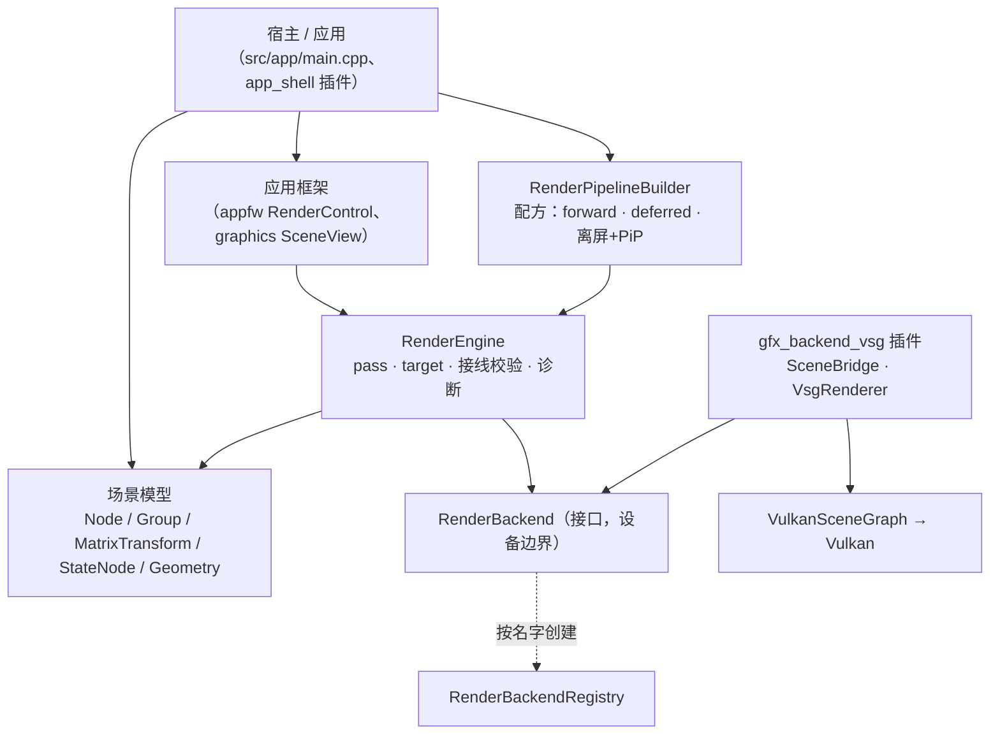

# Vine graphics 模块：架构与使用

graphics 模块是 Vine 的**场景图 + 渲染资源 + 渲染引擎**。它自己**不碰 GPU**：它驱动一个
`RenderBackend`，具体后端是插件（今天即 `src/plugins/gfx_backend_vsg`，后端名 `"vsg"`，经
VulkanSceneGraph 落到 Vulkan）。

- 公开头：`src/viz/graphics/sdk/vine/graphics/`（target `vi::Graphics`）
- 实现：`src/viz/graphics/src/`
- 后端插件与它自己的说明：`src/plugins/gfx_backend_vsg/`

本文写的是**今天的实际行为**；凡属占位（还没实现）的地方都已明确标注。

## 1. 分层



`RenderEngine` 从不直接调用 Vulkan：它驱动 `RenderPass`、解析各 pass 的目标、逐 pass 调用后端。
后端**按名字**创建，因此宿主对后端及其第三方库没有编译期依赖：

```cpp
auto backend = vine::graphics::RenderBackendRegistry::instance().create(u8"vsg");  // 需插件已加载
engine.setBackend(backend);
```

## 2. 场景模型

### 2.1 节点

| 类 | 职责 | 要点 |
| --- | --- | --- |
| `Node` | 所有节点共有的身份：`name()`、`isVisible()`、`opacity()`、`parent()` | `boundingBox()`（世界空间）、`worldMatrix()`、`localTransformMatrix()`（非变换节点恒为单位阵） |
| `Group` | 聚合子节点 | `addChild()` / `removeChild()` 会维护 parent 链 |
| `MatrixTransform` | `Group` + **场景图里唯一持有变换的地方**（`matrix()` / `setMatrix()`） | 嵌套变换沿 root→leaf 相乘 |
| `StateNode` | 给子树施加渲染状态，并可覆盖 material / program | 越深的节点优先 |
| `Geometry` | 叶子：**借用**的属性缓冲 + 可选索引 | `setPositions/setNormals/setTexcoords2/setIndices`、`addBuffer` 加自定义通道、`setRevision()` |
| `Scene` | 根 + 灯光 + 每帧命令收集 | `setRoot()`、`addLight()`、`collectRenderCommands(camera)` |

### 2.2 属性沿树折叠的规则

一次遍历（`Scene.cpp` 的 `collectNodeCommands`）把场景图压平成 `RenderCommand` 列表，各属性沿路径
折叠。规则**故意各不相同**：

| 属性 | 规则 |
| --- | --- |
| 变换 | **相乘**；折好的结果烘焙进 `RenderCommand::modelMatrix` |
| `opacity` | **相乘**：scene × 各层祖先 × 自身，在叶子处夹取到 `[0, 1]` |
| 渲染状态（blend / depth / cull / topology） | **最深者覆盖** |
| material / program | 叶子自己的优先，否则取最近的祖先 `StateNode` |
| `isVisible` | **硬门**：不可见子树整棵不收集 |

`cmd.isTransparent` 由有效 opacity 推出，它决定这个 drawable 走管线的透明部分。

### 2.3 资源

- `Material` —— Phong 参数（`ambient/diffuse/specular/shininess`）+ 可选 `Texture`。颜色改动是
  **动态**的：后端逐帧就地刷新，所以改材质不需要任何重建。
- `ShaderProgram` —— 一个或多个 stage，带 `revision()`，所以"同一个对象、改了源码"能被发现。
- `Texture` —— 2D / Cube，按面填充（`setImage()` / `setFaceImage()` / `setSource()`）。每次填充都会
  `revision()++`，后端据此区分"同一张纹理、新像素"与"同一张纹理、同样像素"（只看指针做不到）。
- `Light` —— ambient / directional，带 `castShadow()` 与 `ShadowSettings{resolution, bias, filter}`
  （阴影渲染的现状见 §4.3）。
- `ImageRef` —— **一张图的身份**（某个 target 的某个附件，颜色或深度），pass 接线的对象形式，见 §3.7。

### 2.4 渲染对象

- `RenderEngine` —— 帧泵 + 账本：`initialize()`、`addPass(pass, content, order)`、`frame(dt)`、
  `resize(w, h)`、`publish/resolve`（命名输出）、`validateWiring()`（结构性校验，走诊断通道）、
  `shutdown()`。
- `RenderPass` —— 相机 + 渲染目标 + 渲染状态 + 清屏/深度策略。**没有 renderTarget 的 pass 画进窗口**，
  order 决定先后。
- `ScreenPass` —— `RenderPass` 子类，全屏 / 画中画。**必须命名 program**（没有隐式着色，也没有
  隐式拷贝）：
  - 把源的**每一张**彩色附件按 binding 0..N-1 绑成采样纹理，用它画一个全屏三角形；想读哪张附件，
    就在 program 里写 `layout(binding = N)`（`screenCopyProgram(N)` 就是这个）；
  - **纯拷贝 = `BuiltinShaders::screenCopyProgram()`**（SDK 的命名程序，不是后端默认）；
  - **必须有相机**（否则什么都不画，引擎在接线期报一次）；**没有 program 也不画**（同样接线期报一次）。
- `RenderTarget` —— 若干彩色附件 + 可选深度：`attachColor(fmt)` / `attachDepth(fmt)` / `setSize(w,h)`，
  以及 `shareDepth(source)`（借用别人的深度）与 `setDepthPromotion(bool)`（深度是否变成可采样）。
- `RenderPipelineBuilder` —— 配方层：`build(const PipelineOptions&)`（结构选择只有一个：
  `ShadingPath::Forward | Deferred`，其余是效果与选项，见 `.ai/design/render-pipeline.md`）、
  `addOffscreenToScreen(...)`（离屏 + PiP），并暴露延迟所需的公有件（`defaultGbufferTarget()`、
  `defaultGbufferGeometryProgram()`、`defaultDeferredLightProgram()`）。它装配出来的就是**你手写也会写的
  那些对象**，返回值 `Pipeline` 句柄持有它们（`windowPass()`、`offscreenTarget()`、`resize(w,h)`），
  **并持有它们的注册**：丢掉句柄 = 那些 pass 从帧里撤下来（`RenderEngine::addPass` 自己另持引用，
  只持有引用会让被丢掉的 pass 继续每帧执行）。
- **顺序用阶段说**（`PipelineStage` + `pipelineStageOrder`）：阴影深度、几何、效果、着色、透明、
  呈现、HUD、预览各占一个档位，效果按"我在谁之前"进入，不去抢别人的魔数。
- `RenderBackend` —— 设备边界（窗口层、逐 pass `render()`、回读、诊断）。`RenderBackendRegistry` /
  `RenderBackendFactory` 让插件自注册、宿主按名字创建。

### 2.5 每帧数据流

1. 宿主调 `RenderEngine::frame(dt)`。
2. 逐 pass：引擎打开内容帧，向场景要命令 —— `Scene::collectRenderCommands(camera)` 对
   **(scene, camera)** 每帧只走一次树，结果记忆到帧末（规则见 §2.2）。返回的是**视锥剔除后**的列表：
   `isVisible()` 是硬门，包围盒完全在视锥外（p-vertex 测试）的节点**整棵子树**被剪掉，被剔除的几何体
   根本不在列表里；后端的保留节点则从根上摘下但不销毁，回来时直接复用（复用窗口 600 帧，细节见
   `backend.md` §5.5）。
3. 后端把每个 `RenderCommand` 物化成后端对象。在 vsg 后端里就是每个 drawable 一条保留的
   `MatrixTransform` → `StateGroup` → bind/draw 命令链，只在其输入（`geometry->revision()`、
   material、texture、resolved state、program）变化时重建。
4. 顶点数据是**别名，不是拷贝**：真的 `vsg::vec3Array` 等直接读 geometry 自己的 buffer，于是模型与
   渲染侧每个通道只占一份分配（位置 / 法线 / UV / 作者颜色 / 自定义通道 / 索引都是）。完整来龙去脉
   （包括让这件事成立的 vsg 约束和踩过的坑）见
   [`src/plugins/gfx_backend_vsg/docs/data-flow.md`](../../../plugins/gfx_backend_vsg/docs/data-flow.md)，
   后端的运行时总览（生命周期 / 调用次数 / 更新策略）见
   [`src/plugins/gfx_backend_vsg/docs/backend.md`](../../../plugins/gfx_backend_vsg/docs/backend.md)。

### 2.6 生命周期与变更契约

- Vine 对象全部引用计数（`intrusive_ptr`）：节点由父节点持有，target 由渲染它的 pass 持有，buffer 由
  geometry 持有。
- `RenderCommand` 是**每帧的值**：它借用 geometry、material、program、camera。后端想留什么，就自己
  取一份引用（见 `RenderBackend.hpp` 的 "WHAT MAY BE RETAINED"）。
- geometry **借用**别人交给它的顶点字节（mesh 把自己的 buffer 交过来），所以：**先建模型、再接线**，
  之后每次改数据都要用 `Geometry::setRevision()` 公告。revision 是渲染侧唯一的重建闸门 ——
  **写 setter 不会推进它**，因为 geometry 分不出"还没读过的新字节"和"上次读过的旧字节"。

### 2.7 顶点数据：整块缓冲，或者缓冲里的一段（arena）

一个通道可以只读缓冲的**一段**（`AttributeChannel::offset` / `scalarCount`，都按**标量**计）——"一个大缓冲、
每个 geometry 一段"。顶点因此只存在一份，不重打包：

| 想要 | 写法 |
| --- | --- |
| 整块缓冲就是通道 | `setPositions / setNormals / setTexcoords2`（= `AttributeChannel::shared(values, components)`） |
| 缓冲里的一段 | `addBuffer(0, AttributeChannel::slice(arena, 3, first_vertex, vertex_count))`（自定义通道、法线、UV 同理） |
| 索引也是缓冲的一段 | `setIndices(index_arena, first_index, index_count)`（`index_count == 0` 表示"到缓冲末尾"） |

规则与后果：

- **单位**：`slice()` 用**顶点**说（`first_vertex` / `vertex_count`），`shared(...)` 用**标量**说
  （`offset` / `scalarCount`，`components` 就是步长）；`0` 长度表示"从起点到缓冲末尾"，所以没有固定长度的通道
  会**跟着缓冲增长**。
- **索引是段内相对的**：索引 0 指这一段自己的第一个顶点；越界检查按**这一段的顶点数**判 ——
  一段的索引读不到邻居的数据。
- **包围盒 / 拾取 / 视锥剔除只覆盖这一段**（它们都经 `AttributeChannel` 的访问器）。
- **一段就是一条流**：共享绑定缓存按 `缓冲地址 + Buffer::revision() + offset + 长度` 分辨，同缓冲的相邻两段
  绝不互借设备缓冲；索引侧相反 —— 索引绑定别名**整段缓冲**，切片写在 draw 命令里（`firstIndex` / `indexCount`），
  所以一个索引 arena 的所有 geometry 共享一次索引上传。
- **改这一段要公告**：`buffer->setRevision(buffer->revision() + 1)`（重新填了字节）+ `geometry->setRevision(...)`
  （渲染侧才知道要重建）。只挪 `offset`（同缓冲换一段）同样要公告。
- **边界**：`offset` 越过缓冲末尾、或段长超过剩余长度 ⇒ 访问器一律当**空**处理（不会读越界）。

## 3. 使用

### 3.1 最小可跑：一个三角形 + forward

```cpp
using namespace vine::graphics;

// ① 模型：一个三角形。packAttribute 把 Vec3f 打成 Buffer<float>，geometry 借它（不拷贝）。
vine::geometry::Vec3fArray positions = {
    vine::math::Vec3f(0.0f, 0.0f, 0.0f),
    vine::math::Vec3f(1.0f, 0.0f, 0.0f),
    vine::math::Vec3f(0.0f, 1.0f, 0.0f),
};
GeometryPtr geometry(new Geometry());
geometry->setPositions(packAttribute(positions));

MaterialPtr material(new Material());
material->setDiffuse(vine::Colorf(0.8f, 0.4f, 0.2f, 1.0f));

// ② 场景图：transform → state → geometry（三层是惯例：位置 / 状态 / 叶子）。
auto state = StateNodePtr(new StateNode());
state->setMaterial(material);
state->addChild(geometry);

auto transform = MatrixTransformPtr(new MatrixTransform());
transform->setMatrix(Mat4d());          // 默认构造 = 单位阵
transform->addChild(state);

auto scene(new Scene());
scene->setRoot(transform);
scene->addLight(Light::createAmbient());                   // 环境光
scene->addLight(Light::createDirectional({ 0.0, 0.0, -1.0 }));  // 一盏方向光

// ③ 相机。
CameraPtr camera(new Camera());
camera->setViewMatrixAsLookAt({ 0.0, 0.0, 3.0 }, { 0.0, 0.0, 0.0 }, { 0.0, 1.0, 0.0 });
camera->setProjectionMatrixAsPerspective(45.0, 16.0 / 9.0, 0.1, 100.0);

// ④ 引擎 + 后端 + 预设管线。
RenderEngine engine;
engine.setBackend(RenderBackendRegistry::instance().create(u8"vsg"));  // 需插件已加载
engine.setWindowHandle(window_handle);                                // 宿主窗口的原生句柄
if (!engine.initialize()) { return false; }

RenderPipelineBuilder builder(&engine);
builder.setContent(scene).setCamera(camera.get());
PipelineOptions options;                      // 默认 = forward 路径
auto pipeline = builder.build(options);      // 或 options.path = ShadingPath::Deferred
if (pipeline == nullptr) { return false; }

// ⑤ 帧循环。
pipeline->resize(width, height);   // 转发给离屏/合成 target，并通知 HUD 叠加
engine.frame(dt);                  // 收集 → 录制 → 提交 → present

engine.shutdown();
```

### 3.2 改数据（唯一需要公告的地方）

```cpp
geometry->setPositions(packAttribute(new_positions));   // 换掉 geometry 读的那块 buffer
geometry->setRevision(geometry->revision() + 1);        // 公告：重建数据节点 + 重新上传
```

首次渲染不受影响（那是从零建）。材质颜色**不需要**公告（动态）；重新填过的 `Texture` 自己会通过
`Texture::revision()` 公告。

### 3.3 例：纯手动 2 pass —— 离屏渲染 + 全屏合成到窗口

不写任何 shader：`ScreenPass` 配 `BuiltinShaders::screenCopyProgram()` 就是"把一张彩色图拷到目标
子视口"——**要显式命名**它（没有隐式拷贝），并且这条 pass 需要有相机。

```cpp
// ① 离屏目标：一张 RGBA8 彩色 + D24 深度。
auto scene_rt = make_intrusive<RenderTarget>();
scene_rt->setName(u8"scene_rt");
scene_rt->attachColor(RenderTarget::ColorFormat::RGBA8);
scene_rt->attachDepth(RenderTarget::DepthFormat::D24);
scene_rt->setSize(surface_w, surface_h);

// ② 场景 pass：画进 scene_rt。order < 0 ⇒ 先于主 pass 执行。
auto scene_pass = make_intrusive<RenderPass>();
scene_pass->setName(u8"scene_into_rt");
scene_pass->setCamera(camera.get());
scene_pass->setRenderTarget(scene_rt);
scene_pass->setClearEnabled(true);                     // 自己是第一笔，清屏
scene_pass->setClearColor(vine::Color(26, 26, 31));    // vine::Color 是 0..255 的 uint8 构造
scene_pass->setShouldClearDepth(true);
scene_pass->setDepthMode(DepthMode::TestAndWrite);     // 不透明内容：测 + 写
scene_pass->setOutputName(u8"SceneColor");             // 命名输出（每帧进名字表）
scene_pass->setOutputTarget(scene_rt);                 // 对象级承诺：它是这张 target 的唯一写者
engine.addPass(scene_pass, scene, -1);                 // -1 < 0：排在主 pass 之前

// ③ 合成 pass：作为**窗口 pass**（没有 renderTarget ⇒ 画进窗口），order 0。
auto compose = make_intrusive<ScreenPass>();
compose->setName(u8"compose_to_window");
compose->setCamera(camera.get());                      // 窗口 pass 的相机决定窗口视角
compose->setProgram(screenCopyProgram());              // 画面是**命名**的：纯拷贝用 SDK 的这个程序
compose->addInputName(u8"SceneColor");                 // 名字形式
compose->addInputTarget(scene_rt);                     // 对象形式（两层在地址上汇合）
compose->setSourceAttachment(0);                       // 采第 0 张彩色图
engine.addPass(compose, scene, 0);
```

想把它变成**右下角画中画**（而不是全屏），给合成 pass 一个子视口即可：

```cpp
compose->setViewport(surface_w - 320 - 8, 8, 320, 180);
```

| pass | 相机 | renderTarget | order | 清屏 | 深度 | 输出/输入 |
| --- | --- | --- | --- | --- | --- | --- |
| `scene_into_rt` | `camera` | `scene_rt` | -1 | 是（清色+深） | `TestAndWrite` | 输出 `SceneColor` + 承诺 `scene_rt` |
| `compose_to_window` | `camera` | 无（= 窗口） | 0 | 否（默认） | 默认（只清/画覆盖层） | 输入 `SceneColor` / `scene_rt` |

### 3.4 例：纯手动 4 pass —— 手搭一条延迟管线

这条管线用的三件"公有件"正是 `RenderPipelineBuilder::build(Deferred)` 内部用的东西，所以手搭出来
与预设**完全等价**：它演示了手写延迟管线的三个要点 —— **MRT target**、**带 program 的 ScreenPass**、
以及**借用深度**。

```cpp
// ① 规范 G-buffer：告警里说的 4 张彩色附件（albedo / view normal+shininess / specular / view position）
//    + D24 深度。几何 program 必须写这 4 个输出。
auto gbuffer = RenderPipelineBuilder::defaultGbufferTarget(width, height);

// ② G-buffer pass（order < 0）：一个场景遍历写 MRT。
auto gbuffer_program = RenderPipelineBuilder::defaultGbufferGeometryProgram();
auto gbuf_pass = make_intrusive<RenderPass>();
gbuf_pass->setName(u8"gbuffer");
gbuf_pass->setCamera(camera.get());
gbuf_pass->setRenderTarget(gbuffer);
gbuf_pass->setProgramOverride(gbuffer_program);   // 场景 pass 也可以带自己的 program
gbuf_pass->setOutputName(u8"GBuffer");
gbuf_pass->setOutputTarget(gbuffer);              // 唯一写者 ⇒ 承诺整张 target
engine.addPass(gbuf_pass, scene, -3);

// ③ 延迟光照 + 前向透明的共同落点：一张离屏 composite，它**借** G-buffer 的深度，
//    于是不透明场景只光栅化一次，前向内容能正确地被不透明物体遮挡。
gbuffer->setDepthPromotion(false);               // 不把深度提升为可采样（省一次布局往返）
auto composite = make_intrusive<RenderTarget>();
composite->setName(u8"composite");
composite->setSize(width, height);
composite->attachColor(RenderTarget::ColorFormat::RGBA8);
composite->shareDepth(gbuffer);                  // 借深度

// ④ 全屏延迟光照（带 program）：读 G-buffer 的全部彩色附件，写进 composite。
auto light_program = RenderPipelineBuilder::defaultDeferredLightProgram();
auto light = make_intrusive<ScreenPass>();
light->setName(u8"deferred_light");
light->setCamera(camera.get());                  // program 路径**必须**有相机
light->setRenderTarget(composite);
light->addInputName(u8"GBuffer");
light->addInputTarget(gbuffer);                  // 读整捆：program 按 binding 自己挑
light->setProgram(light_program);
engine.addPass(light, scene, 0);

// ⑤ 前向透明：不清屏（压在光照结果上），只测深度不写。
auto forward = make_intrusive<RenderPass>();
forward->setName(u8"forward_transparent");
forward->setCamera(camera.get());
forward->setRenderTarget(composite);
forward->setClearEnabled(false);
forward->setDepthMode(DepthMode::TestOnly);
forward->setOutputName(u8"Composite");
forward->setOutputTarget(composite);
engine.addPass(forward, transparent_scene, 1);

// ⑥ 呈现：把烘好的 composite 拷到窗口（窗口 pass，无 renderTarget）。
auto present = make_intrusive<ScreenPass>();
present->setName(u8"present");
present->setCamera(camera.get());
present->addInputName(u8"Composite");
present->addInputTarget(composite);
engine.addPass(present, 2);
```

| # | pass | renderTarget | order | 清屏 | 深度 | 输出 → 输入 |
| --- | --- | --- | --- | --- | --- | --- |
| ① | `gbuffer`（场景，program override） | `gbuffer`（MRT 4 色 + D24） | -3 | 是 | `TestAndWrite` | `GBuffer` |
| ② | `deferred_light`（ScreenPass + program） | `composite` | 0 | 是 | 默认 | 读 `GBuffer`（整捆） |
| ③ | `forward_transparent`（场景） | `composite`（借 gbuffer 深度） | 1 | **否** | `TestOnly` | `Composite` |
| ④ | `present`（ScreenPass + `screenCopyProgram()`） | 无（窗口） | 2 | 否 | 默认 | 读 `Composite`（整捆） |

要点：

- **顺序**：负数在窗口 pass 之前。G-buffer 必须在光照之前 ⇒ `-3`。
- **谁清屏**：每个 target 的**第一笔**清屏（`gbuffer` 清自己、`composite` 由①的 light 清），后面压上去的
  必须 `setClearEnabled(false)`。
- **深度**：不透明 `TestAndWrite`；压在不透明结果上的半透明 `TestOnly`；HUD/覆盖层 `Disabled`。
- **MRT**：目标侧 `attachColor()` 调四次；程序侧输出按附件序号写；`ScreenPass` 的 program 会把源的每张
  彩色附件绑成纹理 0..N-1。
- **借深度**：`shareDepth()` 之后**只有当两边尺寸一致**才是同一张图；源 target 重建（换尺寸）会让借用方
  继续测旧深度 —— 引擎会检测并重建（见 §3.7）。

### 3.5 例：同样的东西用 builder 写

builder 只是把 §3.3 / §3.4 的装配收起来，配上默认 program；它不会替你省掉"相机、内容、尺寸"这三个前提。

```cpp
RenderPipelineBuilder builder(&engine);
builder.setContent(scene).setCamera(camera.get());

// 结构只有两选：forward / deferred。阴影不是预设——它由"投影的那盏灯"提出请求
// （Light::castShadow），当前还没有阴影 pass，所以 builder 会报一条"画面无影"。
PipelineOptions options;
options.path = ShadingPath::Deferred;
options.offscreen_width  = 0;          // 0 = 用当前 surface 尺寸，未知时回退 640x360
options.offscreen_height = 0;
options.gbuffer_program  = nullptr;    // 空 = 用内置的临时 G-buffer 几何 program
options.lighting_program = nullptr;    // 空 = 用内置的临时延迟光照 program
auto pipeline = builder.build(options);
pipeline->resize(surface_w, surface_h);            // 同时管离屏 / 合成 target 与 HUD 叠加

// 内容着色：必须**显式指定**程序。没有 shader preset 枚举，也没有兜底——
// 引擎默认用的是命名的 forward 程序（flat 是它的同一对 stage + `#define VINE_FLAT 1`）：
engine.setDefaultContentProgram(flatForwardProgram());   // 会话默认：没写 program 的 drawable 用它
engine.setDefaultContentProgram(forwardProgram());       // 回到默认前向着色

// 离屏 + 画中画（内部就是 §3.3 的两个 pass）：
builder.addOffscreenToScreen(u8"preview", 512, 288,
                             RenderTarget::ColorFormat::RGBA8,
                             RenderTarget::DepthFormat::D24,
                             surface_w - 320 - 8, 8, 320, 180);

// 也可以自己加 HUD pass：AxisGizmo / FpsOverlay 本身就是 RenderPass。
auto gizmo = make_intrusive<AxisGizmo>();
gizmo->setSourceCamera(camera.get());
gizmo->onSurfaceResized(surface_w, surface_h);
engine.addPass(gizmo, 10);
```

**手动 vs builder 对照**

| 你要做的事 | 手写 | builder |
| --- | --- | --- |
| 主窗口 forward | 一个无 target、order 0 的 `RenderPass` + 相机 + 内容 | `build(Forward)` |
| 延迟管线 | §3.4 的 6 步（target / 4 个 pass / program / 借深度） | `build(Deferred)` |
| G-buffer 布局与 program | 自己 `attachColor` × 4 + 写 MRT program | `defaultGbufferTarget()` / `defaultGbufferGeometryProgram()` |
| 离屏 + PiP | §3.3 + `setViewport()` | `addOffscreenToScreen(...)` |
| 尺寸跟随窗口 | 逐个 `setSize()` | `Pipeline::resize(w, h)` |
| 任意自定义 pass | `engine.addPass(pass, order)` | `builder.addPass(pass, order)` |

### 3.6 例：HUD 叠加与"叠加场景"

- **HUD**：`AxisGizmo` / `FpsOverlay` 是自带 pass，`engine.addPass(gizmo, 10)` 即可；用
  `Pipeline::setGizmo()/setFpsOverlay()` 让句柄持有它们，`resize()` 会顺带通知它们窗口尺寸。
- **半透明叠加场景**：`builder.setTransparentContent(overlay_scene)`。forward 下它是在主 pass 之后、
  同一窗口 pass 里**带深度**的一笔；deferred 下它先与不透明结果在离屏 composite 里合成再呈现 ——
  于是"半透明物体被不透明物体挡住"是正确的，而不是无深度地画在最上面。

### 3.7 pass 接线：名字与对象

pass 之间传图有两种写法，**可以并用**（两层在地址上汇合）：

- **名字**：生产者 `setOutputName("X")`，消费者 `addInputName("X")`。每帧把 `X → 该 pass 的
  renderTarget()` 注册进名字表。
- **对象**（`ImageRef`）：生产者 `setOutput(image)` / `setOutputTarget(target)`，消费者
  `addInput(image)` / `addInputTarget(target)`。粒度可到**某一张附件**（`ImageRef` 带颜色/深度与附件号），
  也可粗到**整捆**（整张 target）—— 带 program 的 `ScreenPass` 读的是整捆。

`RenderEngine::validateWiring()` 每帧校验结构，并把每个问题**只报一次**（消失后重新武装）：

| 检查 | 什么时候报 |
| --- | --- |
| 同一张图被两个 pass 声明为输出 | 两个不同 pass 声明同一 (target, 附件)；同名不同 target 走名字侧 |
| 消费者声明了输入，但本帧没人产出 | 该图没有生产者/生产者排在其后/生产者禁用 |
| `ScreenPass` 完全没有可用输入 | 没声明任何输入（图像 / target / 名字都没有，它没有东西可采样） |
| `ScreenPass` 没有 program | 它的画面是**命名**的（没有隐式拷贝），所以没有 program 就永远不画 ⇒ 报一次 |
| `ScreenPass` 有 program 但没有相机 | 全屏路径必须先建 view（光源也按这个 view 空间推），否则一个像素都不画 |
| 承诺的是"这个 pass 并不画进去的 target" | 声明与 `renderTarget()` 对不上（报在真实的那条线上） |

### 3.8 自己写 shader：location 契约与绑定顺序

**单 pass 还是多 pass 与这件事无关**：只看这个 pass 有没有 program —— 场景 pass 用
`RenderPass::setProgramOverride()`，全屏 / 后处理用 `ScreenPass::setProgram()`。

**先分清三个数字**（后文只用这三个词）：

| 词 | 是什么 | 谁决定 |
| --- | --- | --- |
| **通道 location** | 你在 Geometry 里填的编号，也就是 `Geometry::attributes_` 的键 | **你**：`setPositions` 0、`setNormals` 1、`setTexcoords2`/`setTexcoords3` 8（**同一个槽的两种宽度**）；自定义通道 `addBuffer(L, …)`，L ≥ 3 且 ≠ 8 |
| **shader location** | shader 里的 `layout(location = N)` —— 下表比的就是它 | **写 shader 的人**：内建路径用 vsg 的编号，自定义 program 用模块契约 |
| **数组下标 = Vulkan binding** | 喂入列表里的位置（`VkVertexInputBindingDescription.binding`） | **后端**；你既不写、也看不到，GLSL 里没有这个概念 |

**走哪条路径由 pass 决定，不由 geometry 决定** —— 同一个 geometry 可以在 A pass 走内建、在 B pass 走自定义：

| | 内建路径 | 自定义 program 路径 |
| --- | --- | --- |
| 触发条件 | 该 draw 的 program 为空 | `RenderPass::setProgramOverride()` / `ScreenPass::setProgram()` 给了 program |
| ShaderSet 谁提供 | 内容的**默认 program**（`RenderEngine::setDefaultContentProgram`，默认 `forwardProgram()`；后端把它编译成 set） | 后端按**这个 geometry 的通道布局**现建（`assembleProgramShaderSet`） |
| shader location 从哪来 | **vsg 自己的编号** | **通道 location 一一对应**（canonical 的 0/1/2/8 也是常量） |
| 顶点数据从哪取 | 固定 `buffer(0)` / `buffer(1)` / `buffer(2)` / `buffer(8)` + 自定义通道 | **完全相同**（两条路径取的是同一批数据） |
| 换路径时重建 | 只重建 state wrapper，数据节点复用 | 同左（唯一例外见下面的边角表） |
| 同一份 program、布局不同 | —— | **两个不同的 ShaderSet**（cache key = program + layout hash） |

两条路径的 **shader location 是两套编号**，这是最容易踩的地方（逐通道对照；binding 那列是后端排的）：

| 通道 | 通道 location（你在 Geometry 填的） | 内建路径 `layout(location=…)` | 自定义 program `layout(location=…)` | 数组下标/binding |
| --- | --- | --- | --- | --- |
| 位置 | 0 | **0** | **0** | 0 |
| 法线 | 1 | **1** | **1** | 1 |
| 颜色 | 2 | **6** | **2** | 3 |
| texcoord | **8** | **2** | **8** | 2 |
| 自定义 | L ≥ 3 且 ≠ 8 | ——（内建 set 不声明它，喂了也不被读） | **L** | 4+i |

> texcoord 槽在 SDK 侧只陈述**宽度**，**用途属于采样器**（`Geometry` 从不下结论）：`setTexcoords2`（2 分量）、`setTexcoords3`（3 分量）、`texcoordComponents()` 查宽度。唯一的解释者是**引擎自己的 forward 程序**（`forwardProgram()`）：
>
> | 槽宽度 | 内建 forward 程序的读法 | 采样器 |
> | --- | --- | --- |
> | 2 | UV 对 | `sampler2D`（材质纹理必须是 2D；否则**报一次** + 绑白色 2D） |
> | 3 | cube **方向** | `samplerCube`（材质纹理必须是 cube；否则**报一次** + 绑白色 cube） |
>
> 所以"同一个 3 分量通道"配自定义 program 完全可以读成体积坐标（`sampler3D`）——引擎不拦；将来真加 volume，内建 forward 程序要改成**按纹理种类**选变体（宽度名照样成立）。

> **一套编号（2026-09-13 起）**：引擎自己的 location 就是唯一的 location 契约（0 位置 / 1 法线 / 2 颜色 / 8 texcoord）。
> 以前内建路径用的是 vsg 内建 set 的密集编号（texcoord 在 2、颜色在 **6**），所以按 vsg 习惯写的 shader 在自定义
> program 路径上会**静默读错**——那条路已经删掉了：现在没有任何一条路径按 vsg 的编号绑定。

自定义通道**沿用自己的源 location**（转发范围 `L ≥ 3 且 L ≠ 8`）—— 当初避开 vsg 那套 0..11 密集编号就是为了
不撞号；即使现在只剩一套编号，这个保留规则也不变（`L == 8` 的通道不转发）。

> 另一个常见误记：`enableArray("vine_TexCoord0", …, 8)` 里的 **8 是数组下标（喂入顺序里的位置，= Vulkan binding）**，不是 `layout(location=)`。vsg 自己的这两套编号就是分开的。

**四个 canonical location 为什么是 0 / 1 / 2 / 8**：自定义路径下“通道 location = shader location”，而自定义通道的转发范围是
`L ≥ 3 且 L ≠ 8` —— 所以 canonical 只有 `0/1/2` 三个位置能用，texcoord 必须去 `≥ 3` 区里占一个**保留号**：

| 位置 | 给谁 | 为什么是这个号 |
| --- | --- | --- |
| 0 / 1 | 位置、法线 | 与 vsg 一致 ⇒ 只读位置/法线的 shader 两条路径通用 |
| 2 | 颜色 | `< 3` 的最后一个空位（vsg 内建 set 里颜色在 **6**，2..6 被它自己的 `vsg_TexCoord0..3`(2..5) 与 `vsg_Color`(6) 占满；我们的 set 用 `vine_Color`(2) / `vine_TexCoord0`(8)，见 §3.8 的表） |
| 8 | texcoord | `≥ 3` 里由模块**显式保留**：通道 location == 8 的通道**不转发**，用户占不掉它（`Geometry::kTexCoordLocation`） |
| 3..7、9.. | 自定义通道 | 全留给你（vsg 的 8 是 `vsg_Rotation`；两套 set 永不同时存在，撞号无害） |

**怎么写**（Geometry 侧只选 location，其余全自动）：

```cpp
// 自定义通道：L >= 3 且 != 8，分量数决定数组类型/格式（1→float 2→vec2 3→vec3 4→vec4）
geometry->addBuffer(5u, AttributeChannel::packed(tangent_scalars, 3u));
geometry->addBuffer(9u, AttributeChannel::packed(tint_scalars,    4u));
```

```glsl
layout(location = 0) in vec3 inPosition;   // 位置（固定）
layout(location = 1) in vec3 inNormal;     // 法线（固定；缺失时由位置推导）
layout(location = 2) in vec4 inColor;      // 颜色（固定）
layout(location = 8) in vec2 inUV;         // texcoords（固定；模块保留的 location）
layout(location = 5) in vec3 inTangent;    // 自定义：就是 Geometry 的 loc 5
layout(location = 9) in vec4 inTint;       // 自定义：就是 Geometry 的 loc 9

layout(set = 0, binding = 0) uniform PhongMaterial { /* 与内建路径同一个材质值 */ };
layout(set = 0, binding = 1) uniform sampler2D diffuseMap;
layout(push_constant) uniform PC { /* 顶点阶段 128 字节 */ };
```

**四件要自己对齐的事**（多数错了是静默的）：

| 事项 | 规则 | 错了会怎样 |
| --- | --- | --- |
| location 覆盖 | shader 只能声明 geometry 真有数据的 location | 声明了没有的 ⇒ 不喂数据：Vulkan 合法、读到未定义值、**无任何诊断** |
| 分量数 | geometry 的 3 分量 ↔ shader 的 `vec3` | 两边都能接受，只在绘制时表现为“属性读错/缺失” |
| 反方向 | 数组喂了、但管线不声明那个名字 | 报一条 `ContentSkipped` 的 Warning（`vertex binding '%s' (array %zu, %s) was not matched by the pipeline…`） |
| 绑定顺序 | **不用管、也改不了**：后端按固定顺序排（位置、法线、texcoords、颜色，再按 location 升序的自定义通道） | 你能控的只有 location；binding 下标由后端按通道列表算出 |

**边角**：

| 情形 | 行为 |
| --- | --- |
| program 编译失败 / 槽自己没有 set | **不画**（2026-09-13 起不再回落内建 set），并报一条 `ShaderFallback` Warning（不静默） |
| geometry 带 loc2 颜色、切换路径 | **数据节点也要重建**：内建路径 binding 2 是后端白 **DYNAMIC** 载体（alpha 驱动 opacity），自定义路径绑作者的颜色原样 |
| 自定义通道遇上**内建路径** | 照喂但没人声明 ⇒ `assignArray` 失败被跳过；它在尾部，不挤前缀四个 binding，也**不需要重新上传** |
| 同一份 program 的多个布局 | 共享一次 glslang 编译，按布局各建一个 ShaderSet（缓存上界 64，FIFO 淘汰） |

> 实现细节（名字 ↔ 数组下标那张表、vsg 的两套编号为何不同）见
> [`src/plugins/gfx_backend_vsg/docs/backend.md`](../../../plugins/gfx_backend_vsg/docs/backend.md) §2.4。

**内建 program 的 GLSL 从哪来**（自己写 shader 时想对照/改写它们）：

| 内容 | 位置 |
| --- | --- |
| 内建前向着色（引擎默认内容程序，`forwardProgram()` / `flatForwardProgram()`） | `src/viz/graphics/shaders/std_forward.*` |
| 延迟管线的 G-buffer 几何 / 全屏光照 | `src/viz/graphics/shaders/`（真文件，构建期嵌入） |
| 全屏三角形顶点段 / 纯拷贝（`fullscreenVertexProgram()` / `screenCopyProgram()`） | `src/viz/graphics/shaders/` |

**所有 GLSL 都归 SDK**：后端**没有**自己的 shader 目录（曾经有，2026-09-13 收回来了），它只决定怎么编译和绑。
| 文件怎么进二进制、怎么加一个、有哪些门禁 | [`.ai/design/vsg-custom-shader.md`](../../../../.ai/design/vsg-custom-shader.md) §10 |

> 这些 shader 是**真文件**（不是 C++ 字符串）：改了 `.glsl` 直接重编，`bash scripts/vine_shader_check.sh`
> 会先把每个 shader（含各 define 变体）过一遍 glslangValidator，再核对嵌入副本与文件是否逐字节一致。

## 4. 现成例子：怎么构建、怎么跑

### 4.1 构建

```bash
cmake -S . -B build -G Ninja            # 第三方依赖走 FetchContent（VINE_USE_FETCHCONTENT=ON，默认）
cmake --build build                     # 性能跑用 -DCMAKE_BUILD_TYPE=Release
cmake --build build --target Vine       # 只建 demo 应用
```

要求：C++20 编译器（本仓库用 `clang++-22` 开发）、CMake ≥ 3.21、Qt 6（应用与 appfw），运行需要
Vulkan loader + ICD。`scripts/gfx_lavapipe_check.sh` 可以无头跑在 **lavapipe**（软件 Vulkan）上，也可以用
真 GPU；门禁会打开 Khronos 校验层。

### 4.2 demo 应用的开关

`./build/bin/Vine` 启动应用；`app_shell` 插件负责注册 demo 场景与管线。下面每个开关都是**环境变量**
（应用不接受命令行参数）：

| 环境变量 | 取值 | 作用 |
| --- | --- | --- |
| `VINE_PIPELINE` | `forward` / `deferred` / `forward_shadowed` / `deferred_shadowed` | 选主窗口**路径**（`forward` / `deferred`）。**默认 `deferred`**；`*_shadowed` 两个取值只为兼容旧脚本保留，选的是与**同名无后缀**完全相同的那条路径 —— 阴影现在两条路径都会建（`addDemoLighting` 给主方向光设了 `castShadow`），后缀不再代表"另一条管线" |
| `VINE_SHADER_PRESET` | 任意值 | 把内容程序换成 `flatForwardProgram()`（验证平直着色通路） |
| `VINE_VSG_GBUFFER` | 任意值 | 加一个 G-buffer 彩色附件（albedo / normal / specular / view position）的 PiP 预览 |
| `VINE_VSG_DEFERRED` | 任意值 | 加一条独立的"全屏延迟光照"pass（读 G-buffer 显示光照结果），用于 A/B 对照 |
| `VINE_VSG_OFFSCREEN_MULTISLOT` | 任意值 | 把一个离屏 target 烘成两个内容槽（主场景 + 顶层叠加）并以 PiP 显示 |
| `VINE_VSG_SLOT_DEMO` | 任意值 | 在主相机上再叠一个 (相机, 内容槽) 的 overlay pass，验证同视角多槽绘制 |
| `VINE_VSG_OWN_WINDOW` | 任意值 | **临时逃生口**：后端自建窗口而非用宿主窗口（仅测试用；会忽略公告的表面尺寸） |
| `VINE_TEST_DATA_DIR` | 目录 | demo 与各测试共用的**资产根目录**。不给时的查找顺序是 `<exe>/test_data` → `<exe>/../test_data`（源码树、build 树、安装树三种布局都覆盖）；demo 的 cube map 就从这里读，找不到时**跳过那只盒子并报一行**，而不是贴一张白图 |

默认 demo（不给任何环境变量）的画面：不透明堆叠 + 主方向光投在 6×6 地面上的**阴影** + 一只**贴 cube map 的盒子** `env_box`。
它的材质纹理按**方向**采样（texcoord 通道是 3 分量，引擎据此编译 `samplerCube` 变体，见 `Geometry::setTexcoords3()`），六张面图是
`test_data/images/posx.jpg … negz.jpg`，读入后盒式滤波到 256²/面、再交给 `CubeMap::setFaceImage()` 的**具名**面（`posx` → `+X` … `negz` → `-Z`，
不靠目录排序：六个名字排出来是 -X 在 +X 前面）。Deferred 默认下 G-buffer 的几何程序**只写材质颜色、不采样任何纹理**，所以贴图的盒子画在
**前向叠加场景**里（`makeForwardOverlayScene`，与不透明内容做深度合成），而不是丢进不透明场景变成一只平色盒子。

那只盒子看起来是"**把环境投影在盒子上**"，**不是**镜面反射 —— 这是有意保留的行为：方向是**逐顶点**的值，会被硬件在面上插值（面心被拉伸、棱上出现直缝，容易被读成"看到盒子里面"），而且 cube map 在这里当 albedo 用、照片本身的天空是白的，所以太阳的明暗在它身上很淡。引擎的 set 就是"按顶点给的方向采样"这一条规则；想要 `reflect(view_dir, n)` 那种镜面观感，需要给这只盒子自己的 `ShaderProgram`（见 `addCubeMappedBox` 的注释）。

### 4.3 两条路径各装配什么（阴影不是路径）

| 路径 | 装配内容 |
| --- | --- |
| `ShadingPath::Forward` | 一个 `PipelineStage::Shading` 的窗口场景 pass 画内容（可选叠加场景是同一窗口 pass 里带深度的第二笔，`PipelineStage::Transparent`）。 |
| `ShadingPath::Deferred` | `PipelineStage::Geometry` 的 pass 把内容画进**规范 G-buffer**（4 张彩色：albedo RGBA8、view normal+shininess RGBA16F、specular RGBA8、view position RGBA16F，加 D24 深度；发布为 `"GBuffer"`），再用一个 `Shading` 阶段的全屏光照 `ScreenPass` 作为窗口 pass。有叠加场景时，光照结果先与离屏 composite 合成再呈现（`Transparent` → `Present`）。 |

**阴影由投影的那盏灯提出请求**（`Light::castShadow()` + `ShadowSettings{resolution, bias, filter}` /
`ShadowFilter::{None, Hard, PCF}`），**两条路径都会**为它建一条 depth-only 的阴影 pass
（`PipelineStage::Depth`，默认 1024²，`RenderPipelineBuilder::directionalShadowMatrix()` 从光那一侧框住内容）。
内容集合**无条件**声明阴影 ABI（set 0：map 在 3、块在 4；全屏的延迟光照程序用 5 / 6），`shadow.params.x` 是开关 ——
没有可用阴影时程序一次都不采那张图。宿主自己的程序声明了 `shadow_map` 却没带上它时，会**按 drawable** 报一条
`DiagnosticCategory::UnsupportedRequest`，而不是画出一张"没有阴影的阴影"。两个约定不同、且都写在 ABI 里：矩阵是
**SDK 裁剪约定**（y 向上、z 0 近 → 1 远），纹理是**后端约定**（reverse-Z、near = 1 → far = 0、v = 0 是世界的"上"），
着色器里各转一次。判据（三次像素断言 + 逐项变异）见 `.ai/design/render-pipeline.md` §8.2 / §8.3 / §9。内容着色侧
**没有保留项**：程序就是唯一入口（见 §3），未实现的着色需要宿主自己写一个 `ShaderProgram`。

```bash
./build/bin/Vine                                # deferred（默认）
VINE_PIPELINE=forward  ./build/bin/Vine         # forward
VINE_VSG_GBUFFER=1     ./build/bin/Vine         # + G-buffer 预览
VINE_VSG_DEFERRED=1    ./build/bin/Vine         # + 独立延迟光照 pass
VINE_VSG_OFFSCREEN_MULTISLOT=1 ./build/bin/Vine # 离屏 + PiP
VINE_PIPELINE=forward_shadowed ./build/bin/Vine # 接受；与 forward 完全相同（阴影已是默认）
```

### 4.4 无头验证（仓库门禁跑的就是这些）

```bash
./build/bin/test_graphics            # 设备无关的模块契约
./build/bin/test_vsg                 # 后端契约（桥 / pass / 查表）
./build/bin/test_core                # buffer、math、io

bash scripts/gfx_lavapipe_check.sh    # 真帧 + lavapipe：0 VUID / 0 validation error，**并且** app 阶段要看到 demo
                                      # 自己的证据行（app_shell 加载 / cube map 从素材装载 / shadow_map 建立）——
                                      # "没报错"不算过：demo 没建起来、或素材不在，这条门禁必须红
bash scripts/vsg_selftest_evidence.sh           # 后端自检，与基线逐字节比对（自写前向着色 = 唯一路径）
bash scripts/vine_shader_check.sh     # 每个 shader × define 变体过 glslangValidator + 嵌入副本同步
ctest --test-dir build                # CTest 视角
```

后端自检（`./build/bin/vsg_backend_selftest`，上面两个脚本都会跑它）会驱动整条管线 —— forward、
deferred、离屏、深度共享、overlay —— 并打印 `[selftest]` 证据行。
`scripts/vsg_selftest_evidence.sh` 是渲染改动的主要回归门禁：**逐字节相同否则失败**（`--update` 重设
基线）。用 `VINE_SELFTEST_FRAMES` 可以加大每个相位的帧数做压力跑。

本环境里有三个套件是**既有失败**、与本模块无关（`test_cppstd` / `test_runtime` / `test_system`）；上面
列的 graphics / vsg 套件才是它的门禁。

## 5. 延伸阅读

| 内容 | 位置 |
| --- | --- |
| 后端数据流、每帧时序、已知坑 | `src/plugins/gfx_backend_vsg/docs/data-flow.md` |
| 后端运行时总览（生命周期 / 调用次数 / 更新策略） | `src/plugins/gfx_backend_vsg/docs/backend.md` |
| 设计文档（渲染管线 / 状态 / 阴影 / 延迟 / overlay） | `.ai/design/*.md` |
| 简明模块笔记（坑清单、实测结论、变异证据） | `.ai/memory/graphics.md` |
| 可执行的契约 | `tests/test_graphics/`、`tests/test_vsg/` |
| 后端自己的设备无关规则 | `src/plugins/gfx_backend_vsg/include/vine/vsg/VsgSceneRules.hpp` |
